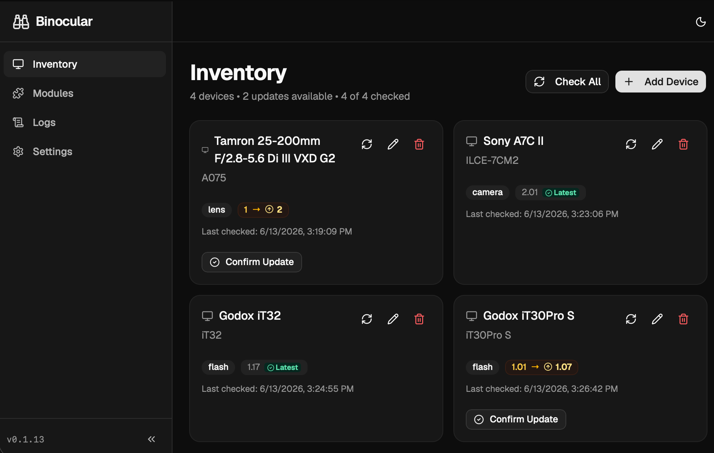
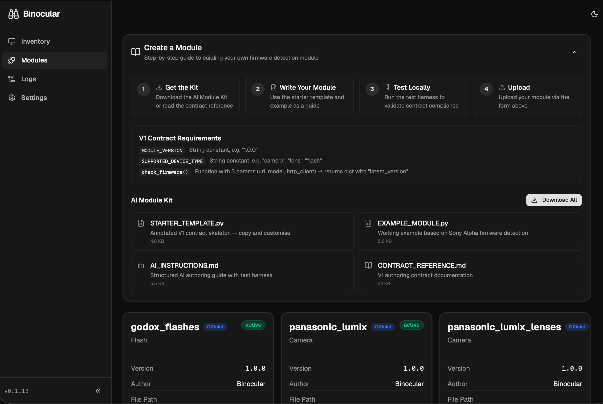
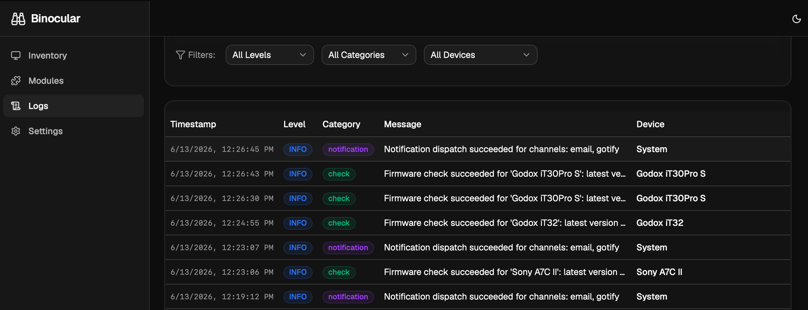
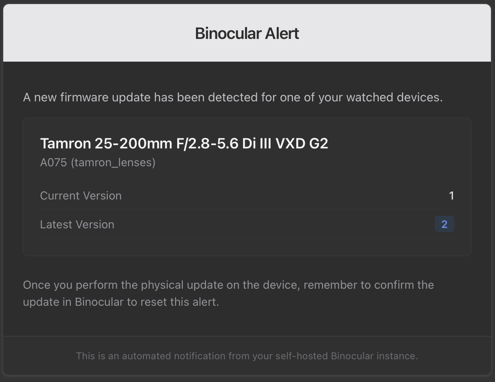
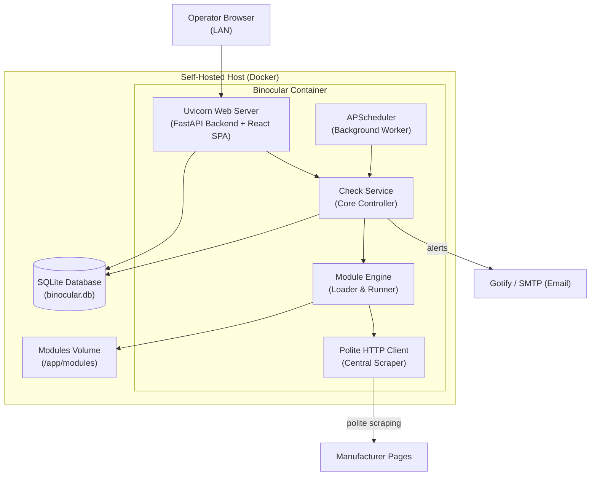

#  Binocular

[](https://opensource.org/licenses/MIT)
[](https://github.com/attilaszasz/Binocular/pkgs/container/binocular)
[](https://mypy.readthedocs.io/en/stable/getting_started.html#strict-mode)
[](https://www.typescriptlang.org/tsconfig#strict)

**Binocular** is a self-hosted, single-user, privacy-first web application that automates the discovery of firmware updates for high-value **offline** devices — cameras, lenses, speedlights, and homelab hardware that manufacturers never auto-update.

Instead of manually checking dozens of disparate support portals, you record your device inventory in Binocular and link each device to an extension module. The application runs on a schedule, politely queries manufacturers' portals, detects new firmware versions, and alerts you instantly via **HTML Email** or **Gotify**.

Designed specifically for homelab operators, self-hosters, and power users who value complete data ownership and set-and-forget reliability.

---

## 📸 Screenshots & Interface

### Dashboard & Device Inventory


### Module Manager & Validator


### Bounded Activity Log


### HTML Email Notification


---

## 🛠 How It Works

Binocular operates as a lightweight, single-container monolithic web service.



### Core Architecture Components

*   **FastAPI Backend & React SPA**: Serves a modern, responsive single-page application built on React 19, Vite, and Tailwind CSS v4, utilizing shadcn/ui primitives.
*   **In-Process Scheduler (APScheduler)**: Automatically triggers checks at user-configured module check intervals (e.g., daily or weekly).
*   **SQLite Single-File DB**: Stores the device inventory, settings, and logs. It operates in WAL (Write-Ahead Log) mode with standard pragmas enabled for optimal concurrent reads/writes.
*   **Extension Module Engine**: Executes Python-based scraper modules to extract firmware versions. Bundled official modules are shipped for:
    *   **Sony Alpha** (Cameras & Lenses via Alpha Universe index)
    *   **Panasonic Lumix** (Micro Four Thirds & L-Mount Cameras)
    *   **Panasonic Lumix Lenses** (MFT & L-Mount Lenses)
    *   **Godox Flashes** (Speedlights, Triggers & Studio strobes)

### Polite by Default (Centralized Scraping Client)
Binocular enforces responsible web scraping rules at the system core. Modules **must not** make raw HTTP requests. Instead, they use a host-provided async `http_client` wrapper which guarantees:
1.  **robots.txt Compliance**: Scrapes automatically check and respect robots.txt (RFC 9309) boundaries.
2.  **Identifiable User-Agent**: Outbound requests carry an identifiable User-Agent header specifying the tool.
3.  **Domain Rate Limiting & Backoff**: Exponential backoff (retrying on transient HTTP 429/5xx codes) and domain-based rate limit pacing protect manufacturer portals from overload.

---

## 🚀 Homelab Deployment (Docker Compose)

The primary and recommended deployment method is using **Docker Compose**.

Create a `compose.yaml` file on your host:

```yaml
services:
  binocular:
    image: ghcr.io/attilaszasz/binocular:latest
    container_name: binocular
    restart: unless-stopped
    ports:
      - "8000:8000"
    volumes:
      - ./data:/app/data
      - ./modules:/app/modules
    environment:
      # Timezone config
      - TZ=Europe/Budapest
      # Linuxserver-style permissions matching your host UID/GID
      - PUID=1000
      - PGID=1000
      # Logging Configuration
      - BINOCULAR_LOG_LEVEL=info
      - BINOCULAR_LOG_FORMAT=console
      # Security (Optional Basic Auth)
      - BINOCULAR_BASIC_AUTH_ENABLED=false
      - BINOCULAR_BASIC_AUTH_USERNAME=admin
      - BINOCULAR_BASIC_AUTH_PASSWORD=SetSecurePasswordHere
      # Notification: Gotify Integration (Optional)
      - BINOCULAR_GOTIFY_URL=https://gotify.example.lan
      - BINOCULAR_GOTIFY_TOKEN=Amc-hHw.14_bFsz
      # Notification: SMTP Email (Optional)
      - BINOCULAR_SMTP_HOST=smtp.gmail.com
      - BINOCULAR_SMTP_PORT=587
      - BINOCULAR_SMTP_USE_TLS=true
      - BINOCULAR_SMTP_USERNAME=notifications@example.com
      - BINOCULAR_SMTP_PASSWORD=app-specific-password
      - BINOCULAR_SMTP_FROM=notifications@example.com
      - BINOCULAR_SMTP_TO=your-inbox@example.com
    # Optional security hardening:
    security_opt:
      - no-new-privileges:true
    read_only: true
    tmpfs:
      - /tmp
```

### Initializing the Container
Run the following command to start the container:
```bash
docker compose up -d
```
Binocular will start immediately, verify filesystem permissions, execute SQLite database migrations, seed the official starter modules, and bind to port `8000`. Navigate to `http://<your-host-ip>:8000` in your web browser.

---

## ⚙️ Configuration Reference (Environment Variables)

Settings are populated on startup via environment variables. Variables are case-insensitive and can optionally be prefixed with `BINOCULAR_`.

| Environment Variable | Default | Description |
| :--- | :--- | :--- |
| **`BINOCULAR_HOST`** | `0.0.0.0` | Server binding address inside the container. |
| **`BINOCULAR_PORT`** | `8000` | Server binding port inside the container. |
| **`BINOCULAR_LOG_LEVEL`** | `info` | Logging severity: `debug`, `info`, `warning`, `error`. |
| **`BINOCULAR_LOG_FORMAT`** | `console` | Format of standard output: `console` or `json`. |
| **`BINOCULAR_DATA_DIR`** | `/app/data` | Path inside container where the SQLite database lives. |
| **`BINOCULAR_MODULES_DIR`** | `/app/modules` | Path inside container where custom extensions are loaded. |
| **`BINOCULAR_DB_PATH`** | *Derived* | Full path override for the SQLite DB. Defaults to `{data_dir}/binocular.db`. |
| **`BINOCULAR_BACKUP_DIR`** | *Derived* | Folder for backups. Defaults to `{data_dir}/backups`. |
| **`BINOCULAR_SEED_MODULES`** | `true` | Automatically discover and register bundled official modules. |
| **`BINOCULAR_MODULE_TIMEOUT`** | `30.0` | Execution timeout limit in seconds for a custom module scrape. |
| **`BINOCULAR_MODULE_HEALTH_THRESHOLD`** | `5` | Failed check count threshold before notifying official module failure. |
| **`BINOCULAR_BASIC_AUTH_ENABLED`** | `false` | Enable password protection for the single-user interface. |
| **`BINOCULAR_BASIC_AUTH_USERNAME`** | `binocular` | Username used when basic authentication is enabled. |
| **`BINOCULAR_BASIC_AUTH_PASSWORD`** | `None` | Password required when basic authentication is enabled. |
| **`BINOCULAR_GOTIFY_URL`** | `None` | Endpoint for Gotify notification dispatches. |
| **`BINOCULAR_GOTIFY_TOKEN`** | `None` | Gotify API application token. |
| **`BINOCULAR_SMTP_HOST`** | `None` | SMTP mail server hostname for HTML email notifications. |
| **`BINOCULAR_SMTP_PORT`** | `587` | SMTP mail server port (usually `587` or `465`). |
| **`BINOCULAR_SMTP_USE_TLS`** | `true` | Secure connection using TLS (recommended). |
| **`BINOCULAR_SMTP_USERNAME`** | `None` | SMTP login credential username. |
| **`BINOCULAR_SMTP_PASSWORD`** | `None` | SMTP login credential password. |
| **`BINOCULAR_SMTP_FROM`** | `None` | Email address displaying in the "From" header. |
| **`BINOCULAR_SMTP_TO`** | `None` | Email address displaying in the "To" header. |

### 🔐 Secret Management (`_FILE` Suffix)

For secure orchestrators (such as Docker Swarm, Kubernetes, or simply mounting files with restricted permissions), Binocular supports reading sensitive parameters directly from files (Docker Secrets). 

Append `_FILE` to any sensitive configuration parameter. The value of this variable must be the file path of the secret:

*   `BINOCULAR_BASIC_AUTH_PASSWORD_FILE` (or `BASIC_AUTH_PASSWORD_FILE`)
*   `BINOCULAR_SMTP_PASSWORD_FILE` (or `SMTP_PASSWORD_FILE`)
*   `BINOCULAR_GOTIFY_TOKEN_FILE` (or `GOTIFY_TOKEN_FILE`)

Example:
```yaml
environment:
  - BINOCULAR_SMTP_PASSWORD_FILE=/run/secrets/smtp_pass
```

---

## 🧩 Custom Extension Modules

Users can upload custom modules in Python to scrape firmware updates for unsupported devices. The custom modules run in-process with full application privileges (they are not sandboxed). Only run modules you trust!

### V1 Module Contract

Every module is a standalone `.py` file implementing the following contract:

```python
"""Example extension module for tracking camera firmware."""
from typing import Any
import asyncio

# 1. Mandatory Metadata Constants
MODULE_VERSION = "1.0.0"
SUPPORTED_DEVICE_TYPE = "camera"  # Common options: camera, lens, flash, recorder
MODULE_AUTHOR = "Homelab Hobbyist"

# 2. Main Entrypoint
def check_firmware(url: str, model: str, http_client: Any) -> dict[str, Any]:
    """Scrapes the manufacturer website for the latest firmware.
    
    Args:
        url: The scrapable target website. If empty, define a default inside the module.
        model: Specific model suffix or SKU to search (e.g. "ILCE-7M4").
        http_client: Central host-provided async HTTP client.
    """
    target_url = url or "https://manufacturer.com/firmware-portal"
    
    # Modules execute inside synchronous threads. Use an event loop to execute
    # requests via the async http_client:
    loop = asyncio.new_event_loop()
    asyncio.set_event_loop(loop)
    try:
        # Perform outbound fetch via centralized client
        response = loop.run_until_complete(http_client.get(target_url))
        html_content = response.text
    except Exception as exc:
        raise ValueError(f"network_error: Failed to fetch {target_url}: {exc}") from exc
    finally:
        loop.close()

    # Parse and extract latest version (e.g. via regex)
    # Let's say we find version '2.0.1' and a download link
    latest_version = "2.0.1" 
    download_url = "https://manufacturer.com/downloads/firmware-v201.zip"
    
    # 3. Return Standardized Dictionary
    return {
        "latest_version": latest_version,
        "release_date": "2026-06-01",                  # Optional
        "download_url": download_url,                  # Optional
        "release_notes_url": target_url,               # Optional
    }
```

### Standardized Error Prefixes (Genuinely Honest Failures)
If parsing or fetching fails, raise a `ValueError` with one of the standard contract prefixes. Binocular parses these prefixes to display clear statuses on the user dashboard:

| Prefix | Description / Trigger |
| :--- | :--- |
| `network_error:` | The HTTP fetch failed (e.g., DNS issue, timeout, 404 response). |
| `product_not_found:` | The target manufacturer page parsed fine, but the specific `model` model was not found in their catalog. |
| `firmware_not_available:` | The model was found, but the manufacturer page lists no firmware packages or indicates it has been discontinued. |
| `firmware_index_not_found:` | The page structure has changed, meaning the HTML DOM pattern (or JSON script arrays) parsed by the module are missing. |
| `download_url_not_found:` | The version parsed correctly, but the direct download zip/tar URL could not be located in the page contents. |

### 🛠 Standalone Local Test Harness

You can validate your custom module structure on your workstation without running the Binocular backend container.

1.  Save the test harness utility to a file called `test_harness.py`:

```python
#!/usr/bin/env python3
"""Local test harness for Binocular extension modules."""
import importlib.util
import sys
from pathlib import Path
from typing import Any

class MockResponse:
    def __init__(self, text: str = "<html>mock</html>"):
        self.text = text
        self.status_code = 200

class MockClient:
    async def get(self, url: str) -> MockResponse:
        print(f"  [Mock HTTP Client] GET -> {url}")
        return MockResponse()

def validate_module(module_path: str, model_name: str, target_url: str) -> None:
    path = Path(module_path)
    spec = importlib.util.spec_from_file_location("test_module", path)
    if spec is None or spec.loader is None:
        print(f"❌ Error: Cannot load file {path}")
        sys.exit(1)
    mod = importlib.util.module_from_spec(spec)
    spec.loader.exec_module(mod)

    # Validate elements
    assert hasattr(mod, "MODULE_VERSION"), "Missing MODULE_VERSION constant"
    assert hasattr(mod, "SUPPORTED_DEVICE_TYPE"), "Missing SUPPORTED_DEVICE_TYPE constant"
    assert hasattr(mod, "check_firmware"), "Missing check_firmware entrypoint function"
    
    print(f"✅ Metadata Verified:")
    print(f"   - Author: {getattr(mod, 'MODULE_AUTHOR', 'Anonymous')}")
    print(f"   - Version: {mod.MODULE_VERSION}")
    print(f"   - Target Device Type: {mod.SUPPORTED_DEVICE_TYPE}")

    try:
        res = mod.check_firmware(target_url, model_name, MockClient())
        assert isinstance(res, dict), "check_firmware MUST return a dictionary"
        assert "latest_version" in res, "Return dict is missing the mandatory 'latest_version' key"
        print("✅ Run Check Successful!")
        print(f"   Result: {res}")
    except ValueError as e:
        print(f"✅ Run Check Conformed to Contract (raised expected error with mock inputs): {e}")
    except Exception as e:
        print(f"❌ Execution Failure: {type(e).__name__}: {e}")
        sys.exit(1)

if __name__ == "__main__":
    if len(sys.argv) < 4:
        print("Usage: python test_harness.py <module.py> <model_name> <url>")
        sys.exit(1)
    validate_module(sys.argv[1], sys.argv[2], sys.argv[3])
```

2.  Run the validation harness:
```bash
python test_harness.py my_module.py "ILCE-7CM2" "https://alphauniverse.com/firmware/"
```

### 🤖 AI-Assisted Module Development

Writing modules is simplified using LLMs/AI coding assistants (e.g., Gemini, ChatGPT). 

Inside the Binocular Web UI (on the Modules tab), click **"Create a Module"** to download the **AI Module Kit**. This kit contains:
1.  `AI_INSTRUCTIONS.md`: Instructs the AI on the exact contract rules.
2.  `CONTRACT_REFERENCE.md`: Structural specification details.
3.  `STARTER_TEMPLATE.py`: Bare scaffold file.
4.  `EXAMPLE_MODULE.py`: Documented reference module.

Provide these files along with your manufacturer URL and targets to your AI tool. The AI will output a completed, compliant Python script.

> [!TIP]
> If an uploaded module fails verification, Binocular displays a structured, AI-friendly validation block. Copy-paste this block directly back to your AI assistant, and it will iterate and output the required fix instantly.

---

## 🗄 Administration & Maintenance

### Daily Database Backups
Binocular schedules an automatic daily backup using SQLite's live-safe `VACUUM INTO` command. This safely creates a consistent backup snapshot even while background scrapes are ongoing, avoiding incomplete Write-Ahead Log (WAL) states. 

Backups are saved to the `/app/data/backups/` directory as `binocular_backup_YYYYMMDD_HHMMSS.db`.

### Disaster Recovery: Restore Runbook

If you need to restore the database to a previous backup snapshot:

> [!CAUTION]
> Never restore a database while the Binocular container is active. Doing so may cause write synchronization issues or database corruption.

1.  **Stop the Container**:
    ```bash
    docker compose down
    ```
2.  **Locate the Target Backup**:
    Find the database snapshot file inside the local data folder (mounted on the host):
    ```bash
    ls ./data/backups/binocular_backup_*.db
    ```
3.  **Restore the Main Database**:
    Copy the chosen backup file, replacing the active `binocular.db`:
    ```bash
    cp ./data/backups/binocular_backup_20260611_134000.db ./data/binocular.db
    ```
4.  **Delete Temp WAL and SHM Files**:
    Because SQLite operates in WAL mode, temporary transactions might remain in `-wal` and `-shm` files. **You must delete them before restarting the container** to prevent old write transactions from overlaying onto the newly restored database:
    ```bash
    rm -f ./data/binocular.db-wal ./data/binocular.db-shm
    ```
5.  **Restart the Container**:
    ```bash
    docker compose up -d
    ```
6.  **Verify Data Status**:
    Log in to the UI and ensure your device inventory and logs show the correct historical state.

### Container Upgrades & SQLite Database Migrations
When upgrading Binocular (`docker compose pull && docker compose up -d`):
1.  The startup script boots the FastAPI application.
2.  The migration runner executes raw, numbered SQL migrations on the SQLite database to match the new container version.
3.  **Automatic Protection**: Before applying pending database migrations, Binocular takes an automatic pre-migration backup snapshot of your current database. If the migration fails or if you roll back to a previous container version, your data remains safe and recoverable.

---

## ⚖️ License
Binocular is released under the **MIT License**. See the [LICENSE](LICENSE) file for more information.
