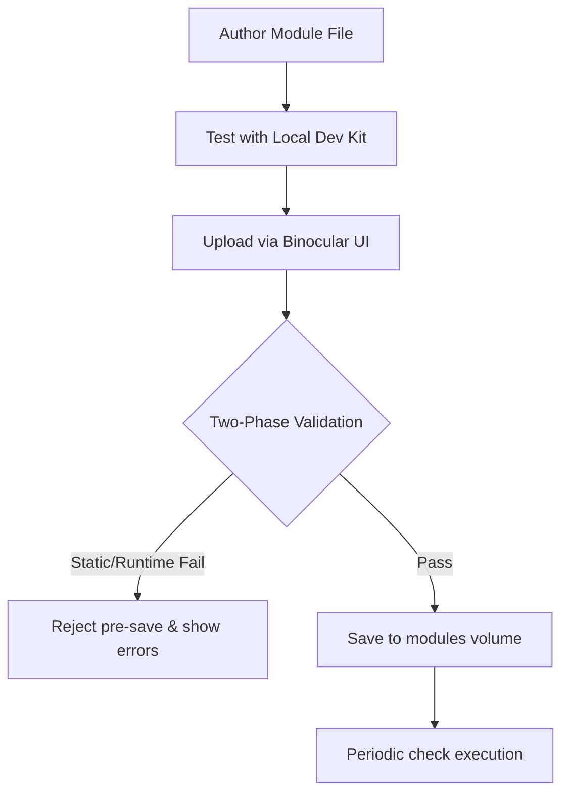

# Extension Module Authoring Guide

Welcome! This guide defines the extension module contract for **Binocular** and explains how to build, test, and validate custom firmware-checking modules locally using the Module Dev Kit.

---

## 1. Trust & Lifecycle Architectural Model

Binocular relies on user-supplied **Extension Modules** to query manufacturer support portals and discover new firmware.

> [!WARNING]
> **Explicit Trust Boundary**  
> Extension modules are not sandboxed. They execute in-process within the main application container and carry full application privileges. Operators must thoroughly vet any third-party module before importing it. The container executes as a non-root user to limit the host blast radius, but this is a security baseline, not an isolation sandbox.

### Module Lifecycle


---

## 2. The Authoring Contract

Each extension module is a standalone `.py` Python script that must implement two specific components: `MODULE_METADATA` and an async `check_firmware` entrypoint.

### 2.1 Module Metadata (`MODULE_METADATA`)
A dictionary defining descriptive settings for the module. It must be valid against the following schema:

| Field | Type | Required | Description |
|-------|------|----------|-------------|
| `module_id` | `str` | **Yes** | A unique, non-empty alphanumeric slug identifier (e.g. `sony_alpha`). |
| `display_name` | `str` | **Yes** | Human-readable name shown in the UI (e.g. `Official Sony Alpha Module`). |
| `version` | `str` | No | SemVer version string of the module (e.g. `1.0.0`). |
| `author` | `str` | No | Name or alias of the creator. |
| `supported_device_hints` | `tuple[str, ...]` | No | Tuple of device type slugs supported by this module. |

### 2.2 Check Entrypoint (`check_firmware`)
An asynchronous callable with the exact signature:
```python
async def check_firmware(input: ModuleCheckInput, scrape_client: ScrapeClient) -> ModuleCheckResult | dict[str, Any]
```

---

## 3. Pydantic Models & Interface Schemas

The contract uses standard Pydantic models to ensure type safety.

### 3.1 Input: `ModuleCheckInput`
The host provides this model containing current device info and scraping targets:
```python
class ModuleCheckInput(BaseModel):
    device_type: str        # e.g., "camera"
    model: str              # e.g., "ILCE-7M4" (Alpha 7 IV)
    current_version: str    # e.g., "1.00"
    source_url: str | None  # Target support portal URL
    extra: dict[str, str]   # Optional module-specific key-value overrides
```

### 3.2 Output: `ModuleCheckResult`
The entrypoint must return a dictionary or model conforming to:
```python
class ModuleCheckResult(BaseModel):
    status: Literal["success", "failed"]   # Run outcome
    latest_version: str | None = None       # Latest discovered version string
    detail: str | None = None              # Info message or failure reason
    source_url: str | None = None          # Scraped source URL
    diagnostics: dict[str, Any] = {}       # Diagnostic context for logs
```

---

## 4. Polite Scraping & `ScrapeClient` API

To protect third-party portals and preserve the legal/reputational standing of the project, direct outbound connections using raw libraries (like `requests` or `urllib`) are strictly prohibited.

> [!IMPORTANT]
> **Polite Scraping Enforcement**  
> All outbound network requests must go through the host-provided `scrape_client`. The client automatically respects `robots.txt` (RFC 9309), applies domain-specific rate limits, implements exponential retry/backoff, and sends a descriptive `User-Agent`.

### 4.1 ScrapeClient Methods
```python
async def fetch(
    self,
    url: str,
    *,
    method: str = "GET",
    headers: Mapping[str, str] | None = None,
) -> ScrapeResponse
```

### 4.2 ScrapeResponse Properties
A successful fetch returns a `ScrapeResponse` containing:
- `status_code` (`int`): HTTP status code (e.g. `200`).
- `url` (`str`): Resolved target URL (accounting for redirects).
- `headers` (`Mapping[str, str]`): Returned response headers.
- `text` (`str`): Unparsed HTML/Text body of the page.
- `diagnostics` (`ScrapeDiagnostics`): Polite scraping attempts, robots.txt status, and timers.

### 4.3 Custom Scrape Errors
Scrape failures throw structured sub-classes of `ScrapeError`. You can catch these to implement specialized scrapers:

| Exception | Raised When |
|-----------|-------------|
| `RobotsDeniedError` | Target page disallows requests under its `robots.txt` rules. |
| `ScrapeTimeoutError` | Underlying HTTP request timed out (default limit is 10s). |
| `ScrapeTransportError` | Underlying HTTP connection or DNS transport fails. |
| `RetryExhaustedError` | Page consistently returns transient errors (429 or 5xx) after retries. |

---

## 5. Copy-Pasteable Module Template

Below is a robust starter template for creating a new module.

```python
"""Starter extension module template for custom device support."""

import re
from typing import Any
from binocular.extensions.contract import ModuleCheckInput, ModuleCheckResult
from binocular.scraping.client import ScrapeClient, ScrapeError

# 1. Declare contract metadata
MODULE_METADATA = {
    "module_id": "custom_starter",
    "display_name": "Custom Starter Support",
    "version": "1.0.0",
    "author": "Developer",
    "supported_device_hints": ("camera", "lens"),
}

# 2. Implement scraper entrypoint
async def check_firmware(
    input: ModuleCheckInput,
    scrape_client: ScrapeClient,
) -> ModuleCheckResult | dict[str, Any]:
    if not input.source_url:
        return {
            "status": "failed",
            "detail": "Missing target source_url",
        }

    try:
        # Fetch the page using the polite scrape client
        response = await scrape_client.fetch(input.source_url)
    except ScrapeError as err:
        return {
            "status": "failed",
            "detail": f"Outbound scrape failed: {err}",
            "diagnostics": {"error_type": type(err).__name__},
        }

    # Extract version using basic regex parsing
    # Adjust this regex match to capture the specific layout of the support page
    version_match = re.search(r"Version\s*(\d+\.\d+(\.\d+)?)", response.text)
    if not version_match:
        return {
            "status": "failed",
            "detail": "Failed to parse version from support page HTML",
            "diagnostics": {"status_code": response.status_code},
        }

    latest_version = version_match.group(1)

    return {
        "status": "success",
        "latest_version": latest_version,
        "source_url": response.url,
        "detail": f"Successfully extracted version {latest_version}",
        "diagnostics": {
            "attempts": response.diagnostics.attempts,
            "status_code": response.status_code,
        },
    }
```

---

## 6. The Module Dev Kit CLI

The Dev Kit provides a terminal CLI utility to statically check and dry-run your modules locally.

### 6.1 Installation / Setup
No configuration or setup is required. Navigate to the project root and run commands via your local Python 3.13 interpreter:

```bash
# Verify the tool is available
python -m binocular.extensions.devkit --help
```

### 6.2 Statically Verify a Module
Statically checks Python syntax, file loading, imports, `MODULE_METADATA` schema validation, and async entrypoint compliance.

```bash
python -m binocular.extensions.devkit check path/to/my_module.py
```

*JSON output mode (ideal for IDE integrations):*
```bash
python -m binocular.extensions.devkit check path/to/my_module.py --json
```

### 6.3 Run Scraper Logic Locally (Dry Run)
Executes static checking followed by the `check_firmware` async logic.

> [!TIP]
> **Offline Local Sandbox**  
> If no `--url` parameter is provided, the Dev Kit injects an offline `MockTransport` that intercepts network requests and returns a sample HTML document containing version `2.5.0` to test parsing safety and error boundaries with zero external network traffic.

```bash
# Run using offline mock scraping client
python -m binocular.extensions.devkit run path/to/my_module.py \
  --device-type "camera" \
  --model "Alpha 7" \
  --current-version "1.0.0"
```

```bash
# Run against a live page to verify real scraper extraction
python -m binocular.extensions.devkit run path/to/my_module.py \
  --device-type "camera" \
  --model "Alpha 7" \
  --current-version "1.0.0" \
  --url "https://www.sony.com/electronics/support/software/00262402"
```

---
*Binocular Extension Engine v1.0.0*
