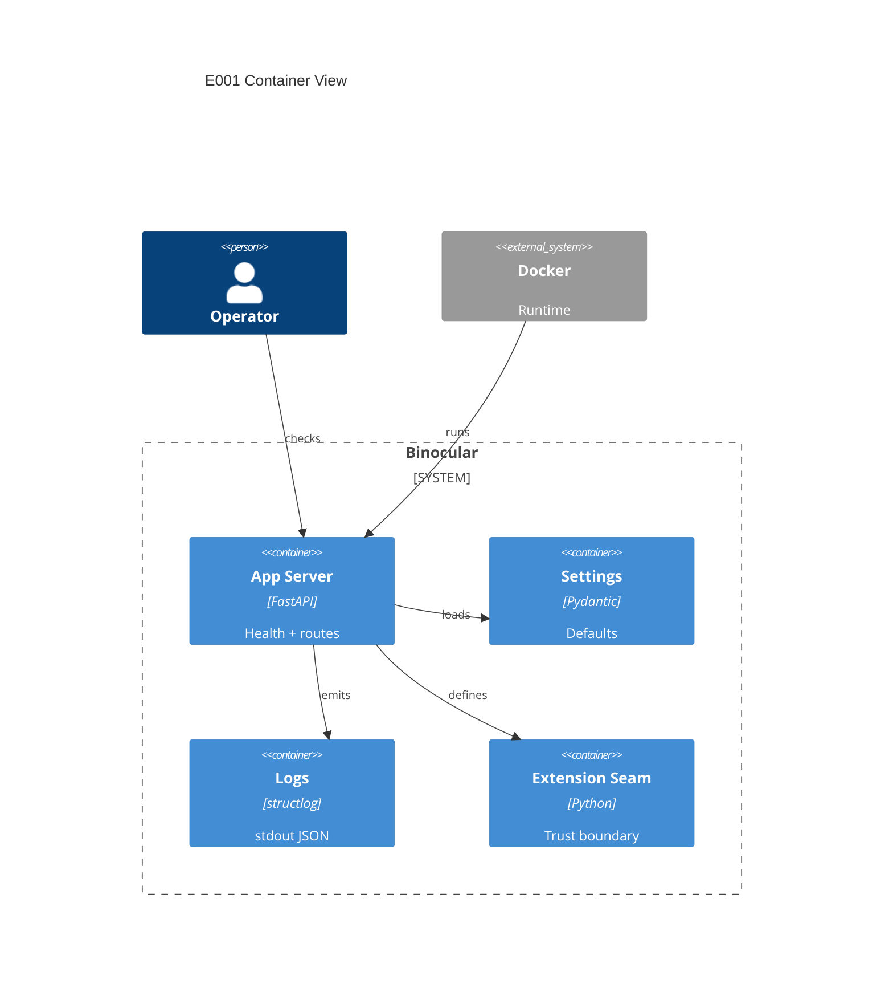

# Implementation Plan: Application Skeleton & Container

**Branch**: `00001-application-skeleton-container` | **Date**: 2026-05-31 | **Spec**: [spec.md](spec.md)

## Summary

**Goal**: Establish the zero-config FastAPI backend skeleton and least-privilege container.  
**Approach**: Build a greenfield backend package, shallow health API, structured logging, tests, and Docker runtime.  
**Key Constraint**: No external service, database, account, or telemetry dependency.

## Technical Context

**Language/Version**: Python 3.13  
**Primary Dependencies**: FastAPI, Uvicorn, Pydantic Settings, structlog, pytest, httpx  
**Storage**: N/A for E001; SQLite introduced by E004  
**Testing**: pytest, pytest-asyncio, httpx ASGI client, Ruff, mypy --strict, coverage.py  
**Target Platform**: Linux Docker container on `python:3.13-slim`, port 8000  
**Project Type**: web  
**Project Mode**: greenfield  
**Performance Goals**: `/healthz` remains cheap and dependency-free  
**Constraints**: backend source under `backend/src/`; zero-config startup; non-root container; no sandbox claim  
**Scale/Scope**: single-user trusted-LAN skeleton for later epics

## Instructions Check

| Gate | Status | Evidence |
|------|--------|----------|
| Honest failure | PASS | Healthcheck and JSON stdout logs make startup failures visible. |
| Polite by default | PASS | No outbound requests in E001; later scraping remains outside scope. |
| Data ownership | PASS | No external database or service introduced. |
| Least privilege | PASS | Docker runtime runs as non-root and documents unsandboxed future modules. |
| Type safety | PASS | Plan requires mypy --strict and typed settings/tests. |
| Reliability | PASS | App starts with zero required configuration. |
| Source layout | PASS | Backend code lives under `backend/src/`. |

## Architecture



## Architecture Decisions

| ID | Decision | Options Considered | Chosen | Rationale |
|----|----------|--------------------|--------|-----------|
| AD-001 | App construction style | module global / app factory | app factory | Supports tests, future lifespan hooks, and router aggregation. |
| AD-002 | Health depth | shallow liveness / dependency readiness | shallow liveness | E001 has no dependencies and must stay cheap. |
| AD-003 | Logging format | plain text / JSON stdout | JSON stdout | Container logs and QC can parse failures reliably. |

## Data Model Summary

| Entity | Key Fields | Relationships | Notes |
|--------|------------|---------------|-------|
| App Factory | settings, routers, logging | owns app assembly | Runtime only; no persistence. |
| Settings | app_name, host, port, log_level | consumed by app factory | Defaults require no env vars. |
| Health Response | status, service, version | returned by `/healthz` | API DTO only. |
| Extension Boundary | core namespace, extension namespace | referenced by future modules | Documents unsandboxed seam. |

**Detail**: [data-model.md](data-model.md)

## API Surface Summary

| Method | Path | Purpose | Auth | Req/Res Types |
|--------|------|---------|------|---------------|
| GET | `/healthz` | Process liveness | none | `HealthResponse` |

**Detail**: [contracts/](contracts/)

## Testing Strategy

| Tier | Tool | Scope | Mock Boundary | Install |
|------|------|-------|---------------|---------|
| Unit | pytest | settings, logging config, app factory | env vars only | `pip install pytest pytest-asyncio` |
| Integration | httpx ASGI client | `/healthz` and app startup | in-process ASGI | `pip install httpx` |
| Static | Ruff + mypy | lint and strict typing | — | `pip install ruff mypy` |
| Security | pip-audit | Python dependencies | — | `pip install pip-audit` |
| Coverage | coverage.py via pytest-cov | backend tests | — | `pip install pytest-cov` |

## Error Handling Strategy

| Error Category | Pattern | Response | Retry |
|----------------|---------|----------|-------|
| Startup config | fail-fast for invalid explicit override | structured log + process failure | no |
| Health route | shallow success only | 200 JSON when responsive | no |
| Unexpected exception | structured exception logging | 500 JSON from FastAPI defaults | no |

## Integration Points

| Spec Reference | System/Service | Technical Approach | Contract |
|----------------|----------------|--------------------|----------|
| IP-001 | Later API routers | router aggregator imports feature routers | app factory module |
| IP-002 | E003 SPA | app factory later mounts static files | future StaticFiles mount |
| IP-003 | E004 data layer | lifespan hooks initialize database | settings + app lifespan |
| IP-004 | E006/E007 modules/scraping | extension package documents trust boundary | `backend/src/binocular/extensions/` |
| IP-005 | E002 CI | Dockerfile and commands become validation targets | `Dockerfile`, pytest, mypy, ruff |

## Risk Mitigation

| Risk (from spec) | Likelihood | Impact | Mitigation | Owner |
|-------------------|------------|--------|------------|-------|
| Dependency compatibility | medium | medium | Pin compatible Python 3.13 dependency ranges in backend project metadata. | backend package |
| Container health flakiness | low | medium | Use healthcheck interval/start-period and a dependency-free endpoint. | Dockerfile |
| Boundary drift | medium | high | Add extension seam docs and tests that import the app through the factory. | backend architecture |

## Requirement Coverage Map

| Req ID | Component(s) | File Path(s) | Notes |
|--------|--------------|--------------|-------|
| TR-001 | app factory | `backend/src/binocular/main.py`, `backend/src/binocular/app.py` | importable construction |
| TR-002 | package layout | `backend/src/binocular/routes/`, `services/`, `repositories/`, `extensions/` | ownership boundaries |
| TR-003 | health route | `backend/src/binocular/routes/health.py` | `/healthz` |
| TR-004 | settings | `backend/src/binocular/config.py` | typed defaults |
| TR-005 | logging | `backend/src/binocular/logging.py` | JSON stdout |
| TR-006 | image | `Dockerfile` | Python 3.13 slim runtime |
| TR-007 | image user | `Dockerfile` | non-root `USER` |
| TR-008 | healthcheck | `Dockerfile` | HTTP `/healthz` check |
| TR-009 | docs/seam | `backend/src/binocular/extensions/README.md`, `README.md` | no sandbox claim |

## Project Structure

### Source Code

```text
backend/
  pyproject.toml
  src/binocular/
    __init__.py
    app.py
    config.py
    logging.py
    main.py
    routes/
      __init__.py
      health.py
    services/
      __init__.py
    repositories/
      __init__.py
    extensions/
      README.md
      __init__.py
  tests/
    test_app.py
    test_config.py
    test_health.py
    test_logging.py
Dockerfile
.dockerignore
```

## Implementation Hints

- **[HINT-001]** Order: Create backend package and tests before Docker so failures are local first.
- **[HINT-002]** Constraint: `/healthz` must not touch database, network, or module loading.
- **[HINT-003]** Gotcha: `structlog` setup must avoid duplicate handlers across repeated app construction in tests.
- **[HINT-004]** Compatibility: Use Python 3.13-compatible dependency pins.
- **[HINT-005]** Security: Docker runtime `USER` must be numeric or named non-root and own only required app paths.