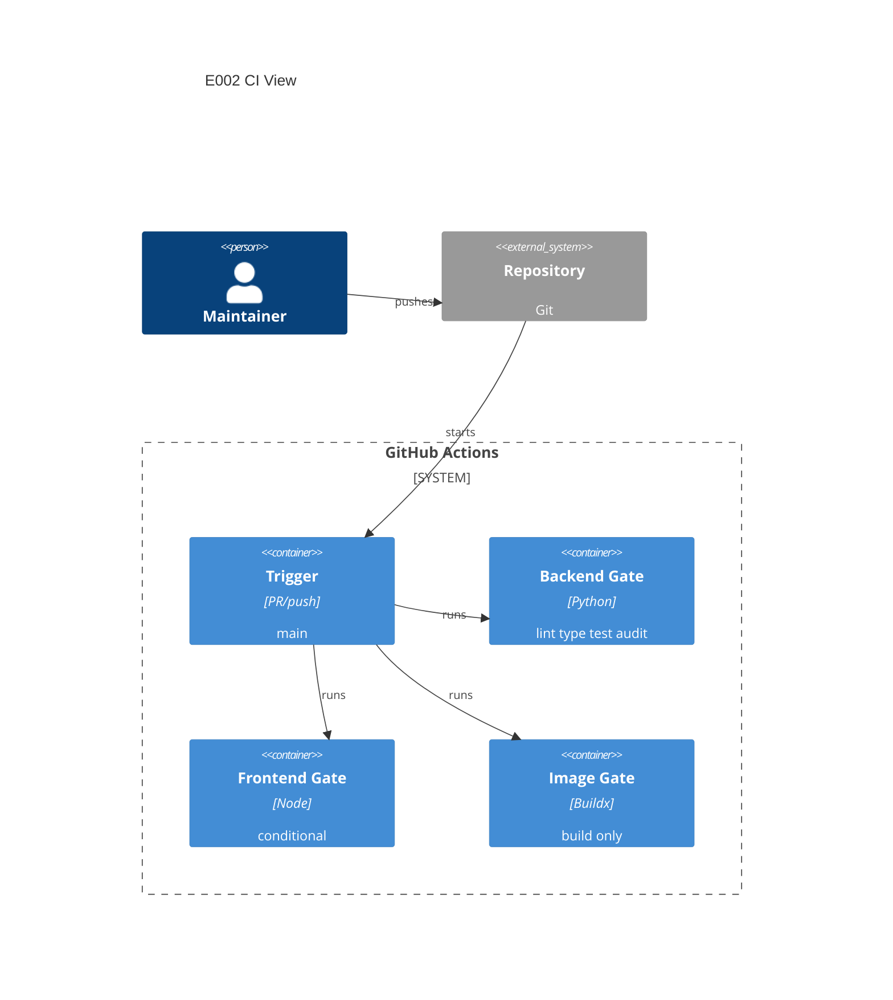

# Implementation Plan: Continuous Integration Pipeline

**Branch**: `00002-continuous-integration-pipeline` | **Date**: 2026-05-31 | **Spec**: [spec.md](spec.md)

## Summary

**Goal**: Add GitHub Actions CI for backend quality gates, future frontend gates, and Docker build validation.  
**Approach**: Create one workflow with separate backend, frontend, and Docker jobs.  
**Key Constraint**: Build-only validation; no image publishing or release artifacts.

## Technical Context

**Language/Version**: Python 3.13 backend; future TypeScript 5.x frontend  
**Primary Dependencies**: GitHub Actions, setup-python, Docker Buildx, backend pyproject tools  
**Storage**: N/A  
**Testing**: Ruff, mypy, pytest-cov, pip-audit; future npm lint/type/test scripts  
**Target Platform**: GitHub-hosted Ubuntu runners  
**Project Type**: operational CI workflow  
**Project Mode**: mixed  
**Performance Goals**: CI uses pip and Buildx layer caching to reduce repeat runtime  
**Constraints**: PR/push build-only; no registry login; pin actions to major versions  
**Scale/Scope**: one workflow for current backend and future frontend package

## Instructions Check

| Gate | Status | Evidence |
|------|--------|----------|
| Type safety | PASS | Backend mypy strict job is required. |
| Lint/static analysis | PASS | Ruff and mypy run in backend job. |
| Coverage | PASS | pytest-cov enforces `backend/pyproject.toml` 80% threshold. |
| Security scanning | PASS | pip-audit runs in backend job. |
| Self-contained runtime | PASS | Workflow adds CI only; no runtime service dependency. |
| Release boundary | PASS | Docker job uses `push: false`; E018 owns publishing. |

## Architecture



## Architecture Decisions

| ID | Decision | Options Considered | Chosen | Rationale |
|----|----------|--------------------|--------|-----------|
| AD-001 | Workflow shape | one workflow / multiple workflows | one workflow | Keeps PR status simple for the first CI increment. |
| AD-002 | Frontend absence handling | fail / skip explicitly | skip explicitly | E003 is parallel and may not exist yet. |
| AD-003 | Image behavior | build-only / build and push | build-only | E018 owns release publishing. |

## Data Model Summary

N/A — no persistent data.

## API Surface Summary

N/A — no application API surface.

## Testing Strategy

| Tier | Tool | Scope | Mock Boundary | Install |
|------|------|-------|---------------|---------|
| Workflow syntax | GitHub Actions YAML + local grep | `.github/workflows/ci.yml` | no runner simulation | N/A |
| Backend gate | Ruff, mypy, pytest-cov, pip-audit | current backend commands | none | configured in `backend/pyproject.toml` |
| Frontend gate | npm scripts | future `frontend/package.json` | manifest gate | deferred until E003 |
| Docker gate | Docker Buildx / local Docker | repository image build | no registry push | configured by Dockerfile |

## Error Handling Strategy

| Error Category | Pattern | Response | Retry |
|----------------|---------|----------|-------|
| Backend check failure | fail-fast per command | job fails with command output | no |
| Missing frontend manifest | explicit skip | job succeeds with skip message | no |
| Frontend script failure | fail-fast when manifest exists | job fails with npm output | no |
| Docker build failure | fail-fast | job fails with Buildx output | no |

## Integration Points

| Spec Reference | System/Service | Technical Approach | Contract |
|----------------|----------------|--------------------|----------|
| IP-001 | E001 backend | run commands from `backend/` | `ruff check .`, `mypy .`, `pytest --cov`, `pip-audit` |
| IP-002 | E003 frontend | condition on `frontend/package.json` | npm `lint`, `typecheck`, `test` scripts |
| IP-003 | E018 release | leave publishing out | no registry login or push |

## Risk Mitigation

| Risk (from spec) | Likelihood | Impact | Mitigation | Owner |
|-------------------|------------|--------|------------|-------|
| Frontend parallelism mismatch | medium | medium | Document expected script names and gate only when manifest exists. | CI workflow |
| CI/runtime drift | medium | high | Reuse exact local backend commands from E001. | backend job |
| Publishing creep | low | medium | Omit registry login and set Docker build `push: false`. | Docker job |

## Requirement Coverage Map

| Req ID | Component(s) | File Path(s) | Notes |
|--------|--------------|--------------|-------|
| OR-001 | workflow trigger | `.github/workflows/ci.yml` | PR and push to main |
| OR-002 | backend job | `.github/workflows/ci.yml` | Ruff check |
| OR-003 | backend job | `.github/workflows/ci.yml` | mypy strict |
| OR-004 | backend job | `.github/workflows/ci.yml` | pytest coverage |
| OR-005 | backend job | `.github/workflows/ci.yml` | pip-audit |
| OR-006 | frontend job | `.github/workflows/ci.yml` | conditional manifest check |
| OR-007 | docker job | `.github/workflows/ci.yml` | Buildx build |
| OR-008 | docker job | `.github/workflows/ci.yml` | no push/login |
| OR-009 | cache config | `.github/workflows/ci.yml` | pip and gha layer cache |

## Project Structure

### Source Code

```text
~ .github/workflows/
  + ci.yml
```

**Patterns to reuse**: backend commands from E001 and existing Dockerfile.  
**Tests to extend**: local backend validation and Docker build smoke.  
**Naming conventions**: workflow file name `ci.yml`; lower-case job IDs.

## Implementation Hints

- **[HINT-001]** Order: Add workflow first, then validate YAML and run equivalent local commands.
- **[HINT-002]** Constraint: Do not add `docker/login-action` or `push: true`.
- **[HINT-003]** Gotcha: Frontend job must not fail while `frontend/package.json` is absent.
- **[HINT-004]** Compatibility: Use Python 3.13 and major-pinned actions.