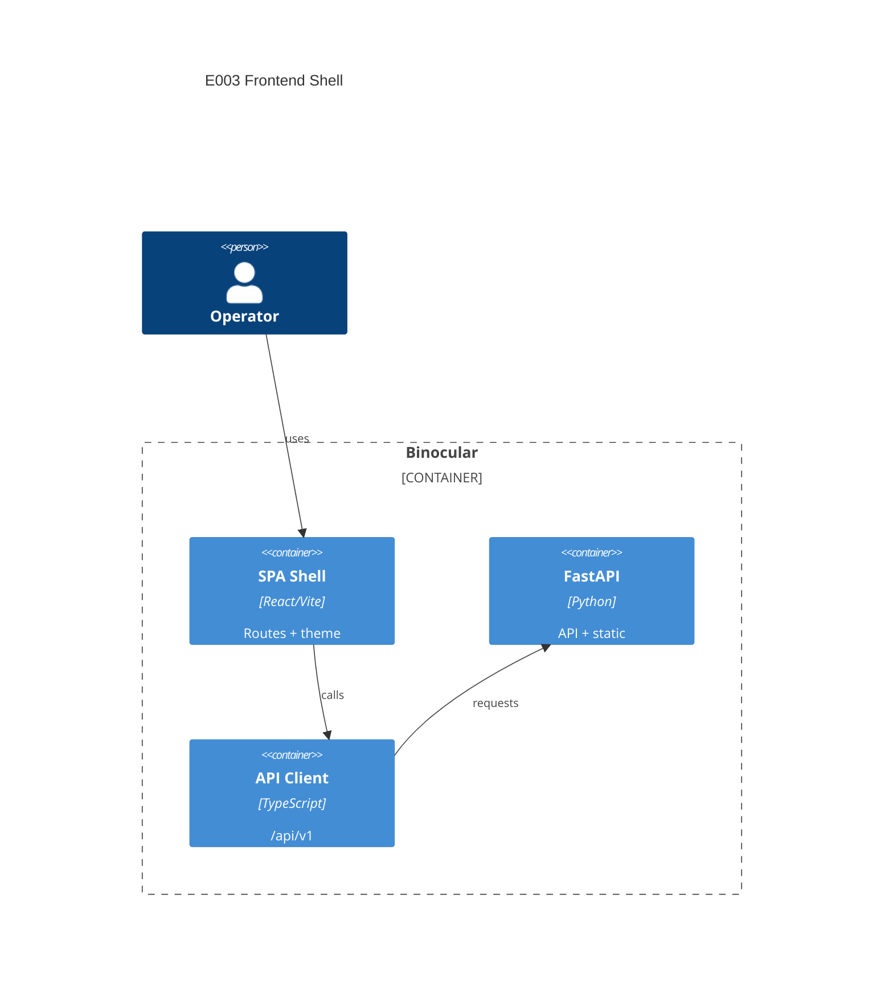

# Implementation Plan: Frontend SPA Shell

## Summary

| Field | Value |
|-------|-------|
| Feature | E003 Frontend SPA Shell |
| Spec | [spec.md](spec.md) |
| Mode | Lightweight brownfield/mixed implementation |

## Instructions Check

| Principle | Status | Plan Alignment |
|-----------|--------|----------------|
| Honest Failure | PASS | Shell includes activity/error surfaces only as placeholders; no hidden checks introduced. |
| Data Ownership | PASS | No external services or telemetry added. |
| Least Privilege | PASS | Docker runtime remains non-root. |
| Type Safety | PASS | Frontend uses strict TypeScript and CI type-check. |
| Source Root | PASS | Frontend source lives under `frontend/src/`. |
| Single Container | PASS | Docker builds SPA and serves it from FastAPI. |

## Technical Context

| Field | Value |
|-------|-------|
| Language/Version | Python 3.13; TypeScript 5.x; React 18; Node 22 |
| Primary Dependencies | FastAPI, Uvicorn, React, Vite, Tailwind CSS, React Router, Vitest, Testing Library |
| Storage | N/A — no persistent data in this epic |
| Testing | pytest, Ruff, mypy; Vitest, Testing Library, ESLint, `tsc` |
| Target Platform | Single Linux Docker container, port 8000 |
| Project Type | Web application |
| Project Mode | mixed |
| Performance Goals | Fast static shell load for small trusted-LAN app |
| Constraints | Single image; non-root runtime; no telemetry; strict typing |
| Scale/Scope | Single-user UI shell for later feature screens |

## Data Model Summary

N/A — no persistent data in this technical shell epic.

## API Surface Summary

| Endpoint/Client | Direction | Purpose | Requirement |
|-----------------|-----------|---------|-------------|
| `/api/v1/*` typed client | Frontend → Backend | Shared JSON request wrapper for later API calls | TR-004 |
| `/` and SPA routes | Browser → Backend | Serve Vite build and deep-link fallback | TR-005, TR-006 |
| `/healthz`, `/api/v1/healthz` | Browser/CI → Backend | Existing health endpoints preserved | TR-006 |

## Architecture

## Architecture Decisions

| ID | Question | Options | Decision | Rationale |
|----|----------|---------|----------|-----------|
| AD-001 | How should deep links be served? | FastAPI fallback; separate web server | FastAPI fallback | Preserves single-container ADR-0003 and avoids extra infrastructure. |
| AD-002 | How should theme state persist? | localStorage; server preference; no persistence | localStorage | Single-user browser setting with no backend dependency. |

## Source Code Structure

| Path | Change | Purpose |
|------|--------|---------|
| `frontend/` | + | Vite React application root |
| `frontend/src/` | + | React source root per project instructions |
| `frontend/src/api/client.ts` | + | Typed `/api/v1` client wrapper |
| `frontend/src/theme/ThemeProvider.tsx` | + | Theme primitives and persistence |
| `frontend/src/App.tsx` | + | Shell routes and layout |
| `backend/src/binocular/static.py` | + | Static asset path and SPA mount helper |
| `backend/src/binocular/app.py` | ~ | Mount SPA after API router |
| `backend/pyproject.toml` | ~ | Include static assets in wheel |
| `Dockerfile` | ~ | Add Node frontend build stage |
| `.github/workflows/ci.yml` | ~ | Existing frontend job becomes active |

## Testing Strategy

| Tier | Tool | Scope | Mock Boundary | Install |
|------|------|-------|---------------|---------|
| Unit | Vitest + Testing Library | React shell routes/theme/API client | Mock `fetch` | `npm ci` |
| Integration | pytest + httpx | FastAPI static/deep-link behavior | Built test fixture files | configured |
| Security | pip-audit + npm audit | Backend and frontend dependency audit | Package manifests | configured / `npm audit --audit-level=high` |
| Coverage | pytest-cov | Backend coverage threshold 80% | Existing backend tests | configured |

## Error Handling Strategy

| Error Category | Pattern | Response | Retry |
|----------------|---------|----------|-------|
| Missing SPA build | graceful fallback | Backend starts; API routes remain available | no |
| API client HTTP error | typed exception | Caller receives status and message | no |
| Static missing asset | StaticFiles default | 404 for asset path | no |

## Integration Points

| Integration | Approach | Validation |
|-------------|----------|------------|
| FastAPI app factory | Include API router first, then mount SPA helper | pytest route tests |
| Docker image | Build frontend in Node stage, copy `dist/` into backend package before wheel build | `docker build` |
| CI frontend gates | Use existing conditional workflow, now active with `frontend/package.json` | `npm` commands |

## Risk Mitigation

| Risk | Mitigation | Owner |
|------|------------|-------|
| Docker build complexity increases by adding a Node stage | Keep frontend build isolated and copy only `dist/` into backend static package path | Dockerfile |
| Static route ordering could accidentally shadow API endpoints | Add backend tests for `/healthz`, `/api/v1/healthz`, `/`, and deep links | Backend tests |
| Frontend dependency changes may add new audit findings in CI | Run `npm audit --audit-level=high` locally and in CI | CI/frontend |

## Requirement Coverage Map

| Requirement | Components | File Paths |
|-------------|------------|------------|
| TR-001 | Frontend toolchain | `frontend/package.json`, `frontend/tsconfig.json`, `frontend/vite.config.ts`, `frontend/tailwind.config.ts`, `frontend/src/` |
| TR-002 | SPA shell routes | `frontend/src/App.tsx`, `frontend/src/main.tsx` |
| TR-003 | Theme primitives | `frontend/src/theme/ThemeProvider.tsx`, `frontend/src/theme/useTheme.ts` |
| TR-004 | API client | `frontend/src/api/client.ts`, `frontend/src/api/client.test.ts` |
| TR-005 | Static SPA serving | `backend/src/binocular/static.py`, `backend/src/binocular/app.py`, `backend/tests/test_static.py` |
| TR-006 | Route preservation | `backend/src/binocular/static.py`, `backend/tests/test_static.py` |
| TR-007 | Docker frontend build | `Dockerfile`, `.dockerignore` |
| TR-008 | Frontend quality gates | `frontend/package.json`, `.github/workflows/ci.yml` |

## Implementation Hints

- **[HINT-001]** Order: create frontend package and lockfile before relying on CI frontend gates.
- **[HINT-002]** Gotcha: mount SPA fallback after existing API router so `/healthz` is not shadowed.
- **[HINT-003]** Compatibility: avoid dynamic Tailwind color class construction; content scanning must see used classes.
- **[HINT-004]** Constraint: backend development must work even when frontend `dist/` is absent.
