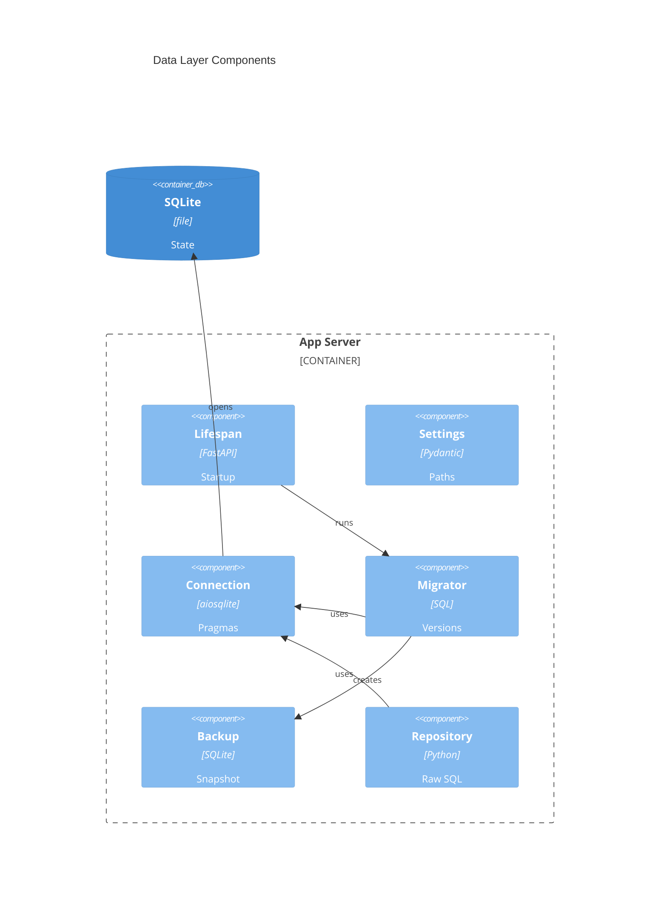

# Implementation Plan: Data Layer & Migrations

**Branch**: `main` | **Date**: 2026-05-31 | **Spec**: [spec.md](spec.md)

## Summary

**Goal**: Add the backend SQLite data layer, migration runner, backup hook, and repository base.  
**Approach**: Keep persistence under `backend/src/binocular/db/`, initialize it from FastAPI lifespan, and validate with focused pytest coverage.  
**Key Constraint**: Raw parameterized SQL only; no ORM or external database.

## Technical Context

**Language/Version**: Python 3.13  
**Primary Dependencies**: FastAPI, Uvicorn, Pydantic Settings, structlog, aiosqlite  
**Storage**: SQLite single file at configured data path, defaulting under `/app/data`  
**Testing**: pytest, pytest-asyncio, pytest-cov, mypy strict, Ruff, pip-audit  
**Target Platform**: Linux Docker container and host Python runtime  
**Project Type**: web  
**Project Mode**: brownfield  
**Performance Goals**: Startup migrations complete before serving requests; WAL supports concurrent reads with one writer.  
**Constraints**: Single backup-able SQLite volume, non-root writable paths, visible startup failure on persistence errors.  
**Scale/Scope**: Single-user instance with roughly 5-50+ devices and background checks.

## Instructions Check

| Gate | Result | Evidence |
|------|--------|----------|
| Honest Failure | PASS | Backup, ordering, and migration failures fail startup visibly. |
| Polite by Default | N/A | No outbound scraping in scope. |
| Data Ownership | PASS | Single SQLite file; no external DB or ORM. |
| Least Privilege | PASS | Uses configured data paths writable by non-root runtime. |
| Type Safety | PASS | Adds typed Python modules and strict mypy-compatible tests. |
| Reliability | PASS | Zero-config defaults, idempotent no-op startup, rollback on failure. |

## Architecture



## Architecture Decisions

| ID | Decision | Options Considered | Chosen | Rationale |
|----|----------|--------------------|--------|-----------|
| AD-001 | Migration timing | startup / request-time / CLI-only | startup | Ensures schema is current before routes or workers use repositories. |
| AD-002 | Backup method | SQLite backup API / raw file copy | SQLite backup API | Avoids WAL copy hazards and produces a consistent snapshot. |
| AD-003 | Repository abstraction | thin helper / ORM / direct cursors | thin helper | Preserves raw SQL while standardizing parameter binding and mapping. |

## Data Model Summary

| Entity | Key Fields | Relationships | Notes |
|--------|------------|---------------|-------|
| Database Settings | database path, backup dir, busy timeout | Used by connection and backup components | Zero-config with `BINOCULAR_` overrides. |
| Schema Version | version, name, applied_at | One row per applied migration | Updated atomically with migration SQL. |
| Migration File | version, name, SQL | Produces schema version | Append-only numbered files. |
| Pre-Migration Backup | path, created_at, source | Created before pending migrations | Failure blocks migration. |
| Repository Base | connection, helpers | Used by future repositories | Parameterized SQL only. |

**Detail**: [data-model.md](data-model.md)

## API Surface Summary

| Method | Path | Purpose | Auth | Req/Res Types |
|--------|------|---------|------|---------------|
| Internal | `ConnectionManager.open()` | Open configured SQLite connection with pragmas | N/A | `aiosqlite.Connection` |
| Internal | `MigrationRunner.apply_pending()` | Apply pending migrations during lifespan | N/A | migration result / exception |
| Internal | `Repository.*` | Execute and fetch parameterized SQL | N/A | mapped Python rows |

**Detail**: [contracts/repository-base.md](contracts/repository-base.md)

## Testing Strategy

| Tier | Tool | Scope | Mock Boundary | Install |
|------|------|-------|---------------|---------|
| Unit | pytest | filename parsing, ordering validation, repository mapping | temp SQLite paths | configured |
| Integration | pytest-asyncio | connection pragmas, startup migration success/failure, backup snapshot | tmp_path filesystem | configured; add `aiosqlite` runtime dep |
| Security | pip-audit, Ruff B rules | dependency and injection-prone patterns | N/A | configured |
| Coverage | pytest-cov | backend data-layer branches | N/A | configured |

## Error Handling Strategy

| Error Category | Pattern | Response | Retry |
|----------------|---------|----------|-------|
| Invalid migration set | fail-fast | startup error with structured log | no |
| Backup failure | fail-fast | startup error before migration SQL | no |
| Migration SQL failure | rollback | startup error; version not recorded | no |
| SQLite busy/lock | bounded wait | raises after configured timeout | no automatic retry |

## Integration Points

| Spec Reference | System/Service | Technical Approach | Contract |
|----------------|----------------|--------------------|----------|
| FastAPI lifespan from E001 | App startup | Call migration runner before yielding lifespan | `binocular.app.create_app` |
| Settings from E001 | Runtime config | Add DB path, backup path, busy timeout settings | `binocular.config.Settings` |
| Future E005/E006/E014 schemas | Domain repositories | Append migrations and subclass/use repository base | [contracts/repository-base.md](contracts/repository-base.md) |
| E019 backup operations | Operations | Reuse path conventions and snapshot directory | [data-model.md](data-model.md) |

## Risk Mitigation

| Risk (from spec) | Likelihood | Impact | Mitigation | Owner |
|-------------------|------------|--------|------------|-------|
| SQLite backup behavior in WAL mode can be wrong if raw file copy is used instead of SQLite backup semantics | M | H | Implement backup through SQLite backup API and cover with integration tests. | DB layer |
| Migration startup failures can make the app unavailable until fixed, but this is preferable to silent data corruption | L | M | Log structured failure and keep migration transaction atomic. | Migrator |
| Future parallel epics can collide on migration numbering unless project-plan guidance is followed | M | M | Validate contiguous numbering and document append-only numbering in hints. | Maintainers |

## Requirement Coverage Map

| Req ID | Component(s) | File Path(s) | Notes |
|--------|--------------|--------------|-------|
| TR-001 | Settings | `backend/src/binocular/config.py` | Add DB and backup path defaults. |
| TR-002 | Connection Manager | `backend/src/binocular/db/connection.py` | Apply WAL, FK, busy timeout. |
| TR-003 | Migrator | `backend/src/binocular/db/migrations.py`, `backend/src/binocular/db/migrations/001_initial.sql` | Create and maintain version table. |
| TR-004 | Migrator | `backend/src/binocular/db/migrations.py` | Discover and validate ordered files. |
| TR-005 | Migrator | `backend/src/binocular/db/migrations.py` | Transaction per migration and version insert. |
| TR-006 | App Lifespan | `backend/src/binocular/app.py` | Run migrations before yielding startup. |
| TR-007 | Backup | `backend/src/binocular/db/backup.py` | Snapshot before pending migrations. |
| TR-008 | DB Layer | `backend/src/binocular/db/*.py` | Raise and log failures visibly. |
| TR-009 | Repository Base | `backend/src/binocular/repositories/base.py` | Parameterized execute/fetch helpers. |
| TR-010 | Tests | `backend/tests/test_db_*.py`, `backend/tests/test_repositories.py` | Cover pragmas, migrations, backups, helpers. |
| TR-011 | Repository Base | `backend/src/binocular/repositories/base.py`, `backend/tests/test_repositories.py` | Bind SQL values and test allowlisted dynamic identifiers. |

## Project Structure

### Source Code

```text
+ backend/src/binocular/db/__init__.py
+ backend/src/binocular/db/backup.py
+ backend/src/binocular/db/connection.py
+ backend/src/binocular/db/migrations.py
+ backend/src/binocular/db/migrations/001_initial.sql
+ backend/src/binocular/repositories/base.py
~ backend/src/binocular/app.py
~ backend/src/binocular/config.py
+ backend/tests/test_db_connection.py
+ backend/tests/test_db_migrations.py
+ backend/tests/test_repositories.py
~ backend/pyproject.toml
```

**Patterns to reuse**: `Settings` in `config.py`, app lifespan in `app.py`, strict pytest style in existing backend tests.  
**Tests to extend**: add new backend tests rather than changing health/static tests.  
**Naming conventions**: snake_case modules, typed functions, no one-letter variables.

## Implementation Hints

- **[HINT-001]** Order: add `aiosqlite` dependency before importing DB modules in tests.
- **[HINT-002]** Gotcha: `PRAGMA foreign_keys=ON` must run outside transactions on every connection.
- **[HINT-003]** Gotcha: do not create backups when there are no pending migrations.
- **[HINT-004]** Constraint: migration filename validation must catch gaps before executing SQL.
- **[HINT-005]** Compatibility: use temp DB paths in tests so local developer data is never touched.
