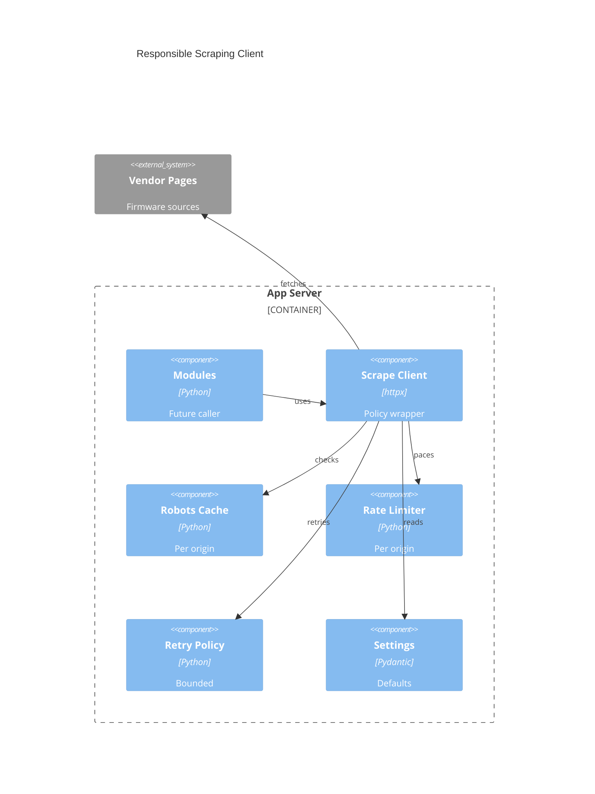

# Implementation Plan: Responsible Scraping Client

## Summary

| Field | Value |
|-------|-------|
| Feature | E007 Responsible Scraping Client |
| Spec | [spec.md](spec.md) |
| Mode | lightweight, brownfield |

## Technical Context

| Field | Value |
|-------|-------|
| Language/Version | Python 3.13 |
| Primary Dependencies | FastAPI, Pydantic Settings, structlog, httpx |
| Storage | N/A — in-memory robots/rate-limit state only |
| Testing | pytest, pytest-asyncio, pytest-cov, Ruff, mypy, pip-audit |
| Target Platform | Host runtime and single non-root Docker container |
| Project Type | Web application backend component |
| Project Mode | brownfield |
| Performance Goals | Avoid live-network tests; keep same-origin pacing deterministic |
| Constraints | Centralized outbound path, robots.txt respect, identifiable UA, no telemetry |
| Scale/Scope | Single-user instance, modest concurrent manufacturer checks |

## Instructions Check

| Principle | Status | Plan Alignment |
|-----------|--------|----------------|
| Honest Failure | PASS | Typed scrape errors expose policy/transport/retry failures. |
| Polite by Default | PASS | All policy enforcement lives in a central client. |
| Data Ownership | PASS | No external service dependency or persistent external state. |
| Least Privilege | PASS | No sandbox claim; client is core-owned and injectable later. |
| Type Safety | PASS | Strict mypy and deterministic tests required. |
| Set-and-Forget | PASS | Zero-config defaults for User-Agent, timeout, limiter, retries. |

## Data Model Summary

| Entity | Scope | Fields / State | Persistence |
|--------|-------|----------------|-------------|
| ScrapeRequest | Module-facing request input | URL, method, headers override | None |
| ScrapeResponse | Successful result | status_code, url, headers, text/bytes, diagnostics | None |
| ScrapeDiagnostics | Structured outcome metadata | origin, attempts, robots_allowed, retry_reason | None |
| RobotsPolicyCache | Per-origin cache | origin, policy text, fetched_at, expiry | In-memory |
| OriginRateLimiter | Per-origin pacing | origin, next_allowed_at | In-memory |

## API Surface Summary

N/A — no FastAPI or browser-facing API surface in this feature.

## Architecture

## Architecture Decisions

| ID | Question | Options | Decision | Rationale |
|----|----------|---------|----------|-----------|
| AD-001 | Runtime HTTP primitive | `httpx.AsyncClient`, urllib, requests | Use `httpx.AsyncClient` | Matches async backend and supports fake transports. |
| AD-002 | Robots policy storage | persistent table, in-memory cache | In-memory per-origin cache | This epic has no durable activity-log requirement. |
| AD-003 | Test timing | real sleeps, injectable clock | Injectable async sleeper/clock | Deterministic tests without slow wall-clock waits. |

## Source Code Structure

| Path | Change | Purpose |
|------|--------|---------|
| `backend/pyproject.toml` | ~ | Move `httpx` to runtime dependencies. |
| `backend/src/binocular/config.py` | ~ | Add scrape client defaults. |
| `backend/src/binocular/scraping/__init__.py` | + | Export scraping client types. |
| `backend/src/binocular/scraping/client.py` | + | Central client, errors, diagnostics. |
| `backend/src/binocular/scraping/robots.py` | + | Robots cache and parser wrapper. |
| `backend/src/binocular/scraping/rate_limit.py` | + | Per-origin pacing helper. |
| `backend/tests/test_scraping_client.py` | + | Client policy/backoff tests. |
| `backend/tests/test_config.py` | ~ | Scrape settings tests. |

### Brownfield Notes

| Category | Notes |
|----------|-------|
| Patterns to reuse | Pydantic settings in `config.py`; typed helper modules under `backend/src/binocular/`; pytest async tests. |
| Tests to extend | Backend unit tests with fake `httpx.MockTransport` and no live calls. |
| Naming conventions | Package modules use lower_snake_case; public classes use PascalCase. |

## Testing Strategy

| Tier | Tool | Scope | Mock Boundary | Install |
|------|------|-------|---------------|---------|
| Unit | pytest + pytest-asyncio | Robots decisions, limiter, diagnostics, retry policy | Fake clock/sleeper | configured |
| Integration | pytest + httpx.MockTransport | Client request flow including robots + target request | MockTransport only | configured after runtime dependency move |
| Security | pip-audit | Dependency vulnerability scan | Installed package graph | configured |
| Coverage | pytest-cov | Backend package coverage | Local tests only | configured |

## Error Handling Strategy

| Error Category | Pattern | Response | Retry |
|----------------|---------|----------|-------|
| Robots Denied | fail fast | `RobotsDeniedError` with diagnostics | no |
| Transport | bounded retry then typed failure | `ScrapeTransportError` / `RetryExhaustedError` | yes for transient cases |
| Timeout | typed failure | `ScrapeTimeoutError` with origin and attempt count | no unless raised from retryable response path |
| Retryable Status | bounded backoff | final response if success, `RetryExhaustedError` if exhausted | yes, exponential / Retry-After |

## Integration Points

| Integration | Approach | Owner |
|-------------|----------|-------|
| App settings | Add zero-config scraping defaults under `BINOCULAR_` env prefix. | config |
| Future module engine | Expose stable `ScrapeClient.fetch()` interface for injection. | scraping package |
| Structured logging | Log policy/retry events without response body content. | scraping package |
| Manufacturer pages | Use only through configured `httpx.AsyncClient` wrapper. | scrape client |

## Risk Mitigation

| Risk | Mitigation | Owner |
|------|------------|-------|
| Robots parsing edge cases may differ from a vendor’s expectation | Add isolated parser tests for allow, disallow, missing, and malformed robots fixtures. | robots cache |
| Overly conservative default pacing may slow bulk checks | Make interval configurable while keeping conservative default. | settings/rate limiter |
| Retry behavior can hide repeated source instability if diagnostics are too thin | Include attempt count, retry reason, and final status in diagnostics. | scrape client |

## Requirement Coverage Map

| Requirement | Component | Paths |
|-------------|-----------|-------|
| TR-001 | Scrape client interface | `backend/src/binocular/scraping/client.py` |
| TR-002 | Settings + headers | `backend/src/binocular/config.py`, `backend/src/binocular/scraping/client.py` |
| TR-003 | Robots enforcement | `backend/src/binocular/scraping/robots.py`, `backend/src/binocular/scraping/client.py` |
| TR-004 | Robots cache | `backend/src/binocular/scraping/robots.py` |
| TR-005 | Rate limiter | `backend/src/binocular/scraping/rate_limit.py` |
| TR-006 | Retry/backoff | `backend/src/binocular/scraping/client.py` |
| TR-007 | Retry-After | `backend/src/binocular/scraping/client.py` |
| TR-008 | Typed errors | `backend/src/binocular/scraping/client.py` |
| TR-009 | Injectable transports/clocks | `backend/src/binocular/scraping/client.py`, `backend/tests/test_scraping_client.py` |
| TR-010 | No live network tests | `backend/tests/test_scraping_client.py` |

## Implementation Hints

- **[HINT-001]** Order: Move `httpx` to runtime dependencies before importing it from source code.
- **[HINT-002]** Gotcha: `urllib.robotparser` exposes sync parsing only; fetch robots through `httpx`, then parse text locally.
- **[HINT-003]** Constraint: Never sleep real seconds in tests; inject sleeper/clock.
- **[HINT-004]** Compatibility: Retry-After can be integer seconds or HTTP date.
- **[HINT-005]** Security: Do not log response bodies or full headers because future pages may include secrets in URLs/headers.

## Compliance Check

PASS — The plan enforces centralized polite scraping, typed visible failures, no telemetry, zero-config settings, strict backend validation, and no external persistence.
