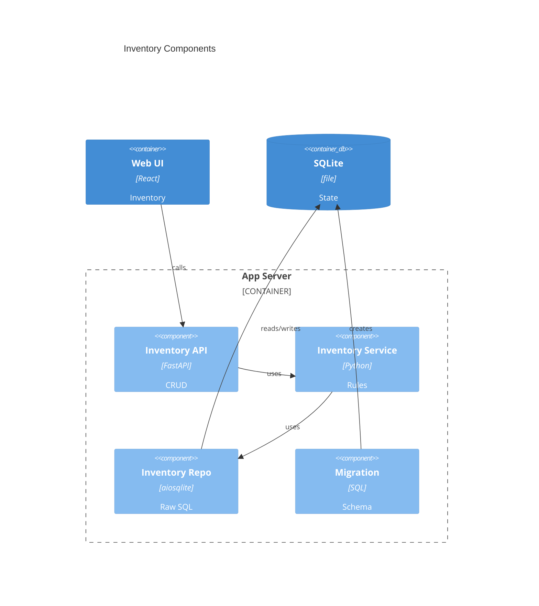

# Implementation Plan: Device Inventory Management

**Branch**: `main` | **Date**: 2026-05-31 | **Spec**: [spec.md](spec.md)

## Summary

**Goal**: Replace mock inventory with persisted grouped device management.  
**Approach**: Add SQLite-backed inventory repository/service/routes and wire the SPA to `/api/v1/inventory`.  
**Key Constraint**: Preserve opaque version strings and honest never-checked state.

## Technical Context

**Language/Version**: Python 3.13; TypeScript 5.x / React 18  
**Primary Dependencies**: FastAPI, Pydantic, aiosqlite, React, Vite, React Router, lucide-react  
**Storage**: SQLite via existing migration runner and raw SQL repository base  
**Testing**: pytest, pytest-asyncio, pytest-cov, Ruff, mypy strict; Vitest, React Testing Library, tsc, ESLint  
**Target Platform**: Single Linux container and host runtimes  
**Project Type**: web  
**Project Mode**: brownfield  
**Performance Goals**: Grouped inventory remains readable for at least 50 active devices without pagination.  
**Constraints**: Local SQLite only, no ORM, no external services, no numeric version coercion.  
**Scale/Scope**: Single-user inventory of roughly 5-50+ devices.

## Instructions Check

| Gate | Result | Evidence |
|------|--------|----------|
| Honest Failure | PASS | Never-checked and failed states are explicit. |
| Polite by Default | N/A | No outbound scraping. |
| Data Ownership | PASS | SQLite local persistence only. |
| Least Privilege | PASS | No privilege or module-execution change. |
| Type Safety | PASS | Typed schemas/models and strict checks. |
| Reliability | PASS | Zero-config DB migration and persistent records. |

## Architecture



## Architecture Decisions

| ID | Decision | Options Considered | Chosen | Rationale |
|----|----------|--------------------|--------|-----------|
| AD-001 | Device type storage | free-text only / normalized table | normalized table | Prevents duplicate groups and supports future module links. |
| AD-002 | Delete behavior | hard delete / archive flag | archive flag | Keeps historical identity available for later activity logs. |
| AD-003 | API shape | flat devices / grouped response | grouped response | Matches primary UI and avoids regrouping inconsistencies. |

## Data Model Summary

| Entity | Key Fields | Relationships | Notes |
|--------|------------|---------------|-------|
| Device Type | id, name, normalized_name | 1:* devices | Unique normalized name, display casing preserved. |
| Device | id, type_id, name, model, current/latest versions, status, timestamps, archive flag | belongs to type | Versions are text; active views filter archived rows. |
| Update Confirmation | device_id, latest_version | updates device | Reject when latest version is unavailable. |

**Detail**: [data-model.md](data-model.md)

## API Surface Summary

| Method | Path | Purpose | Auth | Req/Res Types |
|--------|------|---------|------|---------------|
| GET | `/api/v1/inventory` | List grouped active inventory | none | `InventoryResponse` |
| POST | `/api/v1/inventory` | Create device | none | `DeviceCreate` -> `Device` |
| PATCH | `/api/v1/inventory/{deviceId}` | Update device | none | `DeviceUpdate` -> `Device` |
| DELETE | `/api/v1/inventory/{deviceId}` | Archive device | none | 204 |
| POST | `/api/v1/inventory/{deviceId}/confirm-update` | Sync current version to latest | none | `Device` / 409 |

**Detail**: [contracts/inventory.openapi.yaml](contracts/inventory.openapi.yaml)

## Testing Strategy

| Tier | Tool | Scope | Mock Boundary | Install |
|------|------|-------|---------------|---------|
| Unit | pytest, Vitest | repository normalization, service rules, frontend transforms | temp SQLite, mocked fetch | configured |
| Integration | pytest-asyncio, FastAPI TestClient/httpx | migration, routes, validation, archive/confirm flows | temp DB settings | configured |
| Security | pip-audit, Ruff B rules, ESLint | dependencies and injection-prone code | — | configured |
| Coverage | pytest-cov, Vitest coverage if enabled later | backend inventory branches and UI paths | — | backend configured |

## Error Handling Strategy

| Error Category | Pattern | Response | Retry |
|----------------|---------|----------|-------|
| Validation | fail-fast | 422 with field-specific detail; inline UI errors | no |
| Not found | fail-fast | 404 from API; UI removes stale item after refresh | no |
| Conflict | domain guard | 409 when confirming without latest version | no |
| Database | visible failure | 500 structured log; no silent UI success | no |

## Risk Mitigation

| Risk (from spec) | Likelihood | Impact | Mitigation | Owner |
|-------------------|------------|--------|------------|-------|
| Premature coupling to modules | M | M | Store device type independently; no module FK yet. | Inventory service |
| Version-format bugs | M | H | Text columns and schemas; tests cover leading zero/string versions. | Repository/API |
| Misleading status language | L | H | Default `never_checked`; UI labels nullable latest/check fields honestly. | API/UI |

## Requirement Coverage Map

| Req ID | Component(s) | File Path(s) | Notes |
|--------|--------------|--------------|-------|
| FR-001 | API, service, UI form | `backend/src/binocular/routes/inventory.py`, `backend/src/binocular/services/inventory.py`, `frontend/src/App.tsx` | Create device. |
| FR-002 | API, service, UI form | same as FR-001 | Update while preserving id. |
| FR-003 | API, service, repository, UI action | `backend/src/binocular/repositories/inventory.py`, `frontend/src/App.tsx` | Archive active device. |
| FR-004 | Migration, repository | `backend/src/binocular/db/migrations/002_inventory.sql`, `backend/src/binocular/repositories/inventory.py` | Local SQLite. |
| FR-005 | Repository, API, UI | repository, routes, `frontend/src/App.tsx` | Grouped response/counts. |
| FR-006 | Migration, schemas, tests | migration, `backend/src/binocular/services/inventory.py`, tests | Text versions only. |
| FR-007 | Service, UI | service, routes, `frontend/src/App.tsx` | Explicit status values. |
| FR-008 | Service, API | service, routes | Reject no latest version. |
| FR-009 | Service, repository | service, repository | Current version sync. |
| FR-010 | Schemas, API, UI | routes/service schemas, `frontend/src/App.tsx` | Field errors. |
| FR-011 | Repository/service | repository, service tests | Trim/case-insensitive type reuse. |
| FR-012 | Repository/API/UI | repository, routes, UI | Archived rows hidden. |

## Project Structure

### Source Code

```text
+ backend/src/binocular/db/migrations/002_inventory.sql
+ backend/src/binocular/repositories/inventory.py
+ backend/src/binocular/routes/inventory.py
+ backend/src/binocular/services/inventory.py
~ backend/src/binocular/routes/__init__.py
+ backend/tests/test_inventory_repository.py
+ backend/tests/test_inventory_routes.py
~ frontend/src/App.tsx
~ frontend/src/api/client.ts
+ frontend/src/api/inventory.ts
+ frontend/src/api/inventory.test.ts
~ frontend/src/App.test.tsx
```

**Patterns to reuse**: `Repository` base, route aggregator, typed API client, current SPA layout.  
**Tests to extend**: backend route/repository tests and frontend app/API tests.  
**Naming conventions**: snake_case backend modules; PascalCase React components; camelCase API DTOs.

## Implementation Hints

- **[HINT-001]** Order: add migration and repository before routes, then replace frontend mocks.
- **[HINT-002]** Gotcha: normalize device type for lookup but return display name.
- **[HINT-003]** Constraint: archive deletes; do not hard-delete rows.
- **[HINT-004]** Compatibility: preserve opaque versions like `02`, `v1.2b`, and `3.00`.
- **[HINT-005]** Performance: keep grouped API ordered for stable UI snapshots.