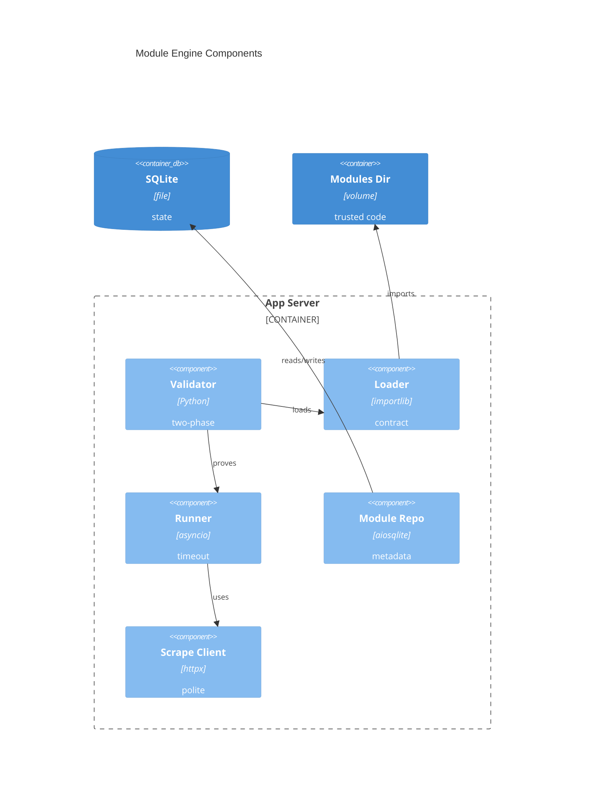

# Implementation Plan: Module Engine & Contract

**Branch**: `main` | **Date**: 2026-05-31 | **Spec**: [spec.md](spec.md)

## Summary

**Goal**: Add the trusted Python extension-module engine foundation.  
**Approach**: Implement backend-only contract models, loader, runner, validator, metadata migration/repository, and contract docs.  
**Key Constraint**: Modules are unsandboxed in-process code; failures must be visible and contained.

## Technical Context

**Language/Version**: Python 3.13  
**Primary Dependencies**: FastAPI, Pydantic, aiosqlite, httpx/ScrapeClient, structlog  
**Storage**: SQLite via existing migration runner and raw SQL repository base  
**Testing**: pytest, pytest-asyncio, pytest-cov, Ruff, mypy strict, pip-audit  
**Target Platform**: Single Linux container and host runtime  
**Project Type**: web  
**Project Mode**: brownfield  
**Performance Goals**: Each module invocation has a 10-second default timeout; later invocations continue after failures.  
**Constraints**: SQLite only, no ORM, no direct module HTTP path, no sandboxing claim.  
**Scale/Scope**: Single-user modules volume; enough for starter modules and user-authored local modules.

## Instructions Check

| Gate | Result | Evidence |
|------|--------|----------|
| Honest Failure | PASS | Load, validation, runtime, timeout, and scrape failures become structured visible results. |
| Polite by Default | PASS | Modules receive only the host ScrapeClient contract for outbound fetching. |
| Data Ownership | PASS | Metadata persists in local SQLite only. |
| Least Privilege | PASS | Unsandboxed trust boundary is documented; no sandbox claim. |
| Type Safety | PASS | Pydantic/dataclass models and strict mypy-compatible services. |
| Reliability | PASS | Per-invocation boundary prevents one broken module from crashing/stalling the core. |

## Architecture



## Architecture Decisions

| ID | Decision | Options Considered | Chosen | Rationale |
|----|----------|--------------------|--------|-----------|
| AD-001 | Module execution boundary | subprocess sandbox / in-process importlib | in-process importlib | Matches ADR-0005 and project trust model; simpler single-container operation. |
| AD-002 | Validation shape | single pass / static + runtime proof | two-phase result | E008 needs pre-save feedback and phase labels. |
| AD-003 | Validation persistence | normalized findings table / latest JSON summary | latest JSON summary | Avoids premature schema expansion while preserving visible latest state. |

## Data Model Summary

| Entity | Key Fields | Relationships | Notes |
|--------|------------|---------------|-------|
| ModuleRecord | id, module_id, display_name, source_path, source_hash, author, version, status, validation_status, validation_summary_json, last_validated_at | source_path points to `modules_dir` file | Enum constraints; latest summary only. |

**Detail**: [data-model.md](data-model.md)

## API Surface Summary

| Method | Path | Purpose | Auth | Req/Res Types |
|--------|------|---------|------|---------------|
| internal | `ModuleLoader.load` | Load/import module file | n/a | path -> LoadedModule/ModuleFailure |
| internal | `ModuleRunner.run` | Invoke module with ScrapeClient | n/a | ModuleCheckInput -> ModuleCheckResult |
| internal | `ModuleValidator.validate` | Static + optional runtime validation | n/a | path/proof -> ModuleValidationResult |
| internal | `ModuleRepository.*` | Persist module metadata/status | n/a | ModuleRecord DTOs |

**Detail**: [contracts/module-engine.md](contracts/module-engine.md)

## Testing Strategy

| Tier | Tool | Scope | Mock Boundary | Install |
|------|------|-------|---------------|---------|
| Unit | pytest | contract models, AST checks, loader failures, runner failure mapping | temp module files, fake ScrapeClient | configured |
| Integration | pytest-asyncio | migration, repository, validator static/runtime paths | temp SQLite, temp modules dir | configured |
| Security | pip-audit, Ruff B rules | dependencies, unsafe direct outbound path regressions | — | configured |
| Coverage | pytest-cov | engine branches: success, syntax, import, timeout, raise, SystemExit | — | configured |

## Error Handling Strategy

| Error Category | Pattern | Response | Retry |
|----------------|---------|----------|-------|
| Static validation | fail-fast | phase failed with findings | no |
| Import/contract | structured load failure | error_type/message in validation result | no |
| Runtime exception | boundary conversion | failed ModuleCheckResult with normalized detail | no |
| Timeout | `asyncio.wait_for` boundary | failed result with timeout error_type | no |
| Scrape failure | preserve diagnostics | failed runtime result with scrape diagnostics | ScrapeClient owns retry |

## Integration Points

| Spec Reference | System/Service | Technical Approach | Contract |
|----------------|----------------|--------------------|----------|
| IP-001 | E008 lifecycle | Call validator before install/activation | [contracts/module-engine.md](contracts/module-engine.md) |
| IP-002 | E009 detection | Call runner for normalized output/failure | [contracts/module-engine.md](contracts/module-engine.md) |
| IP-003 | E015 starter modules | Implement authoring contract | [contracts/module-engine.md](contracts/module-engine.md) |
| IP-004 | E007 ScrapeClient | Inject host client into runner | `backend/src/binocular/scraping/client.py` |
| IP-005 | E004 data layer | Add migration + repository | [data-model.md](data-model.md) |

## Risk Mitigation

| Risk (from spec) | Likelihood | Impact | Mitigation | Owner |
|-------------------|------------|--------|------------|-------|
| Unsandboxed behavior | M | H | Document ACE boundary, keep container non-root, never claim sandboxing. | Extensions docs |
| Strict validation | M | M | Limit static checks to syntax/import/required members and return phase findings. | Validator |
| Timeout cleanup | M | M | Test slow modules; document timeout failure as boundary result, not instant side-effect rollback. | Runner |

## Requirement Coverage Map

| Req ID | Component(s) | File Path(s) | Notes |
|--------|--------------|--------------|-------|
| TR-001 | contract models/docs | `backend/src/binocular/extensions/contract.py`, `backend/src/binocular/extensions/README.md` | Authoring contract. |
| TR-002 | loader | `backend/src/binocular/extensions/loader.py`, `backend/tests/test_module_loader.py` | importlib path load. |
| TR-003 | runner | `backend/src/binocular/extensions/runner.py`, `backend/src/binocular/scraping/client.py` | ScrapeClient injection only. |
| TR-004 | runner | `backend/src/binocular/extensions/runner.py`, `backend/tests/test_module_runner.py` | timeout/error mapping. |
| TR-005 | runner | `backend/src/binocular/extensions/runner.py` | cancellation/interrupt handling. |
| TR-006 | validator | `backend/src/binocular/extensions/validator.py`, `backend/tests/test_module_validator.py` | two-phase result. |
| TR-007 | validator | `backend/src/binocular/extensions/validator.py` | skip runtime on static fail. |
| TR-008 | migration/repository | `backend/src/binocular/db/migrations/003_modules.sql`, `backend/src/binocular/repositories/modules.py` | metadata persistence. |
| TR-009 | docs/tests | `backend/src/binocular/extensions/README.md`, `backend/tests/test_module_contract_docs.py` | explicit unsandboxed docs. |

## Project Structure

### Source Code

```text
+ backend/src/binocular/db/migrations/003_modules.sql
+ backend/src/binocular/extensions/contract.py
+ backend/src/binocular/extensions/loader.py
+ backend/src/binocular/extensions/runner.py
+ backend/src/binocular/extensions/validator.py
~ backend/src/binocular/extensions/README.md
+ backend/src/binocular/repositories/modules.py
~ backend/src/binocular/config.py
+ backend/tests/test_module_contract_docs.py
+ backend/tests/test_module_loader.py
+ backend/tests/test_module_runner.py
+ backend/tests/test_module_validator.py
+ backend/tests/test_modules_repository.py
```

**Patterns to reuse**: migration runner, repository base, ScrapeClient diagnostics, existing test temp settings.  
**Tests to extend**: backend migration/repository/unit suites.  
**Naming conventions**: snake_case modules; dataclass/Pydantic DTOs; explicit async service names.

## Implementation Hints

- **[HINT-001]** Order: add models and migration/repository before loader/validator integration.
- **[HINT-002]** Gotcha: `SystemExit` is not an `Exception`; catch intentionally while preserving cancellation/interrupts.
- **[HINT-003]** Constraint: validation is not sandboxing; docs and tests must say so directly.
- **[HINT-004]** Compatibility: invalidate importlib caches before loading temp/new module files.
- **[HINT-005]** Testing: use temp module files for valid, syntax-fail, import-fail, raising, slow, and invalid-output cases.
