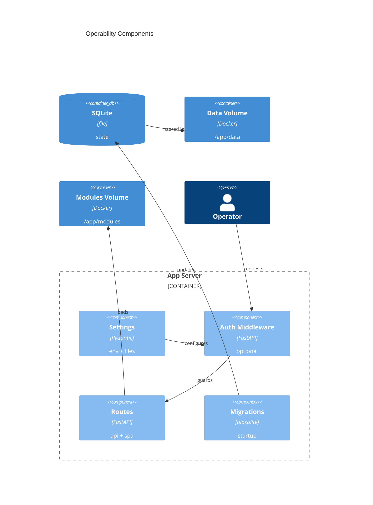

# Implementation Plan: Self-Hosted Operability

**Branch**: `main` | **Date**: 2026-05-31 | **Spec**: [spec.md](spec.md)

## Summary

**Goal**: Complete self-hosted deployment posture: zero-config durability, `_FILE` secrets, optional basic auth, and examples.  
**Approach**: Extend settings, add auth middleware, document Compose/env usage, and add operability smoke tests.  
**Key Constraint**: Preserve trusted-LAN no-auth default and avoid claiming internet-grade security.

## Technical Context

**Language/Version**: Python 3.13; TypeScript 5.x / React 18  
**Primary Dependencies**: FastAPI, Pydantic Settings, aiosqlite, Uvicorn, React/Vite/Tailwind  
**Storage**: SQLite file via existing `/app/data` volume and migration runner  
**Testing**: pytest, httpx AsyncClient, Ruff, mypy strict, Docker build smoke where available  
**Target Platform**: Single non-root Linux container; host runtime fallback  
**Project Type**: web  
**Project Mode**: brownfield  
**Performance Goals**: Auth middleware adds negligible overhead for single-user trusted-LAN traffic.  
**Constraints**: No external auth service, no telemetry, no external database, no multi-user scope.  
**Scale/Scope**: Single user; one app container; `/app/data` and `/app/modules` volumes.

## Instructions Check

| Gate | Result | Evidence |
|------|--------|----------|
| Honest Failure | PASS | Missing/bad secret files and auth misconfiguration fail visibly. |
| Polite by Default | PASS | No scraping behavior changed; ScrapeClient remains central. |
| Data Ownership | PASS | State remains in local SQLite and declared volumes. |
| Least Privilege | PASS | Non-root image preserved; basic auth framed as optional light protection. |
| Type Safety | PASS | Settings and middleware are typed and strict-mypy compatible. |
| Reliability | PASS | Healthcheck remains unauthenticated; restart/upgrade smoke verifies data survival. |

## Architecture



## Architecture Decisions

| ID | Decision | Options Considered | Chosen | Rationale |
|----|----------|--------------------|--------|-----------|
| AD-001 | Secret conflict behavior | direct wins / file wins / fail | fail fast | Prevents hidden operator mistakes and secret ambiguity. |
| AD-002 | Auth activation | credentials imply auth / explicit flag | explicit flag + complete creds | Preserves zero-config no-auth startup. |
| AD-003 | Health route auth | protect all / exempt health | exempt `/healthz` | Docker healthcheck must remain configuration-free. |

## Data Model Summary

N/A — no new persisted entities or migrations; existing SQLite data path is reused.

## API Surface Summary

| Method | Path | Purpose | Auth | Req/Res Types |
|--------|------|---------|------|---------------|
| middleware | `/api/*` | protect API routes when auth enabled | optional basic | HTTP Basic credentials -> route response/401 |
| middleware | `/assets/*`, SPA fallback | protect UI/static routes when auth enabled | optional basic | HTTP Basic credentials -> static/SPA response/401 |
| GET | `/healthz` | container liveness | none | existing health payload |

**Detail**: [contracts/operability.md](contracts/operability.md)

## Testing Strategy

| Tier | Tool | Scope | Mock Boundary | Install |
|------|------|-------|---------------|---------|
| Unit | pytest | secret resolution, auth settings validation, constant-time credential path | temp secret files, monkeypatch env | configured |
| Integration | pytest + httpx AsyncClient | auth-off/on API/UI/health behavior; startup config failures | app factory with test settings | configured |
| Security | Ruff, pip-audit | no secret logging, dependency scan, auth compare implementation | — | configured |
| Coverage | pytest-cov | settings, middleware, Compose smoke helpers | — | configured |

## Error Handling Strategy

| Error Category | Pattern | Response | Retry |
|----------------|---------|----------|-------|
| Secret file | fail-fast | startup configuration error naming setting, no secret value | no |
| Secret conflict | fail-fast | startup configuration error naming setting | no |
| Auth config | fail-fast | startup error when enabled without full credentials | no |
| Invalid credentials | challenge | `401` plus `WWW-Authenticate: Basic` | no |

## Integration Points

| Spec Reference | System/Service | Technical Approach | Contract |
|----------------|----------------|--------------------|----------|
| E001 config/app | Settings + app factory | extend `Settings`, register middleware in `create_app` | [contracts/operability.md](contracts/operability.md) |
| E004 persistence | Migration/data path | keep `/app/data/binocular.db` and backup behavior | existing migration runner |
| Docker runtime | Container image/Compose | preserve non-root image; add examples and volumes | `Dockerfile`, `compose.yaml`, `.env.example` |

## Risk Mitigation

| Risk (from spec) | Likelihood | Impact | Mitigation | Owner |
|-------------------|------------|--------|------------|-------|
| Auth overclaiming | M | H | Add explicit docs/env comments that basic auth is light trusted-LAN protection only. | Docs/config |
| Secret ambiguity | M | M | Fail when direct and `_FILE` values are both set; cover with tests. | Settings |
| Persistence smoke fragility | L | M | Add fast unit/integration persistence checks and keep Docker smoke guarded by runtime availability. | Tests |

## Requirement Coverage Map

| Req ID | Component(s) | File Path(s) | Notes |
|--------|--------------|--------------|-------|
| FR-001 | settings/app | `backend/src/binocular/config.py`, `backend/tests/test_config.py`, `backend/tests/test_health.py` | no-env startup. |
| FR-002 | Docker/settings/db | `Dockerfile`, `compose.yaml`, `backend/tests/test_operability_smoke.py` | volume durability. |
| FR-003 | settings | `backend/src/binocular/config.py`, `backend/tests/test_config.py` | `_FILE` loader. |
| FR-004 | settings | `backend/src/binocular/config.py`, `backend/tests/test_config.py` | missing/empty file errors. |
| FR-005 | settings | `backend/src/binocular/config.py`, `backend/tests/test_config.py` | conflict fail-fast. |
| FR-006 | auth middleware | `backend/src/binocular/auth.py`, `backend/src/binocular/app.py`, `backend/tests/test_auth.py` | optional protection. |
| FR-007 | auth middleware | `backend/src/binocular/auth.py`, `backend/tests/test_auth.py` | default disabled. |
| FR-008 | auth middleware | `backend/src/binocular/auth.py`, `backend/tests/test_auth.py` | constant-time compare. |
| FR-009 | deployment docs | `compose.yaml`, `backend/tests/test_operability_docs.py` | one port, volumes. |
| FR-010 | deployment docs | `.env.example`, `backend/tests/test_operability_docs.py` | settings template. |
| FR-011 | docs | `.env.example`, `compose.yaml`, `README.md` | trust-boundary wording. |

## Project Structure

### Source Code

```text
~ backend/src/binocular/config.py
+ backend/src/binocular/auth.py
~ backend/src/binocular/app.py
+ backend/tests/test_auth.py
~ backend/tests/test_config.py
+ backend/tests/test_operability_docs.py
+ backend/tests/test_operability_smoke.py
+ compose.yaml
+ .env.example
~ README.md
```

**Patterns to reuse**: existing `Settings`, app factory, health tests, migration startup tests, static route tests.  
**Tests to extend**: backend config, health, static, and app lifespan suites.  
**Naming conventions**: snake_case modules, typed settings properties, pytest temp paths.

## Implementation Hints

- **[HINT-001]** Order: implement secret resolution before adding auth settings validation.
- **[HINT-002]** Gotcha: keep `/healthz` outside auth so Docker healthcheck remains zero-config.
- **[HINT-003]** Constraint: never include secret values in exception messages or logs.
- **[HINT-004]** Compatibility: protect FastAPI routes and mounted static/SPA responses consistently.
- **[HINT-005]** Testing: docs tests should parse examples, not depend on an external Docker daemon.
