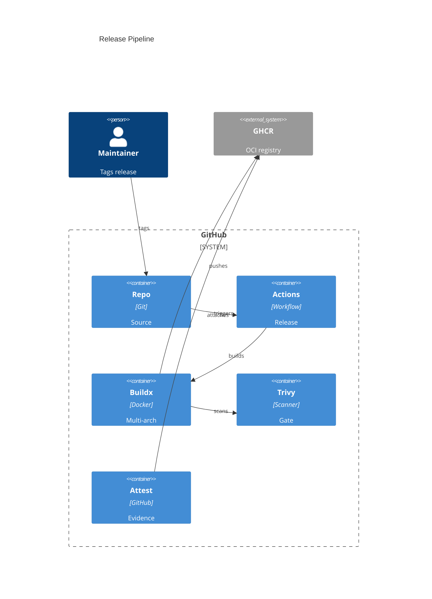

# Implementation Plan: Release & Publish Pipeline

**Branch**: `00009-release-publish-pipeline` | **Date**: 2026-05-31 | **Spec**: [spec.md](spec.md)

## Summary

**Goal**: Publish verified multi-architecture Binocular release images to GHCR from SemVer tags.  
**Approach**: Add a tag-triggered GitHub Actions release workflow that builds, scans, publishes, and attests the existing Docker image.  
**Key Constraint**: Publication must never occur from branches or pull requests.

## Technical Context

**Language/Version**: Python 3.13; TypeScript 5.x / React 18; GitHub Actions YAML  
**Primary Dependencies**: Docker Buildx, GHCR, docker/metadata-action, docker/build-push-action, aquasecurity/trivy-action, GitHub artifact attestations  
**Storage**: N/A — no runtime persistence  
**Testing**: actionlint-compatible workflow validation, GitHub Actions dry-run reasoning, Docker build, Trivy scan gate  
**Target Platform**: GitHub-hosted Ubuntu runner publishing Linux OCI images  
**Project Type**: web  
**Project Mode**: brownfield  
**Performance Goals**: Release workflow completes in practical CI time with Buildx cache.  
**Constraints**: Tag-only publishing; least-privilege permissions; multi-arch `linux/amd64,linux/arm64`; fixable HIGH/CRITICAL vulnerability gate; digest-bound attestations.  
**Scale/Scope**: One public GHCR image package for a single-container app.

## Instructions Check

| Gate | Status | Evidence |
|------|--------|----------|
| Project instructions readable | PASS | [../../project-instructions.md](../../project-instructions.md) |
| Self-contained runtime preserved | PASS | Release workflow changes packaging only. |
| Least privilege preserved | PASS | Workflow uses scoped permissions. |
| Honest failure preserved | PASS | Trivy and publication failures stop the workflow visibly. |
| Type safety/correctness preserved | PASS | Existing CI remains the validation gate; release adds image scan and attestations. |

## Architecture



## Architecture Decisions

| ID | Decision | Options Considered | Chosen | Rationale |
|----|----------|--------------------|--------|-----------|
| AD-001 | Release trigger | Branch push / PR / SemVer tag | SemVer tag | Prevents accidental publication and aligns image versions to releases. |
| AD-002 | Image publication target | Docker Hub / GHCR / both | GHCR | Uses repository-owned package permissions and avoids extra credentials. |
| AD-003 | Scan policy | All CVEs / fixable HIGH+CRITICAL / advisory only | Fixable HIGH+CRITICAL gate | Matches project release policy without blocking on unfixable base-image CVEs. |
| AD-004 | Supply-chain subject | Mutable tags / immutable digest | Immutable digest | Attestations remain verifiable after tag movement. |

## Data Model Summary

N/A — no persistent data.

## API Surface Summary

N/A — no API surface.

## Testing Strategy

| Tier | Tool | Scope | Mock Boundary | Install |
|------|------|-------|---------------|---------|
| Unit | N/A | Workflow-only feature; no app logic unit added. | — | N/A |
| Integration | Docker Buildx / GitHub Actions | Multi-arch image build and GHCR publish path. | External registry side effects avoided except tag release. | configured |
| Security | Trivy Action | Release image OS and library vulnerabilities. | Vulnerability DB is external. | configured |
| Coverage | Existing pytest/Vitest coverage | Existing CI coverage remains app quality gate. | Existing test mocks. | configured |

## Error Handling Strategy

| Error Category | Pattern | Response | Retry |
|----------------|---------|----------|-------|
| Invalid trigger | fail-closed | Workflow does not publish outside SemVer tag refs. | no |
| Build failure | fail-fast | Release job fails before publish completes. | rerun after fix |
| Vulnerability gate | fail-fast | Release job fails with Trivy output. | rerun after dependency/base-image fix |
| Attestation failure | fail-fast | Release job fails; image is not treated as complete. | rerun after permission/config fix |

## Integration Points

| Spec Reference | System/Service | Technical Approach | Contract |
|----------------|----------------|--------------------|----------|
| IP-001 | Existing CI | Reuse Dockerfile and quality-gate assumptions from `.github/workflows/ci.yml`. | CI remains build-only. |
| IP-002 | Dockerfile | Release workflow builds root `Dockerfile` for two platforms. | Single-container runtime. |
| IP-003 | GHCR | Publish `ghcr.io/${{ github.repository_owner }}/binocular` from SemVer tags. | OCI image package. |
| IP-004 | GitHub attestations | Generate provenance and SBOM attestations for image digest. | Digest-bound verification. |

## Risk Mitigation

| Risk (from spec) | Likelihood | Impact | Mitigation | Owner |
|-------------------|------------|--------|------------|-------|
| Emulated arm64 builds are slow or flaky | Medium | Medium | Use Buildx gha cache and keep release workflow tag-only. | Release workflow |
| Trivy database or registry availability causes release delays | Medium | Medium | Fail visibly; maintainers rerun after service recovery. | Release workflow |
| Mutable tag attestation mistakes reduce verification value | Low | High | Use Buildx digest output as attestation subject. | Attestation steps |

## Requirement Coverage Map

| Req ID | Component(s) | File Path(s) | Notes |
|--------|--------------|--------------|-------|
| OR-001 | Release workflow trigger | `.github/workflows/release.yml` | Restrict to SemVer tag refs and add guard condition. |
| OR-002 | Metadata step | `.github/workflows/release.yml` | Use docker/metadata-action for version and latest tags. |
| OR-003 | Buildx step | `.github/workflows/release.yml` | Publish amd64/arm64 manifest. |
| OR-004 | Trivy step | `.github/workflows/release.yml` | Fail on fixable HIGH/CRITICAL findings. |
| OR-005 | Provenance attestation | `.github/workflows/release.yml` | Attest pushed digest. |
| OR-006 | SBOM attestation | `.github/workflows/release.yml` | Generate and attest SBOM for digest. |
| OR-007 | Workflow permissions | `.github/workflows/release.yml` | Scope contents/packages/id-token/attestations. |
| RR-001 | Release runbook | `docs/release.md` | Tag, publish, inspect, and verify steps. |
| RR-002 | Trivy failure runbook | `docs/release.md` | Triage and rerun guidance. |

## Project Structure

### Source Code

```text
+ .github/workflows/release.yml
+ docs/release.md
```

**Patterns to reuse**: Existing `.github/workflows/ci.yml` checkout, Buildx cache, and root `Dockerfile` build context.  
**Tests to extend**: Repository validation commands and Docker build checks.  
**Naming conventions**: Workflow names use concise title case; docs live under `docs/`.

## Implementation Hints

- **[HINT-001]** Order: Build/push must produce an immutable digest before attestations run.
- **[HINT-002]** Gotcha: `latest` must only be emitted for SemVer release tags, not branches.
- **[HINT-003]** Constraint: Use `ignore-unfixed: true` to enforce fixable-only HIGH/CRITICAL gating.
- **[HINT-004]** Compatibility: Use Buildx cache but do not require cache hits for correctness.
- **[HINT-005]** Security: Keep release permissions scoped to the release job.
