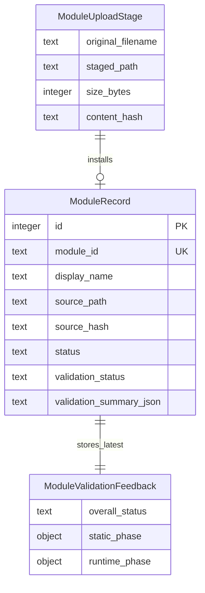

# Data Model: Module Lifecycle Management

| Entity | Attributes (name: type, constraints) | Relationships | State Transitions |
|--------|--------------------------------------|---------------|-------------------|
| ModuleRecord | id: integer PK, module_id: text UNIQUE NOT NULL, display_name: text NOT NULL, source_path: text NOT NULL, source_hash: text NOT NULL, author: text NULL, version: text NULL, status: enum installed/disabled, validation_status: enum unvalidated/valid/invalid, validation_summary_json: text NOT NULL, last_validated_at: timestamp NULL, created_at: timestamp NOT NULL, updated_at: timestamp NOT NULL | 1:1 active module file under configured modules directory | unvalidated -> valid; unvalidated -> invalid; valid -> invalid; invalid -> valid; installed -> disabled |
| ModuleUploadStage | original_filename: text NOT NULL, staged_path: server path NOT NULL, size_bytes: integer CHECK 1..262144, content_hash: text NOT NULL | transient source for ModuleRecord upsert after validation | staged -> rejected; staged -> installed; staged -> replaced |
| ModuleValidationFeedback | overall_status: enum valid/invalid, static_phase: object NOT NULL, runtime_phase: object NOT NULL, findings: list | embedded in ModuleRecord.validation_summary_json and returned by API | static_failed -> rejected; runtime_failed -> rejected; passed -> installed |

## Validation Rules

| Rule | Enforcement | User Outcome |
|------|-------------|--------------|
| File extension | Upload endpoint accepts `.py` only | 400 validation error before module validation |
| Size boundary | Upload endpoint rejects 0 bytes and >256 KiB | 400 validation error before module validation |
| Server-controlled path | Active file name is derived from validated module_id | Client paths ignored |
| Reject before save | Active module file is written only after validation passes | Invalid uploads never become runnable |
| Safe update | Existing active file remains until replacement validates | Failed update preserves prior module |

ER Diagram (visual reference)

