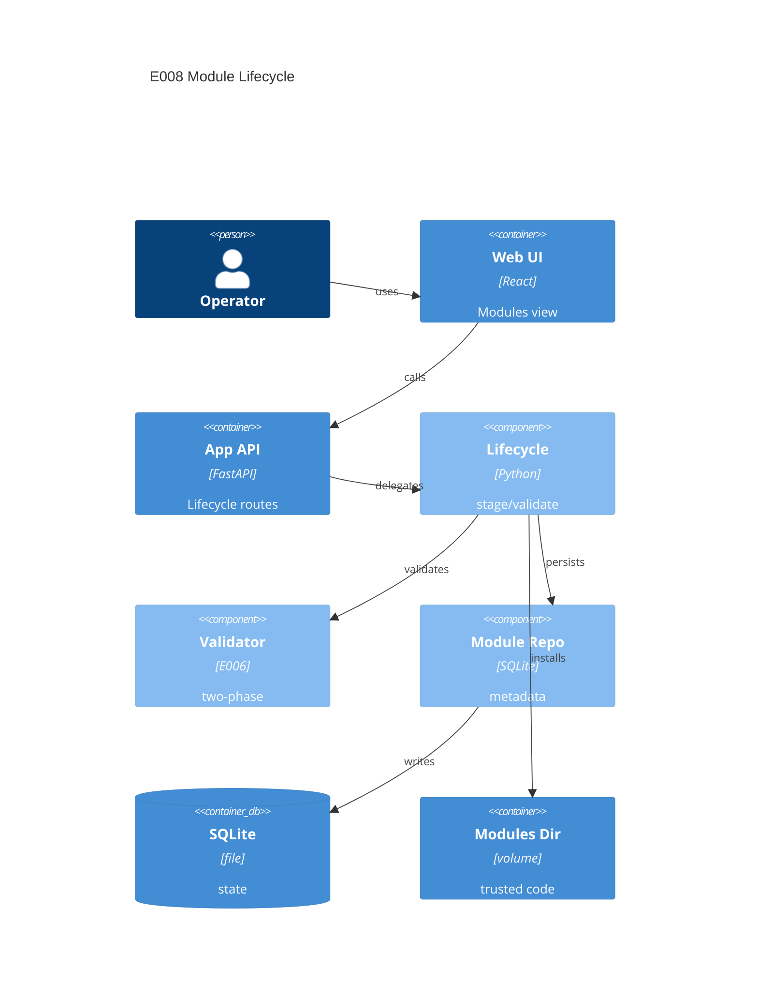

# Implementation Plan: Module Lifecycle Management

**Branch**: `main` | **Date**: 2026-05-31 | **Spec**: [spec.md](spec.md)

## Summary

**Goal**: Add API-backed upload, update, list, and delete flows for trusted extension modules.  
**Approach**: Reuse E006 validation/persistence primitives, add a lifecycle service and router, then replace the static Modules UI with typed API state.  
**Key Constraint**: Invalid uploads must never enter the active modules directory.

## Technical Context

**Language/Version**: Python 3.13; TypeScript 5.x / React 18  
**Primary Dependencies**: FastAPI, Pydantic, aiosqlite, existing extension validator/runner; React, Vite, Tailwind CSS, lucide-react  
**Storage**: SQLite module metadata plus server-controlled modules volume  
**Testing**: pytest, pytest-asyncio, pytest-cov, Ruff, mypy strict; Vitest, React Testing Library, `tsc`  
**Target Platform**: Single Linux Docker container, trusted LAN, optional global basic auth  
**Project Type**: web  
**Project Mode**: brownfield  
**Performance Goals**: 256 KiB max upload; lifecycle actions complete without blocking unrelated API routes.  
**Constraints**: SQLite only, no sandboxing claim, server-controlled paths, reject-before-save, strict type checks.  
**Scale/Scope**: Single-user modules volume; dozens of local trusted modules.

## Instructions Check

| Gate | Result | Evidence |
|------|--------|----------|
| Honest Failure | PASS | Upload, validation, replacement, and deletion failures return visible structured errors. |
| Polite by Default | PASS | Lifecycle does not add outbound scraping; modules still use E007 client via E006. |
| Data Ownership | PASS | State remains in SQLite and `/app/modules`; no external service. |
| Least Privilege | PASS | UI and docs state modules are trusted unsandboxed code. |
| Type Safety | PASS | Backend and frontend tasks include strict typing gates. |
| Reliability | PASS | Staged validation and safe replacement preserve the prior module on failed updates. |

## Architecture



## Architecture Decisions

| ID | Decision | Options Considered | Chosen | Rationale |
|----|----------|--------------------|--------|-----------|
| AD-001 | Upload validation location | active dir / staging | staging | Enables reject-before-save and preserves working modules. |
| AD-002 | Duplicate module IDs | reject / copy / update | update after validation | Avoids duplicate runnable modules. |
| AD-003 | Validation failure shape | generic 400 / phase summary | phase summary | Supports honest failure feedback. |
| AD-004 | Active filenames | client name / module_id | module_id | Prevents path trust and collisions. |

## Data Model Summary

| Entity | Key Fields | Relationships | Notes |
|--------|------------|---------------|-------|
| ModuleRecord | module_id, display_name, source_path, source_hash, status, validation_status, validation_summary_json | 1:1 active file | Reuse E006 table; no migration expected. |
| ModuleUploadStage | original_filename, staged_path, size_bytes, content_hash | transient source | Deleted after success or failure. |
| ModuleValidationFeedback | overall_status, static_phase, runtime_phase, findings | embedded JSON/API response | Drives UI feedback. |

**Detail**: [data-model.md](data-model.md)

## API Surface Summary

| Method | Path | Purpose | Auth | Req/Res Types |
|--------|------|---------|------|---------------|
| GET | `/api/v1/modules` | List installed modules | optional global basic auth | `ModuleListResponse` |
| POST | `/api/v1/modules` | Upload new module or update existing module after validation | optional global basic auth | multipart `file` -> `ModuleResponse` or `ModuleLifecycleError` |
| DELETE | `/api/v1/modules/{moduleId}` | Delete installed module and active source | optional global basic auth | 204 or `ModuleLifecycleError` |

**Detail**: [contracts/openapi.yaml](contracts/openapi.yaml)

## Testing Strategy

| Tier | Tool | Scope | Mock Boundary | Install |
|------|------|-------|---------------|---------|
| Unit | pytest, Vitest | lifecycle service file boundaries, API client helpers, UI states | temp dirs, fake validator, mocked fetch | configured |
| Integration | pytest-asyncio, httpx.AsyncClient, React Testing Library | router upload/delete flows, repository/file coordination, Modules page API flow | temp SQLite/modules dir | configured |
| Security | Ruff, pip-audit, npm audit | path handling, dependency vulnerabilities, unsafe direct path trust | — | configured |
| Coverage | pytest-cov, Vitest coverage | backend lifecycle branches and frontend module UI states | — | configured |

## Error Handling Strategy

| Error Category | Pattern | Response | Retry |
|----------------|---------|----------|-------|
| Upload validation | fail-fast | 400 with `invalid_upload` and visible detail | no |
| Module validation | reject-before-save | 400 with `validation_failed` and phase summary | no |
| Replacement failure | preserve previous active file | 500 with `install_failed`; previous module remains | no |
| Delete missing | explicit not-found | 404 with `module_not_found` | no |
| Repository failure | rollback visible | 500 with structured detail and log entry | no |

## Risk Mitigation

| Risk (from spec) | Likelihood | Impact | Mitigation | Owner |
|-------------------|------------|--------|------------|-------|
| Trusted-code confusion | M | H | Add trusted unsandboxed warning in Modules UI and API-facing docs; never mention sandboxing. | Modules UI |
| Partial replacement | M | H | Validate in staging, derive active filename after metadata load, and replace only after successful validation. | Lifecycle service |
| Validation friction | M | M | Return static/runtime findings in API and render them in the upload panel. | Router/UI |

## Requirement Coverage Map

| Req ID | Component(s) | File Path(s) | Notes |
|--------|--------------|--------------|-------|
| FR-001 | router, API client, UI upload form | `backend/src/binocular/routes/modules.py`, `frontend/src/api/modules.ts`, `frontend/src/App.tsx` | Multipart upload command. |
| FR-002 | lifecycle service, validator | `backend/src/binocular/services/modules.py`, `backend/src/binocular/extensions/validator.py` | Validate before install. |
| FR-003 | lifecycle service | `backend/src/binocular/services/modules.py` | Staging path and reject-before-save behavior. |
| FR-004 | router, UI feedback | `backend/src/binocular/routes/modules.py`, `frontend/src/App.tsx` | Structured phase feedback. |
| FR-005 | repository, router, API client, UI list | `backend/src/binocular/repositories/modules.py`, `backend/src/binocular/routes/modules.py`, `frontend/src/api/modules.ts`, `frontend/src/App.tsx` | Installed module list. |
| FR-006 | lifecycle service | `backend/src/binocular/services/modules.py` | Safe update; preserve prior version on failed replacement. |
| FR-007 | repository, lifecycle service, router, UI action | `backend/src/binocular/services/modules.py`, `backend/src/binocular/routes/modules.py`, `frontend/src/App.tsx` | Delete metadata and source. |
| FR-008 | router, service errors, UI alerts | `backend/src/binocular/routes/modules.py`, `backend/src/binocular/services/modules.py`, `frontend/src/App.tsx` | Visible failures. |
| FR-009 | UI copy, tests | `frontend/src/App.tsx`, `frontend/src/App.test.tsx` | Explicit trust-boundary wording. |
| FR-010 | router upload guard, tests | `backend/src/binocular/routes/modules.py`, `backend/tests/test_modules_api.py` | `.py`, non-empty, max-size checks. |

## Project Structure

### Source Code

```text
+ backend/src/binocular/routes/modules.py
+ backend/src/binocular/services/modules.py
~ backend/src/binocular/routes/__init__.py
~ backend/src/binocular/repositories/modules.py
+ backend/tests/test_modules_api.py
+ backend/tests/test_modules_service.py
+ frontend/src/api/modules.ts
+ frontend/src/api/modules.test.ts
~ frontend/src/api/index.ts
~ frontend/src/App.tsx
~ frontend/src/App.test.tsx
```

**Patterns to reuse**: inventory route dependency setup, repository base helpers, E006 validator and module metadata repository, existing SPA cards/forms.  
**Tests to extend**: backend API/service tests, frontend API client tests, App route tests.  
**Naming conventions**: snake_case backend modules; Pydantic request/response models; camelCase frontend response types.

## Implementation Hints

- **[HINT-001]** Order: implement backend lifecycle service and routes before replacing static frontend module data.
- **[HINT-002]** Gotcha: `UploadFile` may not expose size reliably; count bytes while streaming to staging and reject over 256 KiB.
- **[HINT-003]** Constraint: active module filenames must be derived from validated `module_id`, never from the uploaded filename.
- **[HINT-004]** Compatibility: existing E006 repository has no delete method; add only the minimal lifecycle helpers needed.
- **[HINT-005]** Testing: use temp module files for valid, invalid syntax, oversized, and failed replacement paths.
