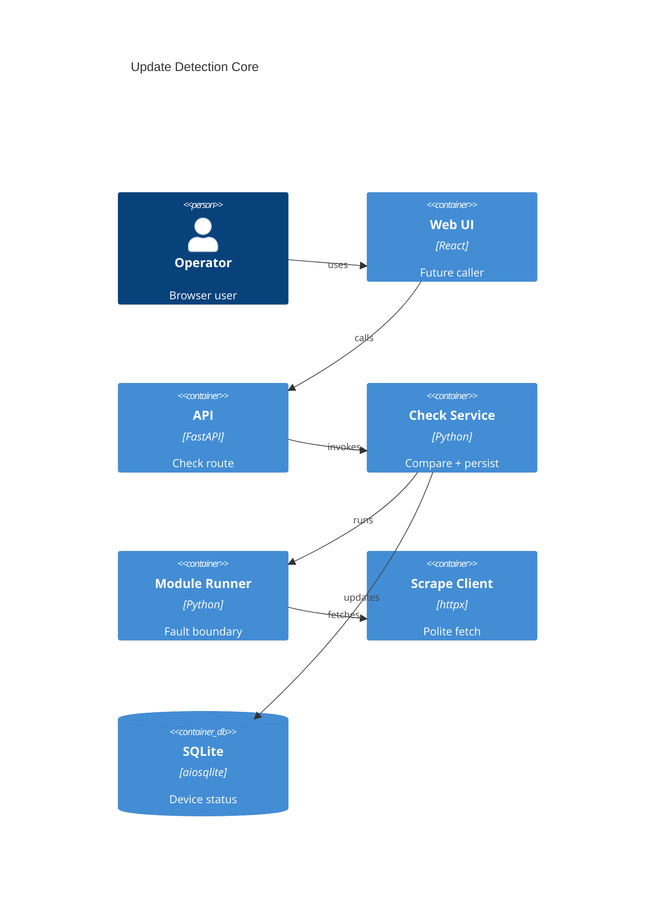

# Implementation Plan: Update Detection & Comparison

**Branch**: `00011-update-detection-comparison` | **Date**: 2026-05-31 | **Spec**: [spec.md](spec.md)

## Summary

**Goal**: Add the core service and API contract that runs a module for one device and classifies the result as up-to-date, update-available, or failed.  
**Approach**: Reuse existing inventory/module repositories and `ModuleRunner`; add a typed check service, deterministic comparator, repository status updates, and a focused API route.  
**Key Constraint**: Failed or unsafe comparisons must be visible and must preserve prior successful check state.

## Technical Context

**Language/Version**: Python 3.13; TypeScript 5.x / React 18  
**Primary Dependencies**: FastAPI, Pydantic, aiosqlite, httpx, existing module runner and scraping client  
**Storage**: SQLite via existing `devices` and `modules` tables; no new table required for E009  
**Testing**: pytest + pytest-asyncio; existing backend route/service/repository test patterns  
**Target Platform**: Linux Docker container, single FastAPI process  
**Project Type**: web  
**Project Mode**: brownfield  
**Performance Goals**: Single-device check remains async and does not block unrelated API requests  
**Constraints**: No direct outbound requests outside host scraping client; no silent failures; no external services  
**Scale/Scope**: Single-user inventory of roughly 5-50+ devices; one device check per API request in this increment

## Instructions Check

| Gate | Verdict | Evidence |
|------|---------|----------|
| Honest Failure | PASS | Failed modules and unsafe versions persist `check_failed` and preserve `last_success_at`. |
| Polite by Default | PASS | Check service uses `ModuleRunner` with host `ScrapeClient`; no direct HTTP path. |
| Data Ownership & Self-Containment | PASS | Reuses SQLite device/module state only. |
| Least-Privilege & Explicit Trust Boundary | PASS | Keeps existing unsandboxed module trust boundary; no sandbox claims. |
| Type Safety & Correctness-First | PASS | Pydantic response models and pytest coverage for all statuses. |
| Set-and-Forget Reliability | PASS | Module failures are contained by existing runner and converted to visible status. |

## Architecture



## Architecture Decisions

Feature-local tradeoffs only. Project-wide architectural decisions belong in standalone ADRs under `specs/adrs/` — reference them by ID instead of duplicating here.

| ID | Decision | Options Considered | Chosen | Rationale |
|----|----------|--------------------|--------|-----------|
| AD-001 | How should version ordering be implemented? | Lexicographic strings / structured parser + numeric fallback / module-owned comparison | Structured parser + numeric fallback | Central deterministic behavior prevents downstream workflows from diverging. |
| AD-002 | How should normal module failure be represented at the API boundary? | HTTP error / HTTP 200 with failed check result | HTTP 200 with failed check result | The check completed and produced visible domain status; transport errors stay reserved for request failures. |
| AD-003 | Should E009 add check-history persistence? | New history table / reuse device status fields | Reuse device status fields | E014 owns activity history; E009 needs only authoritative current detection state. |

## Data Model Summary

| Entity | Key Fields | Relationships | Notes |
|--------|------------|---------------|-------|
| Device | `current_version`, `latest_version`, `last_checked_at`, `last_success_at`, `last_check_status` | belongs to `device_types` | Existing status persistence; add repository update helpers only. |
| Module | `module_id`, `source_path`, `status`, `validation_status` | loaded by module repository/loader | Request selects module for this increment. |
| CheckResult | `device_id`, `module_id`, `status`, versions, timestamps, diagnostics | derived from device + module run | Typed service/API return model. |
| VersionComparison | current/latest normalized values and ordering | used by CheckService | Invalid comparison maps to failed check. |

**Detail**: [data-model.md](data-model.md)

## API Surface Summary

| Method | Path | Purpose | Auth | Req/Res Types |
|--------|------|---------|------|---------------|
| POST | `/api/v1/checks/devices/{device_id}` | Run one detection check for an active device | Optional basic auth when enabled | `RunDeviceCheckRequest` / `CheckResultResponse` |

**Detail**: [contracts/check-result-api.md](contracts/check-result-api.md)

## Testing Strategy

| Tier | Tool | Scope | Mock Boundary | Install |
|------|------|-------|---------------|---------|
| Unit | pytest | Version comparator and CheckService status classification | Fake module runner, fake repositories | configured |
| Integration | pytest + httpx ASGI client | `/api/v1/checks/devices/{device_id}` success/failure paths | Temporary SQLite app database and staged test module | configured |
| Security | Ruff/Bandit-equivalent CI policy | Ensure no direct outbound requests or unsafe eval/path behavior is added | — | configured via existing CI policy |
| Coverage | pytest coverage policy | Backend service, repository, and route branches for all statuses | — | configured |

## Error Handling Strategy

| Error Category | Pattern | Response | Retry |
|----------------|---------|----------|-------|
| Device not found | fail-fast | 404 `device_not_found` | no |
| Module not found | fail-fast | 404 `module_not_found` | no |
| Module not runnable | fail-fast | 409 `module_not_runnable` | no |
| Module failure/timeout | contained domain failure | 200 `CheckResultResponse` with `status=failed` | no extra retry in E009 |
| Invalid version comparison | contained domain failure | 200 `CheckResultResponse` with `status=failed` and diagnostics | no |
| Unexpected internal error | fail visible | 500 structured error and server log | no |

## Integration Points

| Spec Reference | System/Service | Technical Approach | Contract |
|----------------|----------------|--------------------|----------|
| FR-001 | Module engine from E006 | Load requested valid module and call `ModuleRunner.run()` with `ModuleCheckInput` | `backend/src/binocular/extensions/contract.py` |
| FR-004 | Inventory persistence from E005 | Add repository methods to update check success/failure fields transactionally | `backend/src/binocular/repositories/inventory.py` |
| FR-007 | Downstream workflows E010/E011/E012/E014 | Return typed `CheckResult` from service and route | [contracts/check-result-api.md](contracts/check-result-api.md) |

## Risk Mitigation

| Risk (from spec) | Likelihood | Impact | Mitigation | Owner |
|-------------------|------------|--------|------------|-------|
| Vendor-specific version formats | medium | high | Comparator returns explicit comparison failure for unsupported formats and tests known dotted/semantic cases. | Check service |
| Module-to-device association gap | medium | medium | E009 route requires `module_id`; future association can be layered without changing comparison semantics. | API contract |
| Shared contract churn | low | high | Pydantic response model and route tests lock update-available, up-to-date, and failed payloads. | API route/service |

## Requirement Coverage Map

| Req ID | Component(s) | File Path(s) | Notes |
|--------|--------------|--------------|-------|
| FR-001 | CheckService, ModuleLoader, ModuleRunner | `backend/src/binocular/services/checks.py`, `backend/src/binocular/extensions/runner.py` | Run requested installed module with host scrape client. |
| FR-002 | Version comparator | `backend/src/binocular/services/version_compare.py` | Deterministic parser/fallback comparison. |
| FR-003 | CheckResult model, CheckService | `backend/src/binocular/services/checks.py` | Map module/comparison outcome to domain status. |
| FR-004 | InventoryRepository | `backend/src/binocular/repositories/inventory.py` | Persist status and timestamps. |
| FR-005 | InventoryRepository | `backend/src/binocular/repositories/inventory.py` | Failure update excludes `last_success_at`. |
| FR-006 | Version comparator, CheckService | `backend/src/binocular/services/version_compare.py`, `backend/src/binocular/services/checks.py` | Invalid/missing versions become failed checks. |
| FR-007 | API route and schemas | `backend/src/binocular/routes/checks.py`, `backend/src/binocular/services/checks.py` | Typed response payload. |
| FR-008 | CheckService, ModuleRunner | `backend/src/binocular/services/checks.py`, `backend/src/binocular/extensions/runner.py` | Runner-contained failures remain domain results. |

## Project Structure

### Source Code

```text
+ backend/src/binocular/services/version_compare.py
+ backend/src/binocular/services/checks.py
+ backend/src/binocular/routes/checks.py
~ backend/src/binocular/repositories/inventory.py
~ backend/src/binocular/routes/__init__.py
+ backend/tests/test_version_compare.py
+ backend/tests/test_checks_service.py
+ backend/tests/test_checks_routes.py
```

**Patterns to reuse**: dataclass service inputs/results, Pydantic route schemas, raw parameterized repository methods, route aggregation in `routes/__init__.py`.  
**Tests to extend**: backend pytest route/service patterns using async clients and temporary database connections.  
**Naming conventions**: plural route modules, service modules by domain noun, repository update helpers on existing repository classes.

## Implementation Hints

- **[HINT-001]** Order: Implement comparator first, then service classification, then persistence, then route.
- **[HINT-002]** Gotcha: Treat module `status=failed` as a successful API call with failed domain status.
- **[HINT-003]** Constraint: Never update `last_success_at` on failure or invalid comparison.
- **[HINT-004]** Compatibility: Keep `last_check_status` values within the existing SQLite CHECK constraint.
- **[HINT-005]** Testing: Cover newer, equal, older, missing latest, invalid version, module failure, and missing resource paths.
