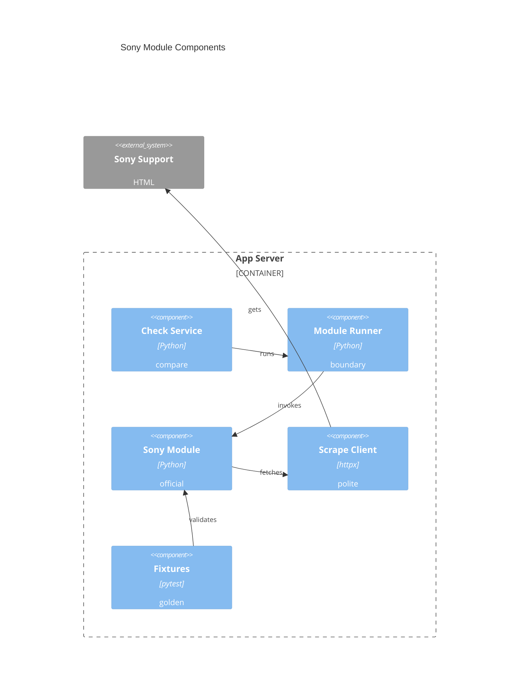

# Implementation Plan: Official Sony Alpha Module

**Branch**: `00012-official-sony-alpha-module` | **Date**: 2026-05-31 | **Spec**: [spec.md](spec.md)

## Summary

**Goal**: Ship a bundled Sony Alpha module that supports all Sony cameras and lenses listed on the Alpha Universe firmware index, including Sony A7CII `ILCE-7CM2` `2.00` -> `2.01`.  
**Approach**: Parse the embedded Alpha Universe firmware catalog through a contract-compatible module, with camera/lens fixtures, parser/unit tests, and README guidance.  
**Key Constraint**: The module must use only host-provided scraping and must fail visibly on unparseable content.

## Technical Context

**Language/Version**: Python 3.13  
**Primary Dependencies**: FastAPI, Pydantic, existing `ModuleRunner`, existing `ScrapeClient`, pytest  
**Storage**: N/A — no new persistence or migrations  
**Testing**: pytest, pytest-asyncio, pytest-cov, Ruff, mypy strict  
**Target Platform**: Single Linux container and host runtime  
**Project Type**: web  
**Project Mode**: brownfield  
**Performance Goals**: Parse fixture-sized Sony pages synchronously within a normal module invocation.  
**Constraints**: No direct outbound requests; fixture-based correctness; visible parse failure; no sandboxing claim.  
**Scale/Scope**: Official starter coverage for all Alpha Universe-listed Sony cameras and lenses, with fixture regression coverage for camera, lens, and failure behavior.

## Instructions Check

| Gate | Result | Evidence |
|------|--------|----------|
| Honest Failure | PASS | Unparseable Sony content returns a failed module result. |
| Polite by Default | PASS | Module receives page content through injected ScrapeClient only. |
| Data Ownership | PASS | No external data store or telemetry is added. |
| Least Privilege | PASS | Module remains an unsandboxed trusted extension; docs do not imply isolation. |
| Type Safety | PASS | Python module and tests use typed contract models and strict-compatible helpers. |
| Reliability | PASS | Fixture regression tests lock expected Sony detection behavior. |

## Architecture



## Architecture Decisions

| ID | Decision | Options Considered | Chosen | Rationale |
|----|----------|--------------------|--------|-----------|
| AD-001 | Where should official modules live? | modules volume seed / backend package | backend package | Bundled package is testable, typed, and ships with the image; user modules still live in the volume. |
| AD-002 | How should Sony fixtures validate updates? | live HTTP / captured Alpha Universe index HTML | captured Alpha Universe index HTML | Deterministic CI and polite scraping compliance while covering the full catalog source. |
| AD-003 | How should parser misses behave? | no-update result / failed module result | failed module result | Matches Honest Failure and prevents silent missed updates. |

## Data Model Summary

N/A — no persistent data or migration changes.

## API Surface Summary

N/A — no new API surface; existing check service invokes the module through `ModuleRunner`.

## Testing Strategy

| Tier | Tool | Scope | Mock Boundary | Install |
|------|------|-------|---------------|---------|
| Unit | pytest | Alpha Universe parser, camera/lens matching, version extraction, failure mapping | fixture HTML strings and fake ScrapeClient | configured |
| Integration | pytest-asyncio | Module `check_firmware()` through contract-compatible async path | fake ScrapeClient response body | configured |
| Security | Ruff / existing CI policy | Ensure module has no direct HTTP client imports or unsafe execution helpers | static source scan | configured |
| Coverage | pytest-cov | Success and unparseable branches for official Sony module | fixture corpus | configured |

## Error Handling Strategy

| Error Category | Pattern | Response | Retry |
|----------------|---------|----------|-------|
| Product not found | fail visible | failed module result with `product_not_found` diagnostics | no |
| Listed without firmware | fail visible | failed module result with `firmware_not_available` diagnostics | no |
| Empty response | fail visible | failed module result with `empty_response` diagnostics | no |
| Unparseable page | fail visible | failed module result with `firmware_index_not_found` diagnostics | no |
| Scrape failure | preserve boundary | ScrapeClient/runner failure remains visible check failure | ScrapeClient owns retry |

## Integration Points

| Spec Reference | System/Service | Technical Approach | Contract |
|----------------|----------------|--------------------|----------|
| FR-001 | Module engine from E006 | Implement `MODULE_METADATA` and async `check_firmware(input, client)` contract | `backend/src/binocular/extensions/contract.py` |
| FR-002 | Update detection from E009 | Parse Alpha Universe camera/lens entries and return matched firmware versions | `backend/src/binocular/services/version_compare.py` |
| FR-003 | Responsible scraping from E007 | Use only injected `ScrapeClient.fetch()` | `backend/src/binocular/scraping/client.py` |
| FR-004 | Module runner failure path | Return failed `ModuleCheckResult` for parser misses, unlisted products, and no-firmware entries | `backend/src/binocular/extensions/runner.py` |

## Risk Mitigation

| Risk (from spec) | Likelihood | Impact | Mitigation | Owner |
|-------------------|------------|--------|------------|-------|
| Alpha Universe embedded-data changes | medium | high | Add fixture parser tests and make missing catalog data a failed result. | Sony module |
| Model alias mismatch | medium | medium | Match camera model/name and lens model/SKU in tests. | Sony module tests |
| Fixture drift | low | medium | Store expected latest version in golden assertions and README guidance. | Official module fixtures |

## Requirement Coverage Map

| Req ID | Component(s) | File Path(s) | Notes |
|--------|--------------|--------------|-------|
| FR-001 | Sony module package | `backend/src/binocular/official_modules/sony_alpha.py`, `backend/src/binocular/official_modules/README.md` | Contract-compatible official module. |
| FR-002 | Sony module tests, comparator integration | `backend/tests/test_official_sony_alpha_module.py`, `backend/src/binocular/services/version_compare.py` | Alpha Universe camera/lens catalog parsing. |
| FR-003 | Sony module implementation | `backend/src/binocular/official_modules/sony_alpha.py` | Uses injected ScrapeClient only. |
| FR-004 | Sony parser failure path | `backend/src/binocular/official_modules/sony_alpha.py`, `backend/tests/test_official_sony_alpha_module.py` | Failed result on missing index, unlisted product, or missing firmware. |
| FR-005 | Fixture corpus and tests | `backend/tests/fixtures/sony_alpha/`, `backend/tests/test_official_sony_alpha_module.py` | Alpha Universe golden fixtures. |

## Project Structure

### Source Code

```text
+ backend/src/binocular/official_modules/__init__.py
+ backend/src/binocular/official_modules/sony_alpha.py
+ backend/src/binocular/official_modules/README.md
+ backend/tests/fixtures/sony_alpha/alpha_universe_firmware.html
+ backend/tests/fixtures/sony_alpha/unparseable.html
+ backend/tests/test_official_sony_alpha_module.py
```

**Patterns to reuse**: module contract dataclasses, runner result models, fake ScrapeClient test doubles, version comparator service.  
**Tests to extend**: backend pytest module runner/check-related suites with official fixture tests.  
**Naming conventions**: snake_case module names, explicit dataclass/Pydantic contract objects, fixture filenames by model code.

## Implementation Hints

- **[HINT-001]** Order: add module package and parser first, then fixtures, then contract/comparison tests.
- **[HINT-002]** Gotcha: do not import `httpx`, `requests`, or perform direct network calls in the official module.
- **[HINT-003]** Constraint: parser miss is a failed result, not `latest_version=None` with success.
- **[HINT-004]** Compatibility: preserve dotted version strings so E009 comparator handles ordering.
- **[HINT-005]** Testing: assert `ILCE-7CM2` current `2.00` with fixture latest `2.01` and lens `SEL2470GM` current `1` with latest `2` both produce update available through `compare_versions()`.