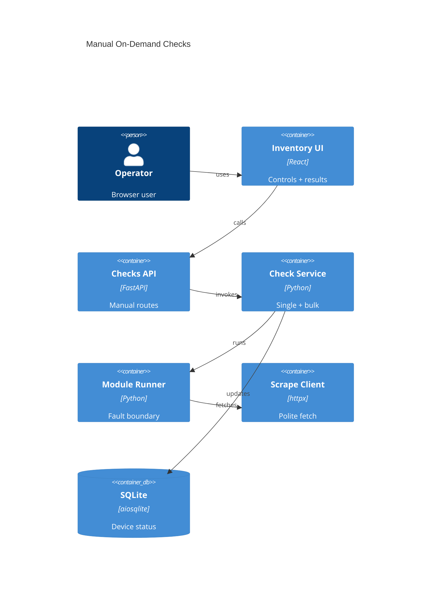

# Implementation Plan: Manual On-Demand Checks

**Branch**: `00014-manual-on-demand-checks` | **Date**: 2026-05-31 | **Spec**: [spec.md](spec.md)

## Summary

**Goal**: Manual single/all-device checks with stored/latest comparison.  
**Approach**: Extend E009 check service/API, then add typed frontend calls and inventory controls.  
**Key Constraint**: Preserve visible failure semantics; no external workers, storage, or outbound paths.

## Technical Context

**Language/Version**: Python 3.13; TypeScript 5.x / React 18  
**Primary Dependencies**: FastAPI, Pydantic, aiosqlite, httpx, React, Vite, module runner, scraping client  
**Storage**: SQLite existing device/module tables; no new persistent table  
**Testing**: pytest + pytest-asyncio; Vitest + React Testing Library  
**Target Platform**: Linux Docker container, single FastAPI process  
**Project Type**: web  
**Project Mode**: brownfield  
**Performance Goals**: Bounded async bulk checks; responsive frontend  
**Constraints**: Host scraping client only; no silent failures; no external broker; trusted-LAN single-user model  
**Scale/Scope**: Single-user inventory of roughly 5-50+ devices

## Instructions Check

| Gate | Verdict | Evidence |
|------|---------|----------|
| Honest Failure | PASS | Bulk and single-device results expose failed check status and diagnostics. |
| Polite by Default | PASS | All checks use E009 `CheckService`, `ModuleRunner`, and `ScrapeClient`. |
| Data Ownership & Self-Containment | PASS | No external queue, DB, or telemetry is introduced. |
| Least-Privilege & Explicit Trust Boundary | PASS | Existing unsandboxed module trust boundary remains unchanged. |
| Type Safety & Correctness-First | PASS | Pydantic models and TypeScript API types cover request/response shapes. |
| Set-and-Forget Reliability | PASS | Per-device bulk failures are isolated and do not crash the request. |

## Architecture



## Architecture Decisions

| ID | Decision | Options Considered | Chosen | Rationale |
|----|----------|--------------------|--------|-----------|
| AD-001 | How should all-device checks run? | Sequential / unbounded gather / bounded concurrency | Bounded async concurrency | Keeps checks responsive without overloading vendor sites or the process. |
| AD-002 | How should bulk failures be represented? | Fail entire request / per-device results | Per-device results | One failed module/device must not hide successful checks for others. |
| AD-003 | Where should manual controls live? | Separate page / inventory cards and toolbar | Inventory cards and toolbar | Stored/latest comparison belongs next to the device inventory context. |
| AD-004 | How should module selection work? | Hidden association / request field / new schema | Selected module in request | Existing schema has no association; explicit selection avoids hidden defaults and migrations. |

## Data Model Summary

| Entity | Key Fields | Relationships | Notes |
|--------|------------|---------------|-------|
| CheckResult | `device_id`, `module_id`, `status`, versions, timestamps, diagnostics | Device + module run | Existing E009 typed contract. |
| ManualCheckRequest | `module_id`, `source_url`, `extra`, optional concurrency | Targets one or all active devices | Transient API payload. |
| ManualCheckBatch | `results`, `total`, `succeeded`, `failed` | Collection of `CheckResult` | Transient response only. |

**Detail**: [data-model.md](data-model.md)

## API Surface Summary

| Method | Path | Purpose | Auth | Req/Res Types |
|--------|------|---------|------|---------------|
| POST | `/api/v1/checks/devices/{device_id}` | Run one manual check | Optional basic auth when enabled | `RunDeviceCheckRequest` / `CheckResultResponse` |
| POST | `/api/v1/checks/all` | Run checks for all active devices | Optional basic auth when enabled | `RunBulkCheckRequest` / `BulkCheckResponse` |

**Detail**: [contracts/manual-check-api.md](contracts/manual-check-api.md)

## Testing Strategy

| Tier | Tool | Scope | Mock Boundary | Install |
|------|------|-------|---------------|---------|
| Unit | pytest, Vitest | Bulk aggregation and frontend status helpers | Fake check/module API | configured |
| Integration | pytest + httpx ASGI client | Bulk success, empty, partial failure, invalid module | Temp SQLite and staged module | configured |
| Security | Ruff/Bandit-equivalent CI policy | No direct outbound requests, unsafe eval, or hidden module execution bypass | — | configured via CI policy |
| Coverage | pytest/Vitest coverage policy | Backend route/service and frontend UI states | — | configured |

## Error Handling Strategy

| Error Category | Pattern | Response | Retry |
|----------------|---------|----------|-------|
| Device not found | fail-fast | 404 `device_not_found` for single-device route | no |
| Module not found | fail-fast | 404 `module_not_found` before bulk starts | no |
| Module not runnable | fail-fast | 409 `module_not_runnable` before bulk starts | no |
| Per-device module failure | contained domain failure | 200 bulk response with failed `CheckResult` entry | no extra retry in E010 |
| Empty inventory | valid empty state | 200 bulk response with `results=[]`, counts `0` | no |
| Unexpected internal error | fail visible | 500 structured error and server log | no |

## Integration Points

| Spec Reference | System/Service | Technical Approach | Contract |
|----------------|----------------|--------------------|----------|
| FR-001 | E009 CheckService | Reuse `run_device_check()` for a selected device and module | `backend/src/binocular/services/checks.py` |
| FR-002, FR-006 | InventoryRepository + CheckService | Add `run_all_device_checks()` over `list_active_devices()` with bounded concurrency | `backend/src/binocular/repositories/inventory.py` |
| FR-003, FR-008 | E009 CheckResult | Return existing result shape unchanged for each manual check | [contracts/manual-check-api.md](contracts/manual-check-api.md) |
| FR-004, FR-005, FR-009 | Inventory UI | Add manual check API client, module selector, buttons, loading/error/result states | `frontend/src/App.tsx`, `frontend/src/api/checks.ts` |

## Risk Mitigation

| Risk (from spec) | Likelihood | Impact | Mitigation | Owner |
|-------------------|------------|--------|------------|-------|
| Long-running vendor pages | medium | medium | Bound concurrency, expose loading state, and refresh inventory when results finish. | Check service + UI |
| Partial failures in bulk mode | medium | high | Use per-device result collection and tests where one failure does not cancel other results. | Check service |
| Contract drift from E009 | low | high | Reuse `CheckResultResponse` and add TypeScript types/tests for the same fields. | API route + frontend client |

## Requirement Coverage Map

| Req ID | Component(s) | File Path(s) | Notes |
|--------|--------------|--------------|-------|
| FR-001 | Checks API, CheckService | `backend/src/binocular/routes/checks.py`, `backend/src/binocular/services/checks.py` | Existing endpoint remains the single-device trigger. |
| FR-002 | Checks API, CheckService, InventoryRepository | `backend/src/binocular/routes/checks.py`, `backend/src/binocular/services/checks.py`, `backend/src/binocular/repositories/inventory.py` | All-device route uses active-device listing. |
| FR-003 | CheckResult models | `backend/src/binocular/routes/checks.py`, `frontend/src/api/checks.ts` | Shared per-device result shape. |
| FR-004 | Inventory UI | `frontend/src/App.tsx` | Render current/latest side by side from manual results and refreshed inventory. |
| FR-005 | Inventory UI | `frontend/src/App.tsx` | Show status, timestamp, and diagnostic detail. |
| FR-006 | CheckService | `backend/src/binocular/services/checks.py` | Bounded concurrent bulk execution. |
| FR-007 | InventoryRepository | `backend/src/binocular/repositories/inventory.py` | Uses `list_active_devices()` archived filter. |
| FR-008 | CheckService | `backend/src/binocular/services/checks.py` | Preserve E009 failure semantics. |
| FR-009 | Frontend API/UI state | `frontend/src/api/checks.ts`, `frontend/src/App.tsx` | Loading state and non-blocking async UI. |

## Project Structure

### Source Code

```text
~ backend/src/binocular/services/checks.py
~ backend/src/binocular/routes/checks.py
+ backend/tests/test_manual_checks.py
+ frontend/src/api/checks.ts
~ frontend/src/api/index.ts
~ frontend/src/App.tsx
+ frontend/src/api/checks.test.ts
~ frontend/src/App.test.tsx
```

**Patterns to reuse**: Pydantic schemas, dataclass results, raw repositories, `apiClient.request`, inventory card UI.  
**Tests to extend**: backend route/service tests and frontend API/App tests.  
**Naming conventions**: plural route/API modules; verb-phrase service methods; `handle*` React handlers.

## Implementation Hints

- **[HINT-001]** Order: Add backend bulk service and route before frontend controls.
- **[HINT-002]** Gotcha: Validate module existence/runnability once before bulk execution so every device does not repeat the same fatal module error.
- **[HINT-003]** Constraint: Keep all outbound requests inside E009 `CheckService`/`ModuleRunner`/`ScrapeClient`.
- **[HINT-004]** Performance: Clamp caller-provided concurrency to a conservative server-side maximum.
- **[HINT-005]** UI: Refresh inventory after manual checks so persisted latest/status fields match displayed results.
