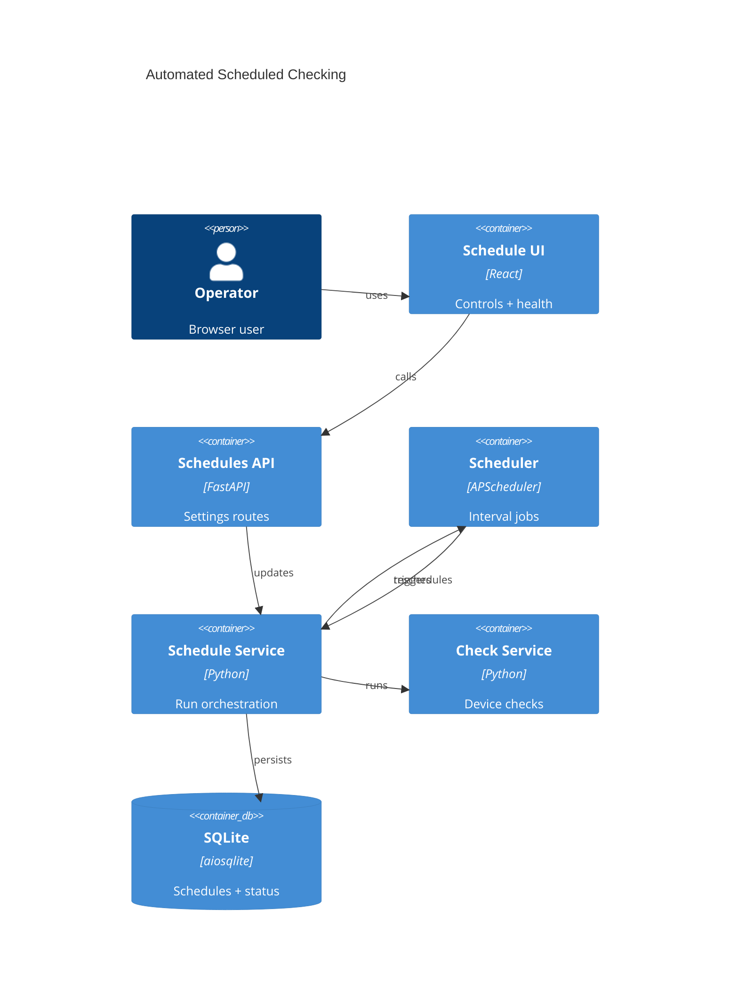

# Implementation Plan: Automated Scheduled Checking

**Branch**: `00015-automated-scheduled-checking` | **Date**: 2026-05-31 | **Spec**: [spec.md](spec.md)

## Summary

**Goal**: Add restart-safe per-device-type scheduled firmware checks.  
**Approach**: Persist schedules in SQLite, rebuild APScheduler jobs at startup, expose API/UI health.  
**Key Constraint**: One scheduler owner; no backlog replay or broker.

## Technical Context

**Language/Version**: Python 3.13; TypeScript 5.x / React 18  
**Primary Dependencies**: FastAPI, Pydantic, aiosqlite, APScheduler, CheckService, React, Vite  
**Storage**: SQLite `device_type_schedules` via `004_schedules.sql`  
**Testing**: pytest + pytest-asyncio; Vitest + React Testing Library  
**Target Platform**: Linux Docker container, single FastAPI process  
**Project Type**: web  
**Project Mode**: brownfield  
**Performance Goals**: One active run per device type; no backlog burst  
**Constraints**: Host scraping client only; visible failures; no worker/broker; trusted LAN  
**Scale/Scope**: Single-user inventory of roughly 5-50+ devices

## Instructions Check

| Gate | Verdict | Evidence |
|------|---------|----------|
| Honest Failure | PASS | Scheduler errors, skips, and check failures are visible. |
| Polite by Default | PASS | No backlog replay; checks use host scraping client. |
| Data Ownership & Self-Containment | PASS | Schedule state is SQLite; no broker or external DB. |
| Least-Privilege & Explicit Trust Boundary | PASS | Existing unsandboxed module boundary remains unchanged. |
| Type Safety & Correctness-First | PASS | Typed contracts and lifecycle tests required. |
| Set-and-Forget Reliability | PASS | Jobs rebuild from SQLite on restart. |

## Architecture



## Architecture Decisions

| ID | Decision | Options Considered | Chosen | Rationale |
|----|----------|--------------------|--------|-----------|
| AD-001 | Durable schedule state | APScheduler store / SQLite table | SQLite table | Single backup-able source; scheduler is derived. |
| AD-002 | Job restoration | Persist jobs / rebuild startup | Rebuild jobs | Avoids callable serialization and duplicate IDs. |
| AD-003 | Missed windows | Replay all / skip / next interval | Next interval | Polite retry without burst. |
| AD-004 | Overlaps | Duplicate / cancel / skip-coalesce | Skip/coalesce visibly | Prevents duplicate work. |

## Data Model Summary

| Entity | Key Fields | Relationships | Notes |
|--------|------------|---------------|-------|
| DeviceTypeSchedule | `device_type_id`, `enabled`, `interval_minutes`, timestamps, diagnostics | `device_types` | Config + latest health. |
| ScheduledCheckRun | `device_type_id`, status, counts, diagnostics | schedule row | One interval execution. |
| CheckResult | status, versions, timestamps, diagnostics | E009 output | Reused unchanged. |

**Detail**: [data-model.md](data-model.md)

## API Surface Summary

| Method | Path | Purpose | Auth | Req/Res Types |
|--------|------|---------|------|---------------|
| GET | `/api/v1/schedules` | List settings and health | Optional basic auth | `ScheduleListResponse` |
| PUT | `/api/v1/schedules/device-types/{device_type_id}` | Upsert schedule | Optional basic auth | `ScheduleUpdateRequest` / `DeviceTypeScheduleResponse` |

**Detail**: [contracts/schedule-api.md](contracts/schedule-api.md)

## Testing Strategy

| Tier | Tool | Scope | Mock Boundary | Install |
|------|------|-------|---------------|---------|
| Unit | pytest, Vitest | Validation, job rebuild, UI helpers | Fake scheduler/check service/API | Add `apscheduler>=3.10,<4.0` |
| Integration | pytest + httpx ASGI client | Routes, migration, startup, run execution | Temp SQLite + fake checks | configured |
| Security | Ruff + pip-audit | No direct outbound requests, dependency vulnerabilities | — | configured |
| Coverage | pytest/Vitest coverage | Scheduler service, routes, repository, UI states | — | configured |

## Error Handling Strategy

| Error Category | Pattern | Response | Retry |
|----------------|---------|----------|-------|
| Device type not found | fail-fast | 404 `device_type_not_found` | no |
| Invalid interval | fail-fast | 422 validation error | no |
| Scheduler startup failure | fail visible | Persist diagnostic and log | next startup |
| Overlapping run | coalesce/skip | Persist `last_skip_reason` | next interval |
| Per-device check failure | contained domain failure | Persist partial/failed health from results | no extra retry |
| Unexpected internal error | fail visible | 500 structured error + log | no |

## Integration Points

| Spec Reference | System/Service | Technical Approach | Contract |
|----------------|----------------|--------------------|----------|
| FR-001, FR-002 | Schedules API/UI | Read/update endpoint and controls | [contracts/schedule-api.md](contracts/schedule-api.md) |
| FR-003, FR-004 | SQLite/repository | `004_schedules.sql` and repository | [data-model.md](data-model.md) |
| FR-005, FR-006 | CheckService | Scheduler calls existing check logic | `backend/src/binocular/services/checks.py` |
| FR-007, FR-008 | APScheduler service | Deterministic jobs; one active run/type | `backend/src/binocular/services/scheduler.py` |
| FR-009, FR-010 | UI/API health | Expose timestamps/diagnostics | [contracts/schedule-api.md](contracts/schedule-api.md) |
| FR-011 | App lifecycle/config | In-process scheduler only | `backend/src/binocular/main.py` |

## Risk Mitigation

| Risk (from spec) | Likelihood | Impact | Mitigation | Owner |
|-------------------|------------|--------|------------|-------|
| Duplicate jobs in unsupported multi-worker deployments | low | high | Start one scheduler in single-process lifespan and document limitation. | Scheduler service |
| Scraping bursts after downtime | medium | high | Use no backlog replay and coalesced/next-interval behavior. | Scheduler service |
| Silent scheduler failure | medium | high | Persist startup, execution, missed-run, and overlap diagnostics. | Repo + UI |

## Requirement Coverage Map

| Req ID | Component(s) | File Path(s) | Notes |
|--------|--------------|--------------|-------|
| FR-001 | API/UI | `backend/src/binocular/routes/schedules.py`, `frontend/src/api/schedules.ts`, `frontend/src/App.tsx` | Enable/disable per type. |
| FR-002 | API/UI | `backend/src/binocular/routes/schedules.py`, `frontend/src/api/schedules.ts`, `frontend/src/App.tsx` | Validate interval bounds. |
| FR-003 | Migration/repo | `backend/src/binocular/db/migrations/004_schedules.sql`, `backend/src/binocular/repositories/schedules.py` | SQLite source of truth. |
| FR-004 | Scheduler/lifespan | `backend/src/binocular/services/scheduler.py`, `backend/src/binocular/main.py` | Rebuild on startup. |
| FR-005 | Scheduler/checks | `backend/src/binocular/services/scheduler.py`, `backend/src/binocular/services/checks.py` | Run type devices. |
| FR-006 | CheckService | `backend/src/binocular/services/scheduler.py`, `backend/src/binocular/services/checks.py` | Reuse result semantics. |
| FR-007 | Scheduler | `backend/src/binocular/services/scheduler.py` | One active run/type. |
| FR-008 | Scheduler | `backend/src/binocular/services/scheduler.py` | No backlog replay. |
| FR-009 | Repo/API/UI | `backend/src/binocular/repositories/schedules.py`, `backend/src/binocular/routes/schedules.py`, `frontend/src/App.tsx` | Expose health fields. |
| FR-010 | Scheduler/repo/UI | `backend/src/binocular/services/scheduler.py`, `backend/src/binocular/repositories/schedules.py`, `frontend/src/App.tsx` | Visible diagnostics. |
| FR-011 | Config/lifespan | `backend/pyproject.toml`, `backend/src/binocular/main.py` | In-process dependency. |

## Project Structure

### Source Code

```text
~ backend/pyproject.toml
+ backend/src/binocular/db/migrations/004_schedules.sql
+ backend/src/binocular/repositories/schedules.py
+ backend/src/binocular/services/scheduler.py
+ backend/src/binocular/routes/schedules.py
~ backend/src/binocular/routes/__init__.py
~ backend/src/binocular/main.py
~ backend/src/binocular/repositories/inventory.py
+ backend/tests/test_schedules_repository.py
+ backend/tests/test_scheduler_service.py
+ backend/tests/test_schedules_routes.py
+ frontend/src/api/schedules.ts
~ frontend/src/api/index.ts
~ frontend/src/App.tsx
+ frontend/src/api/schedules.test.ts
~ frontend/src/App.test.tsx
```

**Patterns to reuse**: raw repositories, route dependency factories, Pydantic schemas, `apiClient.request`.  
**Tests to extend**: migration, route/service, frontend API/App tests.  
**Naming conventions**: plural route/API modules; domain service modules.

## Implementation Hints

- **[HINT-001]** Order: Add migration/repository, then scheduler service, then routes, then UI.
- **[HINT-002]** Constraint: SQLite remains schedule source; do not use APScheduler job stores.
- **[HINT-003]** Gotcha: Start scheduler after migrations and stop it during lifespan shutdown.
- **[HINT-004]** Compatibility: Add `apscheduler` to backend dependencies before importing scheduler types.
- **[HINT-005]** Testing: Use short intervals/fake scheduler calls rather than wall-clock sleeps.