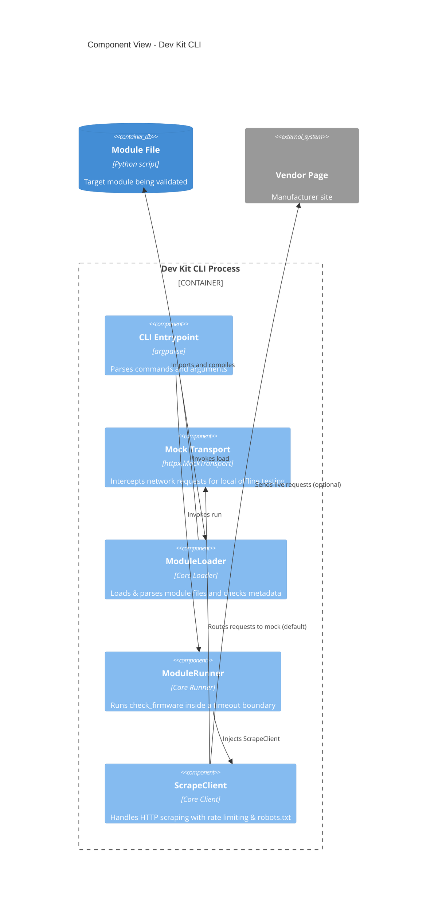

# Implementation Plan: Module Dev Kit & Docs

**Branch**: `00016-module-dev-kit-docs-authoring` | **Date**: 2026-06-01 | **Spec**: [spec.md](spec.md)

## Summary

**Goal**: Deliver a comprehensive authoring guide and a standalone CLI test harness to enable local module development, testing, and contract validation.  
**Approach**: Build `devkit.py` as a CLI utility using standard library `argparse` that directly reuses the core `ModuleLoader`, `ModuleRunner`, and `ScrapeClient` classes. Provide a mock transport fallback for network-free local dry-runs, and document all extension contracts in `docs/modules-authoring-guide.md`.  
**Key Constraint**: The dev kit must mirror the exact static and runtime validation logic used by the production web application engine to ensure 100% parity.

## Technical Context

**Language/Version**: Python 3.13  
**Primary Dependencies**: Pydantic, httpx, structlog  
**Storage**: N/A  
**Testing**: pytest  
**Target Platform**: Linux/macOS host runtime  
**Project Type**: Python CLI utility (part of Backend)  
**Project Mode**: brownfield  
**Performance Goals**: Instant startup (<100ms) for CLI, fast checks.  
**Constraints**: Pure Python standard library/dependencies only, zero-config run, polite scraping by default.  
**Scale/Scope**: Dev utility for individual module authors.

## Instructions Check

*GATE: Must pass before Phase 0 research. Re-check after Phase 1 design.*

| Principle | Verdict | Evidence/Notes |
|-----------|---------|----------------|
| I. Honest Failure | PASS | The CLI tool catches and prints all error findings, exceptions, and diagnostics in a structured format instead of swallowing errors or silently missing. |
| II. Polite by Default | PASS | The CLI initializes and injects the official polite `ScrapeClient` with proper robots.txt and User-Agent handling by default. |
| III. Data Ownership & Self-Containment | PASS | Dev kit runs fully locally and has no external database or SaaS dependencies. |
| IV. Least-Privilege & Explicit Trust Boundary | PASS | The authoring guide explicitly documents that modules execute unsandboxed with full privileges, and the dev kit does not claim to sandbox code. |
| V. Type Safety & Correctness-First | PASS | Code will fully conform to strict static analysis and strict mypy backend constraints. |
| VI. Set-and-Forget Reliability | PASS | Standard argparse is highly reliable, has zero configuration requirements, and isolates exceptions gracefully. |

## Architecture



## Architecture Decisions

| ID | Decision | Options Considered | Chosen | Rationale |
|----|----------|--------------------|--------|-----------|
| AD-001 | CLI Command Router | Click / Typer vs. Standard `argparse` | Standard `argparse` | Eliminates external dependency requirements, ensuring the dev kit remains lightweight and zero-dependency beyond existing core libs. |
| AD-002 | Offline Mock Testing | Live request only vs. Local HTML files vs. In-process Mock Transport | In-process Mock Transport (`httpx.MockTransport`) | Provides instant, network-free dry-runs out of the box with realistic HTML extraction without complex local file management. |

## Data Model Summary

N/A — no persistent data

## API Surface Summary

N/A — no API surface

## Testing Strategy

| Tier | Tool | Scope | Mock Boundary | Install |
|------|------|-------|---------------|---------|
| Unit | pytest | Test CLI parsing, arguments validation, MockTransport returns, and output serialization | Mock network requests | `configured` |
| Integration | pytest | End-to-end execution of `check` and `run` commands using dummy modules (valid and invalid) | Real module filesystem imports | `configured` |
| Security | mypy | Validate backend strict type-checking compliance on `devkit.py` | — | `configured` |

## Error Handling Strategy

| Error Category | Pattern | Response | Retry |
|----------------|---------|----------|-------|
| Syntax Error | Catch and report | Print line numbers and details to stderr, exit code 1 | No |
| Invalid Metadata | Catch and report | Print validation findings to stderr, exit code 1 | No |
| Scraper / Timeout Error | Catch via Runner boundary | Print diagnostics dict and failure status, exit code 1 | No (controlled by scrape client) |
| Core Exception | Global try/except | Print traceback gracefully and report system error, exit code 1 | No |

## Integration Points

| Spec Reference | System/Service | Technical Approach | Contract |
|----------------|----------------|--------------------|----------|
| IP-001 | Loader & Validator | Directly import `binocular.extensions.loader.ModuleLoader` and runner components | Reuses standard Python interface |
| IP-002 | Scrape Client | Instantiate `binocular.scraping.client.ScrapeClient` with CLI parameter overrides | Reuses standard Python interface |

## Risk Mitigation

| Risk (from spec) | Likelihood | Impact | Mitigation | Owner |
|-------------------|------------|--------|------------|-------|
| Scraper block risk during local testing | Medium | Low | Integrate a local Mock Transport by default so network testing is explicit. Add warnings in docs. | DevKit CLI |
| Parity discrepancy | Low | High | Import and reuse core `ModuleLoader`, `ModuleRunner` classes directly rather than reimplementing. | DevKit CLI |

## Requirement Coverage Map

| Req ID | Component(s) | File Path(s) | Notes |
|--------|--------------|--------------|-------|
| FR-001 | CLI devkit script | `backend/src/binocular/extensions/devkit.py` | Main CLI entrypoint runnable as `python -m binocular.extensions.devkit`. |
| FR-002 | `check` command | `backend/src/binocular/extensions/devkit.py` | Parses arguments and runs `ModuleLoader` to statically validate module contract. |
| FR-003 | `run` command | `backend/src/binocular/extensions/devkit.py` | Parses runner arguments and calls `ModuleRunner.run(...)`. |
| FR-004 | Input arguments builder | `backend/src/binocular/extensions/devkit.py` | Maps `--device-type`, `--model`, `--current-version`, etc. to `ModuleCheckInput`. |
| FR-005 | polite HTTP runner | `backend/src/binocular/extensions/devkit.py` | Instantiates `ScrapeClient` using real or mock transport depending on CLI overrides. |
| FR-006 | Documentation | `docs/modules-authoring-guide.md` | Complete Markdown documentation on metadata, entrypoint, client API, and error states. |

## Project Structure

### Source Code

```text
~ backend/src/binocular/extensions/
  + devkit.py             # Dev Kit CLI and MockTransport implementation
+ docs/
  + modules-authoring-guide.md # Comprehensive guide for extension developers
```

<!-- Brownfield Notes (include only when Project Mode = brownfield or mixed):
**Patterns to reuse**: Direct reuse of `ModuleLoader`, `ModuleRunner`, `ModuleCheckInput`, and `ScrapeClient` from `binocular.extensions` and `binocular.scraping`.
**Tests to extend**: Add unit/integration tests under `backend/tests/extensions/test_devkit.py`.
**Naming conventions**: PEP 8 snake_case for Python methods/variables, PascalCase for classes.
-->

## Implementation Hints

- **[HINT-001]** Dependency imports: Keep devkit execution safe by importing `httpx` and `pydantic` only inside appropriate commands to ensure fast CLI invocation times.
- **[HINT-002]** Mock Transport: The `MockTransport` should return a sample page containing the version `2.5.0` to verify parsing code works flawlessly off-line.
- **[HINT-003]** Standard output: Format validation results as clean JSON strings if `--json` is supplied, making the dev kit compatible with editor linters or IDE plugins in the future.
