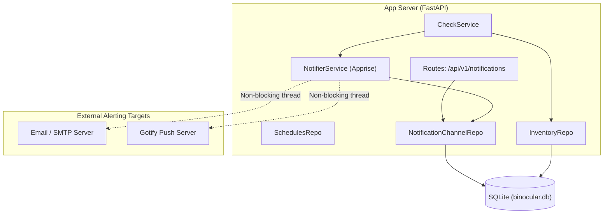

# Implementation Plan: Notification & Alerting

**Branch**: `00017-notification-alerting-apprise` | **Date**: 2026-06-01 | **Spec**: [spec.md](spec.md)

## Summary

**Goal**: Deliver a reliable, multi-channel notification dispatcher using Apprise that pushes alerts to configured Email/SMTP and Gotify targets when newer firmware versions are discovered.  
**Approach**: Integrate an Apprise-based notifier service into the FastAPI monorepo, executing outbound I/O tasks within a non-blocking asyncio thread pool executor, and manage configurations dynamically in SQLite via custom REST endpoints and a secure masking layer.  
**Key Constraint**: Dispatch failures must be completely isolated from the database check transactions so that failing notifications never halt or roll back firmware version updates.

## Technical Context

**Language/Version**: Python 3.13  
**Primary Dependencies**: FastAPI, Apprise, aiosqlite, pydantic, structlog  
**Storage**: SQLite (`binocular.db`) via `aiosqlite`  
**Testing**: pytest, pytest-asyncio, httpx.AsyncClient  
**Target Platform**: Linux Docker container (`python:3.13-slim`)  
**Project Type**: web  
**Project Mode**: brownfield  
**Performance Goals**: Stateless thread-safe dispatch within <2s, with zero blocking overhead on the core FastAPI event loop.  
**Constraints**: Masked credentials in UI reads, non-blocking outbound dispatches, zero external database requirements.  
**Scale/Scope**: Homelab private LAN, 1 operator, 5–50+ devices, 2 core notification channels (SMTP, Gotify).

## Instructions Check

*GATE: Must pass before Phase 0 research. Re-check after Phase 1 design.*

| Instruction / Standard | Status | Verification Method |
|------------------------|--------|---------------------|
| Honest Failure Principle | PASS | Outbound failures do not affect version updates and are written to database activity logs. |
| Secure Credentials Posture | PASS | Masking layer returns asterisks for secrets in API responses; raw credentials load via environment or `_FILE` conventions. |
| Parameterized SQL | PASS | SQLite inserts use standard place-holders (`?`) inside database repository layer. |

## Architecture



## Architecture Decisions

Feature-local tradeoffs only. Project-wide architectural decisions belong in standalone ADRs under `specs/adrs/`.

| ID | Decision | Options Considered | Chosen | Rationale |
|----|----------|--------------------|--------|-----------|
| AD-001 | Outbound Dispatch Concurrency | (A) Celery/Redis tasks<br>(B) Async `asyncio.to_thread` apprise dispatch | **Option B** | Keeps the container single-process and lightweight without requiring a redis broker or additional services, matching the homelab zero-config promise. |
| AD-002 | Apprise URL Scheme Assembly | (A) Save Apprise URLs directly in database<br>(B) Save configuration parameters as structured JSON and assemble URLs on demand | **Option B** | Keeps parameters like username, port, and password readable for updates and enables robust individual form validation and credential masking. |
| AD-003 | Secret Injection Convention | (A) UI entry only<br>(B) Support env variables + `_FILE` secret convention on startup | **Option B** | Follows Docker Swarm / Kubernetes best practices and allows operator to boot without entering secrets in plain text. |

## Data Model Summary

Configuration schemas are persisted inside SQLite as JSON-serialized strings to enable future channel schema additions without migrations.

| Table | Column | Type | Constraints | Notes |
|-------|--------|------|-------------|-------|
| `notification_channels` | `id`<br>`type`<br>`enabled`<br>`config`<br>`created_at`<br>`updated_at` | INTEGER<br>TEXT<br>INTEGER<br>TEXT<br>TEXT<br>TEXT | PRIMARY KEY AUTOINCREMENT<br>NOT NULL UNIQUE CHECK(type IN ('smtp', 'gotify'))<br>NOT NULL DEFAULT 0 CHECK(enabled IN (0,1))<br>NOT NULL<br>NOT NULL DEFAULT CURRENT_TIMESTAMP<br>NOT NULL DEFAULT CURRENT_TIMESTAMP | Stores structured JSON configurations containing hostname, username, encrypted/cleartext credentials. |

**Detail**: [data-model.md](data-model.md)

## API Surface Summary

API paths are fully configured under `/api/v1/notifications` router, with payload schemas separating read/write forms.

| Method | Path | Purpose | Auth | Req/Res Types |
|--------|------|---------|------|---------------|
| `GET` | `/api/v1/notifications` | Fetch configurations for SMTP & Gotify | Optional Basic | None -> `list[NotificationChannelResponse]` |
| `PUT` | `/api/v1/notifications/{channel_type}` | Create/Update configuration | Optional Basic | `UpdateChannelRequest` -> `NotificationChannelResponse` |
| `POST` | `/api/v1/notifications/{channel_type}/test` | Trigger immediate test notification | Optional Basic | `TestChannelRequest` -> `TestChannelResponse` |

**Detail**: [contracts/api.md](contracts/api.md)

## Testing Strategy

All units, routers, and dispatchers are validated under the standard `pytest` suite, with Apprise itself mocked in unit tests.

| Tier | Tool | Scope | Mock Boundary | Install |
|------|------|-------|---------------|---------|
| Unit | `pytest` | NotifierService configuration assembly, masking utility, schema validations | Mock outbound SMTP/Gotify TCP sockets | `configured` |
| Integration | `pytest-asyncio` | API routes configuration persist/fetch/mask, non-blocking check hook execution | Mock `apprise.Apprise.send` returns True | `configured` |
| Security | `bandit` | Scan code structure for arbitrary shell execution or plaintext secrets | — | `configured` |
| Coverage | `pytest-cov` | Verify new code routes meet the 80% coverage mandate | — | `configured` |

## Error Handling Strategy

Outbound failure states must never cascade into the core check loop. All exceptions are caught at the boundary.

| Error Category | Pattern | Response | Retry |
|----------------|---------|----------|-------|
| **Validation Error** | Fail-fast in route payload | `422 Unprocessable Entity` with structured field messages | No |
| **Outbound Connection Failure** | Timeout / DNS crash in Apprise thread | Log to stdout via `structlog`, record failed dispatch details in activity logs | No (immediate alert failure logged) |
| **Credential Expiration** | Auth failure in Apprise thread | Log specific auth error block in activity logs, maintain latest database version | No |

## Integration Points

| Spec Reference | System/Service | Technical Approach | Contract |
|----------------|----------------|--------------------|----------|
| **FR-006** | CheckService Hook | Trigger dispatch function on successful `update_available` check results | In-process method execution |
| **FR-007** | Apprise Library | Dynamically map structured DB configs to Apprise URLs and call Apprise API | Python import interface |

## Risk Mitigation

| Risk (from spec) | Likelihood | Impact | Mitigation | Owner |
|-------------------|------------|--------|------------|-------|
| Homelab outbound SMTP ports are blocked | Medium | High | Expose `/test` endpoint so operator can verify DNS and TCP handshake instantly. | Developer |
| Heavy notification dispatches block FastAPI | High | High | Wrap Apprise outbound dispatches in `asyncio.to_thread` or standard thread pool executors to free event loop. | Developer |
| Secrets saved in plain text in config DB | Low | High | Mask credentials in API read responses, support environment overrides. | Security Auditor |

## Requirement Coverage Map

| Req ID | Component(s) | File Path(s) | Notes |
|--------|--------------|--------------|-------|
| **FR-001** | Notifier, Router, Schemas | `src/binocular/notifications/` | SMTP setting logic |
| **FR-002** | Notifier, Router, Schemas | `src/binocular/notifications/` | Gotify setting logic |
| **FR-003** | Repository, Migration | `src/binocular/repositories/notifications.py` | SQLite configuration storage |
| **FR-004** | Repository, Notifier | `src/binocular/services/notifications.py` | Enabled/Disabled status check |
| **FR-005** | Router, Notifier | `src/binocular/routes/notifications.py` | Stateless test dispatch route |
| **FR-006** | CheckService, Notifier | `src/binocular/services/checks.py` | Trigger alerts on `update_available` |
| **FR-007** | Notifier Service | `src/binocular/services/notifications.py` | Direct integration with `apprise` |
| **FR-008** | Masking Utility, Schemas | `src/binocular/notifications/masking.py` | Replaces passwords/tokens with asterisks |
| **FR-009** | Settings Loader | `src/binocular/config.py` | Loads `_FILE` environment overrides |
| **FR-010** | CheckService Error Boundary | `src/binocular/services/checks.py` | Graceful catch of notification failures |

## Project Structure

### Source Code

```text
  backend/
    src/
      binocular/
        db/
          migrations/
+           005_notification_channels.sql
        repositories/
+         notifications.py
        routes/
+         notifications.py
        services/
+         notifications.py
~         checks.py
~         scheduler.py
        utils/
+         masking.py
```

### Brownfield Notes

**Patterns to reuse**: Inherit database connection and raw SQL formatting conventions from `repositories/base.py` and `repositories/schedules.py`. Register routers dynamically in the central monolith router map under `routes/`.  
**Tests to extend**: Add automated suite `tests/test_notifications.py` covering settings CRUD, masked reads, non-blocking dispatches, and check-service side effects.  
**Naming conventions**: Use snake_case for Python parameters, camelCase for returned JSON attributes, and lowercase snake_case for tables.

## Implementation Hints

- **[HINT-001] Apprise Thread Safety**: Apprise instances are thread-local during concurrent dispatches; initialize Apprise object inside the worker thread dynamically.
- **[HINT-002] Masking Check**: When updating a configuration, check if the input contains masked characters (e.g., `•` or `********`). If so, do not overwrite the existing saved secret in the database.
- **[HINT-003] DB Transaction Separation**: Never run a notification dispatch within an active database transaction/connection context to prevent lock timeout issues.
