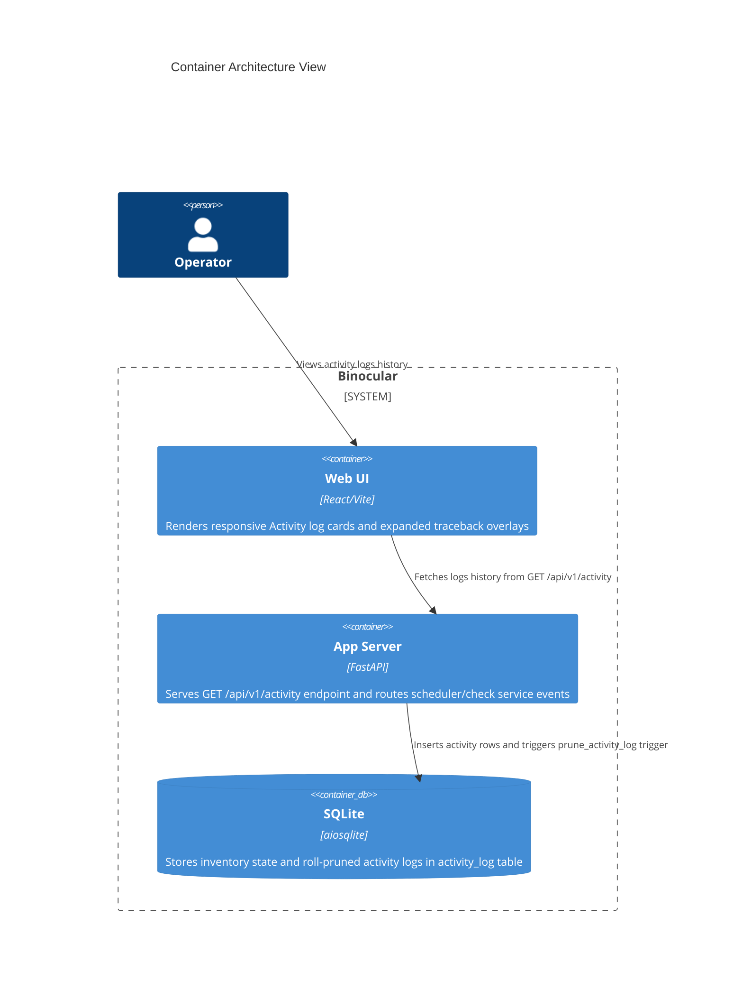

# Implementation Plan: Activity Logging & Visibility

**Branch**: `00018-activity-logging-visibility` | **Date**: 2026-06-01 | **Spec**: [spec.md](spec.md)

## Summary

**Goal**: Record all check activity and alert execution outcomes in a size-bounded, rolling SQLite log, exposing history transparently through a JSON REST API and a beautiful Activity SPA page.  
**Approach**: Apply schema migration `006_activity_log.sql` with an embedded `AFTER INSERT` SQLite pruning trigger, develop repository/router components, hook check/notification dispatch layers, and build the React SPA log viewer with expandable details.  
**Key Constraint**: Retention must be hard-capped at 1,000 records dynamically directly inside the SQLite engine via database trigger to eliminate python processing overhead.

## Technical Context

**Language/Version**: Python 3.13, TypeScript 5.x / React 18  
**Primary Dependencies**: FastAPI, aiosqlite, Pydantic, structlog  
**Storage**: SQLite (`binocular.db`) via `aiosqlite`  
**Testing**: pytest, pytest-asyncio (backend); Vitest (frontend)  
**Target Platform**: Linux Docker container (`python:3.13-slim`)  
**Project Type**: web  
**Project Mode**: brownfield  
**Performance Goals**: <100ms JSON responses, under 1s UI renders, thread-safe parallel database logging.  
**Constraints**: Bounded logs size, decoupled name snapshots, non-blocking check executions.  
**Scale/Scope**: Homelab private LAN, 1 operator, rolling retention pool capped at 1,000 records.

## Instructions Check

*GATE: Must pass before Phase 0 research. Re-check after Phase 1 design.*

| Instruction / Standard | Status | Verification Method |
|------------------------|--------|---------------------|
| Honest Failure Principle | PASS | Capture check stack trace tracebacks and dispatch issues in SQLite activity table. |
| Parameterized SQL | PASS | Repository uses parameterized insertions strictly. |
| Size-Bounded Storage | PASS | Database pruning trigger automatically caps logs size at 1,000 entries. |

## Architecture



## Architecture Decisions

Feature-local tradeoffs only. Project-wide architectural decisions belong in standalone ADRs under `specs/adrs/`.

| ID | Decision | Options Considered | Chosen | Rationale |
|----|----------|--------------------|--------|-----------|
| **AD-001** | Pruning Execution Layer | (A) In-process python cron pruner<br>(B) SQLite `AFTER INSERT` database trigger | **Option B** | Moves pruning execution directly to SQLite, avoiding lockups, double-run overlap issues, or startup dependency gaps. |
| **AD-002** | Log Asset Decoupling | (A) Foreign Keys to devices/modules<br>(B) Plain-text original name snapshotting | **Option B** | Avoids cascade deletions, foreign key reference nullifications, or missing labels when an inventoried device or module is deleted. |

## Data Model Summary

Configuration schemas are persisted inside SQLite as a structured rolling activity history.

| Entity | Key Fields | Relationships | Notes |
|--------|------------|---------------|-------|
| `activity_log` | `id`, `event_type`, `status`, `device_name`, `module_name`, `message`, `traceback`, `created_at` | None | Bounded to 1,000 records via embedded database trigger. |

**Detail**: [data-model.md](data-model.md)

## API Surface Summary

API paths are fully configured under a new `/api/v1/activity` router.

| Method | Path | Purpose | Auth | Req/Res Types |
|--------|------|---------|------|---------------|
| `GET` | `/api/v1/activity` | List rolling activity records with filtering and pagination | Optional Basic | Query parameters -> `list[ActivityLogResponse]` |

**Detail**: [contracts/api.md](contracts/api.md)

## Testing Strategy

All units, routers, and triggers are validated under the standard `pytest` and `vitest` suites.

| Tier | Tool | Scope | Mock Boundary | Install |
|------|------|-------|---------------|---------|
| Unit | `pytest` | Test `ActivityLogRepository` CRUD, check that SQLite pruning trigger truncates table size at 1,000 rows | — | `configured` |
| Integration | `pytest-asyncio` | Verify route queries, query sorting, filtering, and error stack trace capture | — | `configured` |
| Frontend | `vitest` | Verify SPA activity layout, expandable overlays, and query fetch hook triggers | Mock API requests | `configured` |
| Coverage | `pytest-cov` | Verify coverage on newly created and edited backend files meets the 80% project gate | — | `configured` |

## Error Handling Strategy

All activity logging operations are executed inside safe, non-fatal try-except boundaries to isolate logs persistence from the core operations.

| Error Category | Pattern | Response | Retry |
|----------------|---------|----------|-------|
| **Validation Error** | Fail-fast in route payload | `422 Unprocessable Entity` | No |
| **DB Lock Contention** | standard busy wait | `busy_timeout` (5s) connection configuration | No |
| **Traceback Overflow** | String truncation | Truncate stack trace string to max 10KB before insert | No |

## Integration Points

| Spec Reference | System/Service | Technical Approach | Contract |
|----------------|----------------|--------------------|----------|
| **FR-001** | CheckService | Write check start, success, and error outcomes in database repositories | Python in-process hook |
| **FR-002** | NotifierService | Write notification dispatch outcomes in database repositories | Python in-process hook |

## Risk Mitigation

| Risk (from spec) | Likelihood | Impact | Mitigation | Owner |
|-------------------|------------|--------|------------|-------|
| **SQLite Write Locks** | Low | Medium | Enable WAL mode and configure standard 5s database busy timeout. | Developer |
| **Log Volume Disk Exhaustion** | Low | High | Enforce database-level AFTER INSERT rolling pruning trigger capping rows at 1,000. | Architect |

## Requirement Coverage Map

| Req ID | Component(s) | File Path(s) | Notes |
|--------|--------------|--------------|-------|
| **FR-001** | CheckService Hook | `backend/src/binocular/services/checks.py` | Logs manual/scheduled checks status |
| **FR-002** | NotifierService Hook | `backend/src/binocular/services/notifications.py` | Logs SMTP/Gotify notifications outcome |
| **FR-003** | Repositories | `backend/src/binocular/repositories/activity.py` | Stores timestamp, type, status, and traceback |
| **FR-004** | Migration schema | `backend/src/binocular/db/migrations/006_activity_log.sql` | Prunes older logs exceeding 1,000 records |
| **FR-005** | API Router | `backend/src/binocular/routes/activity.py` | GET `/api/v1/activity` in reverse chronological order |
| **FR-006** | API Router | `backend/src/binocular/routes/activity.py` | Supports type/status filtering query options |
| **FR-007** | React Web SPA | `frontend/src/App.tsx` | Dedicated Activity Log page route and tab view |
| **FR-008** | React Web SPA | `frontend/src/App.tsx` | Click-to-expand error traceback card layout |
| **FR-009** | Repositories | `backend/src/binocular/repositories/activity.py` | Saves original plane-text name snapshots |

## Project Structure

### Source Code

```text
  backend/
    src/
      binocular/
        db/
          migrations/
+           006_activity_log.sql
        repositories/
+         activity.py
        routes/
+         activity.py
~         __init__.py
        services/
~         checks.py
~         notifications.py
    tests/
+     test_activity_repository.py
+     test_activity_routes.py
  frontend/
    src/
      api/
+       activity.ts
~       index.ts
~     App.tsx
```

### Brownfield Notes

**Patterns to reuse**: Inherit database connections and base repository patterns from `repositories/base.py`. Use FastAPI dependencies for sqlite session lifecycle hooks. Register the new activity router in `routes/__init__.py`.  
**Tests to extend**: Add `tests/test_activity_repository.py` and `tests/test_activity_routes.py` to backend test suites.  
**Naming conventions**: Casing matches snake_case in backend Python files, camelCase in React frontend SPA files, and database table matching standard lowercase format.

## Implementation Hints

- **[HINT-001] SQLite Pruning Trigger**: Register the `prune_activity_log` trigger inside migration `006_activity_log.sql` to avoid python layer processing dependencies.
- **[HINT-002] Safe Decoupled Persistence**: Insert `device_name` and `module_name` values directly as static plain-text parameters instead of foreign key database mappings.
- **[HINT-003] Traceback Truncation**: Truncate tracebacks to a safe max length of 10KB inside `ActivityLogRepository` to protect filesystem volume space.
- **[HINT-004] Boundary Protection**: Wrap all logging calls inside try-except scopes to ensure activity database failures never break the core version update transitions.
