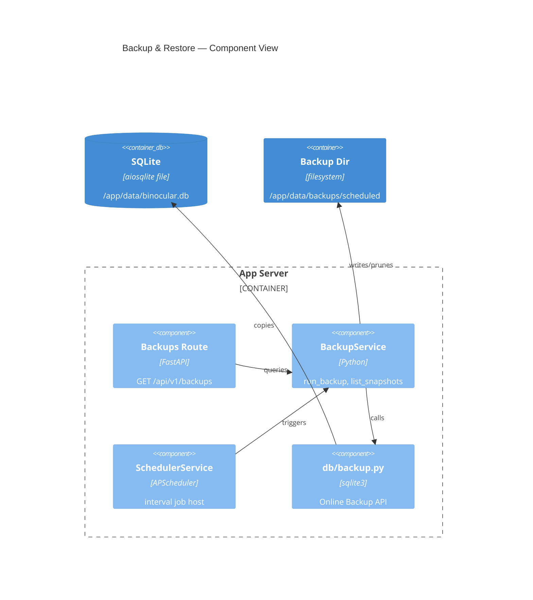

# Implementation Plan: Backup & Restore Operations

**Branch**: `00019-backup-restore-operations` | **Date**: 2026-06-01 | **Spec**: [spec.md](spec.md)

## Summary

**Goal**: Wire a scheduled live-safe SQLite backup job with configurable interval and retention, expose a read-only status API, and ship a restore runbook.
**Approach**: Extend the existing `db/backup.py` utility and `SchedulerService` with a new `BackupService`; add a `/api/v1/backups` route following the established FastAPI pattern.
**Key Constraint**: Backup job must integrate into the existing `AsyncIOScheduler` instance owned by `SchedulerService` without creating a second scheduler.

## Technical Context

**Language/Version**: Python 3.13  
**Primary Dependencies**: APScheduler (AsyncIOScheduler), aiosqlite, structlog, FastAPI, Pydantic  
**Storage**: SQLite via `db/backup.py` (Online Backup API — `sqlite3.Connection.backup()`)  
**Testing**: pytest + pytest-asyncio (configured)  
**Target Platform**: Linux Docker container, python:3.13-slim, non-root  
**Project Type**: web  
**Project Mode**: brownfield  
**Performance Goals**: Backup job runs async via `asyncio.to_thread`; non-blocking  
**Constraints**: Must not lock or stop the database during backup; backup dir within existing `/app/data` volume; no new volume required  
**Scale/Scope**: Single instance, single database file; homelab scale

## Instructions Check

| Principle | Status | Notes |
|-----------|--------|-------|
| I. Honest Failure | PASS | OR-003: every backup outcome logged; failures leave existing snapshots intact |
| II. Polite by Default | N/A | No scraping involved |
| III. Data Ownership | PASS | Backup stays in single SQLite volume; no external dependency |
| IV. Least-Privilege | PASS | Non-root container; no new privileges; docs note trust boundary |
| V. Type Safety | PASS | `mypy --strict` enforced; all new code typed |
| VI. Set-and-forget | PASS | Zero-config defaults (24h, 7 snapshots); job survives restart via `replace_existing=True` |
| VII. Agent Output Style | PASS | No violations |

## Architecture



## Architecture Decisions

| ID | Decision | Options Considered | Chosen | Rationale |
|----|----------|--------------------|--------|-----------|
| AD-001 | Where to register backup job | New scheduler instance / Add to SchedulerService | Add to existing SchedulerService via `add_backup_job()` | Single scheduler avoids double-start and threading conflicts; consistent with APScheduler's single-instance pattern |
| AD-002 | Backup subdirectory | Same dir as pre-migration snapshots / Separate `scheduled/` subdir | `scheduled/` subdir inside `resolved_backup_dir` | Prevents retention pruner from deleting pre-migration snapshots (different path, no glob collision) |
| AD-003 | Retention pruning target | Glob `binocular-*.db` in root / Glob `binocular-*.db` in `scheduled/` | `binocular-*.db` in `scheduled/` | Scoped glob is safe and avoids any collision with pre-migration snapshot filenames |
| AD-004 | Config field `backup_schedule_hours` default | 0 (opt-in) / 24 (opt-out) | 24 (opt-out, enabled by default) | DOD says "nightly backup job"; feature exists specifically to deliver that promise; operator disables by setting to 0 |

## Data Model Summary

N/A — no persistent data (backup status derived from filesystem; no new DB tables or entities)

## API Surface Summary

| Method | Path | Purpose | Auth | Req/Res Types |
|--------|------|---------|------|---------------|
| GET | /api/v1/backups | Backup configuration + snapshot inventory | None (optional basic-auth middleware) | `BackupStatusResponse` |

**Detail**: [contracts/backups-api.md](contracts/backups-api.md)

## Testing Strategy

| Tier | Tool | Scope | Mock Boundary | Install |
|------|------|-------|---------------|---------|
| Unit | pytest + pytest-asyncio | `BackupService.run_backup()`, `list_snapshots()`, retention pruning, job registration | `db/backup.py.create_backup_snapshot` mocked; real tmp dir for filesystem ops | configured |
| Integration | pytest + httpx.AsyncClient | `GET /api/v1/backups` route | Real `BackupService` with tmp backup dir | configured |
| Security | Ruff + mypy --strict | Static analysis; no network calls | — | configured |
| Coverage | pytest-cov | 80% target across new modules | — | configured |

## Error Handling Strategy

| Error Category | Pattern | Response | Retry |
|----------------|---------|----------|-------|
| Backup job failure (disk full, permission error) | Fail-fast, log structured error | structlog `backup_failed` event; existing snapshots untouched | No — retry on next scheduled interval |
| Backup dir unreadable (GET /api/v1/backups) | Fail-fast | HTTP 500 + `{"detail": "backup directory unavailable"}` | No |
| Retention prune failure | Log warning, continue | structlog `backup_prune_failed` warning; backup still recorded | No |

## Integration Points

| Spec Reference | System/Service | Technical Approach | Contract |
|----------------|----------------|--------------------|----------|
| IP-001 | `db/backup.py::create_backup_snapshot` (E004) | Direct async call; passes `source_path` and `scheduled/` subdir | Returns `Path` to new snapshot |
| IP-002 | `SchedulerService` (E011) | New `add_backup_job(backup_svc, hours)` method on `SchedulerService`; called from `app.py` lifespan after scheduler start | In-process APScheduler job |
| IP-003 | `Settings` config (E001/E013) | Read `backup_schedule_hours`, `backup_retention_count`, `resolved_backup_dir` | Existing `Settings` model (2 new fields) |
| IP-004 | `/api/v1` router (`routes/__init__.py`) | Register `backups_router` alongside existing routers | Follows established route-registration pattern |

## Risk Mitigation

| Risk (from spec) | Likelihood | Impact | Mitigation | Owner |
|-------------------|------------|--------|------------|-------|
| Pre-migration snapshot collision | M | H | Use `scheduled/` subdir for job snapshots; retention glob scoped to that subdir only | `BackupService` |
| Disk exhaustion from high retention | L | M | Default retention=7; log `backup_dir` size on each run at DEBUG level | `BackupService` |
| APScheduler job duplication on restart | L | L | `replace_existing=True` + stable job ID `'binocular_backup'` | `SchedulerService.add_backup_job()` |

## Requirement Coverage Map

| Req ID | Component(s) | File Path(s) | Notes |
|--------|--------------|--------------|-------|
| OR-001 | BackupService | `backend/src/binocular/services/backup.py` | `run_backup()` calls `create_backup_snapshot` from `db/backup.py` |
| OR-002 | BackupService | `backend/src/binocular/services/backup.py` | `_prune_old_snapshots()` keeps most-recent N files in `scheduled/` subdir |
| OR-003 | BackupService | `backend/src/binocular/services/backup.py` | structlog events: `backup_started`, `backup_succeeded`, `backup_failed` |
| OR-004 | Backups route | `backend/src/binocular/routes/backups.py` | `GET /api/v1/backups` → `BackupStatusResponse` |
| OR-005 | Settings | `backend/src/binocular/config.py` | `backup_schedule_hours: int = 24`, `backup_retention_count: int = 7` |
| OR-006 | Settings + BackupService | `backend/src/binocular/config.py`, `services/backup.py` | Defaults 24h / 7 snapshots |
| OR-007 | App lifespan + SchedulerService | `backend/src/binocular/app.py`, `services/scheduler.py` | Guard: `if settings.backup_schedule_hours > 0` before `add_backup_job()` |
| OR-008 | BackupService | `backend/src/binocular/services/backup.py` | Prune only `scheduled/` subdir; pre-migration snapshots are in parent dir |
| RR-001 | Restore runbook | `docs/restore.md` | Step-by-step: stop → replace DB → rm WAL/SHM → start → verify |
| RR-002 | Restore runbook | `docs/restore.md` | Rollback-after-migration section referencing pre-migration snapshot |

## Project Structure

### Source Code

```text
backend/
  src/binocular/
    ~ config.py                          (add backup_schedule_hours, backup_retention_count)
    ~ app.py                             (wire BackupService + add_backup_job in lifespan)
    + services/
      + backup.py                        (BackupService: run_backup, list_snapshots, _prune)
    ~ services/
      ~ scheduler.py                     (add add_backup_job() method)
    ~ routes/
      + backups.py                       (GET /api/v1/backups)
      ~ __init__.py                      (register backups_router)
  tests/
    + test_backup_service.py             (unit: run_backup, prune, list_snapshots)
    + test_backups_routes.py             (integration: GET /api/v1/backups)
    ~ test_scheduler_service.py          (extend: add_backup_job test)
    ~ test_config.py                     (extend: new settings fields)
docs/
  + restore.md                           (restore runbook + rollback-after-migration)
```

**Brownfield Notes**:
- **Patterns to reuse**: Route pattern from `routes/activity.py` (APIRouter, Pydantic response with `Field(alias=...)`, `populate_by_name=True`); service pattern from `services/scheduler.py`; structlog event naming (`event_snake_case`).
- **Tests to extend**: `test_scheduler_service.py` (add `add_backup_job` test); `test_config.py` (new fields).
- **Naming conventions**: `snake_case` for Python; camelCase aliases in Pydantic response models; `test_<module>.py` for test files.

## Implementation Hints

- **[HINT-001]** Order: Wire `BackupService` and call `scheduler.add_backup_job()` in `app.py` lifespan **after** `SchedulerService.start()` — the scheduler must be running before jobs are added.
- **[HINT-002]** Gotcha: `create_backup_snapshot` uses `asyncio.to_thread(sqlite3.connect(...).backup(...))` — ensure the backup service is awaited, not called synchronously from the APScheduler job (the job is async, so `await svc.run_backup()` works correctly with `AsyncIOScheduler`).
- **[HINT-003]** Constraint: The `scheduled/` subdirectory path is `settings.resolved_backup_dir / "scheduled"` — do not use `resolved_backup_dir` directly to avoid overlapping with pre-migration snapshots.
- **[HINT-004]** Gotcha: `SchedulerService` creates its own `AsyncIOScheduler` instance. `add_backup_job()` must be a method on `SchedulerService` so it can call `self._scheduler.add_job(...)` on the same instance, not create a new scheduler.
- **[HINT-005]** Compatibility: `backup_schedule_hours` defaults to 24 (enabled). Operators opt out by setting `BINOCULAR_BACKUP_SCHEDULE_HOURS=0`. Document this in `.env.example` and `docs/restore.md`.
