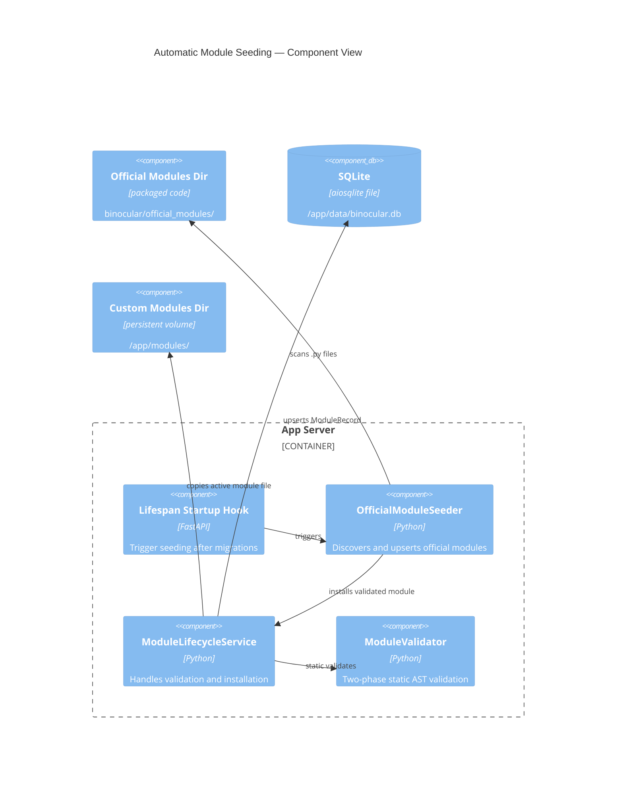

# Implementation Plan: Automatic Module Seeding

**Branch**: `main` | **Date**: 2026-06-01 | **Spec**: [spec.md](spec.md)

## Summary

**Goal**: Automatically discover, validate, and seed/register the packaged official starter modules (Sony Alpha and Panasonic Lumix) into the database and user modules directory on application startup.
**Approach**: Add a seeding manager/service that runs during the FastAPI `lifespan` startup hook (immediately after migrations apply). It discovers bundled `.py` files in `binocular/official_modules/`, validates them using the lightweight static validation engine, and uses the `ModuleLifecycleService` helpers to copy them to the user `/app/modules/` directory and insert/update database records.
**Key Constraint**: The seeding process must be fully idempotent, offline-capable (static validation only, no network calls), and completely isolated so a corrupted module does not block application startup.

## Technical Context

**Language/Version**: Python 3.13  
**Primary Dependencies**: FastAPI, aiosqlite, structlog  
**Storage**: SQLite via `ModuleRepository` raw parameterized SQL (existing `modules` table)  
**Testing**: pytest + pytest-asyncio  
**Target Platform**: Linux Docker container, python:3.13-slim, non-root  
**Project Type**: web / backend  
**Project Mode**: brownfield  
**Performance Goals**: Minimal startup overhead; idempotent execution skips file and DB writes  
**Constraints**: Fully local/offline; individual failure isolation; no database migrations allowed  
**Scale/Scope**: Two bundled modules (`sony_alpha.py` and `panasonic_lumix.py`) seeded on startup

## Instructions Check

| Principle | Status | Notes |
|-----------|--------|-------|
| I. Honest Failure | PASS | Any validation or seeding failure is logged visibly via structured stdout logs without silent omission. |
| II. Polite by Default | PASS | No scraping or outbound calls occur during startup seeding (static validation only). |
| III. Data Ownership | PASS | All state resides in the self-contained SQLite database; no telemetry or external registries. |
| IV. Least-Privilege | PASS | Seeding executes within the non-root container permissions; trust boundaries are explicitly respected. |
| V. Type Safety | PASS | Backend code fully typed and validated using standard type analysis. |
| VI. Set-and-forget | PASS | Delivers the zero-config startup promise by automatically providing official starter modules. |
| VII. Agent Output Style | PASS | Outcome-oriented, terse, and precise documentation. |

## Architecture



## Architecture Decisions

| ID | Decision | Options Considered | Chosen | Rationale |
|----|----------|--------------------|--------|-----------|
| AD-001 | Lifespan orchestration placement | Run seeding during connection open / Run in lifespan after migrations | Run in lifespan after migrations | Guarantees the database schema (`modules` table) exists before upserts, while remaining pre-scheduler to avoid check collisions. |
| AD-002 | Validation phase on startup | Full static + runtime check / Static validation only | Static validation only | Keeps startup fast and offline-capable; runtime validation is unnecessary for pre-bundled verified code. |
| AD-003 | Idempotency verification | Always write and overwrite / Compare hash + version | Compare hash + version | Avoids unnecessary SQLite disk write load and filesystem writes on slow homelab environments. |
| AD-004 | Upgrades handling | Always overwrite user modifications / Upgrades check | Overwrite if bundled version is higher, or if hash differs and registered version is not higher | Clean upgrade path when image is updated, but prevents blindly reverting custom operator changes if version is identical/higher. |

## Data Model Summary

N/A — uses the existing `modules` table structure created by migration `003_modules.sql`:
- `module_id` (PK, string)
- `display_name` (string)
- `source_path` (string)
- `source_hash` (string)
- `author` (string, nullable)
- `version` (string, nullable)
- `status` (string, e.g. "active")
- `validation_status` (string, e.g. "valid")
- `validation_summary_json` (string)

## API Surface Summary

N/A — pure backend startup lifecycle logic; no new API routes or HTTP endpoints.

## Testing Strategy

| Tier | Tool | Scope | Mock Boundary | Install |
|------|------|-------|---------------|---------|
| Unit | pytest | Seeding logic, static validation, file copy, hash checks, idempotency, upgrade checks | Mock SQLite connection, custom temp directories for `/app/modules/` | configured |
| Integration | pytest + pytest-asyncio | Lifespan integration, startup end-to-end seeding, corruption isolation | Real SQLite connection using memory/temp DB, packaged official module directory | configured |
| Security | Ruff + mypy --strict | Static analysis and type safety gates | — | configured |
| Coverage | pytest-cov | 80% coverage on the new seeding manager | — | configured |

## Error Handling Strategy

| Error Category | Pattern | Response | Retry |
|----------------|---------|----------|-------|
| Individual module syntax compile error | Catch exception in seeder boundary, log warning | structlog structured warning; continue seeding other modules | No |
| SQLite connection locked or database write error | Transaction rollback, log warning | Transaction rolled back; startup proceeds (zero-config fault isolation) | No |
| Custom modules directory not writable | Catch OSError, log warning | Log write failure; startup continues without module file write | No |

## Integration Points

| Spec Reference | System/Service | Technical Approach | Contract |
|----------------|----------------|--------------------|----------|
| IP-001 | FastAPI lifespan (`app.py`) | Lifespan startup scans, validates, and seeds official modules after migrations | Seeding complete before request serving starts |
| IP-002 | `ModuleLifecycleService` (`services/modules.py`) | Reuse `install_validated_module` logic (with AST validation) | Transactional installation and file persistence |
| IP-003 | Packaged `official_modules` | Import packaged path dynamically via `importlib.resources` or relative module `__file__` | Location of official modules |

## Risk Mitigation

| Risk (from spec) | Likelihood | Impact | Mitigation | Owner |
|-------------------|------------|--------|------------|-------|
| Seeding failure blocks startup | L | H | Encase seeding block in per-module `try...except Exception` blocks to prevent startup failure. | `OfficialModuleSeeder` |
| Overwriting operator modifications | M | M | Skip seeding if registered module version is higher or matches exactly. | `OfficialModuleSeeder` |
| SQLite locking during parallel startups | L | L | Seeding runs before the background APScheduler is initialized and before requests are served. | `lifespan` hook |

## Requirement Coverage Map

| Req ID | Component(s) | File Path(s) | Notes |
|--------|--------------|--------------|-------|
| TR-001 | Seeder discovery | `backend/src/binocular/services/seeder.py` | Discovers files dynamically |
| TR-002 | Seeder validation | `backend/src/binocular/services/seeder.py` | AST/static compile checks |
| TR-003 | Seeder validation | `backend/src/binocular/services/seeder.py` | No runtime proof execution |
| TR-004 | Seeder copy | `backend/src/binocular/services/seeder.py` | Copies to persistent `/app/modules/` |
| TR-005 | Seeder DB record | `backend/src/binocular/services/seeder.py` | SQLite upsert as `active`/`valid` |
| TR-006 | Idempotency | `backend/src/binocular/services/seeder.py` | Skips if version/hash matches |
| TR-007 | Upgrade policy | `backend/src/binocular/services/seeder.py` | Overwrites older version/hash |
| TR-008 | Fault isolation | `backend/src/binocular/services/seeder.py` | Catch/isolate exceptions per module |
| TR-009 | Transaction | `backend/src/binocular/services/seeder.py` | Commits on success, rolls back on failure |

## Project Structure

### Source Code

```text
backend/
  src/binocular/
    ~ app.py                             (trigger seeder in lifespan startup after migrations)
    + services/
      + seeder.py                        (OfficialModuleSeeder: discover_and_seed)
  tests/
    + test_seeder.py                     (unit/integration tests for OfficialModuleSeeder)
```

**Brownfield Notes**:
- **Patterns to reuse**: Life-cycle dependencies injection pattern from `routes/modules.py` (instantiating validation and repository helper tools); logging patterns (`structlog`).
- **Files to modify**: `backend/src/binocular/app.py` (import and invoke seeder in lifespan).
- **Files to create**: `backend/src/binocular/services/seeder.py` and `backend/tests/test_seeder.py`.

## Implementation Hints

- **[HINT-001]** Lifespan trigger: Seeding must execute **after** `runner.apply_pending()` inside `app.py`.
- **[HINT-002]** Packaged module location: Resolve the bundled path via `import binocular.official_modules as official_modules` and `Path(official_modules.__file__).parent`.
- **[HINT-003]** Static-only check: Call `validator.validate(staged_path, proof_input=None, scrape_client=None)` which skips runtime execution.
- **[HINT-004]** File staging: Create temporary staging files under the custom modules directory to perform static validation before committing them, exactly like `upload_module` route.
