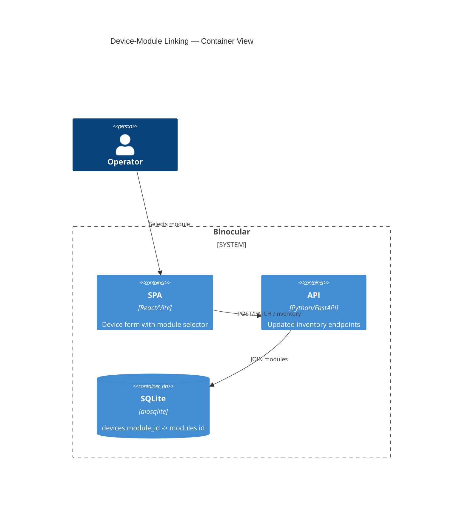

# Implementation Plan: Device-Module Linking & Refactor

**Branch**: `00022-device-module-linking-refactor` | **Date**: 2026-06-04 | **Spec**: [spec.md](spec.md)

## Summary

**Goal**: Replace the standalone device type field with a module selector on device forms, derive device type from the linked module, and remove the DeviceType entity entirely.  
**Approach**: Database migration to swap FK columns, repository query rewrites to JOIN modules instead of device_types, frontend form change to module selector dropdown, and clean removal of deprecated service/repository methods.  
**Key Constraint**: Migration must be forward-only and safe — existing devices must be best-effort matched to modules or marked as unlinked.

## Technical Context

**Language/Version**: Python 3.13+ (backend), TypeScript 5.x / React 18 (frontend)  
**Primary Dependencies**: FastAPI, aiosqlite, Pydantic, structlog (backend); React, Vite, Tailwind CSS, React Hook Form (frontend)  
**Storage**: SQLite single file via aiosqlite, raw SQL, numbered migrations  
**Testing**: pytest + pytest-asyncio (backend); Vitest + React Testing Library (frontend)  
**Target Platform**: Linux Docker container (single port 8000)  
**Project Type**: web  
**Project Mode**: brownfield  
**Performance Goals**: Responsive UI on mobile/desktop; no blocking during module list fetch  
**Constraints**: Non-root container, zero-config, single-volume persistence, forward-only idempotent migrations, parameterized SQL only  
**Scale/Scope**: Single user, single instance, ~5-50 devices, ~2-10 installed modules

## Instructions Check

*GATE: Must pass before Phase 0 research. Re-check after Phase 1 design.*

| Gate | Status | Notes |
|------|--------|-------|
| `project-instructions.md` exists | PASS | Readable at repo root |
| Principle I (Honest Failure) | PASS | Unlinked devices surfaced; module deletion handled gracefully |
| Principle III (Data Ownership) | PASS | All state in single SQLite file; no external dependencies |
| Principle V (Type Safety) | PASS | mypy strict (backend), tsc strict (frontend); Pydantic models updated |
| Principle VI (Set-and-Forget) | PASS | Pre-migration backup; forward-only migration; restart-safe |

## Architecture



## Architecture Decisions

| ID | Decision | Chosen | Rationale |
|----|----------|--------|-----------|
| AD-001 | FK target: modules.id (int) vs modules.module_id (str) | modules.id (int PK) | Standard SQLite; existing pattern; avoids cascading string changes |
| AD-002 | Schedules migration: migrate FK vs drop rows | Drop rows, reconfigure | Schedules are lightweight; FK migration adds complexity for little value |
| AD-003 | module_id: NULLABLE vs NOT NULL | NULLABLE, app-enforced | SQLite can't add NOT NULL in ALTER TABLE; allows graceful unlinked device handling |
| AD-004 | Device type display: materialized vs JOIN-derived | JOIN-derived | No sync issues; single source of truth; trivial at 50-device scale |
| AD-005 | DeviceType removal: same migration vs deferred | Same migration, staged | Enables backfill to reference device_types; atomic; research-backed |

## Data Model Summary

| Entity | Key Fields | Relationships | Notes |
|--------|------------|---------------|-------|
| devices | `id`, `module_id` (NEW FK→modules.id, NULLABLE), `name`, `model`, `current_version`, `latest_version`, `last_checked_at`, `last_success_at`, `last_check_status`, `is_archived`, `created_at`, `updated_at` | `module_id → modules.id` | `module_id` NULL allowed (unlinked devices); app-layer enforces NOT NULL on creation; `device_type_id` column dropped |
| modules | `id`, `module_id`, `display_name`, `status`, `validation_status`, … | Referenced by devices via `module_id` | UNCHANGED; `display_name` provides derived device type |
| device_types | DROPPED | — | Removed entirely; `normalized_name` dedup logic retired |
| device_type_schedules | Rows cleared | — | Existing rows dropped; operator reconfigures per-module schedules post-migration |

**Detail**: [data-model.md](data-model.md)

## API Surface Summary

| Method | Path | Purpose | Auth | Req/Res Types |
|--------|------|---------|------|---------------|
| GET | `/api/v1/inventory` | List inventory grouped by module type | None (trusted LAN) | `DeviceGroupResponse[]` (id=module string, name=display_name) |
| POST | `/api/v1/inventory` | Create device with module link | None | `DevicePayload {moduleId: string, ...}` → `DeviceResponse` |
| PATCH | `/api/v1/inventory/{device_id}` | Update device (incl. reassign module) | None | `DevicePayload` → `DeviceResponse` |
| DELETE | `/api/v1/inventory/{device_id}` | Archive device | None | `{success, message}` |
| POST | `/api/v1/inventory/{device_id}/confirm-update` | Confirm firmware update | None | `{version}` → `DeviceResponse` |

**Breaking changes**: `DevicePayload.deviceType` → `moduleId`; `DeviceResponse.deviceTypeId` → `moduleId`; `DeviceGroupResponse.id` changes from number to string.

**Detail**: [contracts/](contracts/)

## Testing Strategy

| Tier | Tool | Scope | Mock Boundary |
|------|------|-------|---------------|
| Unit | pytest + pytest-asyncio | Repository queries, service methods, Pydantic validation | DB via aiosqlite in-memory |
| Integration | pytest + httpx.AsyncClient | Migration on test DB, API endpoints with new payloads | Test SQLite DB |
| Frontend | Vitest + React Testing Library | Form state, module selector rendering, API types | API client mocked |
| Coverage | pytest-cov | ≥80% backend | — |

## Error Handling Strategy

| Error Category | Pattern | Response |
|----------------|---------|----------|
| Missing moduleId | Fail-fast validation | 400 + error detail |
| Invalid module | Fail-fast lookup | 400 + "not found or not valid" |
| No valid modules exist | UI guidance | Selector disabled + helper text |
| Module deleted (orphaned FK) | Graceful degradation | Unlinked badge, moduleId=null |
| Migration backfill partial | Graceful degradation | Unlinked devices with NULL |
| Module name change | Auto-propagate JOIN | Updated device_type on next read |

## Integration Points

| From | Target | Approach | Contract |
|------|--------|----------|----------|
| E006 | Module validation | Query `validation_status='valid'` for selector | Existing schema |
| E008 | Module listing | `listModules()` API for dropdown | [contracts/inventory-api.md](contracts/inventory-api.md) |
| E004 | Migration runner | `007_module_linking.sql` via `apply_pending()` | Existing infrastructure |
| E009 | Device module_id | Replaces `_resolve_module()` placeholder | Existing CheckResult |

## Risk Mitigation

| Risk | L/I | Mitigation | Owner |
|------|-----|------------|-------|
| Devices not auto-matched during migration | M/L | Unlinked badge + reassign UI; pre-migration backup | Inventory Service |
| Module deletion breaks device links | L/M | SET module_id=NULL before DELETE | Module Service |
| Schedule FK conflicts | L/H | Drop rows; operator reconfigures | Scheduler |

## Requirement Coverage Map

| Req ID | Component(s) | File Path(s) | Notes |
|--------|--------------|--------------|-------|
| FR-001 | InventoryForm, routes | `frontend/src/App.tsx`, `backend/src/binocular/routes/inventory.py` | Module selector replaces text input |
| FR-002 | DeviceRecord, DeviceCard | `backend/src/binocular/repositories/inventory.py`, `frontend/src/App.tsx` | JOIN modules.display_name; read-only |
| FR-003 | Migration runner | `backend/src/binocular/db/migrations/007_module_linking.sql` | Add FK, backfill, drop old cols |
| FR-004 | InventoryService.list_groups | `backend/src/binocular/services/inventory.py` | Group by module display_name |
| FR-005 | Repo, Service, Routes | `inventory.py` (repo/service/routes) | Remove DeviceType methods |
| FR-006 | InventoryForm edit, routes | `frontend/src/App.tsx`, `backend/.../routes/inventory.py` | PATCH accepts moduleId |
| FR-007 | InventoryForm, routes | `frontend/src/App.tsx`, `backend/.../routes/inventory.py` | Disable selector; 400 on invalid |
| FR-008 | ModuleLifecycleService | `backend/.../services/modules.py`, `backend/.../repositories/inventory.py` | SET module_id=NULL before DELETE |

## Project Structure

### Source Code

```text
~ backend/src/binocular/db/migrations/
+   backend/src/binocular/db/migrations/007_module_linking.sql
~   backend/src/binocular/db/migrations.py
~ backend/src/binocular/repositories/inventory.py
~ backend/src/binocular/services/inventory.py
~ backend/src/binocular/routes/inventory.py
~ backend/src/binocular/services/scheduler.py
~ backend/src/binocular/services/modules.py
~ frontend/src/api/inventory.ts
~ frontend/src/App.tsx
```

**Patterns to reuse**: 
- `InventoryRepository._record_from_row()` pattern for row→dataclass mapping
- Existing `InventoryInput` / `InventorySelect` component pattern in App.tsx (use for module dropdown)
- Migration runner `apply_pending()` with backup snapshot
- Pydantic `Field(alias=...)` pattern for camelCase frontend compatibility

**Tests to extend**: 
- `backend/tests/test_inventory.py` — add module-linked create/update tests
- `backend/tests/test_migrations.py` — add 007 migration test
- `frontend/src/App.test.tsx` — add module selector rendering tests

**Naming conventions**: 
- Python: snake_case dataclass fields, Pydantic models with camelCase aliases
- TypeScript: camelCase interface fields, PascalCase component names
- SQL: lowercase table/column names, migrations numbered `NNN_description.sql`

## Implementation Hints

- **[HINT-001]** Migration order: add FK → backfill → drop old column all in one migration (atomic via `BEGIN IMMEDIATE`). Drop `device_types` only after backfill completes within same migration.
- **[HINT-002]** App-layer NOT NULL: validate `module_id` is provided and module exists with `status='installed'` AND `validation_status='valid'` before device INSERT.
- **[HINT-003]** Removal cascade: repo → service → routes → frontend types, in order to avoid compile errors mid-refactor.
- **[HINT-004]** Use `LEFT JOIN modules` + `COALESCE(m.display_name, 'Unlinked')` to include unlinked devices in inventory queries.
- **[HINT-005]** Module deletion: call `unlink_devices_for_module()` before `DELETE FROM modules` to prevent FK violations.
