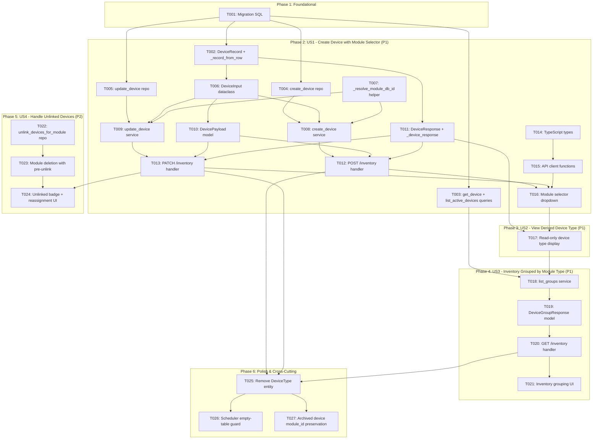

# Tasks: Device-Module Linking & Refactor

**Epic**: E022 | **Spec**: [spec.md](spec.md) | **Plan**: [plan.md](plan.md)
**Generated**: 2026-06-04

## Dependencies

---

## Phase 1: Foundational (Database Migration)

- [X] T001 [P] [US1,US4] {FR-003,FR-009,FR-010,FR-011} [COMPLETES FR-003][COMPLETES FR-009][COMPLETES FR-010][COMPLETES FR-011] Create migration `007_module_linking.sql` at `backend/src/binocular/db/migrations/007_module_linking.sql` with: `PRAGMA foreign_keys = ON`, `ALTER TABLE devices ADD COLUMN module_id INTEGER REFERENCES modules(id) DEFAULT NULL`, best-effort case-insensitive backfill (`UPDATE devices SET module_id = (SELECT m.id FROM modules m JOIN device_types dt ON dt.id = devices.device_type_id WHERE lower(m.display_name) = lower(dt.name) LIMIT 1)`), `ALTER TABLE devices DROP COLUMN device_type_id`, `DROP INDEX IF EXISTS idx_devices_active_type_name`, `CREATE INDEX idx_devices_active_module_name ON devices (is_archived, module_id, name COLLATE NOCASE)`, `DELETE FROM device_type_schedules`, `DROP TABLE IF EXISTS device_types`. Existing `MigrationRunner.apply_pending()` creates a pre-migration backup snapshot automatically (FR-009). Naming convention and `schema_version` tracking enforce forward-only idempotency (FR-010). `PRAGMA foreign_keys = ON` is also already set at runtime by `ConnectionManager.open()` (FR-011).

---

## Phase 2: US1 — Create Device with Module Selector (P1)

### Backend → Repository (`backend/src/binocular/repositories/inventory.py`)

- [X] T002 [P] [US1] {FR-002} Update `DeviceRecord` dataclass: rename `device_type_id: int` to `module_id: int | None`; keep `device_type: str` (now derived from `modules.display_name`); update `_record_from_row()` to use `"module_id"` key instead of `"device_type_id"` in `backend/src/binocular/repositories/inventory.py`

- [X] T003 [P] [US1] {FR-002,FR-004} Rewrite `get_device(device_id)` and `list_active_devices()` SQL queries: replace `JOIN device_types dt ON dt.id = d.device_type_id` with `LEFT JOIN modules m ON m.id = d.module_id`, replace `dt.name AS device_type` with `COALESCE(m.display_name, 'Unlinked') AS device_type`, replace `d.device_type_id` with `d.module_id` in SELECT, update `ORDER BY` in `list_active_devices` to `COALESCE(m.display_name, 'ZZZ_Unlinked') COLLATE NOCASE, d.name COLLATE NOCASE, d.id` in `backend/src/binocular/repositories/inventory.py`

- [X] T004 [US1] {FR-001} Update `create_device()` method: rename parameter `device_type_id: int` to `module_id: int`; update INSERT SQL from `device_type_id` to `module_id` column in `backend/src/binocular/repositories/inventory.py` [after:T003]

- [X] T005 [US1] {FR-001,FR-006} Update `update_device()` method: rename parameter `device_type_id: int` to `module_id: int`; update UPDATE SET clause from `device_type_id = ?` to `module_id = ?` in `backend/src/binocular/repositories/inventory.py` [after:T003]

### Backend → Service (`backend/src/binocular/services/inventory.py`)

- [X] T006 [US1] {FR-001} Update `DeviceInput` dataclass: replace `device_type: str` field with `module_id: str` (the `modules.module_id` string; service resolves to integer FK) in `backend/src/binocular/services/inventory.py` [after:T002]

- [X] T007 [US1] {FR-001,FR-012} [COMPLETES FR-012] Add `_resolve_module_db_id(module_id_str: str) -> int` helper method to `InventoryService`: look up `modules.id` and `modules.module_id` (the string) from `modules` table where `module_id = ?`; raise `ValueError("module_not_found")` if not found; validate `status = 'installed' AND validation_status = 'valid'`, raise `ValueError("module_not_valid")` otherwise; return integer `modules.id` FK in `backend/src/binocular/services/inventory.py`

- [X] T008 [US1] {FR-001,FR-007,FR-012} Update `create_device(payload: DeviceInput) -> DeviceRecord`: validate `payload.module_id` is non-empty (raise `"module_id_required"` if missing); call `_resolve_module_db_id(payload.module_id)` to resolve and validate; pass resolved integer FK to `repository.create_device(module_id=...)`; commit and return record in `backend/src/binocular/services/inventory.py` [after:T004,T007]

- [X] T009 [US1] {FR-001,FR-006} Update `update_device(device_id: int, payload: DeviceInput) -> DeviceRecord`: resolve and validate `payload.module_id` via `_resolve_module_db_id()`; pass resolved integer FK to `repository.update_device(module_id=...)` in `backend/src/binocular/services/inventory.py` [after:T005,T007]

### Backend → Routes (`backend/src/binocular/routes/inventory.py`)

- [X] T010 [US1] {FR-001} Update `DevicePayload` Pydantic model: replace `device_type: str = Field(alias="deviceType", min_length=1)` with `module_id: str = Field(alias="moduleId", min_length=1)`; update `to_input()` to map `self.module_id` instead of `self.device_type`; update `@field_validator` list to include `"module_id"` in `backend/src/binocular/routes/inventory.py` [after:T006]

- [X] T011 [US1] {FR-002} [COMPLETES FR-002] Update `DeviceResponse` Pydantic model: replace `device_type_id: int = Field(alias="deviceTypeId")` with `module_id: str | None = Field(alias="moduleId")`; update `_device_response(record)` helper to map `record.module_id` (convert `int | None` to `str | None` using module string lookup; `None` → `None` for unlinked) and `record.device_type` to `deviceType` in `backend/src/binocular/routes/inventory.py` [after:T002]

- [X] T012 [US1] {FR-001,FR-007,FR-012} Update `POST /api/v1/inventory` handler: accept updated `DevicePayload`; call `service.create_device(payload.to_input())`; catch `ValueError` for `module_id_required`, `module_not_found`, `module_not_valid` and return 400 with `{"code": ..., "detail": ...}` per contract §2.2 in `backend/src/binocular/routes/inventory.py` [after:T008,T010,T011]

- [X] T013 [US1] {FR-001,FR-006} [COMPLETES FR-006] Update `PATCH /api/v1/inventory/{device_id}` handler: accept updated `DevicePayload`; call `service.update_device(device_id, payload.to_input())`; catch `ValueError` for module errors (400) and return 404 if device not found; allow reassignment to a different module in `backend/src/binocular/routes/inventory.py` [after:T009,T010,T011]

### Frontend (`frontend/src/api/inventory.ts` + `frontend/src/App.tsx`)

- [X] T014 [P] [US1] {FR-001,FR-002} Update TypeScript types in `frontend/src/api/inventory.ts`: change `DeviceInput.deviceType: string` to `moduleId: string`; change `InventoryDevice.deviceTypeId: number` to `moduleId: string | null`; change `DeviceGroup.id: number` to `moduleId: string | null`; retain `deviceType: string` field (now always derived); add `ConfirmUpdateInput` type with `version: string`

- [X] T015 [US1] {FR-001} Update API client functions in `frontend/src/api/inventory.ts`: `createDevice()` and `updateDevice()` send `moduleId` in request body instead of `deviceType`; `confirmUpdate()` sends `{ version }` request body per contract §2.5 in `frontend/src/api/inventory.ts` [after:T014]

- [X] T016 [US1] {FR-001,FR-007} [COMPLETES FR-001][COMPLETES FR-007] Replace free-text device type input with module selector dropdown on create and edit forms in `frontend/src/App.tsx`: fetch valid installed modules (`status='installed'`, `validation_status='valid'`) from `GET /api/v1/modules`; render an `InventorySelect` dropdown with module `display_name` as label and `module_id` as value; show "Select a module..." placeholder; disable dropdown and submit button with guidance text when no valid modules exist; submit `moduleId` instead of `deviceType` in form payload [after:T015]

---

## Phase 3: US2 — View Derived Device Type (P1)

- [X] T017 [US2] {FR-002} Ensure device type displays as read-only label throughout the UI: in inventory device cards, the `deviceType` field renders as a non-editable label (derived from `modules.display_name` via API); on the edit form, show the current derived device type as a read-only label adjacent to the module selector dropdown (which allows changing the link); device detail views display `deviceType` from `DeviceResponse` without inline edit controls in `frontend/src/App.tsx` [after:T016]

---

## Phase 4: US3 — Inventory Grouped by Module Type (P1)

### Backend (`backend/src/binocular/services/inventory.py` + `backend/src/binocular/routes/inventory.py`)

- [X] T018 [US3] {FR-004} Rewrite `list_groups()` method in `InventoryService`: group devices by `device.module_id` (which may be `None` for unlinked); use `device.device_type` (already `COALESCE(m.display_name, 'Unlinked')` from repo) as group name; sort groups with unlinked last (`key=lambda k: (k is None, k or 0)`); return `tuple[DeviceGroup, ...]` where `DeviceGroup.id` is `module_id or -1` and `DeviceGroup.name` is the derived type string in `backend/src/binocular/services/inventory.py` [after:T003]

- [X] T019 [US3] {FR-004} Update `DeviceGroupResponse` Pydantic model: change `id: int` to `module_id: str | None = Field(alias="moduleId")`; keep `name: str` and `count: int`; keep `devices: list[DeviceResponse]` in `backend/src/binocular/routes/inventory.py` [after:T018]

- [X] T020 [US3] {FR-004} [COMPLETES FR-004] Update `GET /api/v1/inventory` handler: call updated `service.list_groups()`; map to `DeviceGroupResponse` list (convert module_id integer FK to string `modules.module_id`; `-1` maps to `null` for Unlinked group); wrap in `InventoryResponse(groups=[...])`; return 200 per contract §2.1 in `backend/src/binocular/routes/inventory.py` [after:T018,T019]

### Frontend (`frontend/src/App.tsx`)

- [X] T021 [US3] {FR-004} Update inventory grouping UI in `frontend/src/App.tsx`: render groups using `moduleId` as key and `name` as header; display unlinked devices under an "Unlinked" header (last group); group headers show `count`; devices within each group render with their derived `deviceType` (from API response) [after:T020]

---

## Phase 5: US4 — Handle Existing Unlinked Devices (P2)

- [X] T022 [P] [US4] {FR-008} Add `unlink_devices_for_module(module_db_id: int) -> int` method to `InventoryRepository`: execute `UPDATE devices SET module_id = NULL, updated_at = CURRENT_TIMESTAMP WHERE module_id = ?`; return count of unlinked devices in `backend/src/binocular/repositories/inventory.py`

- [X] T023 [US4] {FR-008} [COMPLETES FR-008] Handle module deletion with pre-unlink in `ModuleLifecycleService` at `backend/src/binocular/services/modules.py`: before `DELETE FROM modules`, call `inventory_repo.unlink_devices_for_module(module_db_id)` to set `module_id = NULL` on all referencing devices; log the count of unlinked devices; the DELETE and unlinking MUST occur within the same transaction; this application-level cascade replaces an `ON DELETE SET NULL` FK clause, giving control for logging per FR-008 [after:T022]

- [X] T024 [US4] {FR-006} Display unlinked badge and enable module reassignment for unlinked devices in `frontend/src/App.tsx`: unlinked devices (where `moduleId: null`) show an "Unlinked" status indicator/badge; clicking edit on an unlinked device opens the edit form with no module preselected, allowing the operator to choose one from the module selector dropdown (already built in T016) [after:T013,T021,T023]

---

## Phase 6: Polish & Cross-Cutting

- [X] T025 [US1,US2,US3] {FR-005} [COMPLETES FR-005] Remove all `DeviceType` entity code: delete `get_or_create_device_type()` method from `InventoryRepository` in `backend/src/binocular/repositories/inventory.py`; delete `_device_type_id()` and `normalize_device_type()` static methods from `InventoryService` in `backend/src/binocular/services/inventory.py`; remove any remaining `device_type_id` / `deviceType` field references from `DevicePayload`, `DeviceResponse`, and route handlers in `backend/src/binocular/routes/inventory.py`; remove any `DeviceType` TypeScript type references from `frontend/src/api/inventory.ts` and `frontend/src/App.tsx` (the `device_types` SQL table is already dropped by migration T001) [after:T012,T013,T020]

- [X] T026 [US3] {FR-013} [COMPLETES FR-013] Add empty-table guard in `SchedulerService` at `backend/src/binocular/services/scheduler.py`: verify `list_schedules()` returning an empty list causes the scheduler to safely idle (no crash, no tight loop, no error log spam); if the existing scheduler loop fails on an empty schedule list, add an early-return guard at the top of the scheduling loop that exits gracefully when `schedules` is empty

- [X] T027 [US1] {FR-014} [COMPLETES FR-014] Verify archived device `module_id` preservation: confirm that `archive_device()` in `InventoryRepository` only sets `is_archived = 1` and does NOT clear `module_id`; confirm that `unarchive_device()` restores the original `module_id` without requiring operator reassignment; if the current archive/unarchive implementation zeroes out FK columns, update it to preserve `module_id` in `backend/src/binocular/repositories/inventory.py`
