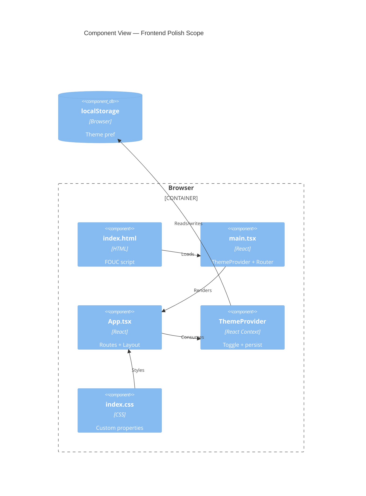

# Implementation Plan: Responsive UI & Dark Mode

**Branch**: `00023-responsive-ui-dark-mode` | **Date**: 2026-06-04 | **Spec**: [spec.md](spec.md)

## Summary

**Goal**: Polish responsive layouts and dark mode across all Binocular routable views (inventory, activity log, modules, settings) for full usability at 320px–1280px+ with WCAG AA contrast compliance.
**Approach**: Replace color-related Tailwind `dark:` variants with CSS custom property tokens; add FOUC-prevention inline script; tighten responsive breakpoints and touch targets; enforce consistency via visual audits.
**Key Constraint**: App.tsx remains monolithic (no structural refactoring); all polish applied in-place.

## Technical Context

**Language/Version**: TypeScript 5.x / React 18 (frontend); Python 3.13 (backend, unchanged)
**Primary Dependencies**: React 18, Tailwind CSS 3.4, Vite, React Router 7, lucide-react
**Storage**: N/A — no data changes
**Testing**: Vitest + React Testing Library (unit/render); Playwright (viewport/dark-mode e2e)
**Target Platform**: Browser (mobile + desktop); served by FastAPI StaticFiles
**Project Type**: web
**Project Mode**: brownfield
**Performance Goals**: Theme toggle <200ms; no layout shift; FOUC eliminated
**Constraints**: Monolithic App.tsx; no container-queries plugin; binary theme toggle only; WCAG AA contrast
**Scale/Scope**: 4 routable views, ~1700 LOC in App.tsx, no new files required

## Instructions Check

*GATE: Must pass before Phase 0 research. Re-check after Phase 1 design.*

| # | Principle | Status | Notes |
|---|-----------|--------|-------|
| 1 | No reordered user story priorities | PASS | P1 stories precede P2 |
| 2 | No changed requirement/success-criteria IDs | PASS | FR-001–FR-009, SC-001–SC-006 stable |
| 3 | Required plan sections present | PASS | All mandatory sections filled or marked N/A |
| 4 | Every requirement mapped in coverage map | PASS | 9 FRs, 6 SCs all accounted for |
| 5 | Architecture diagram valid C4 syntax | PASS | Component view, 8 nodes |
| 6 | `spec.md` has no unresolved NEEDS CLARIFICATION | PASS | 0 markers; all resolved in clarify phase |
| 7 | `project-instructions.md` readable | PASS | Present at repo root |

## Architecture



## Architecture Decisions

Feature-local decisions only. Project-wide architectural decisions reference existing ADRs.

| ID | Decision | Options Considered | Chosen | Rationale |
|----|----------|--------------------|--------|-----------|
| AD-001 | CSS token strategy for colors | A. Replace all color dark: variants / B. Augment with tokens / C. Wrap in Tailwind config | A — Replace | Eliminates FOUC root cause; single source of truth; aligns with FR-005 |
| AD-002 | FOUC prevention approach | A. Inline blocking script / B. SSR class injection / C. CSS-only (no JS) | A — Inline script | Works with Vite static build; no SSR; script shares logic with ThemeProvider per STF-003 resolution |
| AD-003 | Responsive breakpoint strategy | A. Single 640px breakpoint / B. Two breakpoints / C. Tailwind defaults per-component | C — Tailwind defaults | Codebase already uses sm:/md:/lg:; per-component flexibility preserves existing patterns |
| AD-004 | Theme toggle model | A. Binary only / B. Tri-state (system option) | A — Binary | Simpler; explicit preference wins; set-and-forget philosophy |

## Data Model Summary

N/A — no persistent data. This feature changes only presentation (CSS, component markup). Theme preference stored in localStorage (browser-native, not application data).

## API Surface Summary

N/A — no API surface. No new endpoints, no endpoint modifications. Presentation-only changes.

## Testing Strategy

| Tier | Tool | Scope | Mock Boundary | Install |
|------|------|-------|---------------|---------|
| Unit | Vitest + RTL | ThemeProvider toggle/persistence; component render in light/dark; text truncation | jsdom (no viewport) | configured |
| Integration | Vitest + RTL | All routable view components wrapped in ThemeProvider render without errors in both modes | API calls mocked via existing patterns | configured |
| Security | — | No auth/secrets surface | — | — |
| Coverage | Vitest (c8/istanbul) | Ensure existing coverage does not regress; target ≥80% on touched lines | — | configured |

**Playwright e2e**: Add viewport tests at 320px, 768px, 1280px. Dark mode test via `page.evaluate(() => document.documentElement.classList.add('dark'))`. Visual comparison for SC-005 (no layout shift on toggle).

## Error Handling Strategy

N/A — presentation-only feature. No API calls, no external services, no user-facing error states introduced. Existing error boundaries and loading states preserved unchanged.

## Integration Points

N/A — spec has no Integration Points section. This feature modifies presentation of existing components without crossing system boundaries.

## Risk Mitigation

| Risk (from spec) | Likelihood | Impact | Mitigation | Owner |
|-------------------|------------|--------|------------|-------|
| Visual regression in light mode (token replacement alters colors) | Medium | High | Run existing Vitest snapshot tests + manual visual comparison across all views before merge | Frontend |
| Mobile layout breakage on edge content (long names overflow) | Low | Medium | Test with maximum-length fixture strings in device names and module metadata | Frontend |
| FOUC script conflicts with Vite HMR (inline script behaves differently in dev) | Low | Low | Guard inline script behind `%MODE% === 'production'` check; test HMR early in dev cycle | Frontend |

## Requirement Coverage Map

| Req ID | Component(s) | File Path(s) | Notes |
|--------|--------------|--------------|-------|
| FR-001 | All route views, index.css tokens | `frontend/src/App.tsx`, `frontend/src/index.css` | Replace dark: colors with tokens; verify WCAG AA contrast |
| FR-002 | index.html, ThemeProvider | `frontend/index.html`, `frontend/src/theme/ThemeProvider.tsx` | Inline script + shared logic extraction |
| FR-003 | App.tsx layout, all route components | `frontend/src/App.tsx` | max-width:639px queries; 44×44px touch targets |
| FR-004 | Activity log table | `frontend/src/App.tsx` (LogsPage) | overflow-x-auto + visible scroll indicators |
| FR-005 | index.css, App.tsx | `frontend/src/index.css`, `frontend/src/App.tsx` | Define + apply --color-* tokens; remove dark: color variants |
| FR-006 | App.tsx, index.css | `frontend/src/App.tsx`, `frontend/src/index.css` | @media (prefers-reduced-motion: reduce) disabling transitions |
| FR-007 | All view components with user text | `frontend/src/App.tsx` | text-overflow: ellipsis; overflow: hidden; white-space: nowrap |
| FR-008 | ThemeProvider | `frontend/src/theme/ThemeProvider.tsx` | Binary persist; prefers-color-scheme as initial default only |
| FR-009 | App.tsx (sidebar) | `frontend/src/App.tsx` | overflow-y: auto on sidebar nav; focus management |

| SC ID | Verification Method | Notes |
|-------|---------------------|-------|
| SC-001 | Manual audit + Playwright screenshots | All views at 320/768/1280px in dark mode |
| SC-002 | Playwright viewport tests | Operability at 320px; table scroll exemption |
| SC-003 | Playwright touch simulation | Sidebar open/dismiss/focus cycle |
| SC-004 | Playwright visual comparison | Element measurement across views at 1280px |
| SC-005 | Playwright screenshot diff | Before/after toggle; zero pixel displacement |
| SC-006 | Playwright + reduced-motion emulation | Instant transitions when prefers-reduced-motion: reduce |

## Project Structure

### Source Code

```text
frontend/
├── index.html                 ~ Add FOUC-prevention inline <script>
├── src/
│   ├── index.css              ~ Replace dark: colors with CSS custom property tokens
│   ├── App.tsx                ~ Apply responsive/touch/truncation/motion-reduce polish
│   └── theme/
│       └── ThemeProvider.tsx   ~ Extract shared theme-resolution logic; binary toggle
```

**Brownfield Notes**:
- **Patterns to reuse**: Existing Tailwind mobile-first breakpoints; ThemeProvider context pattern; Test setup in `frontend/src/test/setup.ts`
- **Tests to extend**: `App.test.tsx` (add dark mode render test); `ThemeProvider.test.tsx` (add binary toggle + FOUC sync tests)
- **Naming conventions**: PascalCase components; camelCase hooks; kebab-case CSS custom properties

## Implementation Hints

- **[HINT-001]** Token Migration: Replace `dark:` color utilities incrementally per view (inventory → logs → modules → settings) to isolate visual regressions. Verify snapshot tests after each view.
- **[HINT-002]** FOUC Script Sync: Extract theme-resolution function (`getInitialMode()`) into a shared module imported by both `index.html` inline script (copy-paste, not import) and `ThemeProvider.tsx`. Add a unit test verifying identical output for 10+ input combinations.
- **[HINT-003]** Touch Targets: Use `min-h-[44px] min-w-[44px]` on all interactive elements within mobile viewport queries. Existing `h-9` / `text-xs` buttons may need resizing.
- **[HINT-004]** Reduced Motion: Wrap all `transition-*` and `transform` utilities in `motion-safe:` prefix; provide instant alternatives with `motion-reduce:transition-none`.
- **[HINT-005]** Playwright Setup: Add `frontend/e2e/` directory with responsive + dark-mode specs. Use `page.setViewportSize()` for breakpoint testing and `page.evaluate()` for dark class manipulation.
