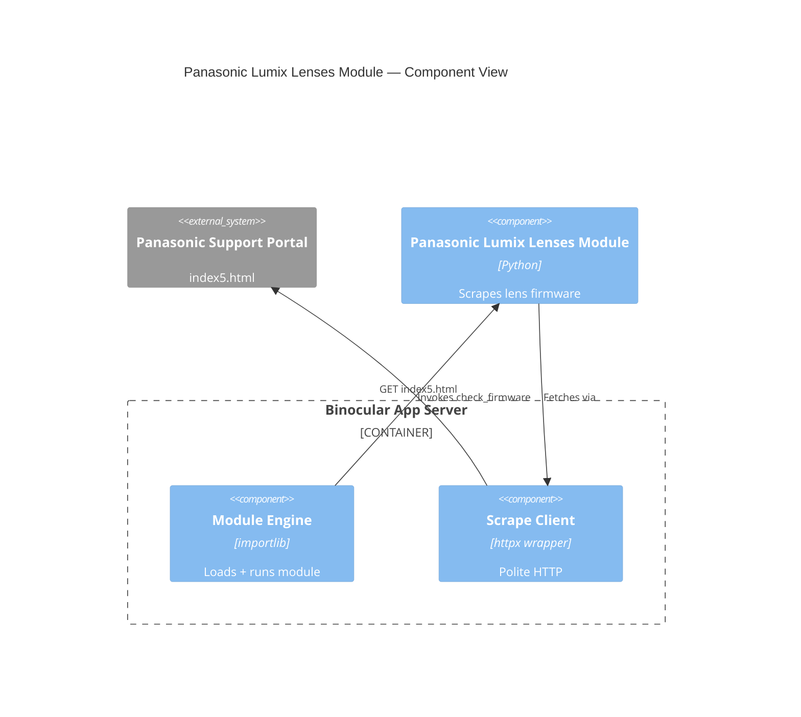

# Implementation Plan: Official Panasonic Lumix Lenses Module

**Feature Branch**: `00024-official-panasonic-lumix-lenses-module`
**Created**: 2026-06-06 | **Status**: Draft
**Spec Type**: product

## Technical Context

| Field | Value |
|-------|-------|
| **Language/Version** | Python 3.13 |
| **Primary Dependencies** | binocular.extensions.contract, binocular.scraping.client |
| **Storage** | N/A (module is a stateless scraper; metadata persisted via existing ModuleRepository) |
| **Testing** | pytest + pytest-asyncio, fixture-based golden tests |
| **Target Platform** | In-process extension module within existing Docker container |
| **Project Type** | Extension module (Python script) |
| **Performance Goals** | Parse <1000 lens entries from ~200KB HTML within 10s scrape timeout |
| **Constraints** | No direct HTTP imports; all outbound via ScrapeClient; fixture-validated correctness |
| **Scale/Scope** | ~50 L-mount + ~40 MFT lens entries on a single firmware page |
| **Project Mode** | brownfield — adds one file to `backend/src/binocular/official_modules/` + test file + fixture |

## Architecture Decisions

| ID | Decision | Rationale |
|----|----------|-----------|
| AD-001 | Mirror structure of existing `panasonic_lumix.py` (E020) | Consistency with existing module pattern; reuse of `FirmwareEntry`, `parse_firmware_entries`, `find_firmware_entry` signatures |
| AD-002 | Single module covers both L-mount (S-*) and MFT (H-*) lenses | Both lens types share the same firmware page, table structure, and JavaScript handler pattern; one module = one scrape per check |
| AD-003 | Use `S*?\d+` regex for OpenWin handlers (matching both `OpenWin` and `OpenWinS`) | L-mount uses `OpenWinS\d+`, MFT uses `OpenWin\d+`; optional `S` captures both with single regex |
| AD-004 | Lens model regex: `^[SH]-[A-Z0-9]+$` | Matches S-R1635, H-ES12035, etc.; excludes camera bodies (DC-*, DMC-*) |

## Architecture

## Data Model Summary

| Entity | Attributes | Source |
|--------|------------|--------|
| FirmwareEntry | model (str), firmware_version (str), firmware_date (str), firmware_download_url (str) | Parsed from `<tr>` rows in lens firmware table |
| MODULE_METADATA | module_id, display_name, version, author, supported_device_hints | Declared at module top level |

No database schema changes — module metadata seeded via existing ModuleRepository (E021).

## API Surface Summary

N/A — no new API endpoints. Module is consumed through existing module engine and device check pathways.

## Source Code Structure

### New Files

| Path | Purpose |
|------|---------|
| `backend/src/binocular/official_modules/panasonic_lumix_lenses.py` | Module implementation: MODULE_METADATA, check_firmware, parse_firmware_entries, extract_latest_version |
| `backend/tests/test_official_panasonic_lumix_lenses_module.py` | Pytest test suite: contract loading, detection correctness, failure modes |
| `backend/tests/fixtures/panasonic_lumix_lenses/panasonic_firmware_index.html` | Captured page snapshot for fixture-based golden tests |
| `backend/tests/fixtures/panasonic_lumix_lenses/unparseable.html` | Malformed page for failure-mode testing |

### Modified Files

None. Module auto-discovered by existing seeder (E021) scanning `binocular/official_modules/`.

### Brownfield Notes

- Existing `binocular/official_modules/panasonic_lumix.py` is the reference implementation (E020)
- Existing `binocular/official_modules/sony_alpha.py` provides alternative pattern
- Seeder (`binocular/services/seeder.py`) requires no changes — discovers `.py` files automatically
- Module engine and authoring contract (`binocular/extensions/`) are unchanged

## Testing Strategy

| Tier | Tool | Scope | Mock Boundary | Install |
|------|------|-------|---------------|--------|
| Unit | pytest + pytest-asyncio | Parsing logic (parse_firmware_entries, find_firmware_entry, model regex matching) | ScrapeClient (FakeScrapeClient with fixture HTML) | configured |
| Integration | pytest (contract-load test) | ModuleLoader loads module, validates MODULE_METADATA, seeder auto-discovery | File system | configured |
| Golden / Correctness | pytest (fixture tests) | check_firmware against captured page snapshot | HTTP (fixture injected via FakeScrapeClient) | configured |
| Security | N/A | No direct HTTP imports verified via source string check | N/A | — |

### Golden Test Assertions

All golden tests MUST assert:
- Exact `latest_version` value (e.g., `"2.0"`, `"1.1"`) — never a loose check (non-empty, numeric-only)
- `compare_versions(current_version, result.latest_version).is_newer` is `True` when the fixture version is genuinely newer than the input `current_version`
- `source_url` is a valid, well-formed URL (not empty, not a JS function name)
- `result.diagnostics["firmware_date"]` is a non-empty string for entries where the fixture contains a date

### Seeder Auto-Discovery Test

A dedicated test MUST verify that placing the module file in `binocular/official_modules/` results in auto-discovery by the existing seeder (E021) without errors or duplicate entries. This test validates FR-007 and SC-005.

### MODULE_METADATA Version Test

A test MUST verify that `MODULE_METADATA.version` is a non-empty, parseable version string, enabling regression correlation between parsing logic changes and specific module releases.

### Fixture Content Requirements

The main fixture (`panasonic_firmware_index.html`) MUST contain:
- Representative entries for both L-mount (S-\*) and Micro Four Thirds (H-\*) lens types, covering at least one model from each lens family
- At least one row that matches the lens model regex (`^[SH]-[A-Z0-9]+$`) but is not a real lens (e.g., a service part or accessory row with an S- prefix), to verify the module does not produce false positives
- Non-lens entries (e.g., LEICA, SIGMA, or camera body rows like DC-\*/DMC-\*) to confirm the module correctly ignores rows outside its defined scope
- Entries with varying `firmware_date` formats (e.g., with and without the "NEW" label, different date separators) to exercise the date cleaning function across representative real-world inputs
- At least one lens entry with an `OpenWinS` handler (L-mount) and one with an `OpenWin` handler (MFT) to verify download URL extraction for both JavaScript function variants
- A lens entry with no `OpenWin`/`OpenWinS` handler at all, serving as golden input for testing the `download_url_not_found` error path

The unparseable fixture (`unparseable.html`) MUST be genuinely missing the firmware table structure that the module's parser depends on, so that `firmware_index_not_found` is a deterministic outcome.

## Error Handling Strategy

| Scenario | error_type | detail | Diagnostics |
|----------|------------|--------|-------------|
| Model not in firmware table | product_not_found | "Panasonic Lumix Lenses product was not found: {model}" | model, module_id |
| Empty/None/whitespace-only model input | product_not_found | "Panasonic Lumix Lenses product was not found: {model}" | model, module_id |
| Page table unparseable | firmware_index_not_found | "Panasonic Lumix Lenses firmware table was not found in page content" | source_url |
| Empty/zero-length response body (HTTP 200 with no content) | firmware_index_not_found | "Panasonic Lumix Lenses firmware table was not found in page content" | source_url |
| Model found, no firmware version | firmware_not_available | "Panasonic firmware version is not listed for {model}" | model, product_model |
| No download handler for entry | download_url_not_found | "Panasonic download URL is not available for {model}" | model, module_id |
| HTTP/network error | firmware_page_unavailable | "Panasonic Lumix Lenses firmware page unreachable: {status}" | status_code, url, error_type |

## Risk Mitigation

| Risk | Likelihood | Impact | Mitigation |
|------|-----------|--------|------------|
| Manufacturer page structure change | medium | high | Honest failure signaling returns firmware_index_not_found; fixture-based regression tests detect breakage on next release cycle |
| Model pattern collision with cameras module | low | low | Dedicated lens module URL (index5.html); distinct model regex (S-*/H-* vs DC-*/DMC-*) |

## Requirement Coverage Map

| Requirement | Component | File Path |
|-------------|-----------|-----------|
| FR-001 (parse S-*/H-* entries) | parse_firmware_entries, _LENS_MODEL_RE | `backend/src/binocular/official_modules/panasonic_lumix_lenses.py` |
| FR-002 (extract version/date/model/URL) | parse_firmware_entries, FirmwareEntry | `backend/src/binocular/official_modules/panasonic_lumix_lenses.py` |
| FR-003 (return success with version) | check_firmware → return ModuleCheckResult | `backend/src/binocular/official_modules/panasonic_lumix_lenses.py` |
| FR-004 (visible failure for 5 error_types) | _failed helper, check_firmware | `backend/src/binocular/official_modules/panasonic_lumix_lenses.py` |
| FR-005 (resolve download URLs) | _download_handlers, _OPEN_WIN_RE, urljoin | `backend/src/binocular/official_modules/panasonic_lumix_lenses.py` |
| FR-006 (host scraping client only) | check_firmware uses scrape_client param | `backend/src/binocular/official_modules/panasonic_lumix_lenses.py` |
| FR-007 (auto-discovered and seeded) | File placement in official_modules/ + valid MODULE_METADATA | `backend/src/binocular/official_modules/panasonic_lumix_lenses.py` |
| FR-008 (fixture-based offline validation) | extract_latest_version, parse_firmware_entries helpers | `backend/src/binocular/official_modules/panasonic_lumix_lenses.py` |
| SC-001 (zero false results vs fixture) | Golden test: test_detects_latest_version_from_fixture | `backend/tests/test_official_panasonic_lumix_lenses_module.py` |
| SC-002 (correct download URL) | Golden test: source_url assertion | `backend/tests/test_official_panasonic_lumix_lenses_module.py` |
| SC-003 (unparseable → failed + detail) | Failure test: test_unparseable_returns_visible_failure | `backend/tests/test_official_panasonic_lumix_lenses_module.py` |
| SC-004 (non-lens → product_not_found) | Failure test: test_unlisted_model_returns_visible_failure | `backend/tests/test_official_panasonic_lumix_lenses_module.py` |
| SC-005 (module in registry after seeding) | Contract-load test: test_module_loads_through_extension_contract | `backend/tests/test_official_panasonic_lumix_lenses_module.py` |
| SC-006 (dry-run produces expected version) | check_firmware integration test with FakeScrapeClient + fixture | `backend/tests/test_official_panasonic_lumix_lenses_module.py` |

## Implementation Hints

- **[HINT-001]** Concurrency: Reuse exact `FakeScrapeClient` pattern from existing `test_official_panasonic_lumix_mft_cameras_module.py` for fixture-based tests.
- **[HINT-002]** Regex: OpenWin regex must match both `OpenWinS\d+` (L-mount) and `OpenWin\d+` (MFT) — use `OpenWinS?\d+`.
- **[HINT-003]** Model pattern: Lens model regex `^[SH]-[A-Z0-9]+$` must be distinct from camera body regex `^(?:DC|DMC)-(?:B?GH|G|GX|GF|GM)\w*$`.
- **[HINT-004]** No aliases: Unlike cameras (which have `/`-delimited model groups like `DC-G90/G91/G95`), lens models are singular — `_model_aliases` not needed, keep `(model,)` tuple.
- **[HINT-005]** Ordering: Create fixture HTML first (capture from live page), then module, then tests — fixture must exist before golden tests can run.
- **[HINT-006]** Regex Safety: Row-level (`<tr\b.*?</tr>`) and cell-level (`<td\b[^>]*>.*?</td>`) extraction regexes use non-greedy matching. Page size is bounded by ScrapeClient's response buffer and 10s timeout (STF-003), preventing pathological backtracking on oversized input.
- **[HINT-007]** URL Resolution Safety: All download page URLs are resolved via `urllib.parse.urljoin` against the actual response URL (accounting for redirects). Since `urljoin` resolves relative to the Panasonic origin, open-redirect targets to external domains are inherently prevented.
- **[HINT-008]** Firmware Date Diagnostics: `firmware_date` extraction is mandatory per FR-002 but only surfaced in diagnostics (not user-facing comparison). The `_clean_date` function strips the "NEW" label; crafted cell content has limited blast radius as the field is diagnostic-only. Edge cases tested must include: a missing date cell, a date cell containing only the `"NEW"` label, and a date cell with Unicode or non-ASCII characters (to verify the parser does not crash or produce garbage on unexpected encoding).
- **[HINT-009]** Source URL Consistency: `source_url` in `ModuleCheckResult` must always be a valid, well-formed URL across all code paths (success and all five error types). For `product_not_found` and `firmware_not_available`, set `source_url` to the firmware index page URL; for `firmware_page_unavailable`, use the attempted URL.
- **[HINT-010]** ScrapeClient Exception Handling: The module must handle all ScrapeClient exception types (`RobotsDeniedError`, `ScrapeTimeoutError`, `ScrapeTransportError`, `RetryExhaustedError`) by catching their common base and mapping to `firmware_page_unavailable` with the appropriate status code and diagnostic context.
- **[HINT-011]** Error Diagnostics Separation: The `detail` field contains human-readable messages only. Raw HTML, page source fragments, and internal HTTP headers must never appear in `detail`. HTTP diagnostics (status code, URL, error origin) are surfaced only in the `diagnostics` dict, separate from user-facing detail.
- **[HINT-012]** Source URL Override: If `check_input.source_url` is provided, it must be validated to originate from `av.jpn.support.panasonic.com` before use. Arbitrary URL injection through check input is rejected by constraining to the Panasonic origin.
- **[HINT-013]** Module Version: `MODULE_METADATA.version` must be declared and incremented on each release, enabling regression correlation between parsing logic changes and specific module versions.
- **[HINT-014]** No Environment Variable Reads: The module is a stateless scraper with no credential needs. `os.environ`, `os.getenv`, or any environment-variable read is expressly forbidden — there is no implicit secret-loading path.
- **[HINT-015]** Success Diagnostics Fields: The `diagnostics` dict in successful `ModuleCheckResult` responses must contain only the documented fields (`model`, `module_id`, `product_model`, `aliases`, `firmware_date`). No internal state, raw regex groups, or unexpected fields may leak through diagnostics.
- **[HINT-016]** Catch-All Error Handling: The five `error_type` values are exhaustive for defined failure paths. Any unrecognized failure (e.g., unexpected regex engine exception) must produce a visible `ModuleCheckResult(status="failed")` with a descriptive `detail` rather than an unhandled exception. The module engine provides a final safety net for uncaught exceptions.
- **[HINT-017]** Diagnostics Serialization Safety: The `_failed` helper must ensure all `diagnostics` keyword argument values are JSON-serializable (str, int, float, bool, None). Binary data from regex match groups, bytes objects, or non-serializable types must be converted to string representations before inclusion.

- **[HINT-018]** Empty Current Version: When `check_input.current_version` is empty, `None`, or non-parseable, the module must still return a valid `ModuleCheckResult(status="success", latest_version=...)` if the lens is found with a version — version comparison is handled by the module engine, and an empty current version simply means no comparison baseline is available. The module itself must not crash, raise an unhandled exception, or return a misleading result.

## Instructions Check

| Principle | Verdict | Notes |
|-----------|---------|-------|
| I. Honest Failure | PASS | Error Handling Strategy covers 5 error_types with detail+diagnostics; Risk Mitigation references honest failure signaling; FR-004 mapped in coverage. |
| II. Polite by Default | PASS | All outbound via ScrapeClient; source code check verifies no direct HTTP imports; Architecture diagram shows ScrapeClient intermediary. |
| III. Data Ownership & Self-Containment | PASS | No external DB/broker/cloud; metadata via existing SQLite ModuleRepository; no schema changes. |
| IV. Least-Privilege & Trust Boundary | PASS | In-process extension under existing documented trust boundary; no sandboxing claims. |
| V. Type Safety & Correctness-First | PASS | Fixture-based golden tests mandated (SC-001: zero false positives/negatives); `mypy --strict` enforced project-wide in CI. |
| VI. Set-and-Forget Reliability | PASS | Module-scoped failures isolated; ScrapeClient timeout (10s); structured error returns prevent core crashes. |
| VII. Agent Output Style | N/A | Applies to agent communication, not plan artifact content. |
