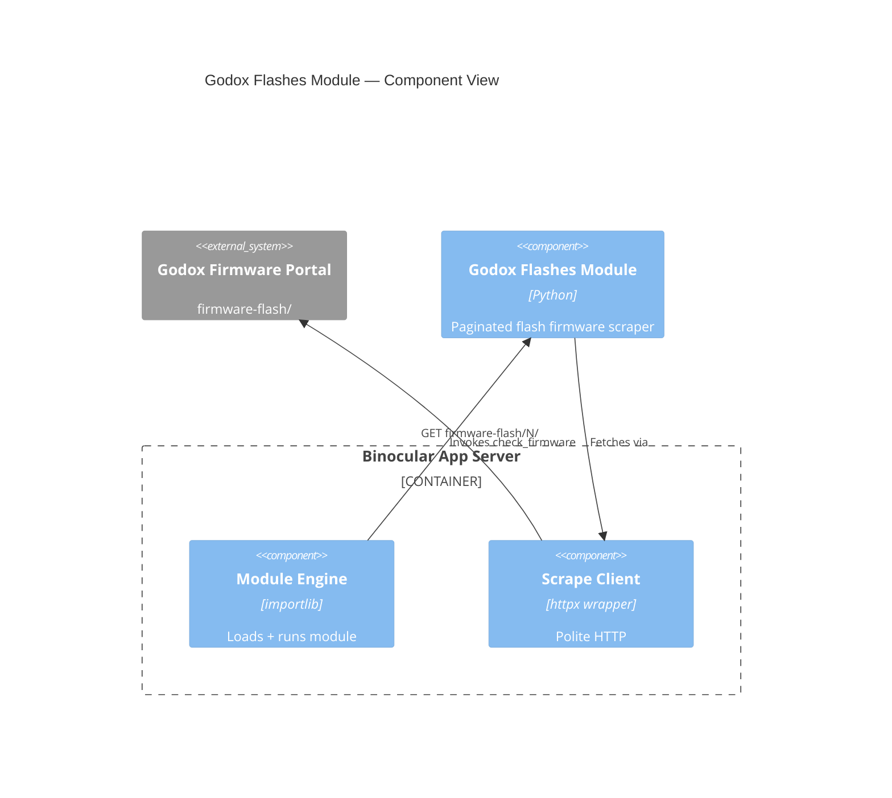

# Implementation Plan: Official Godox Flashes Module

**Feature Branch**: `00025-official-godox-flashes-module-godox`
**Created**: 2026-06-07 | **Status**: Draft
**Spec Type**: product

## Technical Context

| Field | Value |
|-------|-------|
| **Language/Version** | Python 3.13 |
| **Primary Dependencies** | binocular.extensions.contract, binocular.scraping.client |
| **Storage** | N/A (module is a stateless scraper; metadata persisted via existing ModuleRepository) |
| **Testing** | pytest + pytest-asyncio, fixture-based golden tests with multi-page FakeScrapeClient |
| **Target Platform** | In-process extension module within existing Docker container |
| **Project Type** | Extension module (Python script) |
| **Performance Goals** | Traverse up to 14+ paginated pages within host scrape timeout; early termination on first match |
| **Constraints** | No direct HTTP imports; all outbound via ScrapeClient; fixture-validated correctness; must handle paginated listing |
| **Scale/Scope** | ~70 firmware entries across ~14+ pages; 5 entries per page; individual flash model targeting |
| **Project Mode** | brownfield — adds one file to `backend/src/binocular/official_modules/` + test file + fixtures |

## Architecture Decisions

| ID | Decision | Rationale |
|----|----------|-----------|
| AD-001 | Mirror structure of existing `panasonic_lumix_lenses.py` (E023) | Consistency with existing module pattern; reuse of `FirmwareEntry` dataclass, `ModuleCheckInput`/`ModuleCheckResult` contract |
| AD-002 | Multi-page traversal with early termination | Firmware listing is paginated URL-based (`/firmware-flash_N/`); no search/filter exists on page. Stop on first match (entries are reverse chronological — newest first) |
| AD-003 | Pagination termination: inert next-link primary, consecutive-empty fallback | Last page's `a_next` href is `javascript:;`. Two consecutive empty pages act as safety net for structural changes |
| AD-004 | Circuit breaker: hard 30-page limit with priority over other termination conditions | Prevents unbounded traversal if pagination structure changes; takes precedence over inert-link and consecutive-empty |
| AD-005 | Aggressive model normalization: strip non-alphanumeric, uppercase | Matches existing Panasonic and Sony module conventions; handles model suffix variants (V100S/V100C) and hyphenated models (AD360II-C) |
| AD-006 | Version normalization: strip V/v prefix, pass through all formats | Page uses V1.17, V1.02, V1.3, v2.6, V2.2, V1.0; host comparison handles non-standard formats; reject nothing |
| AD-007 | Multi-URL FakeScrapeClient for fixture-based testing | Module fetches multiple page URLs; test client must return different HTML per URL to simulate pagination traversal |

## Architecture

## Data Model Summary

| Entity | Attributes | Source |
|--------|------------|--------|
| FirmwareEntry | model (str), firmware_version (str), firmware_date (str), firmware_download_url (str), page_number (int) | Parsed from `.item` divs in firmware listing HTML |
| MODULE_METADATA | module_id, display_name, version, author, supported_device_hints | Declared at module top level |

No database schema changes — module metadata seeded via existing ModuleRepository (E021).

## API Surface Summary

N/A — no new API endpoints. Module is consumed through existing module engine and device check pathways.

## Source Code Structure

### New Files

| Path | Purpose |
|------|---------|
| `backend/src/binocular/official_modules/godox_flashes.py` | Module implementation: MODULE_METADATA, check_firmware, parse_page_entries, extract_next_page_url, extract_latest_version, pagination loop with circuit breaker |
| `backend/tests/test_official_godox_flashes_module.py` | Pytest test suite: contract loading, detection correctness (single + multi-page), failure modes, circuit breaker |
| `backend/tests/fixtures/godox_flashes/page_1.html` | Page 1 fixture — recent entries (e.g., iT32 at V1.17) |
| `backend/tests/fixtures/godox_flashes/page_2.html` | Page 2 fixture — additional entries |
| `backend/tests/fixtures/godox_flashes/page_3.html` | Page 3 fixture — includes V100S at V1.06 for multi-page detection test |
| `backend/tests/fixtures/godox_flashes/parse_error.html` | Malformed page — zero parseable entries for parse_error testing |
| `backend/tests/fixtures/godox_flashes/empty_page.html` | Empty page — for consecutive-empty termination testing |

### Modified Files

None. Module auto-discovered by existing seeder (E021) scanning `binocular/official_modules/`.

### Brownfield Notes

- **Patterns to reuse**: `panasonic_lumix_lenses.py` (E023) for MODULE_METADATA structure, `check_firmware` entrypoint signature, `FirmwareEntry` dataclass, and failure-helper pattern
- **Tests to extend**: Existing `FakeScrapeClient` pattern from `test_official_panasonic_lumix_lenses_module.py` — extend to support multi-URL responses (dict of `{url: fixture_text}`) for pagination testing
- **Naming conventions**: `official.godox_flashes` module_id; test file `test_official_godox_flashes_module.py`; fixtures under `tests/fixtures/godox_flashes/`

## Testing Strategy

| Tier | Tool | Scope | Mock Boundary | Install |
|------|------|-------|---------------|---------|
| Unit | pytest + pytest-asyncio | FirmwareEntry parsing, version normalization, pagination URL extraction, model matching | No HTTP — pure functions tested with inline data | configured |
| Integration | pytest + pytest-asyncio | check_firmware with FakeScrapeClient, multi-page traversal, early termination, circuit breaker | ScrapeClient replaced with multi-URL FakeScrapeClient | configured |
| Security | Ruff + mypy --strict | No direct HTTP imports, type safety | N/A | configured |
| Coverage | pytest-cov | ≥80% line coverage on godox_flashes.py | N/A | configured |

## Error Handling Strategy

| Error Category | Pattern | Response | Retry |
|----------------|---------|----------|-------|
| Model not found (full traversal) | Return failed status | error_type: product_not_found, detail + pages_checked | No |
| Page structure changed (page 1 zero entries) | Return failed status | error_type: parse_error, detail message | No |
| Network / HTTP failure | Return failed status | error_type: firmware_page_unavailable, diagnostics with http_status (0 for non-HTTP) | No (host ScrapeClient handles retries) |
| Hard page limit reached | Return failed status | error_type: page_limit_exceeded, diagnostics with pages_checked: 30 | No |
| Solo empty page at N>1 | Log warning, continue | Reset empty counter, proceed to next page | N/A |
| Consecutive empty pages (2) | Return failed status | error_type: product_not_found, pages_checked reflects actual pages fetched | No |

All `detail` messages must be human-readable strings only — no raw HTML fragments, page source excerpts, HTTP response bodies, internal stack traces, or scrape-client internals. Diagnostic output (logs, warnings) must not include the full HTML content of any scraped page; limit to entry counts, page numbers, and match results.

## Integration Points

| Spec Reference | System/Service | Technical Approach | Contract |
|----------------|----------------|--------------------|----------|
| FR-007 | Host ScrapeClient | Module receives scrape_client parameter; uses only `.fetch(url)` | ScrapeClient async API (src/binocular/scraping/client.py) |
| FR-008 | Module Seeder (E021) | File placed in `binocular/official_modules/`; auto-discovered by seeder at startup | ModuleLoader validates MODULE_METADATA and check_firmware signature |

## Risk Mitigation

| Risk (from spec) | Likelihood | Impact | Mitigation | Owner |
|-------------------|------------|--------|------------|-------|
| Manufacturer page structure change | Medium | High | parse_error failure for zero entries on page 1; fixture-based regression tests | godox_flashes.py |
| Pagination exhaustion on large listings | Low | Medium | 30-page circuit breaker with page_limit_exceeded error; early termination on first match for common models | godox_flashes.py |
| Model suffix ambiguity for unsuffixed queries | Low | Low | Aggressive normalization + exact-match requirement documented in MODULE_METADATA supported_device_hints | module metadata |

## Requirement Coverage Map

| Req ID | Component(s) | File Path(s) | Notes |
|--------|--------------|--------------|-------|
| FR-001 | FirmwareEntry, parse_page_entries | godox_flashes.py | Parse .item .tit/text from each page; extract model, version, date, download URL |
| FR-002 | Pagination loop, extract_next_page_url | godox_flashes.py | Follow /firmware-flash_N/ pattern; stop at inert next-link; early termination on match |
| FR-003 | check_firmware | godox_flashes.py | Return success with latest_version and diagnostics (matched_page, pages_checked) |
| FR-004 | normalize_version | godox_flashes.py | Strip leading V/v; pass through all formats including non-dotted |
| FR-005 | check_firmware failure paths | godox_flashes.py | Return failed status with appropriate error_type per failure mode |
| FR-006 | Circuit breaker | godox_flashes.py | 30-page limit; takes precedence over all other termination conditions |
| FR-007 | check_firmware scrape_client param | godox_flashes.py | All outbound HTTP via scrape_client.fetch(); no direct httpx/requests imports |
| FR-008 | MODULE_METADATA | godox_flashes.py | module_id: official.godox_flashes, display_name: Godox Flashes |
| FR-009 | FakeScrapeClient, fixture tests | test_official_godox_flashes_module.py | Multi-URL FakeScrapeClient returning per-URL fixture HTML |

## Implementation Hints

- **[HINT-001]** Concurrency: Multi-URL FakeScrapeClient must be a frozen dataclass with a `url_map: dict[str, str]` mapping URL to fixture text; fetch selects the mapped fixture. Reuse the existing `ScrapeResponse` and `ScrapeDiagnostics` construction pattern.
- **[HINT-002]** Pagination: The page-1 URL is `/firmware-flash/` (no underscore), but pages 2+ use `/firmware-flash_N/`. Construct page URLs with `f"/firmware-flash{'_' + str(n) if n > 1 else ''}/"`.
- **[HINT-003]** Safety: Keep direct HTTP imports out of official modules. Use `cast(ScrapeClient, scrape_client)` for type-safety in tests with FakeScrapeClient. No `httpx`, `requests`, or `aiohttp` imports anywhere. Additionally, the module MUST NOT import process-execution primitives (`subprocess`, `os.system`, `popen`), dynamic-code-execution builtins (`eval`, `exec`, `compile`, `__import__`), deserialization modules (`pickle`, `marshal`, `shelve`, `yaml` with unsafe loaders), or foreign-function interfaces (`ctypes`, `cffi`). All imports beyond the standard library must be limited to `binocular.extensions.contract` and `binocular.scraping.client`.
- **[HINT-004]** Normalization: Apply `re.sub(r'[^A-Z0-9]+', '', value.upper())` for model matching — consistent with existing panasonic_lumix_lenses.py. For version normalization: `version_str.lstrip('Vv')`.
- **[HINT-005]** Testing: Golden test must verify that requesting model "iT32" against a multi-page fixture returns latest_version "1.17" and only fetches page 1. A separate test verifies V100S on page 3 triggers exactly 3 page fetches. Circuit breaker test creates a FakeScrapeClient with 30 dummy pages to verify halt at page 30.
