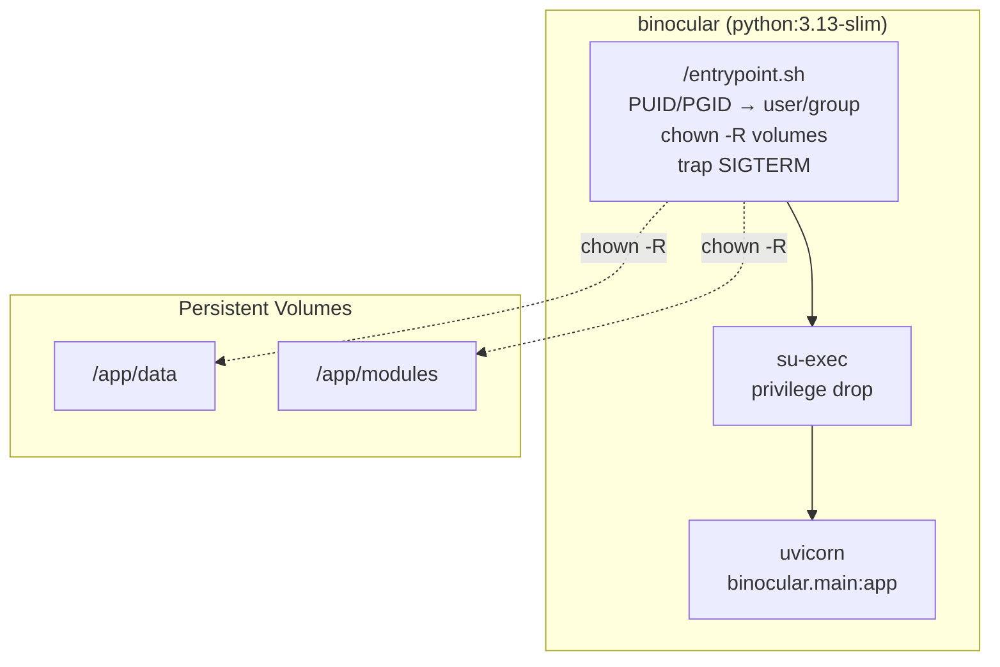

# Implementation Plan: PUID/PGID Entrypoint

**Branch**: `00026-puid-pgid-entrypoint` | **Date**: 2026-06-07 | **Spec**: [spec.md](spec.md)

## Summary

**Goal**: Add a linuxserver.io-style entrypoint script that reads PUID/PGID env vars, creates a matching user/group, chowns volumes, and drops privileges via su-exec before launching uvicorn.
**Approach**: Shell entrypoint script in `docker/entrypoint.sh` with su-exec for privilege drop; minimal Dockerfile changes; no changes to Python/TS code.
**Key Constraint**: Must not break existing zero-config startup (no env vars required); preserved non-root execution per {SAD:ADR-0008}.

## Technical Context

**Language/Version**: Shell (POSIX) — entrypoint script; Dockerfile — Docker build syntax
**Primary Dependencies**: su-exec (apt package), python:3.13-slim base image
**Storage**: N/A — no persistent data; entrypoint chowns existing volumes
**Testing**: Shellcheck for entrypoint script; docker build + docker inspect for image validation
**Target Platform**: Linux Docker container (linux/amd64 + linux/arm64)
**Project Type**: single — adds infrastructure script, no new services
**Project Mode**: brownfield — extends existing Dockerfile
**Performance Goals**: Startup time < 2s for typical volumes (<10k files)
**Constraints**: Zero-config backward compatible; non-root; PUID=0/PGID=0 refused; chown -R on every start; SIGTERM trap before chown phase
**Scale/Scope**: Single entrypoint script + Dockerfile change; affects all container starts

## Instructions Check

*GATE: Must pass before Phase 0 research. Re-check after Phase 1 design.*

- Core Principle IV (Least-Privilege): Container runs as non-root user ✅ — enforced by root refusal and su-exec drop
- Core Principle VI (Set-and-Forget): Zero-config startup preserved ✅ — PUID/PGID default to 1000:1000
- Technology Stack: python:3.13-slim, uvicorn unchanged ✅ — only adds su-exec and entrypoint script
- Source Code Layout: Infra files (Dockerfile, entrypoint) exempt from /src rule ✅

## Architecture



## Architecture Decisions

| ID | Decision | Options Considered | Chosen | Rationale |
|----|----------|--------------------|--------|-----------|
| AD-001 | Privilege drop tool | su-exec / gosu / setpriv / chpst | su-exec (gosu fallback) | ~25 KB, no Python dep, widely used in linuxserver.io images |
| AD-002 | UID/GID defaults | 1000:1000 / 1001:1001 / dynamic | 1000:1000 | Matches typical first-user UID on Linux; backward compatible |
| AD-003 | Entrypoint language | Shell / Python / Go | Shell (POSIX) | Zero deps; runs before Python runtime; simple logic |
| AD-004 | Signal handling during chown | trap / ignore / skip chown on signal | trap SIGTERM/SIGINT | Ensures prompt docker stop during long chown operations |

## Data Model Summary

N/A — no persistent data. Entrypoint manages filesystem ownership only.

## API Surface Summary

N/A — no API surface. Entrypoint is infrastructure-only.

## Testing Strategy

| Tier | Tool | Scope | Mock Boundary | Install |
|------|------|-------|---------------|---------|
| Unit | Shellcheck | entrypoint.sh syntax and style | — | shellcheck (apt) |
| Integration | docker build + docker inspect | Docker image builds and has correct Entrypoint/Cmd | — | docker |
| Integration | docker run + id | Container runs with configured PUID/PGID; volumes owned by correct user | — | docker |
| Integration | docker run + independent defaults | One var set, other absent; verifies independent-default behavior (VC-6) | — | docker |
| Integration | docker run + asymmetric non-numeric | One var numeric, other non-numeric; verifies per-var fallback (VC-7) | — | docker |
| Integration | docker run + out-of-range | PUID > 4294967294; verifies boundary rejection with exit code 4 (VC-8) | — | docker |
| Integration | docker run + shell injection | Shell metacharacters in PUID/PGID; verifies injection prevention (VC-9) | — | docker |
| Integration | docker run + existing UID | Target UID already exists in image; verifies skip-creation and log (VC-10) | — | docker |
| Integration | docker run + missing tools | Neither su-exec nor gosu in PATH; verifies exit code 2 and error message (VC-11) | — | docker |
| Integration | docker run + signal trap | SIGTERM sent during chown phase; verifies prompt exit and partial-chown log | — | docker, timeout |
| Integration | docker run + signal propagation | `docker stop` timing test; verifies `exec` pattern, container exits within stop timeout | — | docker, timeout |
| Integration | docker run + gosu fallback | su-exec removed from image; verifies gosu fallback path and equivalent behavior | — | docker |
| Integration | docker run + chown failure modes | Read-only rootfs (warning+continue), data volume chown failure (exit code 3) | — | docker |
| Integration | docker build multi-arch | Build for linux/amd64 and linux/arm64; verifies su-exec availability on both | — | docker buildx |
| Security | — | N/A — no Python/TS code changed; entrypoint is infrastructure | — | — |
| **Known Limitation** | Concurrent replicas | STF-009: concurrent containers on same volume race on chown; no lock mechanism in v1 — not tested | — | — |

## Error Handling Strategy

| Error Category | Pattern | Response | Retry |
|----------------|---------|----------|-------|
| PUID=0 or PGID=0 | Fail-fast | Exit with exit code 1, clear error message to stderr naming the offending variable | No |
| su-exec/gosu not in PATH | Fail-fast | Exit with exit code 2, clear error message to stderr | No |
| chown fails on data volume | Fail-fast | Exit with exit code 3, log error with path to stderr | No |
| chown fails on read-only rootfs | Warn-only | Log warning to stderr, continue startup | No |
| Non-numeric PUID/PGID | Fallback | Log warning to stderr naming invalid var, fall back to 1000 for that var | No |
| useradd/groupadd failure for existing UID/GID | Skip | Reuse existing user/group, log info | No |

## Integration Points

| Spec Reference | System/Service | Technical Approach | Contract |
|----------------|----------------|--------------------|----------|
| IP-001 (E001) | Dockerfile | Extend runtime stage with su-exec install and entrypoint copy; replace USER directive with entrypoint | Dockerfile syntax |
| IP-002 ({DOD:DDR-004}) | Deployment decision | Implement linuxserver.io PUID/PGID pattern per DDR-004 | Entrypoint.sh interface |

## Risk Mitigation

| Risk (from spec) | Likelihood | Impact | Mitigation | Owner |
|-------------------|------------|--------|------------|-------|
| su-exec not available for arm64 | Low | Medium | Build-time fallback to gosu in Dockerfile; both provide same interface | Dockerfile |
| Operator expects PGID to create new group | Low | Low | Reuse existing group with same GID; document behavior in runbook | entrypoint.sh |
| PUID/PGID out of range | Low | Low | Script-level validation with exit code 4 and clear error message before calling OS tools | entrypoint.sh |

## Requirement Coverage Map

| Req ID | Component(s) | File Path(s) | Notes |
|--------|--------------|--------------|-------|
| OR-001 | entrypoint.sh | docker/entrypoint.sh | Read PUID/PGID env vars at start |
| OR-002 | entrypoint.sh | docker/entrypoint.sh | Default each to 1000 independently when absent |
| OR-003 | entrypoint.sh | docker/entrypoint.sh | Refuse PUID=0 or PGID=0, exit non-zero |
| OR-004 | entrypoint.sh | docker/entrypoint.sh | chown -R /app/data /app/modules to configured user |
| OR-005 | entrypoint.sh | docker/entrypoint.sh | exec su-exec (or gosu) user CMD |
| OR-006 | entrypoint.sh | docker/entrypoint.sh | Log warning to stderr for non-numeric values per var; consistent format |
| OR-007 | entrypoint.sh | docker/entrypoint.sh | Informational logging for key startup phases: env resolution, user/group creation, chown, completion marker |
| OR-008 | entrypoint.sh | docker/entrypoint.sh | Log signal receipt (SIGTERM/SIGINT) and partial chown state |
| OR-009 | entrypoint.sh | docker/entrypoint.sh | Distinct exit codes per failure mode; all errors to stderr |
| RR-001 | docs/ | README or compose example | Document PUID/PGID setup in docker-compose.yml |

## Project Structure

### Source Code

```
+ docker/entrypoint.sh     (new — entrypoint script)
~ Dockerfile                (modified — add su-exec install, copy entrypoint, set ENTRYPOINT)
```

Brownfield Notes:
- **Patterns to reuse**: Existing non-root convention in Dockerfile (lines 24-25, 34)
- **Tests to extend**: N/A — entrypoint is infrastructure; no CI test suite for container behavior
- **Naming conventions**: docker/ directory mirrors project convention for infrastructure scripts

## Implementation Hints

- **[HINT-001]** Order of operations: trap → read env vars → validate → create user/group → chown → exec su-exec CMD. Do NOT reorder.
- **[HINT-002]** Use `exec su-exec ...` (not bare `su-exec ...`) to ensure signals propagate to uvicorn. Without `exec`, `docker stop` will hang for 10s timeout.
- **[HINT-003]** The `USER binocular` line MUST be removed from Dockerfile — entrypoint handles user switching. If both exist, the USER from Dockerfile and the su-exec from entrypoint conflict.
- **[HINT-004]** `trap 'exit 0' TERM INT` must appear before the chown loop to allow prompt shutdown during large-volume chown operations. Without the trap, SIGTERM is ignored by the shell.
- **[HINT-006]** To distinguish read-only rootfs from data volume chown failure: attempt `touch /app/data/.probe 2>/dev/null` before chown. If the data volume is read-only → hard error (exit 3). Rootfs read-only (container-level) is detected by `touch /tmp/.probe 2>/dev/null` — if rootfs is read-only but `/app/data` is writable, only warn for rootfs.
- **[HINT-005]** Test the entrypoint with `docker run --rm -e PUID=1001 -e PGID=1001` and verify with `docker exec <id> id` and `docker exec <id> ls -la /app/data`. Also test the default (no env vars) and the PUID=0 rejection case.
