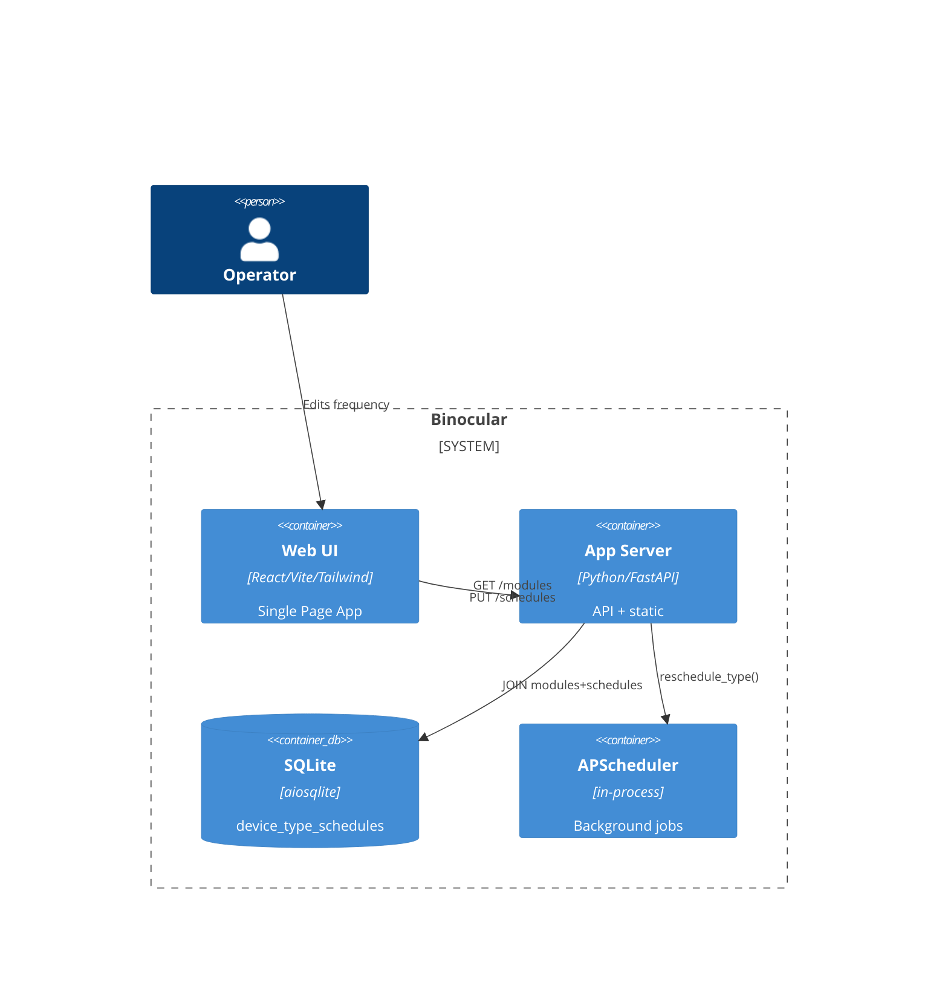

# Implementation Plan: Per-Module Frequency on Modules Page

**Branch**: `00027-per-module-frequency-on-modules` | **Date**: 2026-06-07 | **Spec**: [spec.md](spec.md)

## Summary

**Goal**: Display and edit per-module automatic check frequency on the Modules page cards  
**Approach**: Extend GET /api/v1/modules with schedule JOIN data; add click-to-edit inline frequency picker to ModuleCard component; reuse existing PUT schedules endpoint for persistence  
**Key Constraint**: No new database schema — schedule data already lives in device_type_schedules (device_type_id = modules.id per ADR-0009)

## Technical Context

**Language/Version**: Python 3.13 (backend); TypeScript 5.x / React 18 (frontend)  
**Primary Dependencies**: FastAPI, aiosqlite, Pydantic, APScheduler (backend); React, Vite, Tailwind CSS, TanStack Query, React Hook Form (frontend)  
**Storage**: SQLite (aiosqlite, existing device_type_schedules table)  
**Testing**: pytest + pytest-asyncio, httpx.AsyncClient (backend); Vitest + React Testing Library, Playwright (frontend)  
**Target Platform**: Linux Docker container (`python:3.13-slim`)  
**Project Type**: web  
**Project Mode**: brownfield  
**Performance Goals**: Modules page renders with schedule data within 2s for up to 100 modules (paginated per FR-006)  
**Constraints**: No new endpoints; reuse PUT /api/v1/schedules/device-types/{id} (parametric name device_type_id preserved); no DB migration  
**Scale/Scope**: Single user, ≤100 modules typical; page-based pagination for larger installations

## Instructions Check

*GATE: Must pass before Phase 0 research. Re-check after Phase 1 design.*

| Principle | Verdict | Notes |
|-----------|---------|-------|
| I. Honest Failure | PASS | API errors → error toast + revert; load failures → inline error indicator with retry |
| II. Polite by Default | N/A | No outbound scraping |
| III. Data Ownership & Self-Containment | PASS | Schedule data in existing SQLite volume; no external services |
| IV. Least-Privilege & Explicit Trust Boundary | N/A | No module execution changes |
| V. Type Safety & Correctness-First | PASS | Backend: mypy strict on JOIN query + response model; Frontend: tsc strict on FrequencyEditor component |
| VI. Set-and-Forget Reliability | PASS | Changes persist via SQLite; scheduler adopts new interval synchronously via existing reschedule_type(); survives restarts |
| VII. Agent Output Style | N/A | Governs agent behavior |

## Architecture



## Architecture Decisions

| ID | Decision | Options Considered | Chosen | Rationale |
|----|----------|--------------------|--------|-----------|
| AD-001 | Where to surface schedule data — nested in GET /api/v1/modules vs. separate per-module schedule endpoint | Nested GET /api/v1/modules / separate GET /api/v1/modules/{id}/schedule | Nested in GET /api/v1/modules | FR-006 requires single request; JOIN already exists in ScheduleRepository; avoids N+1 fetches |
| AD-002 | Frontend frequency picker — segmented presets vs. dropdown select | Segmented button group (1h/6h/12h/24h/Custom) / native `<select>` | Segmented button group | Research recommends presets for sparse discrete values; single-click commit; Custom reveals constrained number input |
| AD-003 | Pagination model — page-based vs. limit-offset | Page-based (page/pageSize) / limit-offset | Page-based | FR-006 specifies "page size of 100"; page-based maps naturally to UI pagination controls |
| AD-004 | Default schedule display — API returns null vs. API returns default values | API returns null / API returns {enabled: false, interval_minutes: 1440} | API returns null | Client owns display defaults; keeps API as faithful data layer; avoids coupling to UI conventions |

## Data Model Summary

N/A — no persistent data changes. Feature consumes existing `device_type_schedules` table via JOIN in modules repository. No migration required.

## API Surface Summary

| Method | Path | Summary | Request Body | Response Body | Change |
|--------|------|---------|-------------|---------------|--------|
| GET | `/api/v1/modules` | List installed modules with per-module schedule data (paginated) | Query: `page` (int), `pageSize` (int, max 100) | `ModuleListResponse` with `modules[]` each extended with `schedule: {enabled, intervalMinutes} \| null`; + `total`, `page`, `pageSize` | **MODIFIED** — added schedule field + pagination |
| POST | `/api/v1/modules` | Upload or update a module | multipart/form-data `file` | `ModuleResponse` | Unchanged |
| DELETE | `/api/v1/modules/{moduleId}` | Delete a module and cascade to schedule row | — | 204 | Unchanged |
| PUT | `/api/v1/schedules/device-types/{deviceTypeId}` | Upsert schedule settings | `{ enabled, intervalMinutes: 1-10080 }` | `DeviceTypeScheduleResponse` | **Reused unchanged** — creates row on first write; synchronously reschedules |

**Detail**: `contracts/openapi.yaml`

## Testing Strategy

| Tier | Tool | Scope | Mock Boundary | Install |
|------|------|-------|---------------|---------|
| Unit | pytest + pytest-asyncio (backend); Vitest + React Testing Library (frontend) | Backend: repository JOIN query, response model serialization, frequency label formatter (60→"1h", 90→"90m"). Frontend: preset selection, custom input validation (1–10080), toggle state, editor open/close/cancel/revert | aiosqlite in-memory DB (backend); jsdom + mocked updateSchedule() (frontend) | configured |
| Integration | pytest + httpx.AsyncClient (backend); Vitest + RTL with TanStack Query Provider (frontend) | Backend: GET /api/v1/modules returns schedule fields via JOIN; PUT upsert triggered by editor save; reschedule_type() invoked on success; module delete cascades to schedule row (DELETE FROM device_type_schedules); upsert with invalid module_id returns 404; orphan schedule rows (post-migration) do not appear in /api/v1/modules; concurrent PUTs produce one of the two values (not corrupt); interval_minutes boundary values (1, 10080) round-trip correctly. Frontend: useMutation → invalidate cycle persists and re-renders; external-data-change notification | Test SQLite DB with migration 007 + scheduler mock-spy (backend); mock HTTP transport (frontend) | configured |
| Security | Ruff + mypy --strict + Bandit (backend); tsc strict + ESLint (frontend) | Parameterized SQL in JOIN query; server-side range enforcement on PUT; no new auth surface | N/A (static analysis) | configured |
| Coverage | pytest-cov (backend); @vitest/coverage-v8 (frontend) | ≥80% on new/modified lines: modules repository JOIN method, route handler changes (including scheduler wiring), module delete cascade to schedule row, ScheduleRepository dynamic-typing resilience (int/str coercion for interval_minutes, enabled), FrequencyEditor component, label formatter utility | N/A | configured |

## Error Handling Strategy

| Error Category | Pattern | Response | Retry |
|----------------|---------|----------|-------|
| Module list load failure | fail-fast | 500 `{ detail }`; frontend replaces page skeleton with error state and retry option | no (operator retries) |
| Schedule data load failure (per-module) | fail-soft | 200 with `schedule_error: true` on affected ModuleResponse entries; `schedule` field is null due to load error (not absence of schedule row); frontend shows inline retry per affected card | yes (operator retries per card) |
| Schedule upsert: module not found | fail-fast | 404 `{ detail }`; frontend error toast + revert | no |
| Schedule upsert: interval out of range | inline validation | Client-side block before API call (1–10080 integer check); server-side 422 as backstop | no |
| Schedule upsert: scheduler reschedule fails | partial-fail | 500; DB write succeeded but job not created; frontend shows error toast (" Changes saved but scheduler update failed — will retry automatically"); editor closes with the new value displayed (DB write was successful); scheduler retries on next polling cycle | yes, scheduler auto-retry |
| Scheduler unavailable at startup | fail-soft | On container restart, the scheduler rebuilds jobs from `device_type_schedules` rows via `start()`. If the scheduler service fails to initialize (e.g., threading issue), persisted schedule rows remain intact — the scheduler retries on the next application restart. The API continues to serve schedule data from the database regardless of scheduler state. | yes, on next restart |
| Concurrent edit conflict | fail-fast | API uses last-write-wins (no ETag/409 conflict detection). Frontend detects external changes via TanStack Query cache invalidation; editor closes with notification showing the updated value. The operator's unsaved changes are discarded. | no |
| Pagination page change with open editor | preventive | Changing pages while an editor is open closes the editor without saving (same as blur/Escape) and reverts to the previous value; the operator must explicitly commit before navigating pages | no |

## Risk Mitigation

| Risk (from spec) | Likelihood | Impact | Mitigation | Owner |
|-------------------|------------|--------|------------|-------|
| Schedule API naming gap (device_type_id = module_id) | Low | Low | Document in code comments above route; no rename — deferred to separate cleanup | Backend routes |

## Requirement Coverage Map

| Req ID | Component(s) | File Path(s) | Notes |
|--------|--------------|--------------|-------|
| FR-001 | ModulesRepository, ModulesPage, FrequencyDisplay | `backend/src/binocular/repositories/modules.py` (~), `frontend/src/App.tsx` (~), `frontend/src/components/FrequencyEditor.tsx` (+) | Extend list_modules() with LEFT JOIN schedules; render label in card; formatter utility |
| FR-002 | FrequencyEditor, SchedulesApi | `frontend/src/components/FrequencyEditor.tsx` (+), `frontend/src/api/schedules.ts` (unmodified) | Segmented control presets + custom input validation; calls updateSchedule() |
| FR-003 | FrequencyEditor, SchedulerService | `frontend/src/components/FrequencyEditor.tsx` (+), `backend/src/binocular/services/scheduler.py` (unmodified) | Toggle calls updateSchedule() with enabled: false; interval retained in DB |
| FR-004 | ScheduleRoutes, SchedulerService | `backend/src/binocular/routes/schedules.py` (~), `backend/src/binocular/services/scheduler.py` (unmodified) | Extend upsert route handler to call `scheduler.reschedule_type()` synchronously after DB write (per Clarifications Q1). The route handler currently does NOT invoke the scheduler; this wiring must be added. The scheduler receives the values from the request payload in memory (not re-read from DB). |
| FR-005 | ModulesRepository, ModulesPage | `backend/src/binocular/repositories/modules.py` (~), `frontend/src/App.tsx` (~) | LEFT JOIN returns null → client shows "24h" label + disabled; first PUT creates row |
| FR-006 | ModulesRepository, ModuleRoutes | `backend/src/binocular/repositories/modules.py` (~), `backend/src/binocular/routes/modules.py` (~) | Extend repository with paginated SELECT + LEFT JOIN; add page/pageSize query params. LEFT JOIN SELECT columns: `s.enabled`, `s.interval_minutes` from `device_type_schedules s`; both NULL when no schedule row exists. JOIN condition: `modules.id = s.device_type_id`. Since `device_type_id` is PRIMARY KEY (unique), the JOIN is 1:1 — total count always equals the number of modules. |

## Project Structure

### Source Code *(brownfield — only new and modified paths shown)*

```text
backend/src/binocular/
  repositories/
    ~ modules.py            (extend list_modules() with LEFT JOIN schedules, pagination)
  routes/
    ~ modules.py            (extend GET handler with page/pageSize query params)
  schemas/
    ~ modules.py            (extend ModuleResponse, add ModuleScheduleData, ModuleListResponse with pagination)
frontend/src/
  + components/
  +   FrequencyEditor.tsx   (inline editor: preset buttons, custom input, enabled toggle)
  ~ App.tsx                 (extend ModulesPage to render frequency display/editor)
  ~ api/
    ~ modules.ts            (extend InstalledModule type with optional schedule field)
```

**Patterns to reuse**: Module card grid pattern in `<ModulesPage>`; `updateSchedule()` from `frontend/src/api/schedules.ts`; `SchedulerService.reschedule_type()` called by existing schedule route handler; repository LEFT JOIN pattern from `ScheduleRepository.list_schedules()`
**Tests to extend**: `tests/test_modules.py` (backend route tests — add schedule field assertions); `tests/test_repositories.py` (repository JOIN tests); `frontend/src/__tests__/` (add FrequencyEditor component tests)
**Naming conventions**: PascalCase React components; camelCase utility functions; `module_id` for DB columns; `schedule` nested object on API response

## Implementation Hints

- **[HINT-001]** Order: Extend backend repository + response schema first, then frontend component. The existing `updateSchedule()` client and `reschedule_type()` service are already wired — verify the sync path works before building UI.
- **[HINT-002]** Constraint: The `device_type_schedules` FK to `device_types` was dropped in migration 007. The LEFT JOIN in modules repository must use `modules.id = device_type_schedules.device_type_id` — do NOT reference the deleted `device_types` table.
- **[HINT-003]** Gotcha: The PUT /api/v1/schedules/device-types/{deviceTypeId} path parameter is named `deviceTypeId` in the API client but the actual value is `modules.id`. Confirm the TypeScript type and Pydantic schema align before sending.
- **[HINT-004]** Constraint: Pagination query parameters (`page`, `pageSize`) are optional. The existing modules endpoint has no pagination — the paginated response MUST still return all modules when pageSize is omitted to maintain backward compatibility. Enforcement points: (a) the route handler validates query params via FastAPI/Pydantic schema constraints (minimum 1, maximum 100 for pageSize); (b) the repository layer applies validated page/pageSize to the SQL LIMIT/OFFSET query. When page exceeds total available pages, an empty modules array is returned (standard REST pagination convention).

## Data Integrity Considerations

- **FK Constraint Status (CHK010)**: Migration 007 drops the `device_types` table but does NOT formally drop the FK constraint `REFERENCES device_types(id)` on `device_type_schedules.device_type_id`. The FK definition remains in the schema; since the referenced table no longer exists, the constraint is effectively inert. A future migration should consider adding an explicit FK `REFERENCES modules(id)` on `device_type_schedules.device_type_id` to enforce referential integrity at the schema level.

- **FK Enforcement at Runtime (CHK011)**: `PRAGMA foreign_keys = ON` is set on every connection open (`db/connection.py` line 23). However, since the FK on `device_type_schedules` references the now-dropped `device_types` table, there is NO FK constraint protecting against orphan schedule rows (schedule rows whose `device_type_id` references a non-existent module). This means `upsert_schedule` with an invalid module ID will succeed silently if no application-level validation rejects it.

- **Module Delete Cascade (CHK012)**: The current `ModuleLifecycleService.delete_module()` does NOT delete the corresponding row from `device_type_schedules`. The spec assumes "existing cascade or cleanup logic" — this does not exist. **Action required**: Extend `delete_module()` to also execute `DELETE FROM device_type_schedules WHERE device_type_id = ?` using the module's integer `id` before committing. Alternatively, add a FK constraint from `device_type_schedules.device_type_id` to `modules.id` with `ON DELETE CASCADE`.

- **Defensive Read-Side Validation (CHK014)**: The `ScheduleRepository._record_from_row()` coerces `interval_minutes` via `int()` which handles both INTEGER and TEXT values (SQLite dynamic typing). However, values outside 1–10080 or non-numeric TEXT stored in the database are not validated on read — `int("abc")` would raise `ValueError`. The repository should catch this and log a warning, defaulting to 1440, or the schema should be tightened.

- **`next_run_at` Column (CHK019)**: The `next_run_at` column in `device_type_schedules` is declared in migration 004 but is NEVER written by any repository method. `upsert_schedule` only touches `device_type_id`, `enabled`, `interval_minutes`, and `updated_at`. The scheduler tracks next run times in-memory via APScheduler. For newly created schedule rows, `next_run_at` remains NULL. This is acceptable for the current feature (the API response declares it `nullable: true`), but it should be documented as intentionally unused.

- **Orphan Schedule Rows (CHK024)**: Schedule rows where `device_type_id` references a deleted module are visible in `GET /api/v1/schedules` (shown with `device_type: 'Deprecated'`) but are invisible in `GET /api/v1/modules`. This discrepancy is a known edge case and is acceptable — the modules endpoint only returns data for existing modules. The `ModuleDelete` cascade fix (see above) should prevent new orphans from being created.
