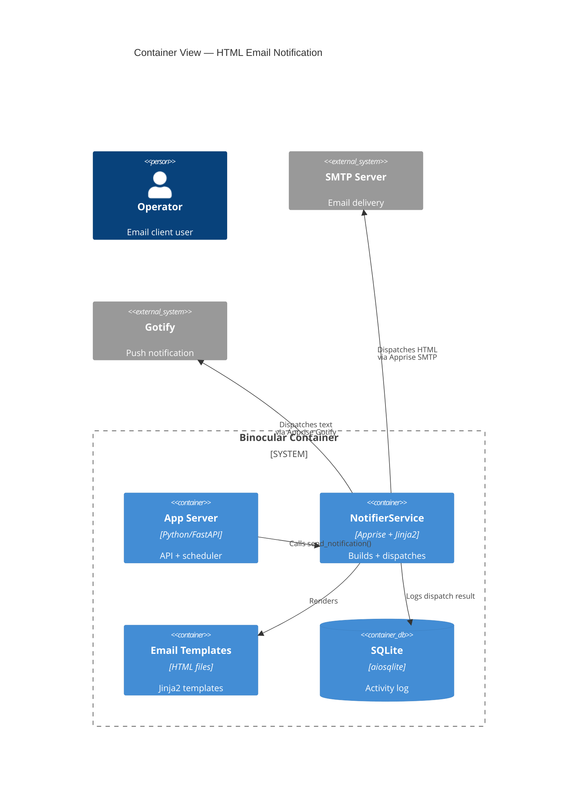

# Implementation Plan: HTML Email Notification Design

**Branch**: `00028-html-email-notification-design` | **Date**: 2026-06-07 | **Spec**: [spec.md](spec.md)

## Summary

**Goal**: Replace plain-text email notifications with responsive HTML emails matching the Binocular light color scheme.
**Approach**: Add Jinja2-based HTML template rendering to the existing notifier service, with per-channel format selection (HTML for SMTP, plain text for Gotify).
**Key Constraint**: Must not break Gotify notifications or alter the activity-log pipeline.

## Technical Context

**Language/Version**: Python 3.13 (backend only; no frontend changes)
**Primary Dependencies**: FastAPI, Apprise (v1.11.0, pinned), Jinja2 (v3.1.x, pinned via FastAPI dependency), html (stdlib). Dependency security advisories reviewed via Dependabot/safety on each upgrade.
**Storage**: N/A — no new schema or migration
**Testing**: pytest + pytest-asyncio, httpx.AsyncClient
**Target Platform**: Linux Docker container (`python:3.13-slim`), single port 8000
**Project Type**: web
**Project Mode**: brownfield
**Performance Goals**: Template rendering ≤50ms per email; no impact on check-loop throughput
**Constraints**: No Gotify regression; inline CSS only; 20-email-per-cycle cap; template failure → plain-text fallback
**Security**: SMTP credentials sourced from environment variables (not stored in source or Docker images); Apprise SMTP configured for TLS/STARTTLS (no plaintext auth fallback); Jinja2 template rendering has a 5-second timeout enforced via `asyncio.wait_for`; SMTP credentials and Apprise connection URLs redacted from all log output
**Scale/Scope**: Single-user, single-instance; ≤20 emails per check cycle

## Instructions Check

*GATE: Must pass before Phase 0 research. Re-check after Phase 1 design.*

| Gate | Status | Evidence |
|------|--------|----------|
| Type Safety (mypy --strict) | PASS | All new/edited Python modules under `backend/src/binocular/` will pass `mypy --strict` |
| Type Safety (tsc strict) | PASS | No frontend changes |
| Honest Failure | PASS | Template failure falls back to plain text + activity log entry (FR-012) |
| Polite by Default | PASS | No new outbound requests; email dispatch uses existing responsible-scraping-compliant path |
| Data Ownership | PASS | No new external dependencies beyond Jinja2 (stdlib-like template rendering) |
| Least-Privilege | PASS | No new trust boundaries; template rendering runs in-process with existing privileges |
| Set-and-Forget Reliability | PASS | Template failure isolates to plain-text fallback; no crash risk |
| Source Layout (ENFORCE_SRC_ROOT) | PASS | New `backend/src/binocular/templates/` directory for HTML templates |

## Architecture



## Architecture Decisions

| ID | Decision | Options Considered | Chosen | Rationale |
|----|----------|--------------------|--------|-----------|
| AD-001 | Template engine for HTML email | Jinja2 / `str.format()` / inline f-strings | Jinja2 | Already a dependency of FastAPI; supports auto-escaping; clean separation of markup and logic |
| AD-002 | Template storage location | `backend/src/binocular/templates/` / inline string constant / database | `backend/src/binocular/templates/` | Follows source-layout convention; filesystem templates allow independent editing and testing |
| AD-003 | HTML-vs-text dispatch branching | Per-channel type check in NotifierService / separate methods / dual Apprise instances | Per-channel type check in NotifierService | Minimal refactor; single Apprise instance serves both SMTP and Gotify; branching at dispatch time per channel protocol |
| AD-004 | HTML escaping strategy | Jinja2 autoescape / manual `html.escape()` / both | Both: Jinja2 autoescape enabled + manual escape for direct string interpolation | Defense in depth; Jinja2 autoescape handles template variables; manual escape guards any non-template string construction |
| AD-005 | MIME multipart/alternative boundary generation | Custom boundary / Python `email.mime` default | Python `email.mime` default (via Apprise) | Python's `email.mime.multipart.MIMEMultipart` uses `uuid.uuid4()` for cryptographically random boundary strings, preventing predictable-boundary content injection |

## Data Model Summary

N/A — no persistent data changes. The `EmailTemplate` entity is transient (constructed at dispatch time, not stored). The `notification_channels` table schema is unchanged. Activity log entries (`activity_log` table) already store dispatch results and need no schema change.

## API Surface Summary

N/A — no new REST API endpoints. The `NotifierService.send_notification()` method signature is extended internally with a `body_format` parameter; no external API surface changes.

## Testing Strategy

| Tier | Tool | Scope | Mock Boundary | Install |
|------|------|-------|---------------|---------|
| Unit | pytest | `EmailRenderer.render()` — Jinja2 template rendering with sample device data; `html.escape()` sanitization; `build_apprise_url()` unchanged | Apprise `notify()` call | configured |
| Integration | pytest + pytest-asyncio | `NotifierService.send_notification()` — HTML body passed to Apprise SMTP with `body_format=HTML`; Gotify receives plain text; fallback on template error | SMTP server, Gotify server | configured |
| Security | pytest | HTML escaping prevents injection in device names, versions, source URLs; template error path tested | — | configured |
| Coverage | pytest-cov | All new `templates/` and modified `notifications.py`/`checks.py` lines covered | — | configured |

## Error Handling Strategy

| Error Category | Pattern | Response | Retry |
|----------------|---------|----------|-------|
| Template render error | fail-fast | Fall back to plain-text email body; log error to activity log | No |
| SMTP dispatch failure | propagate | Log dispatch failure in activity log; preserve check result | No (existing behavior from E012) |
| HTML escape failure (non-string value) | convert-to-string | Coerce unexpected types via `str()` before escaping; log warning | No |
| Simultaneous dispatch cap exceeded (>20) | log-and-skip | Log excess detections as activity-log entries with "skipped" status | No |

## Integration Points

| Spec Reference | System/Service | Technical Approach | Contract |
|----------------|----------------|--------------------|----------|
| FR-011 (SMTP HTML dispatch) | Apprise SMTP plugin | `apobj.notify(body=html, body_format=NotifyFormat.HTML)` for SMTP channels | Apprise NotifyFormat enum |
| FR-008 (Gotify plain-text) | Apprise Gotify plugin | `apobj.notify(body=text, body_format=None)` for Gotify channels | Apprise default text format |
| E012 (NotifierService) | `notifier_service.send_notification()` | Extended with optional `body_format` parameter; existing callers unchanged | Internal Python interface |

## Risk Mitigation

| Risk (from spec) | Likelihood | Impact | Mitigation | Owner |
|-------------------|------------|--------|------------|-------|
| Email client rendering variance | Medium | Low | Use only email-safe inline CSS properties; test in Gmail, Apple Mail, Outlook; accept minor cosmetic differences in fringe clients | NotifierService |
| Notification dispatch library HTML body regression | Low | Medium | Verify HTML body format handling via integration test; test on dependency upgrade | NotifierService |
| Gotify receiving HTML by mistake | Low | Medium | Explicit per-channel format check; Gotify always receives `body_format=None`; integration test verifies zero HTML tags | NotifierService |

## Requirement Coverage Map

| Req ID | Component(s) | File Path(s) | Notes |
|--------|--------------|--------------|-------|
| FR-001 | EmailRenderer | `backend/src/binocular/templates/email_update.html` | Single-column layout, max-width 600px |
| FR-002 | EmailRenderer | `backend/src/binocular/templates/email_update.html` | All CSS inline via `style` attributes |
| FR-003 | EmailRenderer | `backend/src/binocular/services/email_renderer.py` | `html.escape()` on all data fields |
| FR-004 | EmailRenderer | `backend/src/binocular/templates/email_update.html` | Template slots for device fields |
| FR-005 | EmailRenderer | `backend/src/binocular/templates/email_update.html` | Version comparison row with accent emphasis |
| FR-006 | NotifierService | `backend/src/binocular/services/notifications.py` | Multipart/alternative construction |
| FR-007 | ChecksService | `backend/src/binocular/services/checks.py` | Subject line format in notification dispatch |
| FR-008 | NotifierService | `backend/src/binocular/services/notifications.py` | Gotify channel uses default plain-text body |
| FR-009 | ChecksService | `backend/src/binocular/services/checks.py` | Loop over detections, cap at 20 per cycle |
| FR-010 | EmailRenderer | `backend/src/binocular/templates/email_update.html` | Color tokens hardcoded as hex values in template |
| FR-011 | NotifierService | `backend/src/binocular/services/notifications.py` | Per-channel format selection; test notifications always text |
| FR-012 | NotifierService | `backend/src/binocular/services/notifications.py` | Try/except around template render; fallback on error |
| FR-013 | NotifierService | `backend/src/binocular/services/notifications.py` | Activity log write after dispatch (existing behavior) |
| FR-014 | EmailRenderer | `backend/src/binocular/services/email_renderer.py` | Truncate with ellipsis helper function |
| FR-015 | EmailRenderer | `backend/src/binocular/templates/email_update.html` | CSS `word-break: break-word; overflow-wrap: break-word` |

## Project Structure

### Source Code *(brownfield — only new/modified paths)*

```text
backend/src/binocular/
  services/
~   notifications.py        ← Add per-channel format branching + Jinja2 render call
~   checks.py               ← Update email subject line + data field preparation
+   email_renderer.py        ← NEW: Jinja2 template loader + html.escape() sanitizer
+ templates/
+   email_update.html         ← NEW: Responsive HTML email template (inline CSS)
+   email_update.txt          ← NEW: Plain-text fallback template
backend/tests/
~   test_notifications_service.py  ← Add HTML format + template error fallback tests
+   test_email_renderer.py          ← NEW: Template rendering + escaping unit tests
```

**Patterns to reuse**: `NotifierService` class structure, Apprise `apobj.notify()` dispatch, `structlog` logging, `asyncio.to_thread()` async wrapping.
**Tests to extend**: `test_notifications_service.py` — add `body_format=NotifyFormat.HTML` mock assertion, template error recovery test, per-channel format test.
**Naming conventions**: Snake-case Python modules under `backend/src/binocular/`; test files prefixed with `test_`; HTML templates lowercase with underscores.

## Implementation Hints

- **[HINT-001]** Order: Create `email_renderer.py` and template files first, then modify `notifications.py` to integrate, then update `checks.py` subject line last.
- **[HINT-002]** Jinja2: FastAPI already depends on Jinja2 via Starlette — no new pip dependency. Use `jinja2.Environment` with `autoescape=True` and `FileSystemLoader` pointing at `templates/`.
- **[HINT-003]** Apprise format: SMTP dispatch must pass `body_format=NotifyFormat.HTML`; Gotify dispatch must pass `body_format=None` (or omit parameter). Per-channel branching uses `apprise.Apprise` channel list inspection or separate per-channel `notify()` calls.
- **[HINT-004]** Template packaging: Ensure `templates/` directory is included in the Docker image. Add to `Dockerfile` COPY directive in the backend stage.
- **[HINT-005]** Gotcha: The existing `apobj.notify()` call dispatches to ALL loaded channels at once. To apply different `body_format` per channel, dispatch SMTP and Gotify separately — iterate over channel list, inspect protocol, and call `notify()` per channel with appropriate format.
