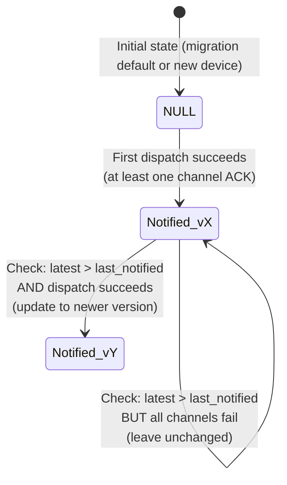
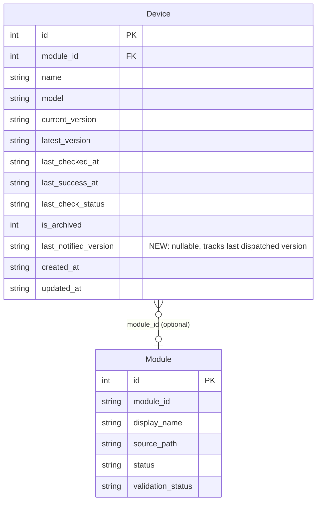

# Data Model: Notification Deduplication

**Feature**: 00029-notification-deduplication  
**Database**: SQLite (aiosqlite, raw SQL, no ORM)  
**Affected Table**: `devices` (ALTER TABLE ADD COLUMN)  
**Migration Number**: 009

## Entity Table

| Entity | Attributes (name: type, constraints) | Relationships | State Transitions |
|--------|--------------------------------------|---------------|-------------------|
| **Device** (extended) | `id`: INTEGER PK<br>`module_id`: INTEGER FK→modules(id) NULL<br>`name`: TEXT NOT NULL<br>`model`: TEXT NOT NULL<br>`current_version`: TEXT NOT NULL<br>`latest_version`: TEXT NULL<br>`last_checked_at`: TEXT NULL<br>`last_success_at`: TEXT NULL<br>`last_check_status`: TEXT NOT NULL DEFAULT 'never_checked'<br> CHECK (IN 'never_checked','check_failed','update_available','up_to_date')<br>`is_archived`: INTEGER NOT NULL DEFAULT 0<br> CHECK (IN 0,1)<br>**`last_notified_version`: TEXT NULL** ← NEW<br>`created_at`: TEXT NOT NULL DEFAULT CURRENT_TIMESTAMP<br>`updated_at`: TEXT NOT NULL DEFAULT CURRENT_TIMESTAMP | belongs_to: Module (N:1 via module_id) | `last_notified_version`: NULL → version_string (first dispatch succeeds)<br><br>`last_notified_version`: vX → vY (dispatch succeeds for newer version)<br><br>`last_notified_version`: unchanged when all channels fail **or** when latest_version ≤ last_notified_version (dedup suppresses) |

## Schema Change

### Migration SQL (009_last_notified_version.sql)

```sql
-- Migration: Add last_notified_version to devices for notification deduplication
-- Number: 009
-- Requires: PRAGMA foreign_keys = ON

ALTER TABLE devices
    ADD COLUMN last_notified_version TEXT DEFAULT NULL;
```

**Startup signal**: On application startup after migration, log at INFO level: `structlog.info("notification_deduplication_active", last_notified_version_column="devices.last_notified_version", migration="009", existing_devices_count=N)` — confirming the feature is deployed and active, with the count of existing devices initialized to NULL.

### Post-Migration Column Constraints

| Property | Value |
|----------|-------|
| Default | NULL |
| Nullable | Yes (NULL = never notified) |
| Format | Free-text firmware version string (same domain as `current_version` / `latest_version`) |
| Index | None (queried only per-device via PK; dedup gate is per-row, not cross-row) |

## Dataclass Change

`DeviceRecord` in `backend/src/binocular/repositories/inventory.py` gains one field:

```python
@dataclass(frozen=True)
class DeviceRecord:
    id: int
    module_id: int | None
    module_id_str: str | None
    device_type: str
    name: str
    model: str
    current_version: str
    latest_version: str | None
    last_checked_at: str | None
    last_success_at: str | None
    status: str
    last_notified_version: str | None        # ← NEW
    created_at: str
    updated_at: str
```

All `SELECT` queries in `get_device()`, `require_device()`, and `list_active_devices()` must include `d.last_notified_version` in the column list. The corresponding `_record_from_row()` factory reads it via `_optional_text()`.

## Locking Strategy (FR-008)

Per-device serialization uses `BEGIN IMMEDIATE` transaction wrapping the read-modify-write of `last_notified_version`:

```
BEGIN IMMEDIATE
SELECT ... FROM devices WHERE id = ? AND is_archived = 0  -- implicit row lock via pending write tx
-- evaluate dedup gate using compare_versions(latest_version, last_notified_version)
-- persist check result (record_check_success / record_check_failure)
-- if dispatch succeeded: UPDATE devices SET last_notified_version = ? WHERE id = ?
COMMIT
```

- SQLite uses database-level locking; `BEGIN IMMEDIATE` acquires a reserved lock immediately, serializing concurrent writers.
- The dedup gate reads `last_notified_version` *inside* the write transaction, ensuring no concurrent check reads a stale value.
- No `SELECT ... FOR UPDATE` syntax in SQLite — the `BEGIN IMMEDIATE` + `UPDATE` pattern achieves equivalent serialization.

## Dedup Gate Logic

```python
# Pseudocode (actual implementation uses compare_versions() from version_compare.py)
if last_notified_version is None:
    # Never notified — dispatch permitted
    should_notify = True
else:
    comparison = compare_versions(last_notified_version, latest_version)
    should_notify = comparison.is_newer  # strictly newer required
```

| Condition | `last_notified_version` | `latest_version` | Result |
|-----------|------------------------|-------------------|--------|
| First ever detection | NULL | any | Notify (FR-003) |
| Known version re-detected | "2.0" | "2.0" | Suppress (FR-002) |
| Older version detected | "2.0" | "1.5" | Suppress (FR-002) |
| Newer version detected | "2.0" | "2.1" | Notify (FR-002) |

## Write Semantics for last_notified_version

| Scenario | Action |
|----------|--------|
| Dedup gate returns should_notify = False | Leave `last_notified_version` unchanged |
| Dedup gate returns should_notify = True AND at least one channel returns transport success | UPDATE `last_notified_version = latest_version` (FR-004) |
| Dedup gate returns should_notify = True AND all channels fail or zero channels configured | Leave `last_notified_version` unchanged (FR-005, edge case) |

The UPDATE to `last_notified_version` occurs in the same `BEGIN IMMEDIATE` transaction as the check result persistence. A new repository method `record_notification_dispatched(device_id, version)` encapsulates the column write (see `## Repository Changes` below).

## Repository Changes

`InventoryRepository` gains one method. No existing method signatures change.

| Method | Purpose | SQL |
|--------|---------|-----|
| `record_notification_dispatched(device_id: int, version: str) -> int` | Persist `last_notified_version` after confirmed dispatch | `UPDATE devices SET last_notified_version = ?, updated_at = CURRENT_TIMESTAMP WHERE id = ? AND is_archived = 0` |

Returns row count (0 if device archived/not found). Caller (`CheckService`) invokes this inside the same `BEGIN IMMEDIATE` → `COMMIT` window as the check result write.

## Validation Rules

| Rule | Source | Enforcement |
|------|--------|-------------|
| `last_notified_version` is only updated after transport-level success (boolean `True` from `NotifierService.send_notification()`) | FR-004 | Application logic in `CheckService.run_device_check()` |
| `last_notified_version` is never reset to NULL by the application after first set | implied by FR-001 | No code path writes NULL to the column except initial migration default |
| Dedup comparison uses the same `compare_versions()` as the update-available check | FR-002, risk mitigation | Single import: `from binocular.services.version_compare import compare_versions` |
| Dedup decisions logged at INFO level with device ID, versions, decision, and trigger source | FR-009 | `structlog.info("notification_dedup_decision", device_id=..., latest_version=..., last_notified_version=..., decision="suppressed"\|"dispatched", trigger="scheduled"\|"manual")` |
| Current check result status shown as `up_to_date` when dedup suppresses (no distinct "suppressed" status) | Clarification Q7 | Existing `record_check_success(device_id, latest_version, status="up_to_date")` |
| Check initiation logged at INFO level with device_id and trigger source | FR-010 | `structlog.info("check_initiated", device_id=..., trigger="scheduled"\|"manual")` |
| `last_notified_version` state transitions logged at INFO level | FR-011 | `structlog.info("last_notified_version_updated", device_id=..., previous_value=..., new_value=..., trigger="scheduled"\|"manual")` |

## State Transition Diagram

<details><summary>Notification State Machine (visual reference)</summary>



</details>

<details><summary>ER Diagram (visual reference)</summary>



</details>

## Brownfield Integration Notes

- **Migration numbering**: Next available is `009`. File path: `backend/src/binocular/db/migrations/009_last_notified_version.sql`.
- **Existing query compatibility**: `get_device`, `require_device`, `list_active_devices` all use explicit column lists — no `SELECT *`. Each must add `d.last_notified_version`.
- **Existing record factory**: `_record_from_row()` must include `last_notified_version=_optional_text(row["last_notified_version"])`.
- **No FK or index changes**: The column is self-contained per-row metadata; no foreign key, no composite index needed.
- **API exposure**: `DeviceRecord.last_notified_version` flows through existing API response serialization — the device detail endpoint automatically includes the field once the dataclass has it.
- **Test pattern**: Existing `test_checks_service.py` uses real SQLite with migrations. Tests for the dedup gate follow the same pattern — seed a device, run checks, assert on `last_notified_version` column reads and notification dispatch side effects.
