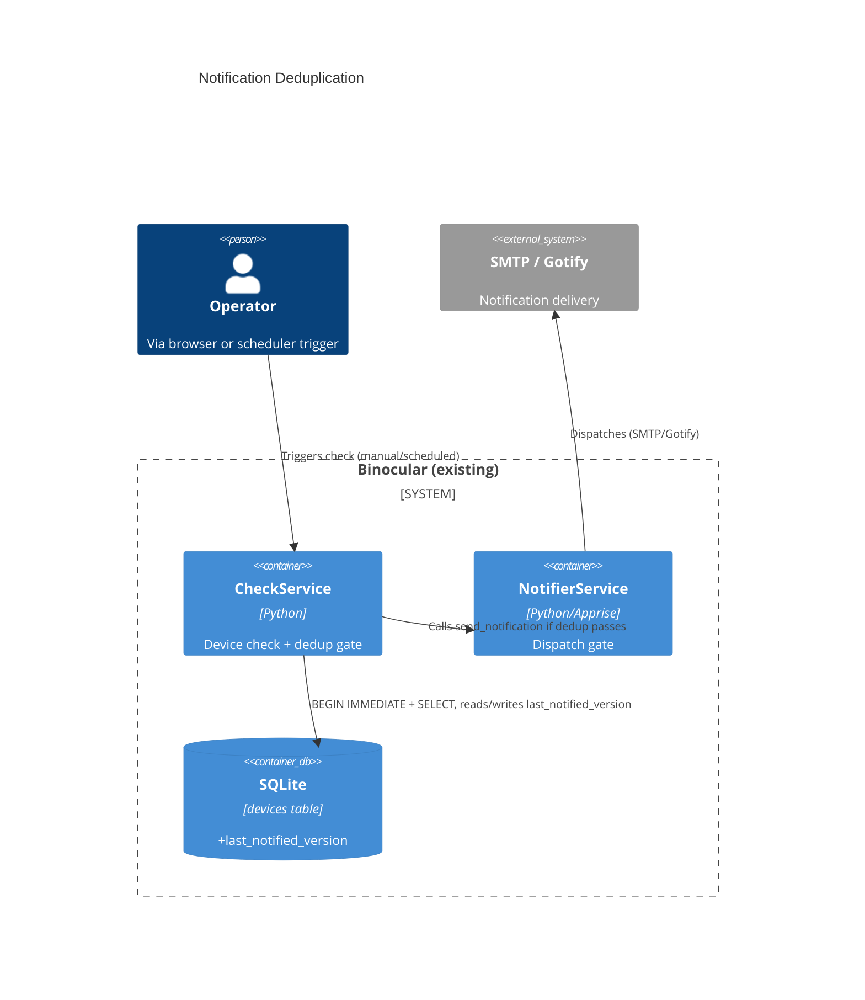

# Implementation Plan: Notification Deduplication

**Branch**: `00029-notification-deduplication` | **Date**: 2026-06-07 | **Spec**: [spec.md](spec.md)

## Summary

**Goal**: Suppress duplicate firmware-update notifications when the same version is re-detected; re-notify only when a strictly newer version appears.  
**Approach**: Add `last_notified_version` column to `devices` table, gate `NotifierService.send_notification()` with per-device `SELECT ... FOR UPDATE` lock + `compare_versions()` check.  
**Key Constraint**: Must not break existing notification flow; first detection after deployment treats NULL `last_notified_version` as pass-through.

## Technical Context

**Language/Version**: Python 3.13  
**Primary Dependencies**: FastAPI, aiosqlite, APScheduler, Apprise  
**Storage**: SQLite (`binocular.db`) via aiosqlite, raw SQL, numbered migrations  
**Testing**: pytest + pytest-asyncio, httpx.AsyncClient  
**Target Platform**: Linux Docker container (`python:3.13-slim`)  
**Project Type**: web  
**Project Mode**: brownfield  
**Performance Goals**: Single-user, single-instance; concurrent checks bounded by existing semaphore  
**Constraints**: No ORM; raw parameterized SQL; non-root container; trusted-LAN single-user  
**Scale/Scope**: 5-50+ devices; one background scheduler + manual checks

## Instructions Check

*GATE: Must pass before Phase 0 research. Re-check after Phase 1 design.*

| Principle | Status | Notes |
|-----------|--------|-------|
| I. Honest Failure | PASS | Dedup suppression is logged at INFO; dispatch failures leave `last_notified_version` unchanged for retry |
| II. Polite by Default | PASS | No new outbound scraping; dedup gates existing scrape pipeline |
| III. Data Ownership & Self-Containment | PASS | `last_notified_version` stored in existing SQLite volume; no external dependency |
| IV. Least-Privilege & Trust Boundary | PASS | No change to module execution or trust boundaries |
| V. Type Safety & Correctness-First | PASS | `mypy --strict` applies; `compare_versions()` reuse prevents inconsistency |
| VI. Set-and-Forget Reliability | PASS | Gate is fault-tolerant; dispatch failure retries; concurrency control prevents races |
| VII. Agent Output Style | PASS | N/A — implementation artifact |

## Architecture



## Architecture Decisions

| ID | Decision | Options Considered | Chosen | Rationale |
|----|----------|--------------------|--------|-----------|
| AD-001 | Concurrency control for per-device dedup gate | BEGIN IMMEDIATE transaction / optimistic UPDATE WHERE / app-level mutex | BEGIN IMMEDIATE | SQLite uses database-level locking; BEGIN IMMEDIATE acquires reserved lock immediately, serializing concurrent writers; simplest correct approach for single-process monolith; no ORM overhead |
| AD-002 | Dedup state column placement | New table (device_notifications) / devices column | devices column | Single last_notified_version per device; new table overkill for single-field tracking |
| AD-003 | dispatch success definition | Transport-level ack (SMTP 250, HTTP 2xx) / delivery confirmation | Transport-level ack | Existing NotifierService.send_notification() returns bool based on Apprise result; transport ack is the available signal |
| AD-004 | Dedup decision logging | INFO-structured / DEBUG-only / no dedicated log | INFO-structured | Required for debugging and audit; matches existing structlog INFO pattern for check activity |
| AD-005 | check result status during suppression | up_to_date / new suppressed status | up_to_date | Device is current relative to known latest; avoids proliferating check statuses; consistent with existing enum |

## Data Model Summary

| Entity | Key Fields | Relationships | Notes |
|--------|------------|---------------|-------|
| Device (extended) | `last_notified_version TEXT NULL` | FK → modules.id | NULL = never notified. Updated after at least one channel confirms dispatch. Read under `BEGIN IMMEDIATE` transaction lock. |

**Detail**: [data-model.md](data-model.md)

## API Surface Summary

No new endpoints. The existing `GET /api/v1/inventory/devices/{id}` response will include the new `last_notified_version` field (auto-serialized from `DeviceRecord`). No frontend code changes required — the field is available for UI consumption via existing API contract.

## Testing Strategy

| Tier | Tool | Scope | Mock Boundary | Install |
|------|------|-------|---------------|---------|
| Unit | pytest | compare_versions dedup gate, last_notified_version DB read/write, dispatch gate logic | Repository, NotifierService | configured |
| Integration | pytest-asyncio + aiosqlite | CheckService.run_device_check with dedup gate, NotifierService integration, migration application | SMTP/Gotify (mock Apprise) | configured |
| Security | Trivy | Built image | — | configured |
| Coverage | pytest-cov | ≥80% on new/changed lines | — | configured |

## Error Handling Strategy

| Error Category | Pattern | Response | Retry |
|----------------|---------|----------|-------|
| Concurrent check race | BEGIN IMMEDIATE serialization | Second check waits for lock release, reads updated last_notified_version | N/A (serialized) |
| All channels fail | notifier returns False for all channels | Leave last_notified_version unchanged; log warning with `device_id`, `failed_channels` (list of channel names), and per-channel failure reasons (transport error message, HTTP status code, exception type) | Next check retries naturally |
| Partial channel failure | At least one channel returns True | Update last_notified_version; log warning with `device_id`, `failed_channel` name, and failure reason (transport error message, HTTP status code, exception type) | No (dedup satisfied) |
| Invalid last_notified_version string | compare_versions raises VersionComparisonError | Treat as NULL (never notified); log error with `device_id`, `last_notified_version` (raw string), `exception_type`, `module_id` | Fix on next valid check |
| Zero configured channels | No channels to dispatch to | **Pre-check channel count before calling `send_notification()`**; skip dispatch entirely; leave last_notified_version unchanged; log at WARNING level with `device_id`, `reason="zero_channels_configured"`. NOTE: `NotifierService.send_notification()` returns `True` for zero channels — the pre-check must guard before the call, not rely on return value. | Operator must configure channels |
| version_compare error | Module returns unparseable version | Record as check_failed; do not update last_notified_version; log error with `device_id`, `module_id`, `raw_version_string`, `exception_type`, and `exception_message` | Next check retries |
| Notification dispatch timeout | Channel adapter hangs or exceeds timeout | Treat as channel failure; do not update last_notified_version; log warning with `device_id`, `channel_name`, and timeout duration | Next check retries naturally |

## Risk Mitigation

| Risk (from spec) | Likelihood | Impact | Mitigation | Owner |
|-------------------|------------|--------|------------|-------|
| Version comparison inconsistency | Low | High | Use exact same compare_versions() call for both update-available and dedup gates | CheckService |
| Dispatch failure edge cases | Medium | Medium | At-least-one-channel rule; leave last_notified_version unchanged on total failure; logging at INFO | NotifierService |

## Requirement Coverage Map

| Req ID | Component(s) | File Path(s) | Notes |
|--------|--------------|--------------|-------|
| FR-001 | InventoryRepository, migration runner | `backend/src/binocular/repositories/inventory.py`, `backend/src/binocular/db/migrations/009_dedup.sql` | ALTER TABLE ADD COLUMN last_notified_version TEXT |
| FR-002 | CheckService | `backend/src/binocular/services/checks.py` | Gate notify with compare_versions(latest, last_notified) |
| FR-003 | CheckService | `backend/src/binocular/services/checks.py` | NULL last_notified_version → allow first notification |
| FR-004 | CheckService, NotifierService | `backend/src/binocular/services/checks.py`, `backend/src/binocular/services/notifications.py` | Update after at least one channel returns True |
| FR-005 | CheckService | `backend/src/binocular/services/checks.py` | Leave unchanged when all channels return False |
| FR-006 | CheckService | `backend/src/binocular/services/checks.py` | Dedup gate applies to run_device_check only (shared path) |
| FR-007 | NotifierService | `backend/src/binocular/services/notifications.py` | No change to notification format/route logic |
| FR-008 | InventoryRepository, CheckService | `backend/src/binocular/repositories/inventory.py`, `backend/src/binocular/services/checks.py` | get_device_for_update() with BEGIN IMMEDIATE transaction lock |
| FR-009 | CheckService | `backend/src/binocular/services/checks.py` | structlog.info with device_id, latest, last_notified, decision, trigger |
| FR-010 | CheckService | `backend/src/binocular/services/checks.py` | structlog.info on check initiation with device_id, trigger |
| FR-011 | CheckService | `backend/src/binocular/services/checks.py` | structlog.info on last_notified_version update with device_id, previous_value, new_value, trigger |

## Project Structure

### Source Code

```text
backend/src/binocular/
├── db/migrations/
│   └── + 009_add_last_notified_version.sql
├── repositories/
│   └── ~ inventory.py            (add last_notified_version to DeviceRecord, add record_last_notified_version, add get_device_for_update)
└── services/
    └── ~ checks.py               (add dedup gate, BEGIN IMMEDIATE transaction, logging, notifier result check)
backend/tests/
├── + test_notification_deduplication.py
└── ~ conftest.py                 (extend fixtures if needed)
```

**Patterns to reuse**: Repository pattern (base.py → parameterized SQL), structlog logging, numbered SQL migrations, dataclass DeviceRecord with frozen=True
**Tests to extend**: Existing check service tests in backend/tests/; existing inventory repository tests
**Naming conventions**: snake_case files and methods, PascalCase classes, UPPER_SNAKE constants

## Implementation Hints

- **[HINT-001]** Migration ordering: assign next available migration number (009) — run `ls backend/src/binocular/db/migrations/` first to confirm
- **[HINT-002]** The dedup gate requires reading `last_notified_version` inside an explicit write transaction (`BEGIN IMMEDIATE`) to serialize concurrent per-device checks. The existing `run_device_check` already runs in the FastAPI request context without manual transaction management — wrap the dedup read+gate in a `connection.execute("BEGIN IMMEDIATE")`/`ROLLBACK`/`COMMIT` block
- **[HINT-003]** NotifierService.send_notification() returns `bool` — check the return value before updating last_notified_version. **Caveat**: `send_notification()` returns `True` when zero channels are configured — use a zero-channels pre-check (see HINT-006) before calling `send_notification()`. Existing call site in checks.py:221 dispatches unconditionally; the dedup gate wraps this call
- **[HINT-004]** DeviceRecord is frozen — create a new DeviceRecord with last_notified_version populated; do not mutate existing instances
- **[HINT-005]** Existing devices (no last_notified_version) after migration: NULL treated as "never notified" per FR-003 — first newer-than-current detection dispatches normally
- **[HINT-006]** Zero-channels guard: before calling `send_notification()`, check if any notification channels are configured. If none, skip dispatch entirely, leave `last_notified_version` unchanged, and log WARNING with `device_id`, `reason="zero_channels_configured"`. Do NOT rely on `send_notification()` return value — it returns `True` for zero channels.
