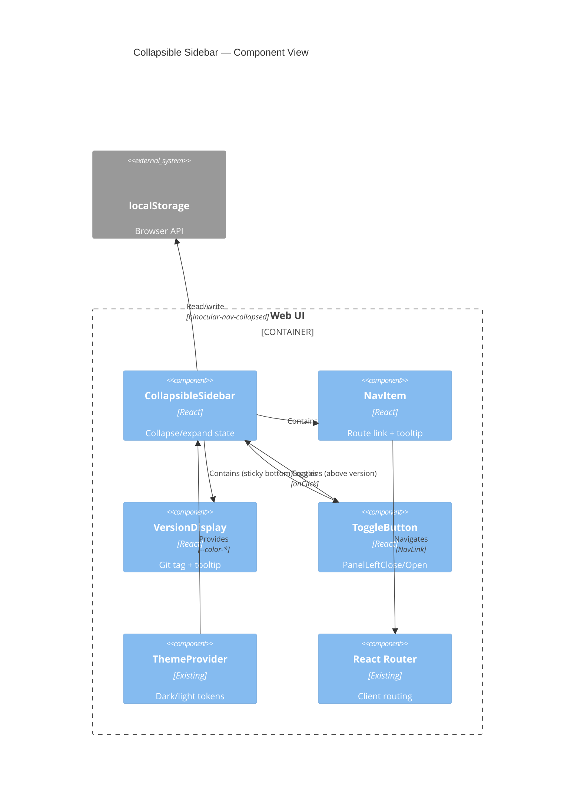

# Implementation Plan: Collapsible Menu & Version Display

**Branch**: `00030-collapsible-menu-version-display` | **Date**: 2026-06-08 | **Spec**: [spec.md](spec.md)

## Summary

**Goal**: Add a desktop collapsible sidebar (icon-only with tooltips) and a build-time version string at the sidebar bottom.  
**Approach**: Extend the existing React SPA sidebar with collapse state (useState + localStorage), toggle button (lucide-react icons), and VITE_APP_VERSION env injection at Docker build time.  
**Key Constraint**: Desktop-only (viewport ≥768px); mobile hamburger overlay must remain untouched.

## Technical Context

**Language/Version**: TypeScript 5.x / React 18 (frontend)  
**Primary Dependencies**: React, Vite, Tailwind CSS, React Router, TanStack Query, lucide-react  
**Storage**: localStorage only (`binocular-nav-collapsed` key) — no persistent storage  
**Testing**: Vitest + React Testing Library + jsdom  
**Target Platform**: Browser (desktop ≥768px); Docker multi-stage build  
**Project Type**: web (frontend-only feature)  
**Project Mode**: brownfield  
**Performance Goals**: Smooth CSS transitions (no layout thrash); rapid toggle clicks must not glitch  
**Constraints**: Desktop breakpoint only; synchronous sidebar/content margin transition; E003 nav structure must be stable; no runtime version API call  
**Scale/Scope**: Single-user single-browser; localStorage key collision across tabs is accepted last-write-wins

## Instructions Check

*GATE: Must pass before Phase 0 research. Re-check after Phase 1 design.*

All planning decisions comply with Binocular project instructions (v1.0.0). No violations detected — feature is frontend-only UI work, adds no backend/database/external-service dependencies, respects trusted-LAN single-user model, and uses existing build pipeline.

## Architecture



## Architecture Decisions

Feature-local tradeoffs only. Project-wide decisions are in `specs/sad.md` (ADR-0001–ADR-0009).

| ID | Decision | Options Considered | Chosen | Rationale |
|----|----------|--------------------|--------|-----------|
| AD-001 | Collapse state initialization | A: `useState` with lazy `localStorage` reader / B: `useEffect` + second render | `useState` lazy initializer | Eliminates flash-of-wrong-state on first render; synchronous read guarantees correct initial width |
| AD-002 | Tooltip implementation | A: Tailwind `group-hover` + CSS `transition-opacity` / B: headless-ui / C: floating-ui | Tailwind `group-hover` + `focus-visible` | Zero new dependencies; matches existing Tailwind pattern; handles keyboard focus via `:focus-visible` |
| AD-003 | Version env injection | A: Docker `ARG`/`ENV` before Vite build / B: runtime API endpoint / C: `.env` file committed | Docker ARG/ENV in existing frontend-builder stage | Follows existing ADR-0003 multi-stage build; no runtime call needed; Vite statically replaces at compile time |

## Data Model Summary

N/A — no persistent data. Sidebar preference uses localStorage only, no entity model.

## API Surface Summary

N/A — no API surface. Version is a compile-time constant; no runtime endpoints.

## Testing Strategy

| Tier | Tool | Scope | Mock Boundary | Install |
|------|------|-------|---------------|---------|
| Unit | Vitest + React Testing Library | Collapse toggle, width class toggling, localStorage read/write, version display rendering | `localStorage` mock, `import.meta.env` mock | `configured` (existing `vitest` in package.json) |
| Integration | Vitest + React Testing Library | Full sidebar render with nav items, tooltip show/hide timing, keyboard focus behavior, theme compatibility | Router wrapper (MemoryRouter), ThemeProvider wrapper | `configured` |
| Security | N/A | N/A — no external dependencies, no user input, no API calls introduced | — | N/A — frontend-only UI feature |
| Coverage | `@vitest/coverage-v8` | All new component code ≥80% | — | `configured` (already in devDependencies) |

## Error Handling Strategy

N/A — no new API endpoints, external service calls, or user-facing error states. localStorage write failures are handled inline via try-catch (FR-006).

## Risk Mitigation

| Risk (from spec) | Likelihood | Impact | Mitigation | Owner |
|-------------------|------------|--------|------------|-------|
| No git tags exist at build time | Low | Medium | Version display falls back to abbreviated commit SHA via `git describe --always` | Dockerfile build stage |
| localStorage quota exceeded or unavailable | Low | Low | try-catch on write; default to expanded state; no crash | CollapsibleSidebar |
| Sidebar changes conflict with future responsive/mobile changes | Medium | Medium | Collapsible behavior scoped to `md:` breakpoint (≥768px); mobile code path untouched | CollapsibleSidebar |
| Keyboard-only operators cannot access hover tooltips | Medium | High | FR-003 requires focus tooltips + `aria-label` on all NavLink elements; test with keyboard navigation | NavItem |

## Requirement Coverage Map

| Req ID | Component(s) | File Path(s) | Notes |
|--------|--------------|--------------|-------|
| FR-001 | CollapsibleSidebar, ToggleButton | `~ frontend/src/App.tsx` | Toggle button with PanelLeftClose/Open; width classes `md:w-64`/`md:w-16`; margin-left sync |
| FR-002 | NavItem | `~ frontend/src/App.tsx` | Hide `<span>` label when collapsed via conditional class |
| FR-003 | NavItem | `~ frontend/src/App.tsx` | Tooltip via group-hover/focus-visible; `aria-label` on NavLink; 200-300ms delay for mouse |
| FR-004 | VersionDisplay | `+ frontend/src/components/VersionDisplay.tsx`, `~ frontend/src/App.tsx` | Sticky-bottom version; truncated in collapsed; tooltip on hover |
| FR-005 | Dockerfile, Build system | `~ Dockerfile` | `ARG VITE_APP_VERSION` + `ENV` in frontend-builder; `git describe --tags --always --dirty` |
| FR-006 | CollapsibleSidebar | `~ frontend/src/App.tsx` | `localStorage` read in lazy initializer; try-catch on write; key `binocular-nav-collapsed` |
| FR-007 | All components | `~ frontend/src/App.tsx` | Regression: verify routes, deep links, theme toggle, mobile hamburger unchanged |
| FR-008 | ToggleButton, VersionDisplay | `~ frontend/src/App.tsx`, `+ frontend/src/components/VersionDisplay.tsx` | Use existing `--color-*` CSS custom property tokens |

## Project Structure

### Source Code

```text
~ Dockerfile                              # Add ARG VITE_APP_VERSION + ENV in frontend-builder stage
~ frontend/src/App.tsx                    # Add collapse state, toggle button, tooltip, localStorage, version display area
+ frontend/src/components/VersionDisplay.tsx  # New: version string component (expanded/collapsed/tooltip states)
```

#### Brownfield Notes

**Patterns to reuse**: Existing `<aside>` flex-col layout, NavItem mapping over `navItems` array, Tailwind `motion-safe:transition-*` pattern, lucide-react icon usage (PanelLeftClose, PanelLeftOpen available in lucide-react).

**Tests to extend**: `frontend/src/App.test.tsx` — add test cases for collapse toggle, localStorage persistence, tooltip rendering, version display.

**Naming conventions**: PascalCase components, camelCase state variables, existing tailwind class ordering convention.

## Implementation Hints

- **[HINT-001]** *Order*: In Dockerfile, `ARG VITE_APP_VERSION` must appear *before* `ENV VITE_APP_VERSION=$VITE_APP_VERSION` in the frontend-builder stage. Docker only passes ARG values to subsequent layers, not to sibling or parent stages.
- **[HINT-002]** *Gotcha*: The `.git` directory must be present in the Docker build context for `git describe`. If using `.dockerignore`, ensure `.git` is not excluded. For shallow CI clones, add `git fetch --unshallow --tags` before the build invocation.
- **[HINT-003]** *Performance*: Use Tailwind `transition-[width]` on the sidebar `<aside>` rather than `transition-all` to avoid child-element layout thrash during animation. The main content uses `transition-[margin-left]` with matching `duration-300 ease-in-out`.
- **[HINT-004]** *Compatibility*: The `aria-expanded` attribute on the toggle button must reflect the *opposite* of the collapsed state (`aria-expanded={!isCollapsed}`) — when sidebar IS collapsed, the button says it can BE expanded. Verify with screen reader tooling.
- **[HINT-005]** *Constraint*: The version component sits outside the scrollable `<nav>` in the `<aside>` flex column. Use `mt-auto` on the spacer before the version display to push it to the bottom without breaking the flex layout on mobile.
