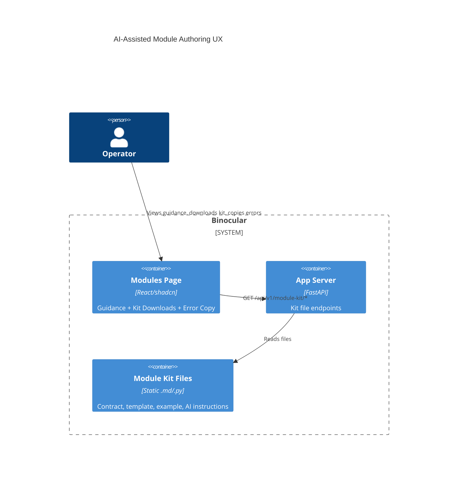

# Implementation Plan: AI-Assisted Module Authoring UX

**Branch**: `00032-ai-assisted-module-authoring-ux` | **Date**: 2026-06-09 | **Spec**: [spec.md](spec.md)

## Summary

**Goal**: Enable operators to create extension modules with AI assistance through in-UI guidance, a downloadable AI Module Kit, and AI-friendly validation error copy-paste.
**Approach**: Add static kit files served by FastAPI, a React guidance section on the Modules page, and a clipboard copy feature on the ValidationSummary component.
**Key Constraint**: No new backend Python dependencies; kit files use only stdlib.

## Technical Context

**Language/Version**: Python 3.13 (backend); TypeScript 5.x / React 19 (frontend)
**Primary Dependencies**: FastAPI, Pydantic (backend); React, Vite, Tailwind CSS 4.x, shadcn/ui, Radix UI (frontend)
**Storage**: N/A — no persistent data changes
**Testing**: pytest + pytest-asyncio (backend); Vitest + React Testing Library (frontend)
**Target Platform**: Linux Docker container (`python:3.13-slim`), single port 8000
**Project Type**: web
**Project Mode**: brownfield
**Performance Goals**: N/A — static file serving, no performance-sensitive operations
**Constraints**: No new backend dependencies; kit files self-contained; tool-agnostic AI instructions
**Scale/Scope**: Single user; kit files <50 KB total

## Instructions Check

*GATE: Must pass before Phase 0 research. Re-check after Phase 1 design.*

- **I. Honest Failure**: Kit download failures surface visibly. ✅
- **II. Polite by Default**: No outbound scraping. ✅
- **III. Data Ownership**: No external services or telemetry. ✅
- **IV. Least-Privilege**: Trust boundary documented in guidance section. ✅
- **V. Type Safety**: `mypy --strict` (backend), `tsc` strict (frontend). ✅
- **VI. Set-and-Forget**: Kit bundled with image; zero config. ✅
- **Source Layout**: `ENFORCE_SRC_ROOT` — backend under `backend/src/`, frontend under `frontend/src/`. ✅

**Result**: PASS

## Architecture



## Architecture Decisions

| ID | Decision | Options Considered | Chosen | Rationale |
|----|----------|--------------------|--------|-----------|
| AD-001 | Kit file storage location | Separate data volume / Backend source tree | Backend source tree (`backend/src/binocular/module_kit/`) | Files are static content bundled with the Docker image; no runtime mutation needed. Follows ENFORCE_SRC_ROOT. |
| AD-002 | Zip bundle generation | Build-time / On-demand at request time | On-demand with in-memory caching | Avoids build complexity; kit is small (<50 KB); stdlib `zipfile` + `io.BytesIO` sufficient. Cache invalidated on restart. |
| AD-003 | Error copy format | Raw JSON / Structured plain text / Markdown | Structured plain text with AI preamble | Tool-agnostic; AI tools parse plain text better than JSON; includes fix instruction preamble for immediate use. |

## Data Model Summary

N/A — no persistent data changes.

## API Surface Summary

| Method | Path | Purpose | Auth | Req/Res Types |
|--------|------|---------|------|---------------|
| GET | `/api/v1/module-kit/files` | List available kit files with metadata | None (trusted LAN) | — / `KitFileListResponse` |
| GET | `/api/v1/module-kit/files/{filename}` | Download individual kit file | None | — / file download |
| GET | `/api/v1/module-kit/bundle` | Download .zip bundle of all kit files | None | — / .zip file download |

## Testing Strategy

| Tier | Tool | Scope | Mock Boundary | Install |
|------|------|-------|---------------|---------|
| Unit | pytest | Backend kit file listing, zip generation | Filesystem (use tmp_path) | configured |
| Unit | Vitest + RTL | Guidance section render, copy-to-clipboard mock | navigator.clipboard | configured |
| Integration | pytest + httpx.AsyncClient | Kit API endpoints return correct files | None (real files) | configured |
| Security | N/A | No new attack surface (static file serving on trusted LAN) | — | — |
| Coverage | pytest-cov / vitest --coverage | 80% target | — | configured |

## Error Handling Strategy

| Error Category | Pattern | Response | Retry |
|----------------|---------|----------|-------|
| Kit file missing | Fail-fast | 404 + descriptive error | No |
| Zip generation failure | Catch + log | 500 + error detail | No |
| Clipboard API unavailable | Graceful degradation | Show fallback text selection or inline error | No |

## Risk Mitigation

| Risk (from spec) | Likelihood | Impact | Mitigation | Owner |
|-------------------|------------|--------|------------|-------|
| AI output quality varies by tool | Medium | Medium | Two-phase validation catches invalid modules; kit includes explicit contract requirements | Module engine (E006) |
| Kit content staleness | Low | Medium | Kit files derived from existing authoring guide; update process documented | Backend kit directory |

## Requirement Coverage Map

| Req ID | Component(s) | File Path(s) | Notes |
|--------|--------------|--------------|-------|
| FR-001 | ModulesPage, GuidanceSection | `frontend/src/components/modules/ModulesPage.tsx`, `frontend/src/components/modules/ModuleGuidanceSection.tsx` | New guidance component rendered between upload form and module list |
| FR-002 | ModuleKitRouter | `backend/src/binocular/routes/module_kit.py` | New router with file listing and download endpoints |
| FR-003 | ModuleKitRouter | `backend/src/binocular/routes/module_kit.py` | Zip bundle endpoint using stdlib zipfile |
| FR-004 | ValidationSummary | `frontend/src/components/modules/ModulesPage.tsx` | Add "Copy errors for AI" button to existing component |
| FR-005 | ValidationSummary, copyErrorsForAI util | `frontend/src/components/modules/ModulesPage.tsx`, `frontend/src/components/modules/copyErrorsForAI.ts` | Format function + clipboard write |
| FR-006 | ModuleGuidanceSection | `frontend/src/components/modules/ModuleGuidanceSection.tsx` | Uses shadcn Card, Button, Badge components |
| FR-007 | ModuleKitRouter | `backend/src/binocular/routes/module_kit.py` | Only stdlib imports (pathlib, zipfile, io) |
| FR-008 | AI instructions kit file | `backend/src/binocular/module_kit/AI_INSTRUCTIONS.md` | Self-contained Markdown with full contract reference |

## Project Structure

### Source Code

```text
backend/src/binocular/
+ module_kit/                          # Static kit files directory
+   CONTRACT_REFERENCE.md              # Authoring contract reference
+   STARTER_TEMPLATE.py                # Minimal starter module template
+   EXAMPLE_MODULE.py                  # Working example module
+   AI_INSTRUCTIONS.md                 # Structured AI prompt/instructions
+ routes/module_kit.py                 # Kit file serving API router
~ routes/__init__.py                   # Register new router

frontend/src/components/modules/
+ ModuleGuidanceSection.tsx            # "Create a Module" guidance UI
+ copyErrorsForAI.ts                   # Error formatting + clipboard utility
~ ModulesPage.tsx                      # Add guidance section + copy button to ValidationSummary
```

**Brownfield Notes**:
**Patterns to reuse**: Router registration pattern in `routes/__init__.py`; `ModuleUploadForm` component pattern for new components; `ValidationSummary` component structure for copy button integration.
**Tests to extend**: `tests/test_modules.py` (backend); `frontend/src/components/modules/` test files (frontend).
**Naming conventions**: Snake_case for Python files/dirs; PascalCase for React components; camelCase for TypeScript utilities.

## Implementation Hints

- **[HINT-001]** Router registration: Register `module_kit.router` in the same aggregator module as `modules.router` — follow the existing `routes/__init__.py` pattern.
- **[HINT-002]** Kit file path resolution: Use `pathlib.Path(__file__).parent / "module_kit"` to locate kit files relative to the routes module, ensuring Docker image compatibility.
- **[HINT-003]** Clipboard API: Use `navigator.clipboard.writeText()` with a try/catch fallback — some browsers restrict clipboard access without HTTPS, but trusted-LAN HTTP is the deployment model.
- **[HINT-004]** Zip caching: Cache the zip bytes in a module-level variable; regenerate only on cold start. Kit files are immutable at runtime.
- **[HINT-005]** AI instructions file: Include the full MODULE_METADATA schema, check_firmware signature, ScrapeClient API, and ModuleCheckInput/ModuleCheckResult schemas inline — the file must be self-contained.
