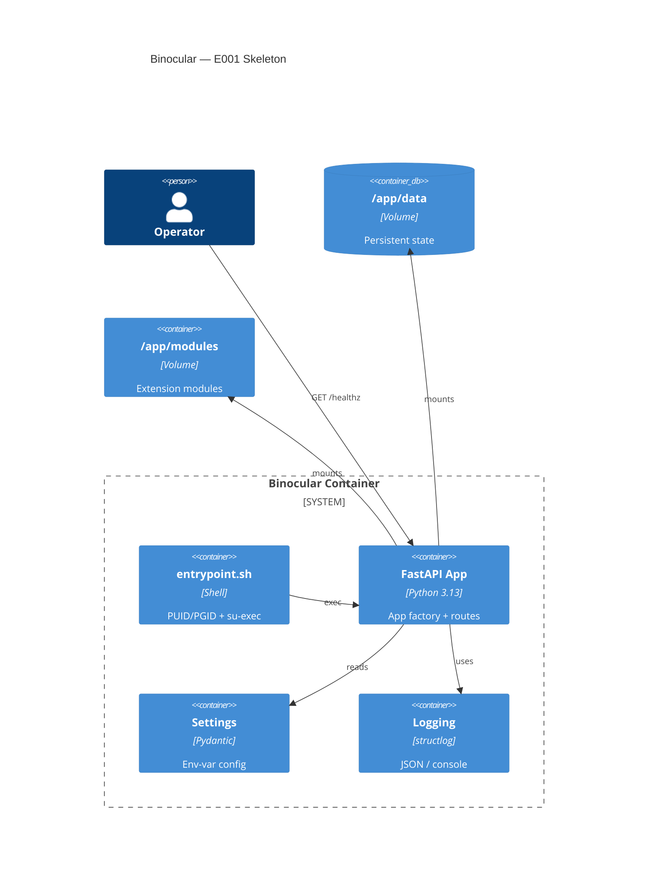

# Implementation Plan: Application Skeleton & Container

**Branch**: `00001-app-skeleton` | **Date**: 2026-06-10 | **Spec**: [spec.md](spec.md)

## Summary

**Goal**: Establish the runnable FastAPI application with config, logging, health endpoint, and a non-root Docker container with PUID/PGID support.
**Approach**: App factory pattern with Pydantic Settings, structlog, and a su-exec-based entrypoint in python:3.13-slim.
**Key Constraint**: `mypy --strict` on all backend source; non-root container execution.

## Technical Context

**Language/Version**: Python 3.13
**Primary Dependencies**: FastAPI, Uvicorn, Pydantic, pydantic-settings, structlog
**Storage**: N/A (E002)
**Testing**: pytest, pytest-asyncio, httpx (ASGI test client)
**Target Platform**: Linux server (Docker container)
**Project Type**: web
**Project Mode**: greenfield
**Performance Goals**: N/A — infrastructure epic
**Constraints**: Single port (8000), non-root, PUID/PGID, `mypy --strict`
**Scale/Scope**: Single-user self-hosted appliance

## Instructions Check

| Principle | Status | Evidence |
|-----------|--------|----------|
| I. Honest Failure | N/A | No detection logic |
| II. Polite by Default | N/A | No outbound scraping |
| III. Data Ownership | PASS | Single-container, no external deps, SQLite volume prepared |
| IV. Least-Privilege | PASS | Non-root user, PUID/PGID, reject UID 0 |
| V. Type Safety | PASS | `mypy --strict` in dev deps and CI gate |
| VI. Set-and-Forget | PASS | Zero-config defaults, volume persistence, restart survival |
| VII. Agent Output Style | N/A | Infrastructure |

## Architecture



## Architecture Decisions

| ID | Decision | Options Considered | Chosen | Rationale |
|----|----------|--------------------|--------|-----------|
| AD-001 | Process executor in entrypoint | gosu / su-exec / su | su-exec | Lighter than gosu, replaces PID 1 cleanly (no zombie parent). See ADR-0008. |
| AD-002 | Log format toggle | Env var / CLI flag / config file | Env var (`BINOCULAR_LOG_FORMAT`) | Consistent with Pydantic Settings env-var pattern; zero-config default is console. |
| AD-003 | App runner | uvicorn direct / gunicorn+uvicorn | uvicorn direct | Single-user appliance; gunicorn multi-worker is unnecessary overhead. See SAD. |

## Data Model Summary

N/A — no persistent data in E001. Data layer deferred to E002.

## API Surface Summary

| Method | Path | Purpose | Auth | Req/Res Types |
|--------|------|---------|------|---------------|
| GET | `/healthz` | Liveness probe | None | — / `HealthResponse` |

Trivial single-endpoint surface. No separate contracts/ directory needed.

## Testing Strategy

| Tier | Tool | Scope | Mock Boundary | Install |
|------|------|-------|---------------|---------|
| Unit | pytest + pytest-asyncio | Settings validation, logging config, health endpoint | None needed | `uv add --dev pytest pytest-asyncio` |
| Integration | httpx + pytest (ASGI TestClient) | Full app factory → /healthz response | None needed | `uv add --dev httpx` |
| Security | N/A | No external deps or secrets handling in E001 | — | — |
| Coverage | pytest-cov | Line coverage ≥80% on `backend/src/` | — | `uv add --dev pytest-cov` |

## Error Handling Strategy

N/A — skeleton has a single /healthz endpoint with no failure modes beyond standard HTTP.

## Integration Points

| Spec Reference | System/Service | Technical Approach | Contract |
|----------------|----------------|--------------------|----------|
| IP-001 | E002 Data Layer | Lifespan context manager yields DB connection pool | Async context manager in lifespan |
| IP-002 | E003 CI Pipeline | pyproject.toml scripts section for lint/test/type-check | CLI commands |
| IP-003 | E004 Frontend SPA | FastAPI StaticFiles mount or SPA catch-all | Route mount |
| IP-004 | E005–E020 | Router aggregator in `routes/__init__.py` | `APIRouter` registration |
| IP-005 | All epics | `config.py` Settings and `logging.py` setup | Python imports |

## Risk Mitigation

| Risk (from spec) | Likelihood | Impact | Mitigation | Owner |
|-------------------|------------|--------|------------|-------|
| su-exec availability on Debian | Low | Medium | Dockerfile installs from GitHub source if not in apt repos; gosu as fallback | Dockerfile |
| Python 3.13 slim image size | Low | Low | Single-stage build sufficient; multi-stage if image exceeds 200MB | Dockerfile |

## Requirement Coverage Map

| Req ID | Component(s) | File Path(s) | Notes |
|--------|--------------|--------------|-------|
| TR-001 | App factory | `backend/src/binocular/app.py` | `create_app()` with lifespan |
| TR-002 | Health route | `backend/src/binocular/routes/health.py` | GET /healthz → 200 |
| TR-003 | Config | `backend/src/binocular/config.py` | `BINOCULAR_` prefix, Pydantic Settings |
| TR-004 | Config | `backend/src/binocular/config.py` | All fields have defaults |
| TR-005 | Logging | `backend/src/binocular/logging.py` | JSON/console toggle |
| TR-006 | Logging | `backend/src/binocular/logging.py` | stdlib integration |
| TR-007 | Container | `Dockerfile` | python:3.13-slim, non-root |
| TR-008 | Container | `entrypoint.sh` | PUID/PGID via su-exec |
| TR-009 | Container | `entrypoint.sh` | Reject UID/GID 0 |
| TR-010 | Container | `compose.yaml` | /app/data + /app/modules volumes |
| TR-011 | Type safety | `pyproject.toml` | mypy --strict in dev deps |
| TR-012 | Dependencies | `pyproject.toml` | All deps declared |

## Project Structure

### Source Code

```text
backend/
  src/
    binocular/
      __init__.py
      app.py              # App factory with lifespan
      config.py            # Pydantic Settings
      logging.py           # structlog configuration
      py.typed             # PEP 561 marker
      routes/
        __init__.py        # Router aggregator
        health.py          # /healthz endpoint
  tests/
    __init__.py
    conftest.py            # Shared fixtures (app client)
    test_health.py         # Health endpoint tests
    test_config.py         # Settings tests
    test_logging.py        # Logging config tests
  pyproject.toml           # Dependencies, scripts, mypy/ruff config
Dockerfile                 # python:3.13-slim + su-exec
entrypoint.sh              # PUID/PGID + exec
compose.yaml               # Service + volumes
.env.example               # Documented env vars
```

## Implementation Hints

- **[HINT-001]** Order: Create `config.py` first — `logging.py` and `app.py` both depend on Settings.
- **[HINT-002]** Gotcha: structlog's `configure()` must run before any `get_logger()` call. Call it in the lifespan, not at module level.
- **[HINT-003]** Gotcha: `su-exec` on Debian requires building from source (C, single file). Add `gcc` and `make` as build deps, remove after install.
- **[HINT-004]** Constraint: `py.typed` marker file is required for PEP 561 — `mypy --strict` won't enforce type checking on the package without it.
- **[HINT-005]** Order: `entrypoint.sh` must `exec` (not fork) the final command so the container runtime receives signals correctly.
