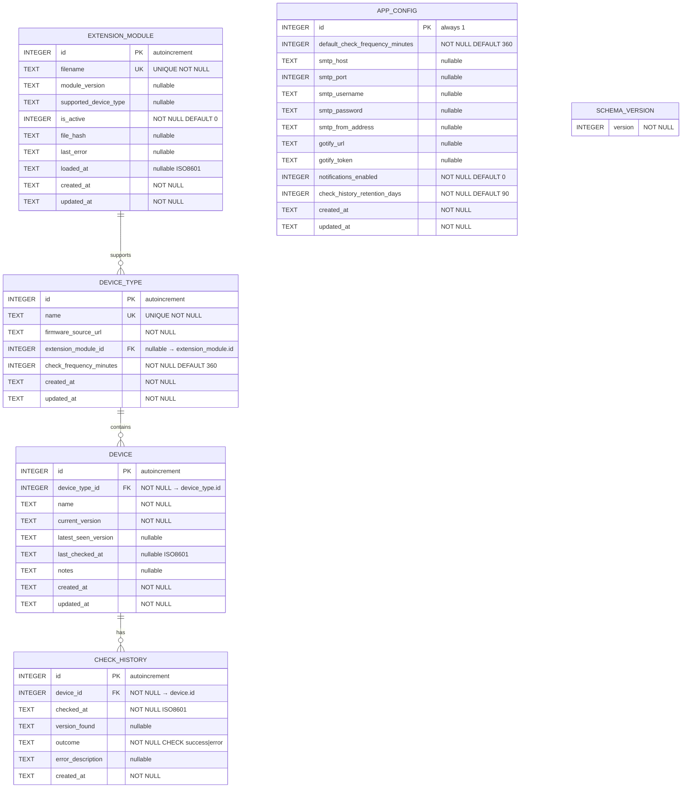

# Data Model: Database Schema & Data Models

**Branch**: `00001-db-schema-models` | **Date**: 2026-03-01 | **Plan**: [plan.md](plan.md)

---

## Entity Definitions

### 1. `device_type`

Represents a category of devices sharing a common firmware source (e.g., "Sony Alpha Bodies").

| Column | Type | Nullable | Default | Constraints |
|---|---|---|---|---|
| `id` | INTEGER | NOT NULL | autoincrement | **PRIMARY KEY** |
| `name` | TEXT | NOT NULL | — | **UNIQUE** |
| `firmware_source_url` | TEXT | NOT NULL | — | — |
| `extension_module_id` | INTEGER | NULL | NULL | **FK → `extension_module.id` ON DELETE SET NULL** |
| `check_frequency_minutes` | INTEGER | NOT NULL | 360 | — |
| `created_at` | TEXT | NOT NULL | `CURRENT_TIMESTAMP` | ISO 8601 |
| `updated_at` | TEXT | NOT NULL | `CURRENT_TIMESTAMP` | ISO 8601 |

**Notes**:
- `name` uniqueness enforces FR-003. Duplicate device type names are rejected at the DB level.
- `extension_module_id` is nullable — a device type may exist without an assigned module (spec: Key Entities). ON DELETE SET NULL ensures removing a module clears the association rather than cascading deletion (US4-AS4, clarification session).
- `check_frequency_minutes` defaults to 360 (6 hours), matching the app_config default. Overrides the global default on a per-type basis (FR-001).
- Timestamps stored as TEXT in ISO 8601 format (`YYYY-MM-DDTHH:MM:SS`).

---

### 2. `device`

Represents a single physical device the user owns (e.g., "Sony A7IV").

| Column | Type | Nullable | Default | Constraints |
|---|---|---|---|---|
| `id` | INTEGER | NOT NULL | autoincrement | **PRIMARY KEY** |
| `device_type_id` | INTEGER | NOT NULL | — | **FK → `device_type.id` ON DELETE CASCADE** |
| `name` | TEXT | NOT NULL | — | — |
| `current_version` | TEXT | NOT NULL | — | — |
| `latest_seen_version` | TEXT | NULL | NULL | — |
| `last_checked_at` | TEXT | NULL | NULL | ISO 8601 |
| `notes` | TEXT | NULL | NULL | — |
| `created_at` | TEXT | NOT NULL | `CURRENT_TIMESTAMP` | ISO 8601 |
| `updated_at` | TEXT | NOT NULL | `CURRENT_TIMESTAMP` | ISO 8601 |

**Unique Constraint**: `UNIQUE(device_type_id, name)` — enforces FR-004 (device name unique within its parent device type). Identical names across different device types are permitted (edge case from spec).

**Notes**:
- `device_type_id` ON DELETE CASCADE enforces FR-014 — deleting a device type removes all its child devices at the DB level. The API/UI layer gates the delete behind user confirmation.
- `current_version` is NOT NULL — every device must have a recorded firmware version at creation time (US1).
- `latest_seen_version` NULL means "never checked" (FR-007). This is a distinct state from "up to date" (where `current_version == latest_seen_version`).
- `last_checked_at` NULL means no check has ever been performed for this device.
- Version strings are stored verbatim as TEXT — no format constraints (FR-017).

---

### 3. `app_config`

Singleton table storing application configuration. Always exactly one row with `id = 1`.

| Column | Type | Nullable | Default | Constraints |
|---|---|---|---|---|
| `id` | INTEGER | NOT NULL | — | **PRIMARY KEY**, always `1` |
| `default_check_frequency_minutes` | INTEGER | NOT NULL | 360 | — |
| `smtp_host` | TEXT | NULL | NULL | — |
| `smtp_port` | INTEGER | NULL | NULL | — |
| `smtp_username` | TEXT | NULL | NULL | — |
| `smtp_password` | TEXT | NULL | NULL | — |
| `smtp_from_address` | TEXT | NULL | NULL | — |
| `gotify_url` | TEXT | NULL | NULL | — |
| `gotify_token` | TEXT | NULL | NULL | — |
| `notifications_enabled` | INTEGER | NOT NULL | 0 | Boolean (0/1) |
| `check_history_retention_days` | INTEGER | NOT NULL | 90 | — |
| `created_at` | TEXT | NOT NULL | `CURRENT_TIMESTAMP` | ISO 8601 |
| `updated_at` | TEXT | NOT NULL | `CURRENT_TIMESTAMP` | ISO 8601 |

**Notes**:
- Single-row wide table pattern (AD-6). One typed column per setting. Maps directly to a Pydantic model with defaults.
- `id` is always `1` — enforced by INSERT logic (seed row in migration). Updates use `UPDATE ... WHERE id = 1` or UPSERT.
- All settings have sensible defaults (FR-009) — the application is functional without any user configuration (SC-003).
- `notifications_enabled` uses INTEGER 0/1 for boolean since SQLite has no native boolean type.
- `check_history_retention_days` default 90 maps to FR-013 retention cleanup.
- Nullable notification fields: NULL means "not configured." Clearing a field reverts to NULL (US3-AS3 — the application treats NULL as "use default/disabled").
- Adding a new setting requires a migration adding a new column with a default value (AD-6 trade-off).

---

### 4. `extension_module`

Registry of installed scraper extension modules.

| Column | Type | Nullable | Default | Constraints |
|---|---|---|---|---|
| `id` | INTEGER | NOT NULL | autoincrement | **PRIMARY KEY** |
| `filename` | TEXT | NOT NULL | — | **UNIQUE** |
| `module_version` | TEXT | NULL | NULL | — |
| `supported_device_type` | TEXT | NULL | NULL | — |
| `is_active` | INTEGER | NOT NULL | 0 | Boolean (0/1) |
| `file_hash` | TEXT | NULL | NULL | — |
| `last_error` | TEXT | NULL | NULL | — |
| `loaded_at` | TEXT | NULL | NULL | ISO 8601 |
| `created_at` | TEXT | NOT NULL | `CURRENT_TIMESTAMP` | ISO 8601 |
| `updated_at` | TEXT | NOT NULL | `CURRENT_TIMESTAMP` | ISO 8601 |

**Notes**:
- `filename` is UNIQUE (FR-010) — each module file is registered at most once.
- `supported_device_type` is a human-readable label declared by the module's capability manifest (Principle II). This is informational metadata, not a foreign key — the actual association between a device type and a module is via `device_type.extension_module_id`.
- `is_active` indicates whether the module passed contract validation and is available for use (US4-AS1, US4-AS2).
- `file_hash` tracks the module file's content hash for change detection on restart (US4-AS3).
- `last_error` captures the error description when a module fails to load (FR-011). NULL when the module loaded successfully.
- `loaded_at` records when the module was last successfully loaded. NULL if never successfully loaded.

---

### 5. `check_history`

Log of firmware check events for auditing and troubleshooting.

| Column | Type | Nullable | Default | Constraints |
|---|---|---|---|---|
| `id` | INTEGER | NOT NULL | autoincrement | **PRIMARY KEY** |
| `device_id` | INTEGER | NOT NULL | — | **FK → `device.id` ON DELETE CASCADE** |
| `checked_at` | TEXT | NOT NULL | — | ISO 8601 |
| `version_found` | TEXT | NULL | NULL | — |
| `outcome` | TEXT | NOT NULL | — | `CHECK(outcome IN ('success', 'error'))` |
| `error_description` | TEXT | NULL | NULL | — |
| `created_at` | TEXT | NOT NULL | `CURRENT_TIMESTAMP` | ISO 8601 |

**Notes**:
- `device_id` ON DELETE CASCADE — when a device is deleted, its check history is removed (transitive cascade: device_type → device → check_history).
- `outcome` is constrained to `'success'` or `'error'` via CHECK constraint (FR-012).
- `version_found` is NULL when the check failed before retrieving a version.
- `error_description` is NULL on successful checks; populated with a descriptive error message on failure (US5-AS2).
- No `updated_at` column — history entries are immutable (write-once, delete by retention).
- Retention cleanup: after each new insert, the application deletes rows where `checked_at < now - retention_days` (AD-5, FR-013).

---

### 6. `schema_version`

Metadata table tracking the current database migration version.

| Column | Type | Nullable | Default | Constraints |
|---|---|---|---|---|
| `version` | INTEGER | NOT NULL | — | — |

**Notes**:
- Always contains exactly one row with the current migration number.
- The migration runner reads this value on startup, compares it to available migration scripts, and applies any unapplied migrations in order (AD-3, FR-016).
- Initial value is `1` after `001_initial.sql` runs.
- No primary key needed — single-row table enforced by application logic.

---

## Relationships

### DeviceType → Device (One-to-Many)

- A **DeviceType** contains zero or more **Devices**.
- A **Device** belongs to exactly one **DeviceType**.
- **Foreign Key**: `device.device_type_id` → `device_type.id`
- **ON DELETE CASCADE**: Deleting a device type removes all its child devices (FR-014).

### ExtensionModule → DeviceType (One-to-Many)

- An **ExtensionModule** may be associated with zero or more **DeviceTypes**.
- A **DeviceType** references zero or one **ExtensionModule** (nullable FK).
- **Foreign Key**: `device_type.extension_module_id` → `extension_module.id`
- **ON DELETE SET NULL**: Removing a module clears the association on all device types that referenced it — the device type remains but loses its module assignment (US4-AS4).

### Device → CheckHistory (One-to-Many)

- A **Device** has zero or more **CheckHistory** entries.
- A **CheckHistory** entry belongs to exactly one **Device**.
- **Foreign Key**: `check_history.device_id` → `device.id`
- **ON DELETE CASCADE**: Deleting a device removes all its check history entries.

### Transitive Cascade Path

```
device_type (DELETE) → device (CASCADE) → check_history (CASCADE)
```

Deleting a device type cascades to its devices, which in turn cascade to their check history entries.

### AppConfig and SchemaVersion — Standalone

- `app_config` and `schema_version` are standalone singleton tables with no foreign key relationships.

---

## Validation Rules

### DeviceType

| Rule | Source | Level |
|---|---|---|
| `name` must be globally unique | FR-003 | DB (UNIQUE constraint) |
| `name` must not be empty | FR-001 | Application (Pydantic `min_length=1`) |
| `firmware_source_url` must not be empty | FR-001 | Application (Pydantic `min_length=1`) |
| `check_frequency_minutes` must be a positive integer | FR-001 | Application (Pydantic `gt=0`) |

### Device

| Rule | Source | Level |
|---|---|---|
| `name` must be unique within its parent device type | FR-004 | DB (composite UNIQUE on `device_type_id, name`) |
| `name` must not be empty | FR-002 | Application (Pydantic `min_length=1`) |
| `current_version` must not be empty | FR-002 | Application (Pydantic `min_length=1`) |
| Version strings stored verbatim — no format validation | FR-017 | Application (no regex constraint) |
| Update confirmation rejected when `latest_seen_version` is NULL | FR-018 | Application (guard in repository/service layer) |
| Version comparison uses semver parse + string fallback | FR-006 | Application (pure function, not DB) |
| NULL `latest_seen_version` = "never checked" (distinct from "up to date") | FR-007 | Application (query-time derivation) |

### AppConfig

| Rule | Source | Level |
|---|---|---|
| All settings have sensible defaults | FR-009 | DB (column defaults) + Application (Pydantic defaults) |
| `notifications_enabled` must be 0 or 1 | — | Application (Pydantic `bool` mapped to int) |
| `default_check_frequency_minutes` must be a positive integer | FR-009 | Application (Pydantic `gt=0`) |
| `check_history_retention_days` must be a positive integer | FR-013 | Application (Pydantic `gt=0`) |
| `smtp_port` when set must be a valid port number (1–65535) | — | Application (Pydantic `ge=1, le=65535`) |

### ExtensionModule

| Rule | Source | Level |
|---|---|---|
| `filename` must be globally unique | FR-010 | DB (UNIQUE constraint) |
| `filename` must not be empty | FR-010 | Application (Pydantic `min_length=1`) |
| `is_active` must be 0 or 1 | — | Application (Pydantic `bool` mapped to int) |
| Error details must be recorded on load failure | FR-011 | Application (repository sets `last_error`) |

### CheckHistory

| Rule | Source | Level |
|---|---|---|
| `outcome` must be `'success'` or `'error'` | FR-012 | DB (CHECK constraint) + Application (Pydantic `Literal`) |
| Entries older than retention period are auto-deleted | FR-013 | Application (DELETE after INSERT in repository) |
| `checked_at` must be a valid ISO 8601 timestamp | FR-012 | Application (Pydantic `datetime`) |

---

## State Machines

### Device Check Status (Derived at Query Time)

The device check status is **not stored** — it is computed at query time from `current_version` and `latest_seen_version` (FR-006).

```
                         ┌──────────────────┐
       Initial state ──▶ │   Never Checked  │
                         │ latest_seen = NULL│
                         └────────┬─────────┘
                                  │
                           (check runs)
                                  │
                    ┌─────────────┴─────────────┐
                    ▼                             ▼
          ┌─────────────────┐          ┌──────────────────┐
          │   Up to Date    │          │ Update Available  │
          │ current = latest│          │ current ≠ latest  │
          └────────┬────────┘          └────────┬─────────┘
                   │                            │
              (check runs,               (user confirms
              versions match)            update — FR-005)
                   │                            │
                   ▼                            ▼
          ┌─────────────────┐          ┌─────────────────┐
          │   Up to Date    │          │   Up to Date    │
          └─────────────────┘          │ current = latest│
                                       └─────────────────┘
```

**Transitions**:

| From | Event | To | Condition |
|---|---|---|---|
| Never Checked | Check completes | Up to Date | `current_version == latest_seen_version` (semver or string) |
| Never Checked | Check completes | Update Available | `current_version != latest_seen_version` |
| Up to Date | Check completes | Update Available | New `latest_seen_version` differs from `current_version` |
| Update Available | Check completes | Up to Date | `latest_seen_version` now matches `current_version` |
| Update Available | User confirms update (FR-005) | Up to Date | `current_version` set to `latest_seen_version` |
| Never Checked | User confirms update | **REJECTED** (FR-018) | `latest_seen_version` is NULL — validation error |

### Extension Module Lifecycle

```
          (module file loaded)
                  │
         ┌────────┴────────┐
         ▼                  ▼
  ┌─────────────┐   ┌─────────────┐
  │   Loaded    │   │   Failed    │
  │ is_active=1 │   │ is_active=0 │
  │ last_error  │   │ last_error  │
  │   = NULL    │   │   = <msg>   │
  └──────┬──────┘   └──────┬──────┘
         │                  │
    (user deactivates  (user retries
     or module removed) or file fixed)
         │                  │
         ▼                  ▼
  ┌──────────────┐   ┌─────────────┐
  │ Deactivated  │   │   Loaded    │
  │ is_active=0  │   │ is_active=1 │
  │ last_error   │   │ last_error  │
  │   = NULL     │   │   = NULL    │
  └──────────────┘   └─────────────┘
```

**States**:

| State | `is_active` | `last_error` | Description |
|---|---|---|---|
| Loaded | 1 | NULL | Module passed contract validation and is available for use |
| Failed | 0 | `<error message>` | Module failed contract validation; error captured for troubleshooting (FR-011) |
| Deactivated | 0 | NULL | Module intentionally disabled by user or removed from disk |

**Transitions**:

| From | Event | To |
|---|---|---|
| (new) | Contract validation passes | Loaded |
| (new) | Contract validation fails | Failed |
| Loaded | User deactivates or file removed | Deactivated |
| Loaded | Reload fails (file modified, now invalid) | Failed |
| Failed | Reload succeeds (file fixed) | Loaded |
| Deactivated | Reload succeeds (file restored) | Loaded |
| Deactivated | Reload fails | Failed |

---

## ER Diagram



---

## Initial Migration SQL

File: `backend/src/db/migrations/001_initial.sql`

```sql
-- =============================================================
-- Binocular: Initial Schema Migration (001)
-- Creates all core tables, constraints, indexes, and seed data.
-- =============================================================

-- -------------------------------------------
-- Extension Module registry
-- -------------------------------------------
CREATE TABLE IF NOT EXISTS extension_module (
    id                   INTEGER PRIMARY KEY AUTOINCREMENT,
    filename             TEXT    NOT NULL UNIQUE,
    module_version       TEXT,
    supported_device_type TEXT,
    is_active            INTEGER NOT NULL DEFAULT 0,
    file_hash            TEXT,
    last_error           TEXT,
    loaded_at            TEXT,
    created_at           TEXT    NOT NULL DEFAULT (strftime('%Y-%m-%dT%H:%M:%fZ', 'now')),
    updated_at           TEXT    NOT NULL DEFAULT (strftime('%Y-%m-%dT%H:%M:%fZ', 'now'))
);

-- -------------------------------------------
-- Device Type (groups related devices)
-- -------------------------------------------
CREATE TABLE IF NOT EXISTS device_type (
    id                      INTEGER PRIMARY KEY AUTOINCREMENT,
    name                    TEXT    NOT NULL UNIQUE,
    firmware_source_url     TEXT    NOT NULL,
    extension_module_id     INTEGER,
    check_frequency_minutes INTEGER NOT NULL DEFAULT 360,
    created_at              TEXT    NOT NULL DEFAULT (strftime('%Y-%m-%dT%H:%M:%fZ', 'now')),
    updated_at              TEXT    NOT NULL DEFAULT (strftime('%Y-%m-%dT%H:%M:%fZ', 'now')),

    FOREIGN KEY (extension_module_id)
        REFERENCES extension_module (id)
        ON DELETE SET NULL
);

-- -------------------------------------------
-- Device (individual tracked device)
-- -------------------------------------------
CREATE TABLE IF NOT EXISTS device (
    id                  INTEGER PRIMARY KEY AUTOINCREMENT,
    device_type_id      INTEGER NOT NULL,
    name                TEXT    NOT NULL,
    current_version     TEXT    NOT NULL,
    latest_seen_version TEXT,
    last_checked_at     TEXT,
    notes               TEXT,
    created_at          TEXT    NOT NULL DEFAULT (strftime('%Y-%m-%dT%H:%M:%fZ', 'now')),
    updated_at          TEXT    NOT NULL DEFAULT (strftime('%Y-%m-%dT%H:%M:%fZ', 'now')),

    UNIQUE (device_type_id, name),

    FOREIGN KEY (device_type_id)
        REFERENCES device_type (id)
        ON DELETE CASCADE
);

-- -------------------------------------------
-- Check History (firmware check audit log)
-- -------------------------------------------
CREATE TABLE IF NOT EXISTS check_history (
    id                INTEGER PRIMARY KEY AUTOINCREMENT,
    device_id         INTEGER NOT NULL,
    checked_at        TEXT    NOT NULL,
    version_found     TEXT,
    outcome           TEXT    NOT NULL CHECK (outcome IN ('success', 'error')),
    error_description TEXT,
    created_at        TEXT    NOT NULL DEFAULT (strftime('%Y-%m-%dT%H:%M:%fZ', 'now')),

    FOREIGN KEY (device_id)
        REFERENCES device (id)
        ON DELETE CASCADE
);

-- -------------------------------------------
-- App Configuration (singleton settings row)
-- -------------------------------------------
CREATE TABLE IF NOT EXISTS app_config (
    id                              INTEGER PRIMARY KEY CHECK (id = 1),
    default_check_frequency_minutes INTEGER NOT NULL DEFAULT 360,
    smtp_host                       TEXT,
    smtp_port                       INTEGER,
    smtp_username                   TEXT,
    smtp_password                   TEXT,
    smtp_from_address               TEXT,
    gotify_url                      TEXT,
    gotify_token                    TEXT,
    notifications_enabled           INTEGER NOT NULL DEFAULT 0,
    check_history_retention_days    INTEGER NOT NULL DEFAULT 90,
    created_at                      TEXT    NOT NULL DEFAULT (strftime('%Y-%m-%dT%H:%M:%fZ', 'now')),
    updated_at                      TEXT    NOT NULL DEFAULT (strftime('%Y-%m-%dT%H:%M:%fZ', 'now'))
);

-- Seed the singleton config row with all defaults
INSERT INTO app_config (id) VALUES (1);

-- -------------------------------------------
-- Schema Version (migration tracking)
-- -------------------------------------------
CREATE TABLE IF NOT EXISTS schema_version (
    version INTEGER NOT NULL
);

-- Seed with current migration version
INSERT INTO schema_version (version) VALUES (1);
```

### Migration Notes

- **Table creation order** respects foreign key dependencies: `extension_module` first (referenced by `device_type`), then `device_type` (referenced by `device`), then `device` (referenced by `check_history`). `app_config` and `schema_version` are standalone.
- **`CHECK (id = 1)`** on `app_config` enforces the singleton pattern at the DB level — any INSERT with `id != 1` is rejected.
- **`strftime('%Y-%m-%dT%H:%M:%fZ', 'now')`** produces ISO 8601 timestamps with millisecond precision in UTC.
- **No indexes beyond primary keys and unique constraints** — the dataset is small (<1K rows) and additional indexes add write overhead without measurable read benefit (research.md recommendation).
- **`PRAGMA` statements** (`journal_mode = WAL`, `busy_timeout = 5000`, `foreign_keys = ON`) are applied at connection time in the connection factory, not in migration scripts (AD-2). This is because PRAGMAs are connection-scoped in SQLite.
- Future migrations (`002_*.sql`, etc.) increment `schema_version.version` after applying their DDL changes. The migration runner handles this automatically (AD-3).

---

## Traceability Matrix

| Entity | Spec FRs | Architecture Decisions | User Stories |
|---|---|---|---|
| `device_type` | FR-001, FR-003, FR-014 | AD-1, AD-2 | US1, US4 |
| `device` | FR-002, FR-004, FR-005, FR-006, FR-007, FR-017, FR-018 | AD-1, AD-4 | US1, US2 |
| `app_config` | FR-008, FR-009, FR-013 | AD-6 | US3 |
| `extension_module` | FR-010, FR-011 | AD-1 | US4 |
| `check_history` | FR-012, FR-013 | AD-5 | US5 |
| `schema_version` | FR-015, FR-016 | AD-3 | — |
