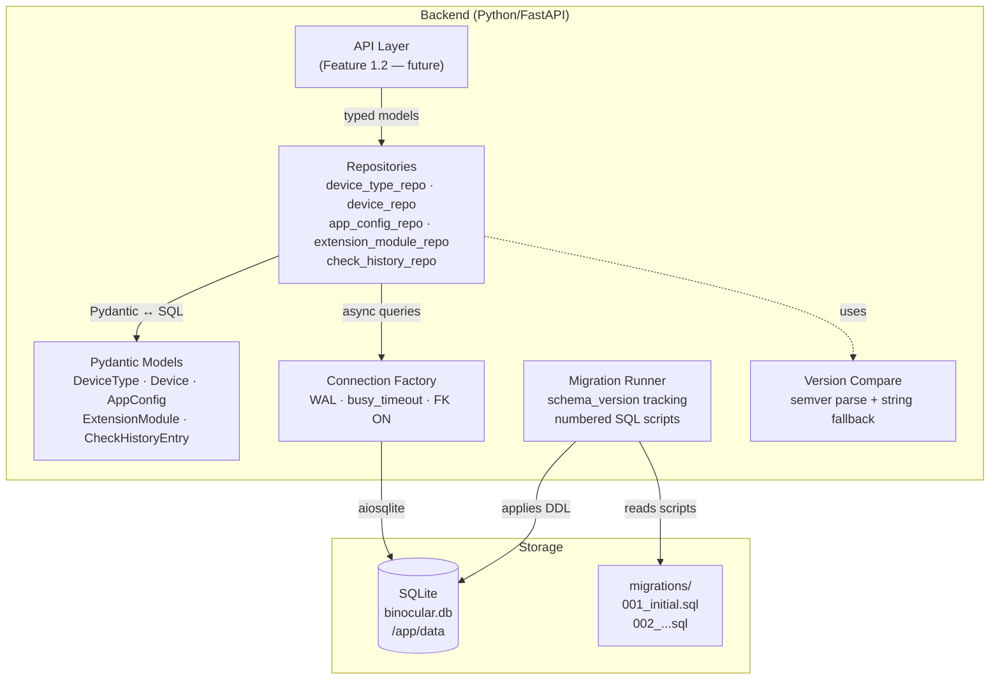

# Implementation Plan: Database Schema & Data Models

**Branch**: `00001-db-schema-models` | **Date**: 2026-03-01 | **Spec**: [spec.md](spec.md)
**Input**: Feature specification from `specs/00001-db-schema-models/spec.md`

## Summary

Establish Binocular's foundational data layer: a SQLite database configured with WAL mode and busy_timeout for safe concurrent read/write access, five core tables (DeviceType, Device, AppConfig, ExtensionModule, CheckHistoryEntry), Pydantic models for all entities, a custom lightweight migration runner with numbered SQL scripts, and a data-access layer providing typed CRUD operations. This feature delivers the persistence backbone that all downstream features (Inventory API, Extension Engine, Scheduler, Alerting) depend on.

## Technical Context

**Source Document**: [docs/tech-context.md](../../docs/tech-context.md)

**Language/Version**: Python 3.11+
**Primary Dependencies**: FastAPI, Pydantic v2, aiosqlite, packaging (PEP 440 version parsing)
**Storage**: SQLite — WAL journal mode, `busy_timeout=5000`, `PRAGMA foreign_keys = ON`
**Testing**: pytest + pytest-asyncio, isolated temp-file SQLite fixtures
**Target Platform**: Linux server (Docker container, `python:3.11-slim`)
**Project Type**: web (FastAPI backend + React frontend)
**Performance Goals**: Sub-50ms for single-entity CRUD; sub-200ms for full inventory retrieval (<1K rows expected)
**Constraints**: Single-user, single-instance access; 2 MB max item size (SQLite page limit is not a concern at this scale); database file on a persistent Docker volume (`/app/data/binocular.db`)
**Scale/Scope**: <100 device types, <1K devices, single concurrent user (homelab)

## Instructions Check

*GATE: Must pass before Phase 0 research. Re-check after Phase 1 design.*

| Principle | Status | Notes |
|---|---|---|
| I. Self-Contained Deployment | PASS | SQLite single-file DB in `/app/data`. Zero external database dependencies. Sensible defaults for all AppConfig settings. |
| II. Extension-First Architecture | PASS | ExtensionModule registry table captures contract validation results, activation status, file hash, and error state. Module metadata is separate from core entity data. DeviceType references module via nullable FK. |
| III. Responsible Scraping | N/A | Data persistence layer only — no web requests in this feature. Scraping behavior is scoped to the Extension Engine feature. |
| IV. Type Safety & Validation | PASS | All entities backed by Pydantic models with strict type annotations. AppConfig uses Pydantic `BaseSettings` pattern with typed columns. Version strings stored as `TEXT` — comparison logic uses semver parsing with string fallback. All DB access functions return typed Pydantic model instances. |
| V. Test-First Development | PASS | Spec provides Given/When/Then acceptance scenarios for all user stories. Plan calls for isolated temp-file SQLite fixtures for each test. Migration runner, CRUD operations, and constraint enforcement all testable independently. |

**Result**: PASS — No compliance violations.

## Architecture Decisions

### AD-1: No ORM — Raw SQL with Pydantic Mapping

**Decision**: Use raw SQL (via `aiosqlite`) with Pydantic models for serialization/deserialization. No SQLAlchemy or other ORM.

**Rationale**: The data model is simple (5 tables, <10 relationships). An ORM adds dependency weight, migration complexity, and abstraction overhead that is unjustified for this scale. Raw SQL keeps the stack minimal (Principle I — Self-Contained) and transparent. Pydantic models provide type safety at the application boundary (Principle IV).

**Trade-off**: Manual SQL means no auto-generated migrations — addressed by AD-3 (custom migration runner).

### AD-2: SQLite Connection Configuration

**Decision**: Configure SQLite at connection time with:
- `PRAGMA journal_mode = WAL` — enables concurrent reads during writes
- `PRAGMA busy_timeout = 5000` — 5-second wait on lock contention
- `PRAGMA foreign_keys = ON` — enforces FK constraints (including CASCADE)

**Rationale**: WAL mode is required by project instructions (Technology Stack table). `busy_timeout` prevents immediate `SQLITE_BUSY` errors when the scheduler writes while the API reads. Foreign keys are off by default in SQLite and must be enabled per-connection for CASCADE to work (FR-014).

### AD-3: Custom Migration Runner

**Decision**: Implement a lightweight migration runner that:
1. Maintains a `schema_version` table with a single integer version number
2. Scans a `migrations/` directory for numbered SQL files (`001_initial.sql`, `002_add_check_history.sql`, etc.)
3. Applies unapplied migrations in order on startup
4. Wraps each migration in a transaction for atomicity

**Rationale**: Alembic and similar tools are designed for SQLAlchemy and add unnecessary complexity for a single-file DB with <10 tables (research.md recommendation). Sequential numbered scripts are simple, auditable, and satisfy FR-016 (preserve data on upgrades).

### AD-4: Version Comparison Strategy

**Decision**: Firmware version comparison uses a two-tier approach:
1. Attempt `packaging.version.Version` (PEP 440) or `semver` parsing on both sides
2. If either side fails to parse → fall back to string inequality (`current != latest` = update available)

**Rationale**: Manufacturer version strings are unpredictable (dates, letters, build hashes). Semantic parsing catches ordered comparisons (3.01 > 2.00) while string fallback ensures the system never crashes on exotic formats (FR-006, FR-017). Comparison logic lives in a pure function, not in the database.

### AD-5: Check History Retention

**Decision**: Time-based retention with 90-day default. Cleanup runs as a lightweight `DELETE` after each new check entry is written (piggyback cleanup pattern).

**Rationale**: Avoids a separate scheduled job for cleanup. A single `DELETE FROM check_history WHERE timestamp < datetime('now', '-90 days')` after each insert is negligible overhead at this scale (FR-013). The retention period is stored in `app_config` and user-configurable.

### AD-6: Single-Row AppConfig Table

**Decision**: Store application settings in a single-row table with one typed column per setting. Map to a Pydantic model with defaults.

**Rationale**: Preserves type safety (Principle IV), avoids key-value store ambiguity, and maps directly to Pydantic `BaseSettings`. Adding a new setting requires a migration (new column + default), which is acceptable given the low rate of settings changes (research.md recommendation).

## Project Structure

### Documentation (this feature)

```text
specs/00001-db-schema-models/
├── plan.md              # This file
├── spec.md              # Feature specification
├── research.md          # Domain research
├── data-model.md        # Entity definitions & ER diagram
├── quickstart.md        # Integration scenarios
└── tasks.md             # Phase 2 output (/sddp-tasks command)
```

### Source Code (repository root)

```text
backend/
├── src/
│   ├── db/
│   │   ├── __init__.py
│   │   ├── connection.py       # SQLite connection factory (WAL, FK pragmas)
│   │   ├── migration_runner.py # Custom migration runner
│   │   └── migrations/
│   │       └── 001_initial.sql # Initial schema DDL
│   ├── models/
│   │   ├── __init__.py
│   │   ├── device_type.py      # DeviceType Pydantic model
│   │   ├── device.py           # Device Pydantic model
│   │   ├── app_config.py       # AppConfig Pydantic model (BaseSettings pattern)
│   │   ├── extension_module.py # ExtensionModule Pydantic model
│   │   └── check_history.py    # CheckHistoryEntry Pydantic model
│   ├── repositories/
│   │   ├── __init__.py
│   │   ├── device_type_repo.py # DeviceType CRUD
│   │   ├── device_repo.py      # Device CRUD + confirm update
│   │   ├── app_config_repo.py  # AppConfig read/upsert
│   │   ├── extension_module_repo.py # Module registry CRUD
│   │   └── check_history_repo.py    # History insert + retention cleanup
│   └── utils/
│       ├── __init__.py
│       └── version_compare.py  # Semver parse + string fallback
└── tests/
    ├── conftest.py             # Temp-file SQLite fixture
    ├── test_connection.py      # WAL, FK, busy_timeout verification
    ├── test_migration_runner.py
    ├── test_models/
    │   └── ...                 # Pydantic model validation tests
    ├── test_repositories/
    │   └── ...                 # CRUD + constraint tests
    └── test_version_compare.py

frontend/
├── src/
│   ├── components/
│   ├── pages/
│   └── services/
└── tests/
```

**Structure Decision**: Web application layout (backend + frontend) per tech-context.md. This feature touches only `backend/` — frontend code is out of scope. Repository pattern (`repositories/`) provides a clean data-access layer without ORM overhead. Models are pure Pydantic — no database coupling.

## Data Model

See [data-model.md](data-model.md) for full entity definitions, field types, constraints, and ER diagram.

**Key entities**: DeviceType, Device, AppConfig, ExtensionModule, CheckHistoryEntry — 5 tables + 1 metadata table (`schema_version`).

API Contracts: N/A — no API surface in this feature. Endpoints are defined in Feature 1.2 (Inventory API).

## High-Level Architecture



## Complexity Tracking

No deviations from project instructions. No complexity violations to justify.
