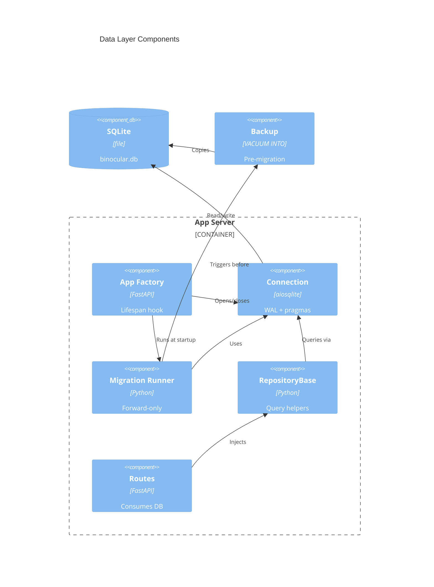

# Implementation Plan: Data Layer & Migrations

**Branch**: `00002-data-layer-migrations` | **Date**: 2026-06-10 | **Spec**: [spec.md](spec.md)

## Summary

**Goal**: Persistent SQLite data layer with async connection management, forward-only numbered migration runner, pre-migration backup, and repository base class.
**Approach**: Integrate aiosqlite into the existing FastAPI lifespan, implement a custom migration runner using `PRAGMA user_version`, and provide a `RepositoryBase` for downstream domain repos.
**Key Constraint**: No ORM — raw parameterized SQL only; single aiosqlite connection managed by app lifespan.

## Technical Context

**Language/Version**: Python 3.13
**Primary Dependencies**: FastAPI, aiosqlite, structlog, Pydantic Settings (existing)
**Storage**: SQLite single file via aiosqlite — WAL mode, foreign_keys=ON, busy_timeout=5000
**Testing**: pytest + pytest-asyncio (configured), httpx (configured)
**Target Platform**: Linux Docker container (python:3.13-slim)
**Project Type**: web
**Project Mode**: brownfield
**Performance Goals**: Single-user, async I/O, no connection pool needed
**Constraints**: mypy --strict, ENFORCE_SRC_ROOT, no ORM, forward-only migrations
**Scale/Scope**: Single user, single instance, ~5–50 devices

## Instructions Check

**Status**: PASS

| Principle | Verdict | Notes |
|-----------|---------|-------|
| I. Honest Failure | PASS | Migration failures logged and rolled back; backup failure blocks migration |
| II. Polite by Default | N/A | No scraping |
| III. Data Ownership | PASS | SQLite single file, no external DB |
| IV. Least-Privilege | N/A | No trust boundary |
| V. Type Safety | PASS | mypy --strict enforced |
| VI. Set-and-Forget | PASS | Auto-create DB, auto-migrate, pre-migration backup |
| VII. Agent Output Style | N/A | Plan document |

## Architecture



## Architecture Decisions

| ID | Decision | Options Considered | Chosen | Rationale |
|----|----------|--------------------|--------|-----------|
| AD-001 | Schema version tracking | PRAGMA user_version / dedicated table | PRAGMA user_version | Built into SQLite header, no extra table, per ADR-0004 |
| AD-002 | Connection cardinality | Single connection / connection pool | Single connection | Single-user app; pool adds complexity without benefit |
| AD-003 | Backup mechanism | VACUUM INTO / file copy / sqlite3 backup API | VACUUM INTO | Consistent copy while DB operational; WAL-safe; no external tools |
| AD-004 | Migration transaction scope | Per-migration / whole-batch | Per-migration | Partial progress preserved on failure; safer for multi-migration runs |

## Data Model Summary

| Entity | Key Fields | Relationships | Notes |
|--------|------------|---------------|-------|
| schema_version | (PRAGMA user_version) | N/A | Tracked via SQLite pragma, not a table |

No domain tables in this epic. E006+ add domain entities.

## API Surface Summary

N/A — no HTTP API surface. Database connection exposed via FastAPI dependency injection, not HTTP endpoints.

## Testing Strategy

| Tier | Tool | Scope | Mock Boundary | Install |
|------|------|-------|---------------|---------|
| Unit | pytest + pytest-asyncio | Connection pragmas, migration runner logic, RepositoryBase methods | Filesystem (tmp dirs) | configured |
| Integration | pytest + pytest-asyncio | Full startup with migration, backup creation, idempotent re-run | None (real SQLite) | configured |
| Security | ruff (S rules) | SQL injection prevention via parameterized queries | — | configured |
| Coverage | pytest-cov | ≥80% on db/ package | — | configured |

## Error Handling Strategy

| Error Category | Pattern | Response | Retry |
|----------------|---------|----------|-------|
| Migration SQL error | fail-fast + rollback | Log error, leave DB at last good version, raise startup exception | no |
| Backup failure (disk full) | fail-fast | Log error, skip migrations, raise startup exception | no |
| Connection failure | fail-fast | Log error, raise startup exception | no |
| Missing migrations dir | graceful | Log warning, skip migrations, continue startup | no |

## Integration Points

| Spec Reference | System/Service | Technical Approach | Contract |
|----------------|----------------|--------------------|----------|
| IP-001 | E001 App Factory lifespan | DB open/close in lifespan async context manager | `app.state.db: aiosqlite.Connection` |
| IP-002 | E001 Settings.data_dir | DB path = `settings.data_dir / "binocular.db"` | `Path` from config.py |
| IP-003 | E006+ domain repos | Subclass `RepositoryBase`, add numbered migrations | `RepositoryBase` ABC + migration file convention |
| IP-004 | E007+ module engine | Add migrations to `db/migrations/` directory | Numbered `NNNN_*.sql` files |
| IP-005 | All domain epics | Inject connection via FastAPI `Depends()` | `get_db()` dependency function |

## Risk Mitigation

| Risk (from spec) | Likelihood | Impact | Mitigation | Owner |
|-------------------|------------|--------|------------|-------|
| WAL file cleanup on unclean shutdown | Low | Low | SQLite auto-recovers on next open; document in README | db/connection |
| Disk space for backup | Low | Medium | Single pre-migration backup; E018 adds retention; log backup size | db/migrations |

## Requirement Coverage Map

| Req ID | Component(s) | File Path(s) | Notes |
|--------|--------------|--------------|-------|
| TR-001 | Connection manager | `backend/src/binocular/db/connection.py` | WAL + FK + busy_timeout pragmas |
| TR-002 | DI dependency | `backend/src/binocular/db/connection.py` | `get_db()` FastAPI dependency |
| TR-003 | Connection manager | `backend/src/binocular/db/connection.py` | Close in lifespan shutdown |
| TR-004 | Connection manager | `backend/src/binocular/db/connection.py` | aiosqlite auto-creates file |
| TR-005 | Migration runner | `backend/src/binocular/db/migrations.py` | Discover + sort NNNN_*.sql |
| TR-006 | Migration runner | `backend/src/binocular/db/migrations.py` | PRAGMA user_version read/write |
| TR-007 | Migration runner | `backend/src/binocular/db/migrations.py` | Per-migration transaction + rollback |
| TR-008 | Migration runner | `backend/src/binocular/db/migrations.py` | Version comparison skip logic |
| TR-009 | Migration runner | `backend/src/binocular/db/migrations.py` | VACUUM INTO before pending |
| TR-010 | Migration runner | `backend/src/binocular/db/migrations.py` | Skip backup when current |
| TR-011 | Repository base | `backend/src/binocular/db/repository.py` | execute, fetch_one, fetch_all |
| TR-012 | Repository base | `backend/src/binocular/db/repository.py` | Row factory configuration |
| TR-013 | Migration runner + connection | `backend/src/binocular/db/migrations.py` | structlog logging |
| TR-014 | All files | `backend/src/binocular/db/*.py` | mypy --strict |

## Project Structure

### Source Code

```text
backend/src/binocular/
+ db/
+   __init__.py
+   connection.py          # async connection open/close, pragmas, get_db()
+   migrations.py          # migration runner: discover, backup, apply
+   repository.py          # RepositoryBase with execute/fetch helpers
+   migrations/
+     0001_init.sql         # seed migration (baseline)
~ app.py                    # add DB lifecycle to lifespan
~ pyproject.toml            # add aiosqlite dependency

backend/tests/
+ test_connection.py        # pragma validation, lifecycle tests
+ test_migrations.py        # runner logic, backup, idempotency
+ test_repository.py        # RepositoryBase query helpers
```

**Brownfield Notes**:
- **Patterns to reuse**: App factory lifespan pattern from `app.py`, Settings from `config.py`, structlog from `logging.py`
- **Tests to extend**: Existing test structure under `backend/tests/`
- **Naming conventions**: Snake_case modules, docstrings on public functions, `mypy --strict` annotations

## Implementation Hints

- **[HINT-001]** Order: DB connection must be opened in lifespan BEFORE migrations run; migrations use the same connection
- **[HINT-002]** Gotcha: `PRAGMA user_version = N` cannot be inside a transaction in some SQLite versions — execute it after committing the migration transaction
- **[HINT-003]** Gotcha: `VACUUM INTO` requires an absolute path or path relative to the process CWD — use `Path.resolve()` on the backup path
- **[HINT-004]** Constraint: Migration files must be sorted numerically, not lexicographically — `0002` before `0010`
- **[HINT-005]** Order: Backup MUST complete successfully before any migration is applied — backup failure aborts the entire migration sequence
