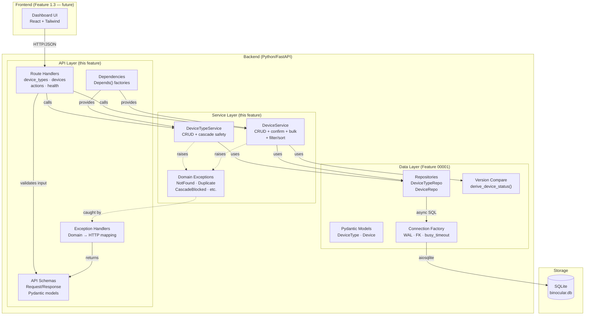

# Implementation Plan: Inventory API (CRUD)

**Branch**: `00002-inventory-api` | **Date**: 2026-03-01 | **Spec**: [spec.md](spec.md)
**Input**: Feature specification from `specs/00002-inventory-api/spec.md`

## Summary

Build the FastAPI REST API layer that exposes the repository CRUD operations from Feature 00001 as HTTP endpoints. Covers device type management, device management within types, single-device and bulk firmware update confirmation, filtering, sorting, and a consistent error translation layer. The API is the backend contract that the React frontend (Feature 1.3) and the extension engine (Feature 2.x) will consume.

## Technical Context

**Source Document**: [docs/tech-context.md](../../docs/tech-context.md)

**Language/Version**: Python 3.11+
**Primary Dependencies**: FastAPI, Pydantic v2, aiosqlite (via existing repositories), structlog, uvicorn
**Storage**: SQLite — reuses Feature 00001 connection factory and repositories (no schema changes)
**Testing**: pytest + pytest-asyncio + httpx.AsyncClient (FastAPI TestClient pattern)
**Target Platform**: Linux server (Docker container, `python:3.11-slim`)
**Project Type**: web (FastAPI backend + React frontend)
**Performance Goals**: Sub-100ms p95 for single-entity operations; sub-200ms for filtered list queries (<1K rows)
**Constraints**: Single-user, single-instance. No authentication. No pagination in V1.
**Scale/Scope**: <100 device types, <1K devices, single concurrent user (homelab)

## Instructions Check

*GATE: Must pass before Phase 0 research. Re-check after Phase 1 design.*

| Principle | Status | Notes |
|---|---|---|
| I. Self-Contained Deployment | PASS | Builds on existing SQLite layer. Adds only FastAPI route modules — no external dependencies. Uvicorn serves on single port. `BINOCULAR_DB_PATH` env var with sensible default (`/app/data/binocular.db`). `.vscode/launch.json` for F5 debugging. |
| II. Extension-First Architecture | PASS | API layer is device-agnostic. Extension module association is a generic FK attribute on device types. No vendor-specific logic. |
| III. Responsible Scraping | N/A | No web requests in this feature. Inventory management only. |
| IV. Type Safety & Validation | PASS | All request/response payloads validated via Pydantic models. Consistent error envelope with typed error codes. All code targets `mypy --strict`. Structured logging via `structlog`. |
| V. Test-First Development | PASS | Integration tests using `httpx.AsyncClient` + FastAPI TestClient with isolated temp-file SQLite. Spec provides GWT scenarios for all user stories. Task ordering enforces test-first: test tasks precede implementation tasks within each user story phase. |
| VI. Technology Stack | PASS | FastAPI + SQLite. `uvicorn` for serving. No new frameworks. httpx added as test dependency only. |
| VII. Development Workflow | PASS | Auto-generated OpenAPI docs at `/docs`, tagged by resource type. `.vscode/launch.json` for F5 debugging. |

**Result**: PASS — No compliance violations.

## Architecture Decisions

### AD-1: Hybrid Routing — Nested Creation, Flat Querying

**Decision**: Device creation uses a nested route (`POST /api/v1/device-types/{id}/devices`) to make the parent-child relationship explicit. All other device operations use flat routes (`GET/PATCH/DELETE /api/v1/devices/{id}`, `GET /api/v1/devices`).

**Rationale**: The creation route enforces that every device has a parent device type — the `device_type_id` comes from the URL, not the request body, preventing mismatches. The flat query route (`GET /api/v1/devices`) enables cross-type inventory views with optional `?device_type_id=X` filtering, which the dashboard needs for grouped displays.

**Trade-off**: Two different URL patterns for devices — nested for creation, flat for everything else. The OpenAPI docs make this clear, and the `device_type_id` is always present in the response body regardless of which URL was used.

### AD-2: Service Layer + Exception Handlers for Error Translation

**Decision**: Introduce a thin service layer (`backend/src/services/`) that wraps repository calls and translates low-level exceptions (SQLite `IntegrityError`, `ValueError` from repos) into typed domain exceptions (`DuplicateNameError`, `NotFoundError`, `NoLatestVersionError`, `CascadeBlockedError`). FastAPI exception handlers registered at app startup convert domain exceptions to the standard error envelope (HTTP status + `{detail, error_code, field}`).

**Rationale**: 
- **Separation of concerns**: Route handlers stay thin — they validate input (Pydantic), call the service, return the response. Error translation logic is centralized, not duplicated across routes.
- **Testability**: Domain exceptions can be unit-tested independently of HTTP. Integration tests verify the full chain.
- **Consistency**: A single set of exception handlers guarantees every error response follows FR-016's envelope structure.

**Domain exception hierarchy**:
```
BinocularError (base)
├── NotFoundError(resource_type, resource_id)
├── DuplicateNameError(resource_type, name, field="name")
├── ValidationError(message, field)
├── CascadeBlockedError(device_type_name, device_count)
└── NoLatestVersionError(device_id)
```

**HTTP mapping**:
| Domain Exception | HTTP Status | Error Code |
|---|---|---|
| `NotFoundError` | 404 | `NOT_FOUND` |
| `DuplicateNameError` | 409 | `DUPLICATE_NAME` |
| `CascadeBlockedError` | 409 | `CASCADE_BLOCKED` |
| `NoLatestVersionError` | 409 | `NO_LATEST_VERSION` |
| `ValidationError` | 422 | `VALIDATION_ERROR` |
| Unhandled exception | 500 | `INTERNAL_ERROR` |

### AD-3: Confirm Action as POST Sub-Resource

**Decision**: The single-device confirm action is `POST /api/v1/devices/{id}/confirm`. Bulk confirm is `POST /api/v1/devices/confirm-all`. No request body — the action is self-describing.

**Rationale**: This follows the Google API Design Guide's "custom methods" pattern. The action is a state transition (set `current_version = latest_seen_version`), not a generic field update. A dedicated endpoint makes the intent explicit, is idempotent, and keeps PATCH reserved for user-driven field changes.

**Trade-off**: Two action endpoints (`confirm` + `confirm-all`) vs a single batch endpoint. Separate endpoints are simpler — the single-device confirm returns the updated device; the bulk confirm returns a summary object. Different response shapes warrant different endpoints.

### AD-4: Device Response Enrichment

**Decision**: The `DeviceResponse` Pydantic model includes two derived fields not stored in the database:
1. `status`: Tri-state string (`never_checked`, `up_to_date`, `update_available`) computed via `derive_device_status()`.
2. `device_type_name`: The parent device type's name, fetched via a JOIN or follow-up query.

**Rationale**: The spec requires devices to include parent device type information for grouped dashboard views (US2-AS6, FR-011). Computing `status` at serialization time (not DB-level) aligns with Feature 00001's AD-4 (version comparison is a pure function). Including `device_type_name` avoids N+1 queries on the frontend.

### AD-5: DeviceType Response with Device Count

**Decision**: The `DeviceTypeResponse` includes a `device_count: int` field derived from `SELECT COUNT(*) FROM device WHERE device_type_id = ?`. This is computed at query time, not cached.

**Rationale**: FR-011 requires device count in type responses for cascade deletion warnings and dashboard summaries. At the expected scale (<100 types, <1K devices), the COUNT query is negligible. The count is computed via a LEFT JOIN in the list query or a subquery in the single-get.

### AD-6: App Entry Point and F5 Debugging

**Decision**: The FastAPI application factory lives at `backend/src/main.py`. A `.vscode/launch.json` configuration uses `debugpy` to launch Uvicorn with `--reload`, enabling F5 debugging with breakpoints.

**Rationale**: 
- The entry point `backend.src.main:app` follows the existing project structure (`backend/src/` is the source root).
- `debugpy` is the standard Python debugging protocol for VS Code — it integrates natively with the Python extension.
- `--reload` enables hot-reloading during development without restarting the debugger.
- `BINOCULAR_DB_PATH` env var defaults to `./data/binocular.db` for local dev, overridden in Docker to `/app/data/binocular.db`.

### AD-7: Pydantic Model Layering (Request → Domain → Response)

**Decision**: Introduce API-specific Pydantic models in `backend/src/api/schemas/` that are distinct from the repository-layer models in `backend/src/models/`:

- **Request models** (`DeviceTypeCreateRequest`, `DeviceUpdateRequest`, etc.): Validate input at the API boundary. Include max-length constraints (200 chars for names), URL format validation, and trimming.
- **Response models** (`DeviceTypeResponse`, `DeviceResponse`, `BulkConfirmResponse`, `ErrorResponse`): Include derived fields (`status`, `device_count`, `device_type_name`).
- **Domain models** (existing `backend/src/models/`): Remain as-is — they map to DB rows.

**Rationale**: API schemas have different concerns than persistence models (e.g., `device_count` doesn't exist in the DB). Separating them avoids leaking API concerns into the data layer and vice versa. FastAPI auto-generates OpenAPI docs from these schemas.

### AD-8: Name Update Support on DeviceType

**Decision**: Allow `name` to be updated via PATCH on device types. The existing `DeviceTypeUpdate` model in Feature 00001 omits `name` — the API layer must extend it (or shadow it with a request-specific schema that includes `name`).

**Rationale**: The spec (US1-AS3) expects users to correct device type names. The uniqueness constraint is enforced at the DB level (UNIQUE on `name`) and translated to a `DUPLICATE_NAME` error by the service layer.

## Project Structure

### Documentation (this feature)

```text
specs/00002-inventory-api/
├── plan.md              # This file
├── spec.md              # Feature specification
├── research.md          # Domain research (reused from specify phase)
├── quickstart.md        # Integration scenarios and debug setup
├── contracts/
│   └── openapi.yaml     # OpenAPI 3.1 contract
└── tasks.md             # Phase 2 output (/sddp-tasks command)
```

### Source Code (repository root)

```text
backend/
├── src/
│   ├── main.py                    # FastAPI app factory + startup hooks
│   ├── db/                        # (existing — no changes)
│   │   ├── connection.py
│   │   ├── migration_runner.py
│   │   └── migrations/
│   │       └── 001_initial.sql
│   ├── models/                    # (existing domain models — minor updates)
│   │   ├── device_type.py         # Add name to DeviceTypeUpdate
│   │   ├── device.py
│   │   ├── app_config.py
│   │   ├── extension_module.py
│   │   └── check_history.py
│   ├── repositories/              # (existing — minor additions)
│   │   ├── device_type_repo.py    # Add get_device_count(), get_all_with_counts()
│   │   ├── device_repo.py         # Add get_all_filtered(), bulk_confirm()
│   │   ├── app_config_repo.py
│   │   ├── extension_module_repo.py
│   │   └── check_history_repo.py
│   ├── api/                       # NEW — API layer
│   │   ├── __init__.py
│   │   ├── schemas/
│   │   │   ├── __init__.py
│   │   │   ├── device_type.py     # DeviceTypeCreateRequest, Response, etc.
│   │   │   ├── device.py          # DeviceCreateRequest, Response, etc.
│   │   │   ├── actions.py         # BulkConfirmResponse
│   │   │   └── errors.py          # ErrorResponse model
│   │   ├── routes/
│   │   │   ├── __init__.py
│   │   │   ├── device_types.py    # /api/v1/device-types routes
│   │   │   ├── devices.py         # /api/v1/devices routes + nested creation
│   │   │   ├── actions.py         # /api/v1/devices/{id}/confirm, confirm-all
│   │   │   └── health.py         # /api/v1/health
│   │   ├── middleware.py           # Correlation ID + structured request logging
│   │   ├── dependencies.py        # FastAPI Depends — repo & service factories
│   │   └── exception_handlers.py  # Domain exception → HTTP error envelope
│   ├── services/                  # NEW — thin service layer
│   │   ├── __init__.py
│   │   ├── device_type_service.py # Wraps DeviceTypeRepo + error translation
│   │   ├── device_service.py      # Wraps DeviceRepo + confirm + bulk + filtering
│   │   └── exceptions.py          # Domain exception hierarchy
│   └── utils/                     # (existing)
│       ├── logging_config.py
│       └── version_compare.py
└── tests/
    ├── conftest.py                # Extended: add TestClient + app fixture
    ├── test_api/                  # NEW — API integration tests
    │   ├── __init__.py
    │   ├── conftest.py            # httpx.AsyncClient fixture
    │   ├── test_device_types.py   # CRUD + cascade + duplicate
    │   ├── test_devices.py        # CRUD + filtering + sorting + duplicate
    │   ├── test_confirm.py        # Single confirm + bulk confirm
    │   └── test_errors.py         # Error envelope consistency
    ├── test_services/             # NEW — service layer unit tests
    │   ├── __init__.py
    │   ├── test_device_type_service.py
    │   └── test_device_service.py
    ├── test_connection.py
    ├── test_migration_runner.py
    ├── test_models/
    ├── test_repositories/
    └── test_version_compare.py
```

**Structure Decision**: Web application layout (backend + frontend) per tech-context.md. This feature adds `backend/src/api/` (route layer) and `backend/src/services/` (business logic layer) on top of the existing `models/` and `repositories/` from Feature 00001. Frontend is out of scope.

Data Model: Reuses Feature 00001 — see [specs/00001-db-schema-models/data-model.md](../00001-db-schema-models/data-model.md). No schema changes required. Minor additions to repository methods and Pydantic model fields.

## API Contracts

See [contracts/openapi.yaml](contracts/openapi.yaml) — OpenAPI 3.1 specification.

**Endpoint Summary** (13 endpoints):

| Method | Path | Tag | Description | Spec FR |
|---|---|---|---|---|
| GET | `/api/v1/device-types` | Device Types | List all types with device counts | FR-001, FR-011 |
| POST | `/api/v1/device-types` | Device Types | Create a device type | FR-001 |
| GET | `/api/v1/device-types/{id}` | Device Types | Get type by ID | FR-001 |
| PATCH | `/api/v1/device-types/{id}` | Device Types | Partial update | FR-001 |
| DELETE | `/api/v1/device-types/{id}` | Device Types | Delete (cascade-safe) | FR-001, FR-010 |
| POST | `/api/v1/device-types/{id}/devices` | Devices | Create device (nested) | FR-002 |
| GET | `/api/v1/devices` | Devices | List with filters & sort | FR-002, FR-012, FR-013 |
| GET | `/api/v1/devices/{id}` | Devices | Get device by ID | FR-002 |
| PATCH | `/api/v1/devices/{id}` | Devices | Partial update | FR-002 |
| DELETE | `/api/v1/devices/{id}` | Devices | Delete device | FR-002 |
| POST | `/api/v1/devices/{id}/confirm` | Actions | Confirm firmware update | FR-003, FR-004, FR-005 |
| POST | `/api/v1/devices/confirm-all` | Actions | Bulk confirm all pending | FR-014, FR-014a, FR-015 |
| GET | `/api/v1/health` | Health | Docker HEALTHCHECK | — |

## High-Level Architecture



## Complexity Tracking

No deviations from project instructions. No complexity violations to justify.
