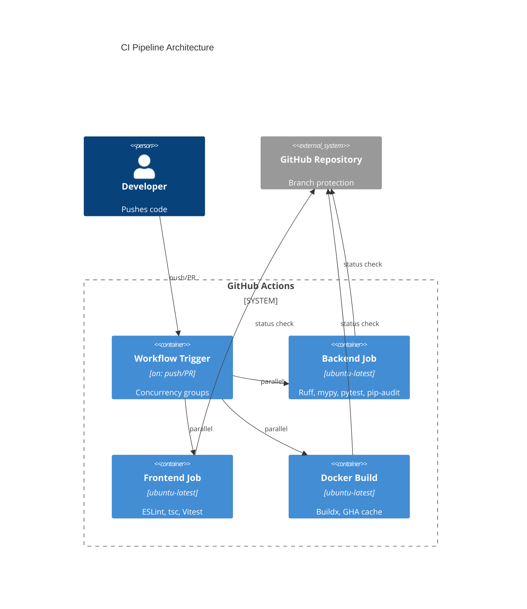

# Implementation Plan: Continuous Integration Pipeline

**Branch**: `00003-continuous-integration-pipeline` | **Date**: 2026-06-10 | **Spec**: [spec.md](spec.md)

## Summary

**Goal**: Validate and harden the GitHub Actions CI pipeline so every PR and push enforces backend quality gates (Ruff, mypy --strict, pytest/coverage, pip-audit), conditional frontend gates (lint, tsc, Vitest), and Docker build verification.
**Approach**: Audit the existing `ci.yml` seeded by E001 against E003 spec requirements, fill any gaps, and verify all gates function correctly.
**Key Constraint**: GitHub Actions free-tier public repo; no self-hosted runners.

## Technical Context

**Language/Version**: YAML (GitHub Actions), Python 3.13 (backend gates), Node 22 (frontend gates)
**Primary Dependencies**: GitHub Actions (`actions/checkout@v5`, `astral-sh/setup-uv@v6`, `actions/setup-python@v6`, `actions/setup-node@v5`, `docker/setup-buildx-action@v4`, `docker/build-push-action@v7`)
**Storage**: N/A
**Testing**: N/A — CI pipeline validates other code, not itself
**Target Platform**: GitHub Actions ubuntu-latest runners
**Project Type**: web
**Project Mode**: brownfield
**Performance Goals**: CI completes within 5 minutes for a typical PR
**Constraints**: Free-tier runner limits; no secrets required; read-only permissions
**Scale/Scope**: Single workflow file, three parallel jobs

## Instructions Check

| Principle | Status | Evidence |
|-----------|--------|----------|
| I. Honest Failure | PASS | CI gates fail visibly on violations (OR-002–OR-005) |
| II. Polite by Default | N/A | No outbound scraping |
| III. Data Ownership | N/A | No data persistence |
| IV. Least-Privilege | PASS | `permissions: contents: read` (OR-011) |
| V. Type Safety | PASS | mypy --strict (backend), tsc strict (frontend) enforced |
| VI. Set-and-Forget | PASS | Runs automatically on every change |
| VII. Agent Output Style | N/A | |

## Architecture



## Architecture Decisions

| ID | Decision | Options Considered | Chosen | Rationale |
|----|----------|--------------------|--------|-----------|
| AD-001 | Dependency installer for backend CI | pip + requirements.txt / uv sync | uv sync | Project uses uv (pyproject.toml + uv.lock); faster installs, lock-file consistency. See ADR-0002. |
| AD-002 | Frontend conditional execution | Separate workflow / conditional steps in same job | Conditional steps via GITHUB_OUTPUT | Single workflow simpler to maintain; frontend gates activate when E004 adds package.json |
| AD-003 | Docker build caching | No cache / Docker layer cache / GHA cache | GHA cache (type=gha) | Native GitHub Actions integration; no external registry needed. See ADR-0001. |

## Data Model Summary

N/A — no persistent data

## API Surface Summary

N/A — no API surface

## Testing Strategy

| Tier | Tool | Scope | Mock Boundary | Install |
|------|------|-------|---------------|---------|
| Unit | N/A | CI pipeline has no unit-testable logic | — | — |
| Integration | GitHub Actions | Workflow validates by running on real code | No mocks — real linter/compiler/test runner | configured |
| Security | pip-audit | Backend Python dependency CVE scan | — | configured |
| Coverage | pytest-cov | Backend code coverage ≥80% enforcement | — | configured |

## Error Handling Strategy

N/A — CI pipeline produces pass/fail status; no error recovery patterns apply.

## Integration Points

| Spec Reference | System/Service | Technical Approach | Contract |
|----------------|----------------|--------------------|----------|
| IP-001 | E001 App Skeleton | Consumes Dockerfile, pyproject.toml, entrypoint.sh | File existence and valid syntax |
| IP-002 | E001 ci.yml seed | Validates and hardens existing workflow | YAML schema compliance |
| IP-003 | E004 Frontend SPA | Conditional frontend gates activate on package.json | package.json existence check |
| IP-004 | E017 Release Pipeline | Provides base workflow; E017 extends with publish steps | Workflow structure |

## Risk Mitigation

| Risk (from spec) | Likelihood | Impact | Mitigation | Owner |
|-------------------|------------|--------|------------|-------|
| GHA cache eviction causing slower builds | Low | Low | Accept; GHA cache has 10GB limit per repo, sufficient for this project | CI workflow |
| Action version breaking changes | Low | Medium | Pin to major versions (v4, v5, v6, v7); review Dependabot PRs | CI workflow |

## Requirement Coverage Map

| Req ID | Component(s) | File Path(s) | Notes |
|--------|--------------|--------------|-------|
| OR-001 | Workflow trigger | `.github/workflows/ci.yml` (lines 3-7) | `on: pull_request` + `push: branches: [main]` |
| OR-002 | Backend job | `.github/workflows/ci.yml` (backend job) | `uv run ruff check .` step |
| OR-003 | Backend job | `.github/workflows/ci.yml` (backend job) | `uv run mypy .` step |
| OR-004 | Backend job | `.github/workflows/ci.yml` (backend job) | `uv run pytest --cov=binocular --cov-report=term-missing` step |
| OR-005 | Backend job | `.github/workflows/ci.yml` (backend job) | `uv run pip-audit` step |
| OR-006 | Frontend job | `.github/workflows/ci.yml` (frontend job) | Shell script checking `frontend/package.json` |
| OR-007 | Frontend job | `.github/workflows/ci.yml` (frontend job) | Conditional lint, typecheck, test steps |
| OR-008 | Docker build job | `.github/workflows/ci.yml` (docker-build job) | `docker/build-push-action` with `push: false` |
| OR-009 | Docker build job | `.github/workflows/ci.yml` (docker-build job) | Buildx setup + `cache-from: type=gha` |
| OR-010 | Workflow config | `.github/workflows/ci.yml` (top-level) | `concurrency` block with `cancel-in-progress: true` |
| OR-011 | Workflow config | `.github/workflows/ci.yml` (top-level) | `permissions: contents: read` |
| OR-012 | GitHub settings | Repository branch protection rules | Required status checks (manual config outside code) |

## Project Structure

### Source Code

```text
~ .github/workflows/ci.yml          # Validate and harden existing workflow
```

**Brownfield Notes**:
- **Patterns to reuse**: Existing ci.yml structure from E001 with three parallel jobs
- **Tests to extend**: No CI-specific tests; validation is by running the pipeline
- **Naming conventions**: GitHub Actions YAML conventions; step names use sentence case

## Implementation Hints

- **[HINT-001]** Gotcha: The existing ci.yml already covers all OR-001 through OR-012 requirements — verify before making unnecessary changes
- **[HINT-002]** Order: Frontend gates must remain conditional; removing the package.json check will break CI until E004 is delivered
- **[HINT-003]** Constraint: `pip-audit` may report advisories for transitive dependencies — ensure the step configuration handles exit codes correctly
