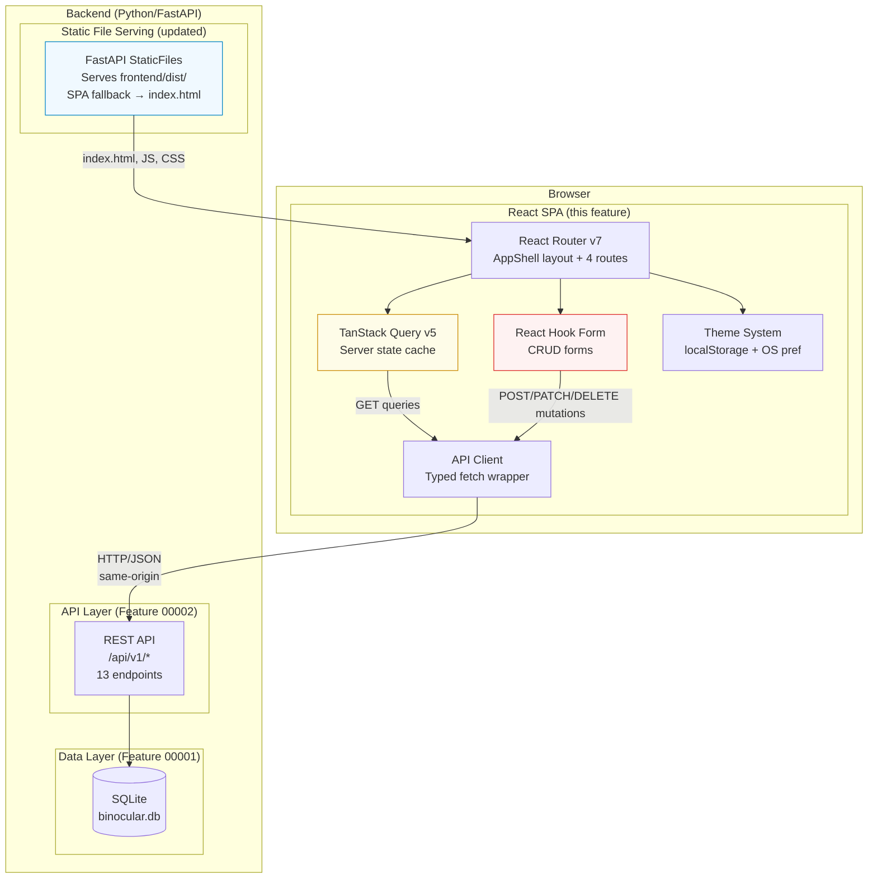

# Implementation Plan: Core Frontend (UI/UX)

**Branch**: `00003-devices-ui` | **Date**: 2026-03-01 | **Spec**: [spec.md](spec.md)
**Input**: Feature specification from `specs/00003-devices-ui/spec.md`

## Summary

Build the React + TypeScript frontend that serves as the primary user interface for Binocular's device inventory management. The frontend consumes the Inventory API (Feature 00002) to display a grouped device dashboard with firmware version comparison, tri-state status indicators, one-click confirm actions, CRUD forms for devices and device types/modules, dark/light theme with OS preference detection, responsive layout (320px–desktop), and skeleton loading states. Delivered as a Vite-built SPA served by FastAPI's `StaticFiles` middleware on the existing single port.

## Technical Context

**Source Document**: [docs/tech-context.md](../../docs/tech-context.md)

**Language/Version**: TypeScript (strict) — React 18+, Vite 5+
**Primary Dependencies**: React, React Router v7, TanStack Query v5, React Hook Form, Tailwind CSS v3.4+, lucide-react, Biome
**Storage**: N/A (browser `localStorage` for theme preference only)
**Testing**: Vitest + React Testing Library + one Playwright smoke test
**Target Platform**: Modern browsers (Chrome, Firefox, Safari, Edge — last 2 versions), minimum 320px viewport
**Project Type**: web (`backend/` + `frontend/`)
**Performance Goals**: < 3s initial load (SC-001), < 300ms tab transitions (SC-008), < 2s confirm round-trip (SC-003)
**Constraints**: Single-port architecture (FastAPI serves static files), no external CDN, no runtime external dependencies, 320px minimum width
**Scale/Scope**: 5–50 devices, single user, 4 navigation tabs, ~12 API endpoints consumed

## Instructions Check

*GATE: Must pass before Phase 0 research. Re-check after Phase 1 design.*

| Principle | Status | Notes |
|---|---|---|
| I. Self-Contained Deployment | PASS | No external services. Frontend built by Vite, served via FastAPI `StaticFiles` on single port. Multi-stage Docker build (Node for frontend → Python for runtime). Theme persistence uses browser `localStorage`. No new env vars required. |
| II. Extension-First Architecture | PASS | Frontend treats devices and device types generically. No vendor-specific logic. Modules tab exposes CRUD through existing API. |
| III. Responsible Scraping | N/A | Frontend makes zero external HTTP requests. All data flows through same-origin backend API. |
| IV. Type Safety & Validation | PASS | TypeScript strict mode (equivalent of `mypy --strict`). Client-side validation via React Hook Form mirrors backend Pydantic rules (FR-016). Server errors mapped to user-friendly messages (FR-017). |
| V. Test-First Development | PASS | Vitest + RTL for component tests, one Playwright smoke test. Every user story has Independent Test + Given/When/Then scenarios. Testing approach targets behavior, not implementation internals. |
| VI. Technology Stack | PASS | React + Tailwind CSS + Vite matches locked stack table. lucide-react is a lightweight bundled icon library. Dependencies pinned via `package-lock.json` (`npm ci` in Docker). |
| VII. Development Workflow | PASS | **Frontend quality gates**: Biome (lint + format) + `tsc --noEmit` (type check) run as pre-merge gates alongside Python's `ruff` + `mypy`. Lock file committed. Conventional Commits enforced. |

**Result**: PASS — No compliance violations. Principle VII CONCERN (frontend quality gates undefined) resolved by explicit Biome + tsc toolchain declaration.

## Architecture Decisions

### AD-1: Component Architecture — Feature-Based Organization

**Decision**: Organize the `frontend/src/` directory by feature area (dashboard, modules, common) rather than by component type (components, hooks, utils). Each feature folder contains its own components, hooks, and types.

**Rationale**: At the expected scale (~20–30 components), a feature-based layout is more navigable than a flat `components/` folder. Developers can work on the Modules tab without knowing the dashboard internals. Co-location of related code reduces import distance and makes it obvious which components support which user stories.

**Component hierarchy** (informed by [mockup.jsx](../../docs/mockup.jsx)):

```
AppShell (layout route)
├── Sidebar (desktop: fixed 256px, mobile: off-canvas drawer)
│   ├── Logo + branding
│   └── NavItem × 4 (Inventory, Activity Logs, Modules, Settings)
├── Header (sticky, section title + theme toggle)
└── <Outlet/> (route content)
    ├── DashboardPage
    │   ├── StatsRow (3 cards: Total, Updates Available, Up to Date)
    │   ├── ActionBar (Add Device button, Refresh button)
    │   ├── DeviceTypeGroup × N
    │   │   ├── GroupHeading (type name, device count)
    │   │   └── DeviceCard × N
    │   │       ├── StatusIndicator (tri-state icon + color + label)
    │   │       ├── VersionComparison (Local → Latest)
    │   │       └── ConfirmButton (conditional, disabled during pending)
    │   └── EmptyState (shown when no devices exist)
    ├── ModulesPage
    │   ├── ModuleCard × N (name, firmware URL, frequency)
    │   └── EmptyState
    ├── PlaceholderPage (Activity Logs, Settings)
    └── SlideOverPanel (shared — add/edit device, add/edit device type/module)
        ├── FormFields (React Hook Form controlled)
        └── SubmitButton (disabled during pending)
```

### AD-2: State Management — TanStack Query for Server State

**Decision**: Use TanStack Query v5 for all server-state management (device lists, device types, module list, stats). Local UI state (sidebar open, theme, slide-over form visibility) uses plain React `useState`.

**Rationale**:
- **Automatic cache invalidation**: After a `createDevice` mutation, invalidate the `["devices"]` and `["device-types"]` queries — the dashboard re-fetches and stats (FR-021) update automatically.
- **Optimistic mutations**: The confirm action (FR-010) uses `useMutation` with `onMutate` to optimistically update the device's `status` and `current_version` before the server responds, then rolls back `onError`. This delivers the < 2s perceived round-trip (SC-003).
- **Loading/error states for free**: Each `useQuery` call provides `isLoading`, `isError`, `error` — directly consumed by skeleton screens (FR-024) and error messages (FR-017).
- **Manual refresh**: The Refresh button (FR-023) calls `queryClient.invalidateQueries()` to trigger a re-fetch.

**Query key structure**:
- `["device-types"]` — list all types (with device counts)
- `["devices"]` — list all devices
- `["devices", { device_type_id }]` — filtered by type (future use)

**No global state library needed**: The only cross-cutting client state is theme preference (stored in `localStorage`, read on mount) and sidebar toggle (local `useState`). Neither warrants Zustand or Redux.

### AD-3: API Client — Typed Fetch Wrapper

**Decision**: A hand-written TypeScript module (`frontend/src/api/client.ts`) providing one async function per API operation. TypeScript interfaces mirror the OpenAPI response schemas from Feature 00002's [openapi.yaml](../00002-inventory-api/contracts/openapi.yaml).

**Rationale**: With 12 API endpoints, code generation (openapi-typescript-codegen, orval) adds build pipeline complexity that exceeds the value. The wrapper is ~150 lines, fully typed, and trivially maintainable. All functions share a common `apiFetch()` base that:
1. Prepends the `/api/v1` base path
2. Sets `Content-Type: application/json` for mutations
3. Checks `response.ok` and throws a typed `ApiError` on failure
4. Parses the backend error envelope (`{ detail, error_code, field }`) into a structured error object

**TypeScript types** defined in `frontend/src/api/types.ts`:
- `DeviceType`, `DeviceTypeCreateRequest`, `DeviceTypeUpdateRequest` — mirrors OpenAPI schemas
- `Device`, `DeviceCreateRequest`, `DeviceUpdateRequest` — mirrors OpenAPI schemas
- `BulkConfirmResponse`, `ErrorResponse`, `ApiError` — error handling
- `DeviceStatus = "never_checked" | "up_to_date" | "update_available"` — tri-state literal union

### AD-4: Form Pattern — Slide-Over Panel with React Hook Form

**Decision**: All CRUD forms render in a shared `SlideOverPanel` component (right-edge drawer). Forms use React Hook Form for state management, validation, and server error integration.

**Rationale**:
- **Slide-over** (per REC-4.1 from research and spec clarification): Preserves dashboard context — the user can see the grouped device list behind the panel. Full-screen on mobile (< 768px), 400px-wide drawer on desktop. Matches the pattern from Linear, Portainer, and Mealie.
- **React Hook Form** (per research §12): The `setError("name", { message })` API maps backend `DUPLICATE_NAME` errors directly to the name field — no custom plumbing needed (FR-017, SC-007). Validation rules (non-empty, max-length, URL format) are declared inline with `register()`.
- **Shared component**: A single `SlideOverPanel` component accepts `title`, `isOpen`, `onClose`, and renders children. Form-specific content is composed inside it. This avoids duplicating the slide-over animation, backdrop, and focus-trap logic.

**Form inventory**:
| Form | Fields | Trigger | API Operation |
|---|---|---|---|
| Add Device | name*, type* (dropdown), current_version* | Dashboard "Add Device" button | `POST /device-types/{id}/devices` |
| Edit Device | name*, current_version*, notes | Device card edit action | `PATCH /devices/{id}` |
| Add Device Type / Module | name*, firmware_source_url*, check_frequency, extension_module_id (disabled) | Modules tab "Add" button | `POST /device-types` |
| Edit Device Type / Module | name*, firmware_source_url*, check_frequency, extension_module_id (disabled) | Module card edit action | `PATCH /device-types/{id}` |

*\* = required field*

### AD-5: Dark Mode — Class Strategy with FOIT Prevention

**Decision**: Tailwind's `darkMode: 'class'` strategy. A blocking `<script>` in `index.html` `<head>` reads `localStorage` and applies the `dark` class to `<html>` before React mounts, preventing flash of incorrect theme (FOIT).

**Rationale**:
- The `class` strategy gives programmatic control over the theme (FR-002, FR-003, FR-004, FR-005).
- The blocking script runs before any rendering, so the initial paint matches the user's saved preference — no white flash for dark-mode users (FR-005).
- The toggle is a two-state switch (Sun/Moon icons from lucide-react, matching mockup) with OS preference as the initial default (FR-003). A three-state toggle (system/light/dark) is deferred to V2 — the two-state toggle is simpler and sufficient for V1.
- `localStorage` key: `binocular-theme` with values `"dark"` or `"light"`. If `localStorage` is unavailable (FR-004), falls back to in-memory state defaulting to `prefers-color-scheme`.

### AD-6: Routing — React Router v7 with Layout Route

**Decision**: React Router v7 with a single layout route (`AppShell`) wrapping four child routes. No nested routes beyond the top-level layout.

**Route table**:
| Path | Component | Sidebar Label |
|---|---|---|
| `/` | `DashboardPage` | Inventory |
| `/logs` | `PlaceholderPage` | Activity Logs |
| `/modules` | `ModulesPage` | Modules |
| `/settings` | `PlaceholderPage` | Settings |

**Rationale**: The 4-tab SPA layout maps directly to 4 routes under a shared layout. `AppShell` renders the sidebar, header, and an `<Outlet>` for the active route's content. `<NavLink>` provides automatic active-tab styling (FR-006, SC-008). No data loading at the route level — TanStack Query handles data fetching inside components.

**SPA fallback**: In production, FastAPI must return `index.html` for any path not matching `/api/*` — so browser refreshes on `/modules` or `/settings` work correctly.

### AD-7: Responsive Layout — Mockup-Aligned Breakpoints

**Decision**: Three responsive tiers matching the mockup's layout behavior:

| Breakpoint | Sidebar | Stats Row | Device Cards | Header |
|---|---|---|---|---|
| < 768px (mobile) | Off-canvas drawer, hamburger trigger | Single column (stacked) | Single column, full width | Hamburger menu + title + theme toggle |
| 768px–1023px (tablet) | Fixed 256px sidebar | 3 columns | Single column | Title + theme toggle |
| ≥ 1024px (desktop) | Fixed 256px sidebar | 3 columns | 2-column grid | Title + theme toggle |

**Rationale**: These breakpoints match Tailwind's `md` (768px) and `lg` (1024px) defaults and align with the mockup's existing responsive behavior. The sidebar transition at `md` (fixed ↔ off-canvas) is CSS-driven (no animation timing requirement per spec edge case §7). Stats cards use `grid-cols-1 sm:grid-cols-3`. Device cards use `grid-cols-1 lg:grid-cols-2` (matching the mockup's `lg:grid-cols-2`).

### AD-8: Skeleton Loading — Layout-Matched Placeholders

**Decision**: Skeleton screens (FR-024) match the structural layout of real content: stats row (3 pulse-animated rectangles), followed by device card skeletons (matching card dimensions with animated gradient). Displayed during initial `useQuery` loading state. Individual action buttons use inline spinners (FR-018).

**Rationale**: Layout-matched skeletons prevent content shifting when data arrives — the user sees a stable layout that "fills in" rather than a spinner followed by a layout jump. This is the pattern used by GitHub, Linear, and Vercel. Implementation uses Tailwind's `animate-pulse` on `bg-slate-200 dark:bg-slate-800` placeholder blocks.

### AD-9: Error Handling — Layered Error Strategy

**Decision**: Three layers of error handling:

1. **Form-level errors**: React Hook Form's `setError()` maps backend `error_code` + `field` to inline field errors (e.g., `DUPLICATE_NAME` on `name` → "A device with this name already exists" appears below the name input).
2. **Action-level errors**: Mutation errors from TanStack Query are caught and displayed as inline banners on the relevant section (e.g., confirm action fails → error banner on the device card).
3. **Page-level errors**: Query errors (network failure, 500) trigger an error state component with a "Retry" button that calls `refetch()`.

**Error code mapping** (from backend's `ErrorResponse` to user-facing messages):
| `error_code` | User Message |
|---|---|
| `DUPLICATE_NAME` | "A {resource} with this name already exists." |
| `NOT_FOUND` | "This {resource} was not found — it may have been deleted." |
| `VALIDATION_ERROR` | Use `detail` field directly (already human-readable). |
| `CASCADE_BLOCKED` | "This device type has {n} devices. Delete them first or confirm cascade deletion." |
| `NO_LATEST_VERSION` | "Cannot confirm: this device has never been checked for updates." |
| `INTERNAL_ERROR` | "Something went wrong. Please try again." |

### AD-10: F5 Debugging — Compound Launch Configuration

**Decision**: Extend the existing `.vscode/launch.json` with a compound configuration that launches both the FastAPI backend and the Vite frontend dev server simultaneously when the user presses F5.

**Configuration**:
- **"Binocular: Debug API"** (existing) — launches Uvicorn with debugpy on port 8000
- **"Binocular: Debug Frontend"** (new) — launches `npm run dev` in `frontend/` via a Task or launch config (Vite dev server on port 5173 with proxy to 8000)
- **"Binocular: Full Stack"** (new compound) — launches both configurations together

**Rationale**: The user explicitly requested F5 debugging for both backend and frontend. The compound configuration means pressing F5 starts both servers. The frontend dev server uses Vite's proxy so the browser connects to `localhost:5173` and API calls are forwarded to `localhost:8000`. Breakpoints work in both Python (via debugpy) and TypeScript (via VS Code's built-in Chrome debugger / source maps).

**Prerequisite**: The Vite dev server must be configured as a VS Code task (or `launch` config with `"type": "node"`) to be included in the compound configuration.

### AD-11: Delete Confirmation — Device Type Cascade Dialog

**Decision**: When the user clicks "Delete" on a device type that has child devices (FR-015), show a confirmation dialog (not a browser `confirm()`) that displays: "Delete {type name}? This will also delete {N} devices." with "Cancel" and "Delete All" buttons.

**Rationale**: The backend requires `?confirm_cascade=true` when child devices exist. The frontend must first check `device_count` (available in the `DeviceTypeResponse`) and conditionally show the cascade warning. A custom dialog (rather than `window.confirm()`) allows consistent styling in both themes and better UX.

**Flow**: Delete button → if `device_count > 0`, show dialog → user confirms → `DELETE /device-types/{id}?confirm_cascade=true` → invalidate queries. If `device_count === 0`, delete directly with a simpler "Are you sure?" confirmation.

## Project Structure

### Documentation (this feature)

```text
specs/00003-devices-ui/
├── plan.md              # This file
├── spec.md              # Feature specification
├── research.md          # UX patterns (§1-7) + architecture decisions (§8-17)
├── quickstart.md        # Dev setup, integration scenarios, F5 debugging guide
└── tasks.md             # Phase 2 output (/sddp-tasks command)
```

Data Model: N/A — the frontend consumes API responses from Feature 00002. No new persistent data is introduced.

API Contracts: N/A — the frontend consumes the existing [openapi.yaml](../00002-inventory-api/contracts/openapi.yaml) from Feature 00002. No new backend endpoints are introduced.

### Source Code (repository root)

```text
frontend/
├── index.html                  # SPA entry point + FOIT-prevention script
├── package.json                # Dependencies, scripts (dev, build, test, lint, typecheck)
├── package-lock.json           # Pinned dependency versions
├── tsconfig.json               # TypeScript strict config
├── vite.config.ts              # Vite config: proxy, build output
├── biome.json                  # Biome linter + formatter config
├── tailwind.config.ts          # Tailwind config: darkMode 'class', content paths
├── postcss.config.js           # PostCSS config for Tailwind
├── public/                     # Static assets (favicon, etc.)
├── src/
│   ├── main.tsx                # React DOM root + QueryClientProvider + RouterProvider
│   ├── App.tsx                 # Route definitions (AppShell layout + 4 child routes)
│   ├── api/
│   │   ├── client.ts           # Typed fetch wrapper — apiFetch() base + per-endpoint functions
│   │   └── types.ts            # TypeScript interfaces mirroring OpenAPI schemas
│   ├── components/
│   │   ├── AppShell.tsx        # Layout: sidebar + header + <Outlet/>
│   │   ├── Sidebar.tsx         # Desktop fixed / mobile off-canvas sidebar
│   │   ├── Header.tsx          # Sticky header: section title + theme toggle
│   │   ├── ThemeToggle.tsx     # Dark/light toggle button (Sun/Moon icons)
│   │   ├── SlideOverPanel.tsx  # Shared right-edge drawer for all forms
│   │   ├── ConfirmDialog.tsx   # Reusable confirmation dialog (cascade delete, etc.)
│   │   ├── Skeleton.tsx        # Reusable skeleton loading primitives
│   │   └── ErrorBanner.tsx     # Inline error display component
│   ├── features/
│   │   ├── dashboard/
│   │   │   ├── DashboardPage.tsx      # Main dashboard: stats + grouped devices + empty state
│   │   │   ├── StatsRow.tsx           # 3 stat cards (total, updates, up to date)
│   │   │   ├── DeviceTypeGroup.tsx    # Group heading + device cards for one type
│   │   │   ├── DeviceCard.tsx         # Individual device card with status, versions, actions
│   │   │   ├── StatusIndicator.tsx    # Tri-state icon + color + text label
│   │   │   ├── VersionComparison.tsx  # Local → Latest version display
│   │   │   ├── EmptyState.tsx         # Dashboard empty state with CTA
│   │   │   └── hooks.ts              # useDevices(), useDeviceTypes(), useConfirmDevice() etc.
│   │   ├── modules/
│   │   │   ├── ModulesPage.tsx        # Module list + empty state
│   │   │   ├── ModuleCard.tsx         # Individual module card
│   │   │   └── hooks.ts              # useDeviceTypes() (shared query key)
│   │   ├── forms/
│   │   │   ├── DeviceForm.tsx         # Add/Edit device form (React Hook Form)
│   │   │   ├── DeviceTypeForm.tsx     # Add/Edit device type / module form
│   │   │   └── validation.ts         # Shared validation rules (max lengths, required, URL)
│   │   └── placeholders/
│   │       └── PlaceholderPage.tsx    # Generic placeholder for Activity Logs, Settings
│   ├── hooks/
│   │   ├── useTheme.ts               # Theme state hook (localStorage + OS preference)
│   │   └── useSidebar.ts             # Mobile sidebar toggle hook
│   └── styles/
│       └── index.css                  # Tailwind base/components/utilities imports
└── tests/
    ├── setup.ts                       # Vitest setup (RTL cleanup, global mocks)
    ├── components/
    │   ├── DeviceCard.test.tsx         # Tri-state rendering, confirm action
    │   ├── StatsRow.test.tsx           # Stats computation from query data
    │   ├── SlideOverPanel.test.tsx     # Open/close, focus trap, escape key
    │   └── ThemeToggle.test.tsx        # Theme switching, localStorage interaction
    ├── features/
    │   ├── DashboardPage.test.tsx      # Empty state, grouped rendering, refresh
    │   ├── ModulesPage.test.tsx        # Module list, add/edit form
    │   └── DeviceForm.test.tsx         # Validation, server error mapping
    └── e2e/
        └── smoke.spec.ts              # Playwright: load → add device → confirm → verify stats

backend/
├── src/
│   └── main.py                        # Updated: mount frontend/dist via StaticFiles + SPA fallback
└── (existing backend code — no other changes)

.vscode/
└── launch.json                        # Updated: add frontend debug config + compound "Full Stack"
```

**Structure Decision**: Web application layout (`backend/` + `frontend/`). This feature adds the `frontend/` directory. The backend receives only a minor update to `main.py` (mounting static files and SPA fallback route). All existing backend code is unchanged.

## High-Level Architecture



## Complexity Tracking

No deviations from project instructions. No complexity violations to justify.
