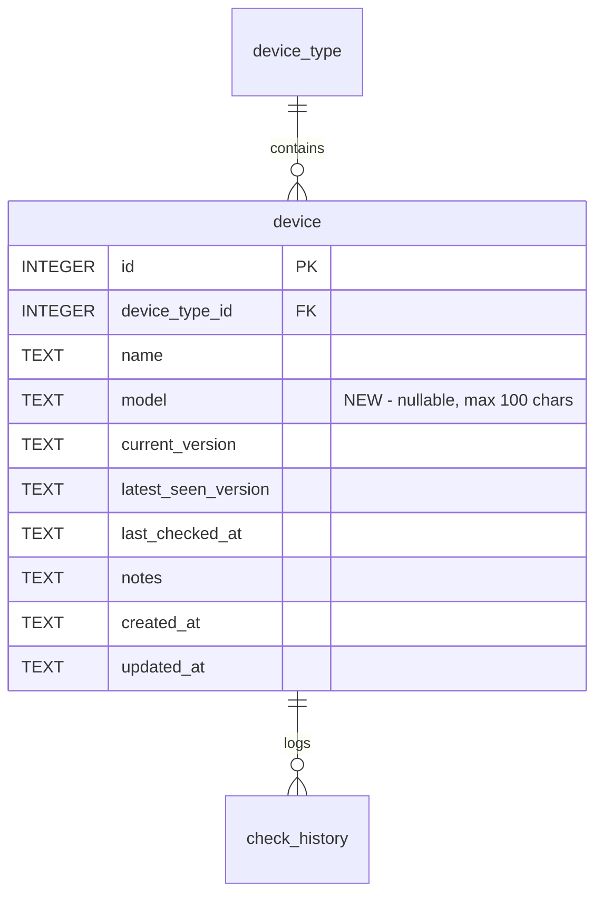

# Data Model: Device Model Identifier

**Branch**: `00004-add-device-model` | **Date**: 2026-03-02 | **Plan**: [plan.md](plan.md)
**Amends**: [00001-db-schema-models/data-model.md](../00001-db-schema-models/data-model.md) — `device` entity

---

## Schema Change

This feature adds a single nullable column to the existing `device` table. No new entities are introduced.

### Migration: `002_add_device_model.sql`

```sql
ALTER TABLE device ADD COLUMN model TEXT NULL;
```

**Migration runner note**: The existing `schema_version` table is updated from `1` → `2` by the migration runner after applying this migration (per Feature 00001 AD-3).

---

## Amended Entity: `device`

The `device` table gains one new column. All other columns, constraints, and relationships are unchanged from Feature 00001.

### New Column

| Column | Type | Nullable | Default | Constraints |
|---|---|---|---|---|
| `model` | TEXT | NULL | NULL | Max 100 characters (application-level) |

### Full Column List (post-amendment)

| Column | Type | Nullable | Default | Constraints | Changed? |
|---|---|---|---|---|---|
| `id` | INTEGER | NOT NULL | autoincrement | PRIMARY KEY | — |
| `device_type_id` | INTEGER | NOT NULL | — | FK → `device_type.id` ON DELETE CASCADE | — |
| `name` | TEXT | NOT NULL | — | — | — |
| **`model`** | **TEXT** | **NULL** | **NULL** | **Max 100 chars (app-level)** | **NEW** |
| `current_version` | TEXT | NOT NULL | — | — | — |
| `latest_seen_version` | TEXT | NULL | NULL | — | — |
| `last_checked_at` | TEXT | NULL | NULL | ISO 8601 | — |
| `notes` | TEXT | NULL | NULL | — | — |
| `created_at` | TEXT | NOT NULL | `CURRENT_TIMESTAMP` | ISO 8601 | — |
| `updated_at` | TEXT | NOT NULL | `CURRENT_TIMESTAMP` | ISO 8601 | — |

**Unique Constraint**: `UNIQUE(device_type_id, name)` — unchanged. No uniqueness constraint on `model` (FR-003).

---

## Validation Rules (model field)

| Rule | Source | Level |
|---|---|---|
| `model` is nullable — omitting or clearing results in `NULL` | FR-002 | Application (Pydantic) |
| `model` max length 100 characters | FR-006 | Application (Pydantic `max_length=100`) |
| `model` leading/trailing whitespace trimmed before persistence | FR-005 | Application (Pydantic validator) |
| Empty string after trimming → treated as `NULL` | FR-002, Edge Cases | Application (Pydantic validator) |
| No uniqueness constraint on `model` | FR-003 | N/A (intentionally absent) |
| No format validation beyond length | Edge Cases | N/A (intentionally absent) |

---

## Relationships

No relationship changes. The `model` field is a plain attribute on `device` with no foreign key references.

```
device_type (1) ── (0..*) device    [unchanged]
device (1) ── (0..*) check_history  [unchanged]
```

---

## ER Diagram (Amendment View)



---

## Impact on Existing Data

- **Existing rows**: All existing devices receive `model = NULL`. No data loss, no required user intervention (FR-010, SC-003).
- **Existing constraints**: The `UNIQUE(device_type_id, name)` constraint is unaffected — `model` is not part of any unique index.
- **Backward compatibility**: All queries using `SELECT *` automatically pick up the new column. Explicit column lists in INSERT statements must be updated.

## Pydantic Model Changes

### `DeviceBase` (shared fields)

Add: `model: str | None = None`

### `DeviceCreate` (inherits from DeviceBase)

Inherits `model` automatically.

### `DeviceUpdate` (patch payload)

Add: `model: str | None = None` — consistent with other nullable updatable fields.

### `Device` (persisted model)

Inherits `model` from `DeviceBase` automatically.
