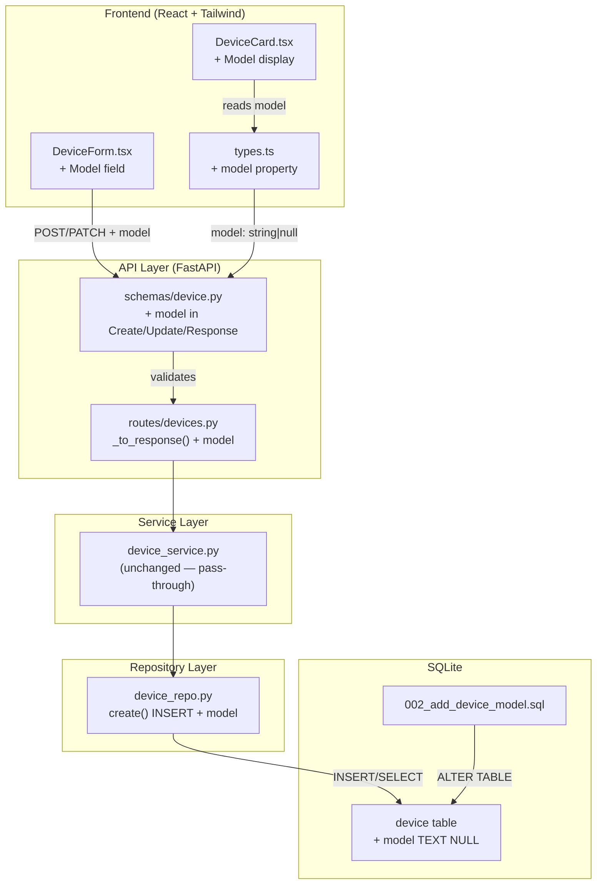

# Implementation Plan: Device Model Identifier

**Branch**: `00004-add-device-model` | **Date**: 2026-03-02 | **Spec**: [spec.md](spec.md)
**Input**: Feature specification from `specs/00004-add-device-model/spec.md`

## Summary

Add an optional `model` attribute to the device entity — a manufacturer model identifier (e.g., "ILCE-7M4") used by extension modules for firmware page lookup. This is a vertical-slice amendment across all layers: a SQLite migration adds the nullable column, the Pydantic domain models and API schemas gain the field, the repository INSERT is extended, the frontend device card displays the model as a secondary label, and the add/edit forms collect it. No new endpoints, no new entities, no new services. The feature is purely additive — existing devices receive `model = NULL` with zero disruption.

## Technical Context

**Source Document**: [docs/tech-context.md](../../docs/tech-context.md)

**Language/Version**: Python 3.11+
**Primary Dependencies**: FastAPI, Pydantic v2, aiosqlite, React, Tailwind CSS, Vite
**Storage**: SQLite (WAL mode) — single `ALTER TABLE` migration
**Testing**: pytest + pytest-asyncio + httpx.AsyncClient (backend), Vitest + React Testing Library (frontend)
**Target Platform**: Linux server (Docker container, `python:3.11-slim`)
**Project Type**: web (FastAPI backend + React frontend)
**Performance Goals**: No new performance requirements — single column addition has negligible impact
**Constraints**: Self-contained Docker deployment. No authentication. No pagination.
**Scale/Scope**: <100 device types, <1K devices, single concurrent user (homelab)

## Instructions Check

*GATE: Must pass before Phase 0 research. Re-check after Phase 1 design.*

| Principle | Status | Notes |
|---|---|---|
| I. Self-Contained Deployment | PASS | Adds nullable column to existing SQLite DB. No external services or new ports. Migration runs automatically on startup. |
| II. Extension-First Architecture | PASS | `model` stored as plain text — no vendor-specific logic. Extension modules will use it as lookup key (future feature). |
| III. Responsible Scraping | N/A | No scraping behavior introduced. |
| IV. Type Safety & Validation | PASS | Pydantic models enforce `max_length=100`, whitespace trimming, and nullable semantics. All paths pass through typed schemas. `mypy --strict` compatible. Structured logging via `structlog`. |
| V. Test-First Development | PASS | Acceptance scenarios → integration tests. Task ordering enforces test-before-implementation within each phase. |
| VI. Technology Stack | PASS | No new technologies. Uses existing SQLite + FastAPI + React + Tailwind stack. |
| VII. Development Workflow | PASS | OpenAPI docs auto-update from Pydantic models. No new documentation surfaces needed. |

**Pre-Research Result**: PASS — No compliance violations.
**Post-Design Result**: PASS — No compliance violations. No complexity justifications needed.

## Architecture Decisions

### AD-1: Single Nullable Column — No Index

**Decision**: Add `model TEXT NULL` to the `device` table with no database index.

**Rationale**: The `model` field is not used in WHERE clauses or JOINs by the core system — it's a display/data attribute read via `SELECT *` queries that already return all device columns. At the expected scale (<1K devices), a sequential scan is negligible. If a future extension engine needs to look up devices by model, an index can be added then.

**Trade-off**: If model-based queries become common (e.g., "find all devices with model X"), a partial index on `model IS NOT NULL` would help. But adding speculative indexes violates the project's complexity justification principle.

### AD-2: Whitespace Normalization at the Schema Layer

**Decision**: Whitespace trimming and empty-to-null canonicalization are performed in the Pydantic API schemas (request validators), consistent with the existing `_trim_strings` pattern in `DeviceCreateRequest` and `DeviceUpdateRequest`.

**Rationale**: Feature 00002 established the pattern (FR-008b from that spec): the `_trim_strings` validator in API request schemas trims leading/trailing whitespace from all string fields before they reach the service/repository layer. Adding `model` to this existing validator maintains consistency — one canonicalization point, no duplication.

**Special handling**: After trimming, if the result is an empty string, it is replaced with `None`. This matches FR-002's requirement that "an empty value after trimming results in no model being set."

### AD-3: Model Field in DeviceUpdate Uses Sentinel-Free Nullable Pattern

**Decision**: In `DeviceUpdateRequest`, `model` is `str | None = Field(default=None)` — the same pattern as `notes`. Omitting the field means "don't change"; sending `null` means "clear to null".

**Rationale**: Pydantic's `model_dump(exclude_unset=True)` already handles the distinction between "not sent" (field absent from dump) and "explicitly null" (field present with value `None`). The existing repository `update()` method builds its SET clause dynamically from `model_dump(exclude_unset=True)`, so the model field works automatically without any repository changes to the update path. This was established in Feature 00002 AD-2.

### AD-4: No Uniqueness Constraint on Model

**Decision**: No UNIQUE index on `model`, either standalone or composite.

**Rationale**: FR-003 explicitly permits multiple devices to share the same model value — a user may own two identical camera bodies. Cross-type duplicate models are also permitted (same model in different device types). A uniqueness constraint would create false restrictions.

### AD-5: Frontend Display — Secondary Label Pattern

**Decision**: Display the model as a secondary label on its own line below the device name in `DeviceCard.tsx`, using Tailwind's `text-sm text-gray-500` (or equivalent muted style). Devices without a model show "No model set" in the same position with an even more subdued style (e.g., `text-xs text-gray-400 italic`).

**Rationale**: FR-010 and US2-AS1/AS2 specify the model as a secondary label below the name. This follows the existing card layout pattern where the device name is the primary heading. The "No model set" placeholder prevents confusing blank space and signals to users that the field exists (US2-AS2).

### AD-6: Amendment-Only Changes — No New Files in Core Backend

**Decision**: All backend changes are amendments to existing files. No new route modules, service classes, repository classes, or exception types are introduced.

**Rationale**: The `model` field is a simple attribute addition to an existing entity. Creating new files would violate the project's complexity justification principle. The changes touch:
- 1 new migration file (`002_add_device_model.sql`)
- 1 domain model file (`models/device.py`)
- 1 API schema file (`api/schemas/device.py`)
- 1 repository file (`repositories/device_repo.py`) — only the `create()` INSERT column list
- 1 route file (`api/routes/devices.py`) — only the `_to_response()` mapper

All other paths (update, list, get, confirm) pick up the field automatically through existing dynamic patterns.

## Layer-by-Layer Change Map

### Database Layer

| File | Change |
|---|---|
| `backend/src/db/migrations/002_add_device_model.sql` | **NEW** — `ALTER TABLE device ADD COLUMN model TEXT NULL` |

### Domain Model Layer

| File | Change |
|---|---|
| `backend/src/models/device.py` | Add `model: str \| None = None` to `DeviceBase` and `DeviceUpdate` |

### Repository Layer

| File | Change |
|---|---|
| `backend/src/repositories/device_repo.py` | Add `model` to explicit column list in `create()` INSERT statement |

Note: `update()` uses dynamic `model_dump(exclude_unset=True)` — handles `model` automatically. `get_by_id()`, `get_all()`, `get_all_filtered()` use `SELECT *` — pick up `model` automatically. `confirm_update()` sets only `current_version` — does not touch `model` (FR-007 satisfied by design).

### API Schema Layer

| File | Change |
|---|---|
| `backend/src/api/schemas/device.py` | Add `model` to `DeviceCreateRequest`, `DeviceUpdateRequest`, `DeviceResponse`; add `"model"` to `_trim_strings` validators with empty-to-null canonicalization |

### API Route Layer

| File | Change |
|---|---|
| `backend/src/api/routes/devices.py` | Add `model=device.model` to `_to_response()` DeviceResponse constructor |

Note: `actions.py` (confirm endpoint) calls `_to_response()` from the devices route or returns a `DeviceResponse` that inherits the field — no direct changes needed.

### Frontend Type Layer

| File | Change |
|---|---|
| `frontend/src/api/types.ts` | Add `model: string \| null` to `Device`; add `model?: string` to `DeviceCreateRequest`, `DeviceUpdateRequest` |

### Frontend Display Layer

| File | Change |
|---|---|
| `frontend/src/features/dashboard/DeviceCard.tsx` | Add model secondary label below device name; show "No model set" placeholder when null |

### Frontend Form Layer

| File | Change |
|---|---|
| `frontend/src/features/forms/DeviceForm.tsx` | Add Model input field (optional, with help text); include in form values and submit handler |
| `frontend/src/features/forms/validation.ts` | Add `fieldLimits.model = 100` |
| `frontend/src/features/dashboard/DashboardPage.tsx` | Pass `model` in create/edit form initial values and submit callbacks |

### Test Layer

| File | Change |
|---|---|
| `backend/tests/test_repositories/test_device_repo.py` | Update test data to include `model`; add model-specific assertions |
| `backend/tests/test_services/test_device_service.py` | Update test data to include `model` |
| `backend/tests/test_api/test_devices.py` | Add model to request/response assertions; add model validation tests |
| `backend/tests/test_api/test_confirm.py` | Assert model unchanged after confirm |
| `frontend/tests/` | Update DeviceCard and DeviceForm component tests |

## Project Structure

### Documentation (this feature)

```text
specs/00004-add-device-model/
├── spec.md              # Feature specification
├── research.md          # Phase 0 research (pre-existing)
├── data-model.md        # Schema amendment documentation
├── quickstart.md        # Integration verification scenarios
├── contracts/
│   └── device-model-amendment.md  # API contract changes
└── plan.md              # This file
```

### Source Code (repository root)

```text
backend/
├── src/
│   ├── db/
│   │   └── migrations/
│   │       └── 002_add_device_model.sql           # NEW migration
│   ├── models/
│   │   └── device.py                              # AMENDED — add model field
│   ├── repositories/
│   │   └── device_repo.py                         # AMENDED — create() INSERT
│   ├── api/
│   │   ├── schemas/
│   │   │   └── device.py                          # AMENDED — all 3 schemas
│   │   └── routes/
│   │       └── devices.py                         # AMENDED — _to_response()
│   └── services/
│       └── device_service.py                      # UNCHANGED
└── tests/
    ├── test_repositories/
    │   └── test_device_repo.py                    # AMENDED
    ├── test_services/
    │   └── test_device_service.py                 # AMENDED
    └── test_api/
        ├── test_devices.py                        # AMENDED
        └── test_confirm.py                        # AMENDED

frontend/
├── src/
│   ├── api/
│   │   └── types.ts                               # AMENDED — Device type interfaces
│   └── features/
│       ├── dashboard/
│       │   ├── DeviceCard.tsx                      # AMENDED — model display
│       │   └── DashboardPage.tsx                   # AMENDED — form data flow
│       └── forms/
│           ├── DeviceForm.tsx                      # AMENDED — model field
│           └── validation.ts                      # AMENDED — model limit
└── tests/
    └── features/                                  # AMENDED — component tests
```

**Structure Decision**: Web application (frontend + backend). All changes are amendments to existing files from Features 00001–00003, with the sole exception of the new migration file. This is a vertical-slice feature touching every layer but introducing no new modules or structural complexity.

## High-Level Architecture



## Key Design Constraints

1. **No Pydantic field named `model`**: Pydantic v2 reserves `model_` as a prefix. The field name `model` on a `BaseModel` requires `model_config = ConfigDict(protected_namespaces=())` or using `Field(alias="model")`. However, examining the existing codebase: `DeviceBase` already uses field name patterns that work with Pydantic v2. The field name `model` on request/response schemas (which are `BaseModel` subclasses) is fine in Pydantic v2 — the `model_` protected namespace prefix only blocks names starting with `model_`, not the exact name `model`. Verify this during implementation.

2. **`_to_response()` explicit mapping**: The route layer's `_to_response()` function uses explicit keyword arguments to construct `DeviceResponse`. The `model` field must be explicitly added to this mapping — it does not auto-propagate.

3. **Confirm endpoint FR-007**: The `confirm_update()` repository method sets only `current_version = latest_seen_version`. The `model` column is never in the UPDATE SET clause for confirm. FR-007 is satisfied by the absence of any model-mutating logic in the confirm path.

## Complexity Tracking

No instructions violations detected. No complexity justifications needed.
