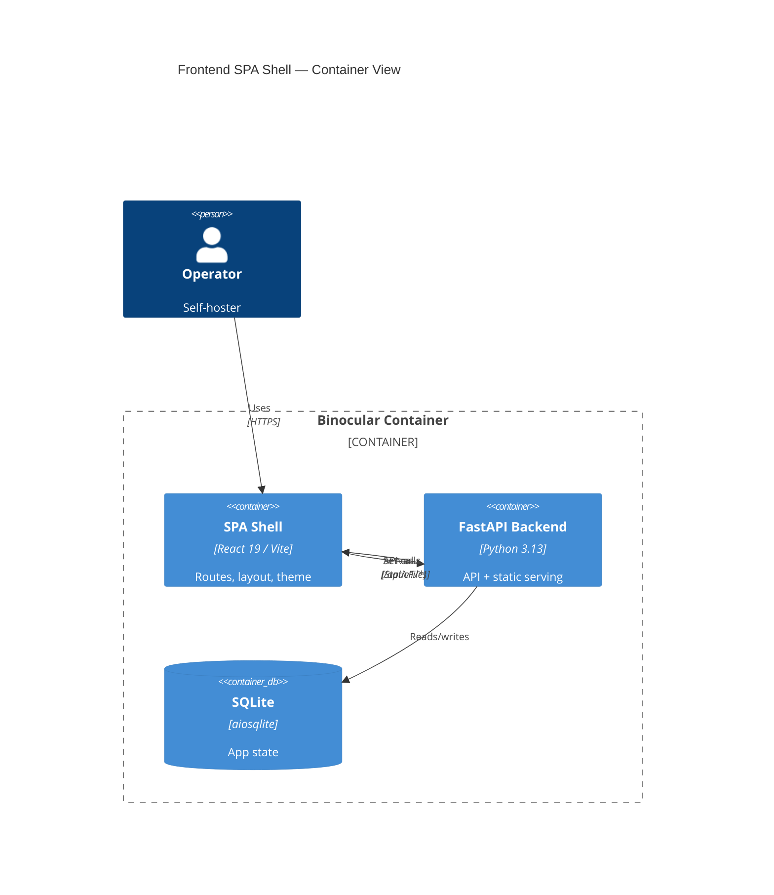

# Implementation Plan: Frontend SPA Shell

**Branch**: `00004-frontend-spa-shell` | **Date**: 2026-06-10 | **Spec**: [spec.md](spec.md)

## Summary

**Goal**: Establish the React/Vite/Tailwind v4/shadcn/ui SPA shell with layout, navigation, theming, routing, and Docker build integration.
**Approach**: Initialize Vite project, configure Tailwind v4 CSS-first, scaffold shadcn/ui primitives, build layout components, add React Router with placeholders, integrate into Docker multi-stage build and FastAPI static serving.
**Key Constraint**: Tailwind CSS v4 CSS-first config only — no `tailwind.config.ts`, no PostCSS/autoprefixer.

## Technical Context

**Language/Version**: TypeScript 5.x / React 19 (frontend), Python 3.13 (backend static serving)
**Primary Dependencies**: Vite 6, React 19, React Router v7, Tailwind CSS 4.x, @tailwindcss/vite, shadcn/ui (New York), Radix UI, clsx, tailwind-merge, class-variance-authority, tw-animate-css, lucide-react
**Storage**: N/A
**Testing**: Vitest + React Testing Library (frontend), pytest (backend)
**Target Platform**: Browser (SPA) served from Docker container
**Project Type**: web
**Project Mode**: mixed (new frontend directory, modifications to existing backend + Dockerfile)
**Performance Goals**: < 200KB gzipped initial JS bundle
**Constraints**: Single-port serving, no external CDN, no PostCSS pipeline
**Scale/Scope**: Single-user self-hosted tool

## Instructions Check

| Principle | Status | Evidence |
|-----------|--------|----------|
| I. Honest Failure | N/A | UI shell — no detection/scraping |
| II. Polite by Default | N/A | No outbound requests |
| III. Data Ownership | PASS | No external services, CDNs, cloud deps. All assets in container. |
| IV. Least-Privilege | N/A | Frontend-only changes |
| V. Type Safety | PASS | TypeScript strict, `tsc --noEmit`, ESLint required |
| VI. Set-and-Forget | PASS | Static assets in container, `localStorage` for preferences |
| VII. Agent Output Style | N/A | Not runtime output |

## Architecture



## Architecture Decisions

| ID | Decision | Options Considered | Chosen | Rationale |
|----|----------|--------------------|--------|-----------|
| AD-001 | Sidebar state persistence | localStorage / cookie / none | localStorage | Consistent with theme persistence; no server round-trip. See ADR-0003. |
| AD-002 | SPA catch-all implementation | FastAPI middleware / catch-all route / Starlette FileResponse | Catch-all route returning FileResponse | Simplest approach; middleware adds complexity; catch-all after API router registration ensures `/api` paths are not intercepted. |
| AD-003 | Path alias convention | `@/` → `src/` / relative imports | `@/` → `src/` | Standard shadcn/ui convention; shorter imports; configured in both tsconfig and vite. |
| AD-004 | Frontend linter | ESLint / Biome | ESLint | CI pipeline (E003) already wired for ESLint; consistency with existing config. |

## Data Model Summary

N/A — no persistent data

## API Surface Summary

N/A — no API surface (this epic adds static file serving, not API endpoints)

## Testing Strategy

| Tier | Tool | Scope | Mock Boundary | Install |
|------|------|-------|---------------|---------|
| Unit | Vitest + React Testing Library | Component rendering, theme toggle, sidebar state | Browser APIs via jsdom | `npm install -D vitest @testing-library/react @testing-library/jest-dom jsdom` |
| Integration | Vitest | Router navigation, layout integration | None | configured |
| Security | N/A | N/A — no secrets, no API surface | — | N/A |
| Coverage | Vitest (c8/istanbul) | Statement + branch coverage | — | `npm install -D @vitest/coverage-v8` |

## Error Handling Strategy

N/A — UI shell with no API calls or external service interactions in this epic

## Integration Points

| Spec Reference | System/Service | Technical Approach | Contract |
|----------------|----------------|--------------------|----------|
| IP-001 | E001 FastAPI app factory | Add `StaticFiles` mount at `/` and SPA catch-all route in `app.py` | `from fastapi.staticfiles import StaticFiles` |
| IP-002 | E001 Dockerfile | Add `frontend-builder` stage before final stage; COPY `dist/` to `/app/static_dist/` | Multi-stage Dockerfile |
| IP-003 | E003 CI Pipeline | `frontend/package.json` existence triggers conditional frontend quality gates | CI workflow conditionals |
| IP-004 | E006/E009/E012/E015 | Export shadcn/ui primitives, layout components, ThemeProvider, `cn()`, routes | Import paths under `@/components/` |

## Risk Mitigation

| Risk (from spec) | Likelihood | Impact | Mitigation | Owner |
|-------------------|------------|--------|------------|-------|
| Tailwind v4 / shadcn/ui compatibility | Low | High | Test each shadcn component after generation; apply codemod for renamed utilities if needed | Frontend |
| Docker build time increase | Medium | Low | Use Docker layer caching; `npm ci` for deterministic installs; separate `package.json` COPY for layer cache | DevOps |

## Requirement Coverage Map

| Req ID | Component(s) | File Path(s) | Notes |
|--------|--------------|--------------|-------|
| TR-001 | Vite scaffold | `frontend/package.json`, `frontend/vite.config.ts`, `frontend/tsconfig.json`, `frontend/src/index.css`, `frontend/src/main.tsx`, `frontend/index.html` | Project initialization + Tailwind v4 CSS-first |
| TR-002 | shadcn/ui primitives | `frontend/src/components/ui/*.tsx`, `frontend/src/lib/utils.ts`, `frontend/components.json` | 9 primitives + cn() utility |
| TR-003 | Theme system | `frontend/src/components/theme-provider.tsx`, `frontend/src/hooks/use-theme.ts` | system/light/dark modes |
| TR-004 | Sidebar | `frontend/src/components/layout/sidebar.tsx`, `frontend/src/components/layout/nav-item.tsx` | Collapsible with localStorage |
| TR-005 | Router + pages | `frontend/src/App.tsx`, `frontend/src/pages/*.tsx` | 4 placeholders + 404 |
| TR-006 | Static serving | `backend/src/binocular/app.py`, `backend/src/binocular/spa.py` | StaticFiles + catch-all |
| TR-007 | Docker build | `Dockerfile` | frontend-builder stage |
| TR-008 | Version display | `frontend/src/components/layout/version-display.tsx` | VITE_APP_VERSION env |
| TR-009 | Type safety | `frontend/tsconfig.json`, `frontend/eslint.config.js` | tsc strict + ESLint |

## Project Structure

### Source Code

```text
frontend/                          (+ new directory)
  + package.json
  + tsconfig.json
  + tsconfig.app.json
  + tsconfig.node.json
  + vite.config.ts
  + eslint.config.js
  + components.json
  + index.html
  + src/
    + main.tsx
    + index.css
    + App.tsx
    + vite-env.d.ts
    + lib/
      + utils.ts
    + components/
      + theme-provider.tsx
      + ui/
        + button.tsx
        + card.tsx
        + select.tsx
        + badge.tsx
        + table.tsx
        + switch.tsx
        + tooltip.tsx
        + input.tsx
        + label.tsx
      + layout/
        + app-layout.tsx
        + sidebar.tsx
        + header.tsx
        + nav-item.tsx
        + brand.tsx
        + version-display.tsx
    + hooks/
      + use-theme.ts
      + use-sidebar.ts
    + pages/
      + inventory.tsx
      + modules.tsx
      + logs.tsx
      + settings.tsx
      + not-found.tsx

backend/src/binocular/
  ~ app.py                         (add StaticFiles mount + SPA catch-all)
  + spa.py                         (SPA serving helper)

~ Dockerfile                       (add frontend-builder stage)
```

**Brownfield Notes**:
- **Patterns to reuse**: FastAPI app factory pattern in `app.py`, router aggregation via `routes/__init__.py`
- **Tests to extend**: `backend/tests/` for SPA serving tests
- **Naming conventions**: snake_case Python modules, PascalCase React components, kebab-case CSS

## Implementation Hints

- **[HINT-001]** Order: Initialize Vite project and install dependencies before running `npx shadcn@latest init` — shadcn CLI reads `vite.config.ts` and `tsconfig.json` during setup
- **[HINT-002]** Gotcha: Tailwind v4 renamed utilities (`shadow-sm`→`shadow-xs`, `rounded-sm`→`rounded-xs`, `outline-none`→`outline-hidden`) — shadcn-generated components may need post-generation fixup
- **[HINT-003]** Order: Register API router before SPA catch-all route in FastAPI — catch-all must be last to avoid intercepting `/api` paths
- **[HINT-004]** Constraint: `@tailwindcss/vite` plugin must be listed after `@vitejs/plugin-react` in the Vite plugins array for correct processing order
- **[HINT-005]** Gotcha: Docker `COPY frontend/package.json frontend/package-lock.json ./` before `COPY frontend/ ./` for layer caching — `npm ci` layer survives source changes
