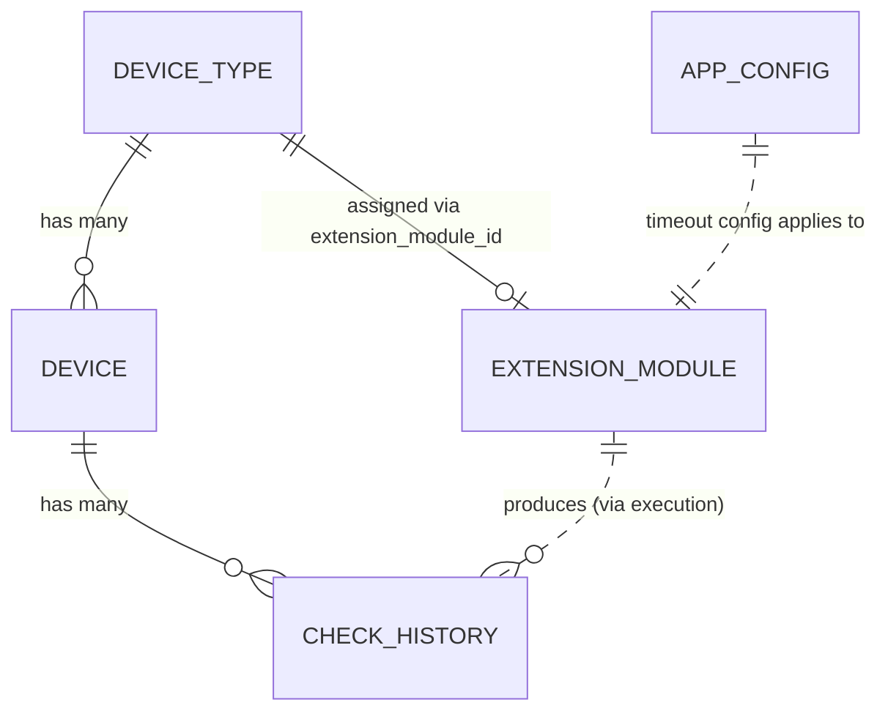

# Data Model: Module Interface Contract & Mock Execution

**Feature**: 00005-dummy-module  
**Date**: 2026-03-03  
**Spec**: [spec.md](spec.md) | **Plan**: [plan.md](plan.md)

## Overview

This feature introduces **no new database tables**. The `extension_module` and `check_history` tables (created in Feature 00001) already provide all required persistence. One new column is added to `app_config` for the module execution timeout setting.

The primary data modeling work is defining **runtime Pydantic models** for the module interface contract and execution results.

---

## Schema Changes

### Migration 003: Add Module Execution Timeout

**File**: `backend/src/db/migrations/003_add_module_timeout.sql`

```sql
ALTER TABLE app_config ADD COLUMN module_execution_timeout_seconds INTEGER NOT NULL DEFAULT 30;
```

**Rationale**: FR-008 requires a configurable execution timeout (default 30s, range 5–300s) stored in application configuration. The existing `app_config` singleton table is the canonical location for such settings.

**Impact**: The `AppConfig` and `AppConfigUpdate` Pydantic models in `backend/src/models/app_config.py` gain the `module_execution_timeout_seconds` field. The `AppConfigRepo` picks it up automatically via `SELECT *`.

---

## Existing Tables Used (No Changes)

### `extension_module` (Feature 00001)

| Column | Type | Notes |
|---|---|---|
| `id` | INTEGER PK | Auto-increment |
| `filename` | TEXT UNIQUE | e.g., `mock_module.py` |
| `module_version` | TEXT NULL | From `MODULE_VERSION` constant |
| `supported_device_type` | TEXT NULL | From `SUPPORTED_DEVICE_TYPE` constant |
| `is_active` | INTEGER (bool) | `1` = passed validation, `0` = failed |
| `file_hash` | TEXT NULL | SHA-256 of file contents for change detection |
| `last_error` | TEXT NULL | Human-readable validation/load error |
| `loaded_at` | TEXT NULL | ISO 8601 timestamp of last successful load |
| `created_at` | TEXT | Auto-set |
| `updated_at` | TEXT | Auto-set on every change |

**Used by**: Module Loader (register/upsert on scan), Module List API (read), Execution Engine (resolve module for device type).

### `check_history` (Feature 00001)

| Column | Type | Notes |
|---|---|---|
| `id` | INTEGER PK | Auto-increment |
| `device_id` | INTEGER FK → device | CASCADE delete |
| `checked_at` | TEXT | ISO 8601 timestamp of the check |
| `version_found` | TEXT NULL | The `latest_version` from the module (on success) |
| `outcome` | TEXT CHECK | `"success"` or `"error"` |
| `error_description` | TEXT NULL | Human-readable error (on failure) |
| `created_at` | TEXT | Auto-set |

**Used by**: Execution Engine (record results), Check History API (read).

### `device_type` (Feature 00001)

The `extension_module_id` FK links a device type to its assigned module. This relationship is used by the Execution Engine to resolve which module to invoke for a given device.

### `device` (Features 00001 + 00004)

The `model` field (Feature 00004) provides the device model identifier passed to the module's `check_firmware()` function.

---

## Runtime Pydantic Models (New)

### `CheckResult` — Module Return Value Schema

**File**: `backend/src/models/check_result.py`

```python
class CheckResult(BaseModel):
    """Validated result from a module's check_firmware() call."""
    
    latest_version: str = Field(min_length=1, max_length=200)
    download_url: str | None = None
    release_date: str | None = None
    release_notes: str | None = None
    raw_versions: list[dict[str, Any]] | None = None
    metadata: dict[str, str] | None = None
```

**Validation rules**:
- `latest_version` is required and must be a non-empty string (≤200 chars)
- All other fields are optional enrichment data
- The host calls `CheckResult.model_validate(raw_dict)` on the module's return value
- `ValidationError` is caught and recorded as a check error with outcome `"error"`

**Purpose**: Enforces FR-002 (return value schema validation) using Pydantic, satisfying project instruction Principle II (Extension-First Architecture: "Module return values MUST be validated through Pydantic models").

### `ModuleManifest` — Load-Time Constant Validation

Not a formal Pydantic model — validated via `hasattr()` and `inspect.signature()` checks at load time. The required constants are:

| Constant | Type | Required | Description |
|---|---|---|---|
| `MODULE_VERSION` | `str` | Yes | Semver string for the module itself |
| `SUPPORTED_DEVICE_TYPE` | `str` | Yes | Matches a device type name/slug |

### `ModuleResponse` — API Response Model

**File**: `backend/src/api/schemas/modules.py`

```python
class ModuleResponse(BaseModel):
    """API response for a registered extension module."""
    
    id: int
    filename: str
    module_version: str | None
    supported_device_type: str | None
    is_active: bool
    file_hash: str | None
    last_error: str | None
    loaded_at: datetime | None
    created_at: datetime
    updated_at: datetime
```

This maps directly from the existing `ExtensionModule` domain model.

---

## Entity Relationship Context



The module execution flow: `device_type.extension_module_id` → resolve `extension_module` → invoke `check_firmware(device_type.firmware_source_url, device.model, http_client)` → validate with `CheckResult` → persist to `check_history`.
