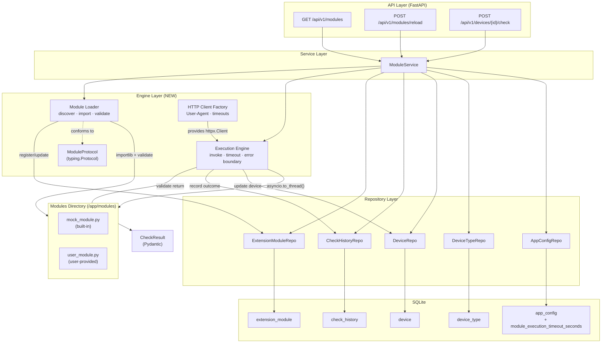
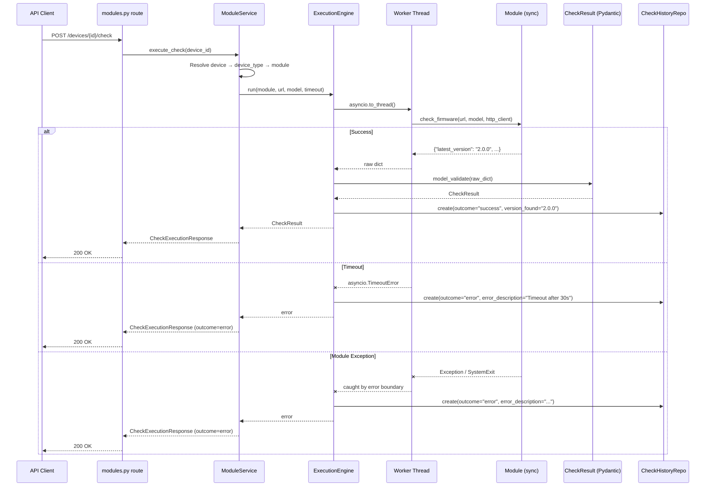

# Implementation Plan: Module Interface Contract & Mock Execution

**Branch**: `00005-dummy-module` | **Date**: 2026-03-03 | **Spec**: [spec.md](spec.md)
**Input**: Feature specification from `specs/00005-dummy-module/spec.md`

## Summary

Define the Python extension module interface contract (function signature, manifest constants, return schema), build the Module Loader that discovers/validates/registers modules at startup, build the Execution Engine that invokes modules with timeout/error-boundary protection, ship a built-in mock module as reference implementation, and expose three API endpoints (list modules, reload, execute check). The host provides a pre-configured `httpx.Client` enforcing all responsible scraping rules. Modules are sync functions; the host wraps them in `asyncio.to_thread()`. Return values are validated through Pydantic. One migration adds a module timeout setting to `app_config`.

## Technical Context

**Source Document**: [docs/tech-context.md](../../docs/tech-context.md)

**Language/Version**: Python 3.11+
**Primary Dependencies**: FastAPI, Pydantic v2, aiosqlite, httpx, structlog
**Storage**: SQLite (WAL mode) — one `ALTER TABLE` migration for timeout config
**Testing**: pytest + pytest-asyncio + httpx.AsyncClient (backend)
**Target Platform**: Linux server (Docker container, `python:3.11-slim`)
**Project Type**: web (FastAPI backend + React frontend)
**Performance Goals**: Module execution ≤30s default timeout. Module load/scan <1s for ≤50 modules.
**Constraints**: Self-contained Docker deployment. No sandboxing (trusted user model). Sync modules only.
**Scale/Scope**: <50 modules, <100 device types, single concurrent user (homelab)

## Instructions Check

*GATE: Must pass before Phase 0 research. Re-check after Phase 1 design.*

| Principle | Status | Notes |
|---|---|---|
| I. Self-Contained Deployment | PASS | Second volume mount (`/app/modules`) for module files. No external services. Mock module seeded from internal staging directory. |
| II. Extension-First Architecture | PASS | `importlib.util.spec_from_file_location` for loading (never `exec()`/`eval()`). `typing.Protocol` defines the contract. `inspect.signature()` validates at load time. `try/except` error boundaries per execution. `CheckResult` Pydantic model validates returns. `MODULE_VERSION` + `SUPPORTED_DEVICE_TYPE` manifest constants. |
| III. Responsible Scraping | PASS | Host-provided `httpx.Client` (FR-016) centralizes robots.txt, User-Agent, per-domain rate limiting, and backoff. Modules cannot bypass. Response caching via `hishel` or manual cache layer. |
| IV. Type Safety & Validation | PASS | All new code passes `mypy --strict`. Pydantic models for `CheckResult`, API request/response schemas, and `AppConfig` extension. Structured logging via `structlog`. No `print()`. |
| V. Test-First Development | PASS | Contract compliance test fixtures. Module loader integration tests. Execution engine tests with mock/broken modules. API-level integration tests for all three endpoints. |
| Technology Stack | PASS | Python 3.11, FastAPI, SQLite, httpx. No new technology categories introduced. |

**Pre-Research Result**: PASS — No compliance violations.
**Post-Design Result**: PASS — No compliance violations.

## Architecture Decisions

### AD-1: Sync Modules with `asyncio.to_thread()` Wrapping

**Decision**: Extension modules implement a synchronous `check_firmware()` function. The host runs it via `asyncio.to_thread()` to avoid blocking the FastAPI event loop.

**Rationale**: Module authors are homelab users, not async Python experts. A sync function with a plain `httpx.Client` is the simplest possible authoring experience. The host handles the async wrapping transparently. `asyncio.to_thread()` (Python 3.9+) provides clean cancellation semantics when combined with `asyncio.wait_for()` for timeout.

**Trade-off**: Python threads cannot be forcibly killed — a CPU-bound infinite loop persists until process exit. Acceptable at homelab scale where the process can be restarted. `multiprocessing` was rejected as overkill for the trust model.

### AD-2: `typing.Protocol` for Interface Contract — No Host Imports Required

**Decision**: Define a `ModuleProtocol` using `typing.Protocol` for static analysis. At runtime, validate conformance via `hasattr()` + `inspect.signature()`. Module authors never import anything from Binocular.

**Rationale**: Protocol classes (PEP 544) provide structural subtyping — a module satisfies the protocol by having the right attributes, without inheriting from a base class. This eliminates `sys.path` issues and import coupling that would arise with `abc.ABC`. Zero-import authoring is a core UX goal for homelab users.

**Trade-off**: `@runtime_checkable` Protocol only checks method existence, not signatures. The host supplements with `inspect.signature()` for parameter validation at load time.

### AD-3: Function-Based Interface with Module-Level Constants

**Decision**: Modules expose a top-level `check_firmware(url, model, http_client)` function and module-level constants (`MODULE_VERSION`, `SUPPORTED_DEVICE_TYPE`). No class instantiation.

**Rationale**: Simplest possible authoring pattern. Modules are inherently stateless (scrape a URL, return a result). The host manages session reuse, rate limiting, and caching externally. The mock module demonstrates the complete pattern in ~30 lines.

### AD-4: Host-Provided `httpx.Client` for Scraping Enforcement

**Decision**: The host constructs a pre-configured `httpx.Client` and passes it to the module's `check_firmware()` function as the `http_client` parameter. Modules use this client for all HTTP requests.

**Rationale**: FR-016 mandates central enforcement of responsible scraping rules (robots.txt, User-Agent, rate limiting, backoff). Passing the client as a parameter makes enforcement unavoidable — modules cannot accidentally or intentionally create their own HTTP sessions. The `httpx.Client` supports timeouts natively, aligns with the async FastAPI ecosystem (sync client variant for sync modules), and is well-documented.

**Implementation**: The client is configured with:
- `User-Agent: Binocular/<version> (+https://github.com/aristidesneto/binocular)` — the version is read from the application's package metadata at startup; the URL points to the project's public repository for transparency
- Per-request timeout (connection: 10s, read: 20s)
- The host wraps the client or uses middleware for per-domain rate limiting (2s minimum delay) and robots.txt compliance

### AD-5: Pydantic `CheckResult` for Return Value Validation

**Decision**: Module functions return a plain `dict`. The host validates it with `CheckResult.model_validate(raw_dict)` (Pydantic v2). `ValidationError` is caught and recorded as an error outcome.

**Rationale**: Modules stay dependency-free (no Pydantic import needed). The host owns the validation contract. One required field (`latest_version: str`) minimizes authoring burden. Optional enrichment fields (`download_url`, `release_date`, `release_notes`, `metadata`) give advanced authors room to provide richer data.

### AD-6: Module Directory Seeding Strategy

**Decision**: Built-in modules (mock module) are packaged at `/app/_modules/` in the Docker image. On first start, if `/app/modules/` is empty, the system copies files from `_modules/` into `modules/`. After seeding, all modules are treated equally regardless of origin.

**Rationale**: FR-013a specifies this pattern. Users who add modules to `/app/modules/` never need to worry about a separate "system modules" directory. The mock module sits alongside user modules with no special-case loading logic.

**Implementation**: The seeding check runs in the FastAPI `lifespan` startup, before the module scan.

### AD-7: Module Execution Timeout via `asyncio.wait_for()`

**Decision**: Wrap `asyncio.to_thread(module.check_firmware, ...)` in `asyncio.wait_for(coro, timeout=configured_seconds)`. On timeout, `asyncio.TimeoutError` is caught, an error outcome is recorded, and processing continues.

**Rationale**: FR-008 specifies a configurable timeout (default 30s, range 5–300s). `asyncio.wait_for()` is the idiomatic mechanism for coroutine timeout in Python. The thread may linger briefly after timeout, but the host has already moved on and recorded the error.

### AD-8: Error Boundary Catches `SystemExit` Explicitly

**Decision**: The error boundary around module loading and execution catches `SystemExit` in addition to `Exception`. `KeyboardInterrupt` propagates normally.

**Rationale**: FR-007 requires this explicitly. A module that calls `sys.exit()` (directly or through a dependency) must not terminate the host process. The exception hierarchy: catch `SystemExit` + `Exception`, let `KeyboardInterrupt` + `GeneratorExit` propagate.

```python
try:
    result = module.check_firmware(url, model, http_client)
except SystemExit:
    # Module attempted to kill host process
    ...
except Exception as e:
    # Standard error boundary
    ...
```

### AD-9: No `sys.modules` Pollution — Private Registry Dict

**Decision**: Loaded module objects are stored in a private `dict[str, types.ModuleType]` within the Module Loader. They are never inserted into `sys.modules`.

**Rationale**: Avoids name collisions with the host application's imports. Each module load via `spec_from_file_location` creates an isolated module object. The host references modules by filename key in the registry dict.

### AD-10: Scraping Infrastructure — Phased Delivery

**Decision**: The full responsible scraping infrastructure (robots.txt cache, per-domain rate limiter, exponential backoff, response caching) is designed in this plan but delivered as a composable layer. The mock module does not make network calls, so the initial implementation focuses on the `httpx.Client` factory with User-Agent and timeouts. Rate limiting and robots.txt enforcement are integrated when real scraping modules are developed.

**Rationale**: The mock module (P2 US3) returns canned data and never touches the network. Building the full scraping stack before any module needs it adds speculative complexity. The interface contract already requires `http_client` as a parameter, so the enforcement point exists — only the client's internal middleware needs enrichment later.

**Interface guarantee**: All modules already receive the host-provided client. When scraping rules are added to the client factory, every existing module automatically benefits without code changes.

### AD-11: NEW `ErrorCode` Value — `MODULE_ERROR`

**Decision**: Add `MODULE_ERROR` to the existing `ErrorCode` literal type in `backend/src/api/schemas/errors.py`. This covers module-specific failures (execution errors, timeout, validation failures) returned from the check endpoint.

**Rationale**: The existing error codes (`NOT_FOUND`, `VALIDATION_ERROR`, etc.) don't semantically cover "the extension module failed during execution." A dedicated code lets the frontend distinguish module problems from standard API errors.

## Layer-by-Layer Change Map

### Database Layer

| File | Change |
|---|---|
| `backend/src/db/migrations/003_add_module_timeout.sql` | **NEW** — `ALTER TABLE app_config ADD COLUMN module_execution_timeout_seconds INTEGER NOT NULL DEFAULT 30` |

### Domain Model Layer

| File | Change |
|---|---|
| `backend/src/models/app_config.py` | Add `module_execution_timeout_seconds: int = Field(default=30, ge=5, le=300)` to `AppConfig` and `AppConfigUpdate` |
| `backend/src/models/check_result.py` | **NEW** — `CheckResult` Pydantic model for module return validation |
| `backend/src/models/__init__.py` | Export `CheckResult` |

### Module Engine Layer (NEW)

| File | Change |
|---|---|
| `backend/src/engine/__init__.py` | **NEW** — Package init |
| `backend/src/engine/protocol.py` | **NEW** — `ModuleProtocol` (typing.Protocol) defining the interface contract |
| `backend/src/engine/loader.py` | **NEW** — Module Loader: discover, import, validate, register modules |
| `backend/src/engine/executor.py` | **NEW** — Execution Engine: invoke modules with timeout/error-boundary, validate results, record history |
| `backend/src/engine/http_client.py` | **NEW** — HTTP client factory: creates pre-configured `httpx.Client` with User-Agent and timeouts |

### Service Layer

| File | Change |
|---|---|
| `backend/src/services/module_service.py` | **NEW** — Orchestrates module operations: list, reload, execute check. Coordinates Loader + Executor + repos. |
| `backend/src/services/exceptions.py` | Add `ModuleExecutionError` and `NoModuleAssignedError` exception classes |

### API Schema Layer

| File | Change |
|---|---|
| `backend/src/api/schemas/modules.py` | **NEW** — `ModuleResponse`, `ModuleReloadResponse`, `CheckExecutionResponse` |
| `backend/src/api/schemas/errors.py` | Add `MODULE_ERROR` to `ErrorCode` literal |

### API Route Layer

| File | Change |
|---|---|
| `backend/src/api/routes/modules.py` | **NEW** — `GET /modules`, `POST /modules/reload`, `POST /devices/{id}/check` |

### API Dependency Layer

| File | Change |
|---|---|
| `backend/src/api/dependencies.py` | Add `get_module_service()` factory |

### Application Startup

| File | Change |
|---|---|
| `backend/src/main.py` | Import and include modules router. Add module directory seeding + initial scan to `lifespan`. |

### Built-In Module

| File | Change |
|---|---|
| `backend/_modules/mock_module.py` | **NEW** — Mock/dummy module implementing the interface contract |

### Seed Script

| File | Change |
|---|---|
| `backend/scripts/seed_mock_data.py` | Add "Mock Devices" device type linked to mock module. Add mock devices with model identifiers. Reset also clears `extension_module` table. |

### Test Layer

| File | Change |
|---|---|
| `backend/tests/test_engine/test_loader.py` | **NEW** — Module loader tests: valid module, missing function, wrong signature, syntax error, missing constants |
| `backend/tests/test_engine/test_executor.py` | **NEW** — Execution engine tests: success, validation failure, exception, timeout, SystemExit |
| `backend/tests/test_engine/test_http_client.py` | **NEW** — HTTP client factory tests: User-Agent, timeouts |
| `backend/tests/test_services/test_module_service.py` | **NEW** — Module service integration tests |
| `backend/tests/test_api/test_modules.py` | **NEW** — API endpoint tests: list, reload, execute check |
| `backend/tests/fixtures/modules/` | **NEW** — Test fixture modules: valid, broken (various failure modes) |

## Project Structure

### Documentation (this feature)

```text
specs/00005-dummy-module/
├── spec.md              # Feature specification
├── research.md          # Phase 0 research (pre-existing, reused)
├── data-model.md        # Schema amendment + runtime model documentation
├── quickstart.md        # Integration verification scenarios
├── contracts/
│   └── openapi.yaml     # API contract for module endpoints
└── plan.md              # This file
```

### Source Code (repository root)

```text
backend/
├── _modules/
│   └── mock_module.py                             # NEW — Built-in mock module (staging)
├── src/
│   ├── db/
│   │   └── migrations/
│   │       └── 003_add_module_timeout.sql         # NEW — app_config timeout column
│   ├── models/
│   │   ├── app_config.py                          # AMENDED — timeout field
│   │   ├── check_result.py                        # NEW — CheckResult validation model
│   │   └── __init__.py                            # AMENDED — export CheckResult
│   ├── engine/
│   │   ├── __init__.py                            # NEW — package init
│   │   ├── protocol.py                            # NEW — ModuleProtocol
│   │   ├── loader.py                              # NEW — Module Loader
│   │   ├── executor.py                            # NEW — Execution Engine
│   │   └── http_client.py                         # NEW — HTTP client factory
│   ├── services/
│   │   ├── module_service.py                      # NEW — Module operations orchestrator
│   │   └── exceptions.py                          # AMENDED — new exception types
│   ├── api/
│   │   ├── schemas/
│   │   │   ├── modules.py                         # NEW — module API schemas
│   │   │   └── errors.py                          # AMENDED — MODULE_ERROR code
│   │   ├── routes/
│   │   │   └── modules.py                         # NEW — module endpoints
│   │   └── dependencies.py                        # AMENDED — module service factory
│   └── main.py                                    # AMENDED — router + lifespan
├── scripts/
│   └── seed_mock_data.py                          # AMENDED — mock module + devices
└── tests/
    ├── test_engine/
    │   ├── test_loader.py                         # NEW
    │   ├── test_executor.py                       # NEW
    │   └── test_http_client.py                    # NEW
    ├── test_services/
    │   └── test_module_service.py                 # NEW
    ├── test_api/
    │   └── test_modules.py                        # NEW
    └── fixtures/
        └── modules/                               # NEW — test fixture module files
            ├── valid_module.py
            ├── missing_function.py
            ├── wrong_signature.py
            ├── syntax_error.py
            ├── missing_constants.py
            └── raises_system_exit.py
```

**Structure Decision**: Web application (frontend + backend). New `engine/` package under `backend/src/` for module loading and execution — this is the core new subsystem. New service, schemas, and routes follow established patterns from Features 00002–00004. Test fixture modules are standalone `.py` files with deliberate contract violations for testing.

## High-Level Architecture



## Module Execution Flow



## Structured Logging Events

All module-related events use `structlog` bound loggers. Key events:

| Event | Level | Context Fields | When |
|---|---|---|---|
| `module.scan.start` | info | `directory`, `file_count` | Scan cycle begins |
| `module.load.success` | info | `filename`, `module_version`, `supported_device_type` | Module passed validation |
| `module.load.failed` | warning | `filename`, `error`, `error_type` | Module failed validation |
| `module.load.skipped` | debug | `filename`, `reason` | File excluded (`_` prefix, `__init__.py`) |
| `module.scan.complete` | info | `loaded_count`, `error_count`, `total_files` | Scan cycle ends |
| `module.exec.start` | info | `filename`, `device_id`, `model` | Check execution begins |
| `module.exec.success` | info | `filename`, `device_id`, `latest_version`, `duration_ms` | Check returned valid result |
| `module.exec.error` | warning | `filename`, `device_id`, `error`, `error_type`, `duration_ms` | Check failed (exception or validation) |
| `module.exec.timeout` | warning | `filename`, `device_id`, `timeout_seconds` | Check exceeded timeout |
| `module.seed.copy` | info | `source`, `destination`, `file_count` | Built-in modules seeded |

## Open Questions Resolved

| Question | Resolution |
|---|---|
| Async vs sync modules | Sync modules with `asyncio.to_thread()` wrapping (AD-1) |
| Module dependencies (e.g., beautifulsoup4) | Module authors install into the container. Not managed by Binocular. Documented in module authoring guide. |
| Module versioning (same `MODULE_VERSION` after edit) | File hash comparison detects changes regardless of version constant. No enforcement on version bumps — it's informational metadata. |
| Multi-model support per module | `SUPPORTED_DEVICE_TYPE` is informational. Users assign modules to device types via the UI. Multiple types can reference the same module. |
| Execution timeout default | 30 seconds, configurable 5–300s, stored in `app_config` (AD-7) |

## Complexity Tracking

No instructions violations detected. No complexity justifications needed.
