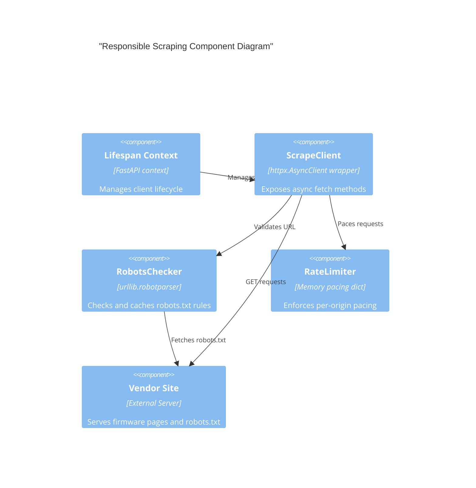

# Implementation Plan: Responsible Scraping Client

**Branch**: `00005-responsible-scraping-client-central-polite` | **Date**: 2026-06-10 | **Spec**: [spec.md](spec.md)

## Summary

**Goal**: Deliver a centralized, polite HTTP client wrapper around `httpx.AsyncClient` that enforces robots.txt rules, per-origin pacing, and backoff retries.  
**Approach**: Build `ScrapeClient` using standard library `urllib.robotparser` (loaded async) and in-memory timestamp tracking for pacing, integrating it with the FastAPI app lifespan.  
**Key Constraint**: Zero blocking I/O on the async event loop during robots.txt fetches or rate-limiting delays.

## Technical Context

**Language/Version**: Python 3.13  
**Primary Dependencies**: FastAPI, httpx, structlog  
**Storage**: N/A  
**Testing**: pytest, pytest-asyncio  
**Target Platform**: Linux server (`python:3.13-slim` container)  
**Project Type**: web  
**Project Mode**: brownfield  
**Performance Goals**: Fast, non-blocking concurrent request scheduling.  
**Constraints**: Respect robots.txt (RFC 9309), 1.0s origin pacing, maximum 3 retries.  
**Scale/Scope**: Internal scraping engine for all firmware update check requests.

## Instructions Check

*GATE: Must pass before Phase 0 research. Re-check after Phase 1 design.*

| Principle | Check/Requirement | Status | Evidence |
|-----------|-------------------|--------|----------|
| I. Honest Failure | Propagate scrape failures as typed exceptions | PASS | Plan defines custom exception hierarchy and error handling table |
| II. Polite by Default | Centralized HTTP client, robots.txt, rate limits, backoff | PASS | Plan defines ScrapeClient, RobotsChecker, RateLimiter components |
| III. Data Ownership | Database/state footprint | PASS | Client state is ephemeral and in-memory; no DB change |
| IV. Least-Privilege | Container execution user | PASS | Handled in E001/Dockerfile; client runs as non-root |
| V. Type Safety | Static typing configuration | PASS | mypy strict enabled; all code fully typed |
| VI. Set-and-Forget | Fault isolation | PASS | Scrape errors raised up to modules; core app process remains unaffected |

## Architecture



## Architecture Decisions

Feature-local tradeoffs only. Project-wide architectural decisions belong in standalone ADRs under `specs/adrs/` — reference them by ID (e.g., "See ADR-0001") instead of duplicating here.

| ID | Decision | Options Considered | Chosen | Rationale |
|----|----------|--------------------|--------|-----------|
| AD-001 | Robots.txt Parser | urllib.robotparser vs. Protego (third-party) | urllib.robotparser (stdlib) | Zero external dependency addition. We fetch text asynchronously and parse it locally to avoid event loop blocking. |
| AD-002 | Pacing mechanism | In-memory token bucket vs. Timestamp tracking | Timestamp tracking | Simple and robust for single-process monolith. We store the last request timestamp per origin. |

## Data Model Summary

N/A — no persistent data

## API Surface Summary

N/A — no API surface

## Testing Strategy

| Tier | Tool | Scope | Mock Boundary | Install |
|------|------|-------|---------------|---------|
| Unit | pytest | client wrapping, rate limiting, and backoff functions | HTTP network calls mocked | configured |
| Integration | pytest | Robots.txt caching and validation integration | robots.txt HTTP requests mocked | configured |
| Security | pip-audit | vulnerability check for httpx / python packages | — | configured |
| Coverage | pytest-cov | code coverage target >= 80% | — | configured |

## Error Handling Strategy

| Error Category | Pattern | Response | Retry |
|----------------|---------|----------|-------|
| HTTP Error (non-429/5xx) | fail-fast | raise `HTTPStatusError` | no |
| HTTP 429 / 5xx | exponential backoff | retry up to 3 times, then raise `HTTPStatusError` | yes |
| Robots Disallowed | fail-fast | raise `RobotsDisallowedError` | no |
| Connection Timeout | backoff retry | retry up to 3 times, then raise `ConnectError` | yes |

## Integration Points

| Spec Reference | System/Service | Technical Approach | Contract |
|----------------|----------------|--------------------|----------|
| TR-009 | FastAPI Lifespan | Register ScrapeClient startup and close | app.py |

## Risk Mitigation

| Risk (from spec) | Likelihood | Impact | Mitigation | Owner |
|-------------------|------------|--------|------------|-------|
| Target site blocking | M | H | Default 1.0s pacing, exponential backoff, custom User-Agent identifying Binocular | scrape client |

## Requirement Coverage Map

| Req ID | Component(s) | File Path(s) | Notes |
|--------|--------------|--------------|-------|
| TR-001 | ScrapeClient core | `backend/src/binocular/scraping/client.py` | Core client implementation wrapping `httpx.AsyncClient` |
| TR-002 | Identifiable User-Agent | `backend/src/binocular/scraping/client.py` | Custom default headers set on client creation |
| TR-003 | robots.txt parser | `backend/src/binocular/scraping/robots.py` | Load and parse robots.txt asynchronously using standard lib parser |
| TR-004 | robots.txt cache | `backend/src/binocular/scraping/robots.py` | Rules cached in memory per origin (scheme + host + port) |
| TR-005 | robots.txt check | `backend/src/binocular/scraping/client.py` | Check robots.txt rules before any HTTP fetch |
| TR-006 | Rate limiter | `backend/src/binocular/scraping/rate_limit.py` | Memory pacing dict using `asyncio.sleep` |
| TR-007 | Exponential backoff | `backend/src/binocular/scraping/client.py` | Try/except retry loop with exponential spacing and jitter |
| TR-008 | Custom exceptions | `backend/src/binocular/scraping/client.py` | Define `ScrapeError`, `RobotsDisallowedError`, `HTTPStatusError`, `ConnectError` |
| TR-009 | Lifespan integration | `backend/src/binocular/app.py` | Setup `app.state.scrape_client` on startup, close on shutdown |

## Project Structure

### Source Code

```text
backend/
  src/
    binocular/
      ~ app.py
      + scraping/
        + __init__.py
        + client.py
        + robots.py
        + rate_limit.py
  tests/
    + scraping/
      + __init__.py
      + test_client.py
      + test_robots.py
      + test_rate_limit.py
```

**Patterns to reuse**: Standard structlog logging patterns as defined in `logging.py`.  
**Tests to extend**: We'll add new test cases under `backend/tests/scraping/`.  
**Naming conventions**: Python snake_case for methods, CamelCase for classes, strict typing.

## Implementation Hints

- **[HINT-001]** Robots.txt fallback: If the target returns 404 for robots.txt, treat it as allowed. If it returns 500 or timeout, treat it as disallowed for safety.
- **[HINT-002]** Lifespan state: In FastAPI, the lifespan state is shared with the request state. Store the `ScrapeClient` on `app.state.scrape_client`.
