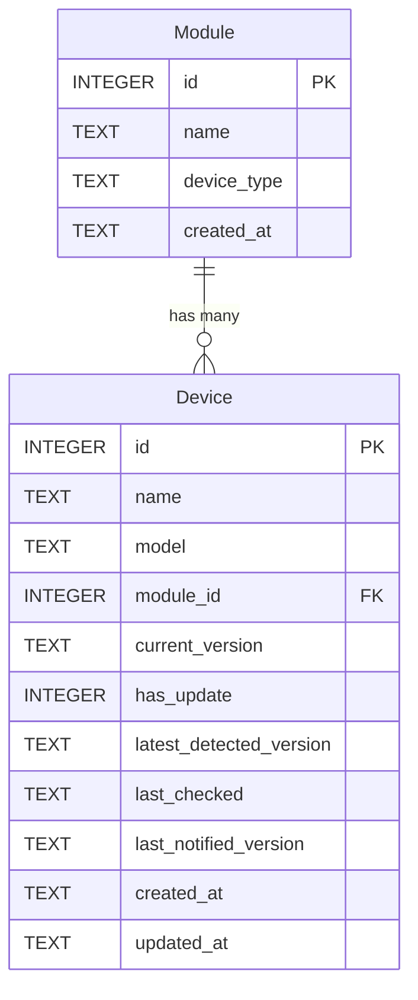

# Data Model: Device Inventory Management

## Entity Table

| Entity | Attributes (name: type, constraints) | Relationships | State Transitions |
|--------|--------------------------------------|---------------|-------------------|
| Module (seed) | id: INTEGER PK AUTOINCREMENT, name: TEXT NOT NULL, device_type: TEXT NOT NULL DEFAULT '', created_at: TEXT NOT NULL DEFAULT (datetime('now')) | has_many: Device | — |
| Device | id: INTEGER PK AUTOINCREMENT, name: TEXT NOT NULL, model: TEXT DEFAULT '', module_id: INTEGER NOT NULL FK(Module.id) ON DELETE RESTRICT, current_version: TEXT NOT NULL DEFAULT '', has_update: INTEGER NOT NULL DEFAULT 0 CHECK(has_update IN (0,1)), latest_detected_version: TEXT, last_checked: TEXT, last_notified_version: TEXT, created_at: TEXT NOT NULL DEFAULT (datetime('now')), updated_at: TEXT NOT NULL DEFAULT (datetime('now')) | belongs_to: Module | — |

## Notes

- `Module` seed table uses `CREATE TABLE IF NOT EXISTS` — E007 extends it with additional columns.
- `has_update` stored as INTEGER 0/1 (SQLite has no native boolean).
- All datetime fields stored as ISO 8601 text (`datetime('now')` default).
- `ON DELETE RESTRICT` on `module_id` prevents orphaned devices.
- `updated_at` is maintained by application code on every UPDATE.

ER Diagram (visual reference)

