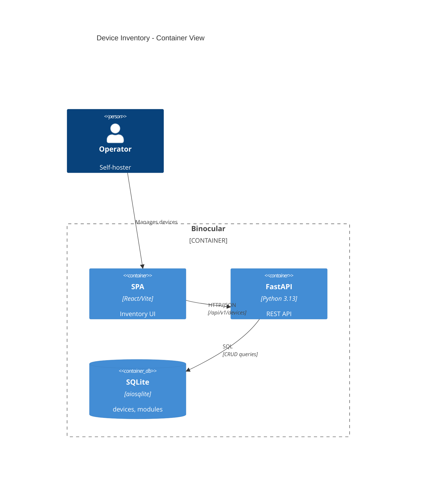

# Implementation Plan: Device Inventory Management

**Branch**: `00006-device-inventory-management` | **Date**: 2026-06-10 | **Spec**: [spec.md](spec.md)

## Summary

**Goal**: Enable operators to register, view, edit, and delete firmware-tracked devices linked to detection modules, with one-click update confirmation.
**Approach**: Layered backend (migration → repository → service → router) with Pydantic models, plus a React frontend consuming the REST API via TanStack Query.
**Key Constraint**: Module table must exist before devices table due to FK — E006 migration seeds a minimal modules table.

## Technical Context

**Language/Version**: Python 3.13 (backend), TypeScript 5.x / React 19 (frontend)
**Primary Dependencies**: FastAPI, Pydantic, aiosqlite, structlog (backend); React, TanStack Query, React Hook Form, shadcn/ui, Tailwind CSS 4.x (frontend)
**Storage**: SQLite via aiosqlite, raw parameterized SQL, numbered migrations
**Testing**: pytest + pytest-asyncio (backend), Vitest + React Testing Library (frontend)
**Target Platform**: Linux server (Docker), browser SPA
**Project Type**: web
**Project Mode**: brownfield
**Performance Goals**: < 500ms list, < 200ms single device (trusted LAN)
**Constraints**: Single SQLite connection, no ORM, `mypy --strict`, `tsc` strict
**Scale/Scope**: Tens to low hundreds of devices (self-hosted homelab)

## Instructions Check

| Principle | Status | Notes |
|-----------|--------|-------|
| I. Honest Failure | PASS | API returns explicit error responses for all failure modes |
| II. Polite by Default | N/A | No outbound scraping in inventory |
| III. Data Ownership | PASS | SQLite only, no external services |
| IV. Least-Privilege | PASS | No privilege changes; runs under existing non-root user |
| V. Type Safety | PASS | Pydantic models + mypy --strict; TypeScript strict mode |
| VI. Set-and-Forget | PASS | Auto-migration at startup, zero-config defaults |
| VII. Agent Output Style | N/A | |

## Architecture



## Architecture Decisions

| ID | Decision | Options Considered | Chosen | Rationale |
|----|----------|--------------------|--------|-----------|
| AD-001 | Module table seeding strategy | Deferred FK / Require E007 first / Seed minimal table | Seed minimal table via `CREATE TABLE IF NOT EXISTS` | Enables independent E006 development; E007 extends with ALTER TABLE |
| AD-002 | Device type storage | Store on device / Derive via JOIN | Derive via JOIN | ADR-0009 compliance; single source of truth on module |
| AD-003 | API response shape for module fields | Nested object / Flat fields / Type string only | Flat fields (module_id, module_name, device_type) | Simpler frontend consumption, avoids nested destructuring |
| AD-004 | Delete endpoint response | 200 with body / 204 no content | 204 no content | REST convention for successful deletion |

## Data Model Summary

| Entity | Key Fields | Relationships | Notes |
|--------|------------|---------------|-------|
| Module (seed) | id PK, name, device_type, created_at | has_many: Device | Minimal seed; E007 extends |
| Device | id PK, name, model, module_id FK, current_version, has_update, latest_detected_version, last_checked, last_notified_version, created_at, updated_at | belongs_to: Module | has_update as INTEGER 0/1 |

**Detail**: [data-model.md](data-model.md)

## API Surface Summary

| Method | Path | Purpose | Auth | Req/Res Types |
|--------|------|---------|------|---------------|
| GET | /api/v1/devices | List all devices with module info | None (trusted LAN) | — / DeviceResponse[] |
| POST | /api/v1/devices | Create a device | None | DeviceCreate / DeviceResponse |
| GET | /api/v1/devices/{id} | Get single device | None | — / DeviceResponse |
| PUT | /api/v1/devices/{id} | Update device fields | None | DeviceUpdate / DeviceResponse |
| DELETE | /api/v1/devices/{id} | Remove a device | None | — / 204 |
| PUT | /api/v1/devices/{id}/confirm | Confirm firmware update | None | — / DeviceResponse |
| GET | /api/v1/modules | List modules for dropdown | None | — / ModuleResponse[] |

**Detail**: [contracts/openapi.yaml](contracts/openapi.yaml)

## Testing Strategy

| Tier | Tool | Scope | Mock Boundary | Install |
|------|------|-------|---------------|---------|
| Unit | pytest + pytest-asyncio | Repository, service, Pydantic models | In-memory SQLite | configured |
| Unit | Vitest + React Testing Library | Components, hooks | MSW for API mocking | configured |
| Integration | pytest + httpx.AsyncClient | API routes end-to-end | In-memory SQLite | configured |
| Linting | Ruff (backend), Biome (frontend) | All source files | — | configured |
| Static Analysis | mypy --strict, tsc --strict | Type safety | — | configured |
| Coverage | pytest-cov, Vitest --coverage | 80% target | — | configured |

## Error Handling Strategy

| Error Category | Pattern | Response | Retry |
|----------------|---------|----------|-------|
| Validation | Fail-fast via Pydantic | 422 + detail message | No |
| Not Found | Service raises DeviceNotFoundError | 404 + detail message | No |
| FK Violation | Service validates module_id before INSERT/UPDATE | 422 + "Module not found" | No |
| DB Error | Repository propagates aiosqlite exceptions | 500 + generic message | No |

## Risk Mitigation

| Risk (from spec) | Likelihood | Impact | Mitigation | Owner |
|-------------------|------------|--------|------------|-------|
| Module table dependency | Low | Low | E006 migration seeds minimal modules table via CREATE TABLE IF NOT EXISTS | Migration (0002) |
| Schema migration ordering | Low | Medium | E006 uses 0002_devices.sql; E007 uses 0003+ | Migration numbering convention |
| Large inventories | Low | Low | No pagination initially; SQLite handles practical limits for self-hosters | Deferred |

## Requirement Coverage Map

| Req ID | Component(s) | File Path(s) | Notes |
|--------|--------------|--------------|-------|
| FR-001 | Migration | backend/src/binocular/db/migrations/0002_devices.sql | Schema DDL |
| FR-002 | Router, Service, Repository | backend/src/binocular/routes/devices.py, backend/src/binocular/devices/service.py, backend/src/binocular/devices/repository.py | POST with module_id validation |
| FR-003 | Repository, Router | backend/src/binocular/devices/repository.py, backend/src/binocular/routes/devices.py | JOIN query for module fields |
| FR-004 | Router, Service, Repository | backend/src/binocular/routes/devices.py | GET by ID |
| FR-005 | Router, Service, Repository | backend/src/binocular/routes/devices.py | PUT update |
| FR-006 | Router, Service, Repository | backend/src/binocular/routes/devices.py | DELETE |
| FR-007 | Router, Service, Repository | backend/src/binocular/routes/devices.py | PUT confirm endpoint |
| FR-008 | Service | backend/src/binocular/devices/service.py | DeviceNotFoundError → 404 |
| FR-009 | Service | backend/src/binocular/devices/service.py | Module FK validation → 422 |
| FR-010 | Frontend | frontend/src/pages/inventory.tsx | InventoryPage with StatCard + DeviceCard |
| FR-011 | Frontend | frontend/src/components/inventory/device-form.tsx | DeviceForm with module select |
| FR-012 | Frontend | frontend/src/pages/inventory.tsx | Empty state component |

## Project Structure

### Source Code

```text
backend/src/binocular/
+ devices/                    # New device domain package
+   __init__.py
+   models.py                 # Pydantic request/response models
+   repository.py             # DeviceRepository(RepositoryBase)
+   service.py                # DeviceService with business logic
+ db/migrations/
+   0002_devices.sql           # Module seed + devices table
~ routes/
~   __init__.py               # Register devices router
+   devices.py                # /api/v1/devices routes

frontend/src/
~ pages/
~   inventory.tsx             # Replace placeholder with live page
+ components/inventory/
+   device-card.tsx           # Device display card
+   stat-card.tsx             # Summary stat card
+   device-form.tsx           # Add/edit form with module select
+   empty-state.tsx           # No-devices placeholder
+ hooks/
+   use-devices.ts            # TanStack Query hooks for device API
+   use-modules.ts            # TanStack Query hook for module list
+ lib/
+   api.ts                    # HTTP client helpers (if not existing)

backend/tests/
+ devices/
+   test_repository.py
+   test_service.py
+   test_routes.py

frontend/src/__tests__/       # Or colocated
+ inventory.test.tsx
```

**Patterns to reuse**: `RepositoryBase` for DB access, `DBDep` type alias for route injection, router aggregator pattern in `routes/__init__.py`, shadcn/ui Card/Table/Button/Select components, ThemeProvider dark mode.
**Tests to extend**: Backend test infrastructure from E001/E002 (conftest with in-memory SQLite).
**Naming conventions**: snake_case Python modules, kebab-case React component files, PascalCase component names.

## Implementation Hints

- **[HINT-001]** Migration ordering: `0002_devices.sql` must create `modules` table BEFORE `devices` table (FK dependency within same migration file).
- **[HINT-002]** Row factory: Ensure `aiosqlite.Row` factory is set on the connection so `dict(row)` works for Pydantic conversion.
- **[HINT-003]** Updated_at: Set `updated_at = datetime('now')` in every UPDATE SQL statement — SQLite has no automatic trigger for this.
- **[HINT-004]** Frontend query invalidation: After create/update/delete mutations, invalidate the `["devices"]` TanStack Query key to refresh the list.
- **[HINT-005]** Module dropdown: `GET /api/v1/modules` is a read-only endpoint in E006 — full module CRUD comes in E009.
