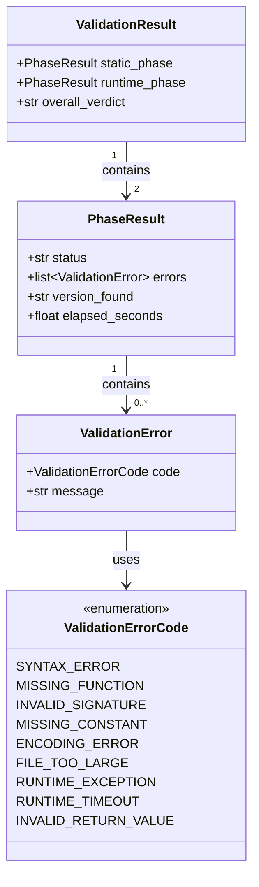

# Data Model: Module Validation Engine

**Feature**: 00006-module-validation-engine
**Date**: 2026-03-04
**Spec**: [spec.md](spec.md) | **Plan**: [plan.md](plan.md)

## Overview

This feature introduces **no database tables or schema changes**. The validation engine is a pure function (FR-011) that returns structured results without persisting anything. All new entities are **runtime Pydantic models** defining the validation result contract.

---

## Runtime Pydantic Models (New)

| Entity | Attributes (name: type, constraints) | Relationships | State Transitions |
|--------|--------------------------------------|---------------|-------------------|
| ValidationResult | static_phase: PhaseResult, runtime_phase: PhaseResult, overall_verdict: Literal["pass","fail"] (derived: pass only when both phases pass) | has: 2× PhaseResult | — |
| PhaseResult | status: Literal["pass","fail","skipped"], errors: list[ValidationError] (empty on pass), version_found: str or None (runtime only), elapsed_seconds: float or None (runtime only) | has_many: ValidationError | — |
| ValidationError | code: ValidationErrorCode, message: str (human-readable, ≤500 chars) | belongs_to: PhaseResult | — |
| ValidationErrorCode | Enum: SYNTAX_ERROR, MISSING_FUNCTION, INVALID_SIGNATURE, MISSING_CONSTANT, ENCODING_ERROR, FILE_TOO_LARGE, RUNTIME_EXCEPTION, RUNTIME_TIMEOUT, INVALID_RETURN_VALUE | — | — |

### Design Notes

- `ValidationErrorCode` is a **closed enum** (spec Clarification). Adding codes requires a spec amendment.
- `overall_verdict` is derived: `"pass"` only when `static_phase.status == "pass"` AND `runtime_phase.status == "pass"`. If runtime is skipped (static failed), verdict is `"fail"`.
- `PhaseResult.version_found` and `elapsed_seconds` are populated only for a passing runtime phase.
- `PhaseResult.errors` collects **all** issues per phase (FR-003), not just the first.

### Validation Rules (from spec)

- Static phase validates against the hardcoded V1 contract: `check_firmware(url, model, http_client)` + constants `MODULE_VERSION`, `SUPPORTED_DEVICE_TYPE` (FR-002).
- File size limit: configurable, default 100 KB (FR-004).
- Runtime timeout: configurable, default 30 seconds, covers import + invocation (FR-007).
- Runtime return value must contain a non-empty `latest_version` string (FR-006).

---

## Existing Models Referenced (No Changes)

### `CheckResult` (Feature 00005)

**File**: `backend/src/models/check_result.py`

Used by the runtime validation phase to validate the module's return value. The validator calls `CheckResult.model_validate(raw_dict)` — same pattern as the Execution Engine.

### `ModuleProtocol` (Feature 00005)

**File**: `backend/src/engine/protocol.py`

Defines the structural type contract. The static validator checks the same contract (function name, signature, constants) but via AST analysis instead of runtime inspection.

ER Diagram (visual reference)

